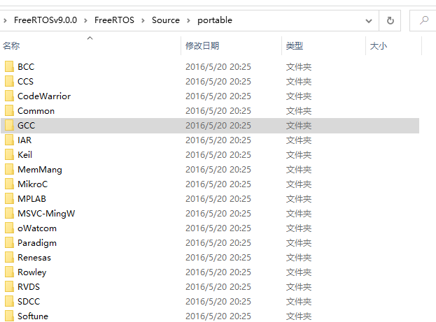
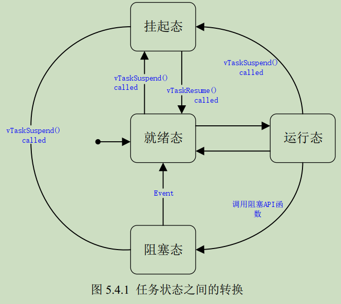
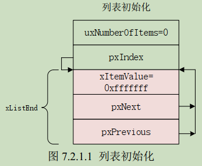

# FreeRTOS STM32F4

[toc] 

## 第一章 FreeRTOS简介
#### 1.3.2 FreeRTOS文件预览
&emsp;&emsp;FreeRTOS文件夹下有`FreeRTOS`和`FreeRTOS-Plus`两个文件夹，区别是Plus的功能比普通的功能强大一点。`FreeRTOS`文件夹下有三个文件夹`Demo`、`License`、`Source`，`Demo`中是针对不同芯片的例程，移植时可以参考，`Source`就是FreeRTOS的源码。  
&emsp;&emsp;`Source`文件夹下面包括两个文件夹`include`、`portable`和一些文件。**`include`文件夹是一些头文件，移植的时候是需要的**。`portable`文件夹里面是FreeRTOS系统和具体硬件之间的桥梁。不同的编译环境，不同的MCU，其桥梁应该是不同的，`portable`下面首先是不同的编译环境，例如GCC、Keil、IAR等。***其中`MemMang`是内存管理相关内容，移植的时候是必须的**。如下图所示：
  
在每个编译环境目录下是针对不同架构的MCU的分类，如下图所示，在GCC下面，`ARM_CA9`是cortex-A9架构，`ARM_CM0`是cortex-M0架构相关代码，****其中的`prot.c`和`portmacro.h`是移植时必须的**。
## 第二章 FreeRTOS移植
### 2.2 FreeRTOS移植
&emsp;&emsp;在正点原子的历程中添加文件。添加的文件就是上面加粗的文件。包括，
* `Source`文件夹下的所有`.c`文件；
* `include`中的所有头文件；
* `portable`中的`MemMang`文件夹中任一个`.c`文件；
* `portable`中和编译器相关的具体架构的文件夹，例如：RVDS-->ARM_CM4F_MPU文件夹中的文件：`port.c`和`portmacro.h`
* 除此之外，还需要有`FreeRTOSConfig.h`，在官方demo文件中可以找到这个文件。  
&emsp;&emsp;移植完上面的文件以后，编译还会有许多错误。
* `SystemCoreClock`未定义的错误：在FreeRTOSConfig.h中使用它来标记MCU频率。
* 会有一些未定义的Hook函数，这是因为在FreeRTOSConfig.h中开启了这些钩子函数却没有定义导致的，关闭这些函数即可，将这些宏定义改为0即可。
* 在正点原子的例程中，FreeRTOS的心跳是由滴答定时器产生的，在滴答定时器中调用FreeRTOS的API函数`xPortSysTickHandler()`
## 第三章 FreeRTOS系统配置
&emsp;&emsp;实际使用FreeRTOS的时候需要根据自己的需求来配置FreeRTOS，不同架构的MCU在使用的时候配置也不同。FreeRTOS的系统配置文件为FreeRTOSConfig.h，在此配置文件中可以完成FreeRTOS的裁剪和配置。


## 第四章 FreeRTOS 中断配置和临界段
## 第五章 FreeRTOS 任务基础知识
### 5.1 什么是多任务系统
&emsp;&emsp;在裸机中，通常用一个 while 循环来完成所有的处理，有时候也需要在中断中完成一些处理。相对于多任务系统而言，这个就是单任务系统，也称作前后台系统，终端服务函数作为前台程序，大循环 while 作为后台程序。
&emsp;&emsp;前后台系统的实时性差，各个任务都是排队等着轮流执行，相当于所有任务的优先级都是一样的。
&emsp;&emsp;在多任务系统中，高优先级的任务可以打断低优先级任务的运行而取得 CPU 的使用权，这样就保证了那些紧急任务的运行。高优先级的任务执行完成以后重新把 CPU 的使用权归还给低优先级的任务。

### 5.2 FreeRTOS 任务与协程
&emsp;&emsp;在 FreeRTOS 中应用既可以使用任务，也可以使用协程（Co-Routine），或者两者混合使用。但是任务和协程使用不同的 API 函数，因此不能通过队列（或信号量）将数据从任务发送给协程，反之亦然。
#### 5.2.1 任务（Task）的特性
&emsp;&emsp;在使用 RTOS 的时候每个任务都有自己的运行环境，不依赖于系统中其他的任务或者 RTOS 调度器。任何一个时间点只能由一个任务运行。RTOS 的职责是确保当一个任务开始执行的时候其上下文环境（寄存器值，堆栈内容等）和任务上一次退出的时候相同。为了做到这一点，每个任务都必须有个堆栈，当任务切换的时候将上下文环境保存在堆栈中，这样当任务再次执行的时候就可以从堆栈中取出上下文环境，任务恢复运行。
### 5.3 任务状态
&emsp;&emsp;FreeRTOS 中的任务永远处于下面几个状态中的某一个：
* 运行态：处于运行态的任务就是当前正在使用处理器的任务。如果使用的是单核处理器的话那么不管在任何时刻永远都只有一个任务处于运行态。
* 就绪态：处于就绪态的任务就是那些准备就绪（这些任务没有被阻塞或者挂起），可以运行的任务，但是处于就绪态的任务还没有运行，因为有一个同优先级或者更高优先级的任务正在运行。
* 阻塞态：如果一个任务当前正在等待某个外部事件的话就说它处于阻塞态，比如说如果某个任务调用了函数`vTaskDelay()`的话就会进入阻塞态，直到延时周期完成。任务在等待队列、信号量、事件组、通知或互斥信号量的时候也会进入阻塞态。任务进入阻塞态会有一个超时时间，当超过这个超时时间任务就会退出阻塞态，即使所等待的事件还没有来临。
* 挂起态：像阻塞态一样，任务进入挂起态以后也不能被调度器调用进入运行态，但是进入挂起态的任务没有超时时间。任务进入和退出挂起态通过调用函数`vTaskSuspend()`和`xTaskResume()`。

&emsp;&emsp;任务状态之间的转换如图所示：  
  

### 5.4 任务优先级
&emsp;&emsp;每个任务都可以分配一个从 0~（configMAX_PRIORITIES-1）的优先级。
&emsp;&emsp;如果硬件平台支持类似计算前导零这样的指令，并且宏 configUSE_PORT_OPTIMISED_TASK_SELECTION 也设置为了 1，那么宏 configMAX_PRIORITIES 不能超过 32.
&emsp;&emsp;其他情况下 configMAX_PRIORITIES 可以为任意值。
&emsp;&emsp;优先级数字越低标识任务的优先级越低，0 的优先级最低，空闲任务的优先级最低，为 0。
&emsp;&emsp;当宏 configUSE_TIME_SLICING 为 1 的时候，多个任务可以共用同一个优先级，数量不限。此时处于就绪态的优先级相同的任务就会使用时间片轮转调度器获取运行时间。


```c
BaseType_t xTaskCreate(	TaskFunction_t pxTaskCode,
                        const char * const pcName,
                        const uint16_t usStackDepth,
                        void * const pvParameters,
                        UBaseType_t uxPriority,
                        TaskHandle_t * const pxCreatedTask ) 

TaskHandle_t xTaskCreateStatic(	TaskFunction_t pxTaskCode,
                                const char * const pcName,
                                const uint32_t ulStackDepth,
                                void * const pvParameters,
                                UBaseType_t uxPriority,
                                StackType_t * const puxStackBuffer,
                                StaticTask_t * const pxTaskBuffer )
```

### 5.5 任务实现
&emsp;&emsp;在使用 FreeRTOS 的过程中，我们要使用 xTaskCreate() 或 xTaskCreateStatic() 来创建任务，这两个函数的第一个参数`pxTaskCode`，就是这个人物的任务函数。
&emsp;&emsp;FreeRTOS 官方给出的任务函数模板如下：
```c
void vATaskFunction(void *pvParameters)
{
    for(;;)
    {
        /* 任务应用程序 */
        vTaskDelay();
    }

    /* 不能从任务函数中返回或退出，从任务函数中返回或退出的话就会调用 configASSERT(),
       前提是你定义了 configASSERT()。如果一定要从任务函数中退出的话那一定要调用函数
       vTaskDelete(NULL) 来删除此任务 */

    vTaskDelete(NULL);
}
```

1. 任务函数返回类型一定要为 void，人且人物的参数也是 void 指针类型的。
2. 人物的具体执行过程就是一个大循环，for(;;) 作用和 while(1) 一样。
3. 循环里面就是真正的任务代码。
4. `vTaskDelay` 是 FreeRTOS 的延时函数，此处不一定要用延时函数，其他只要能让 FreeRTOS 发生切换的 API 函数都可以，比如请求信号量、队列等，甚至直接调用任务调度器。
5. 任务函数一般不允许跳出循环，如果一定要跳出循环，那么循环外一定要调用`vTaskDelete(NULL)`删除此任务。

&emsp;&emsp;其他的 RTOS 的任务函数基本也是这种方式。

### 5.6 任务控制块
&emsp;&emsp;FreeRTOS 每个任务都有一些属性需要存储，FreeRTOS 把这些属性结合到一起用一个结构体来表示，这个结构体叫做任务控制块：TCB_t，在使用函数 xTaskCreate() 创建任务的时候就会给每个人物分配一个任务控制块。老版本此结构体名字叫 tskTCB。当不适用某些功能的时候与其相关的变量就不参与编译。

```c
typedef struct tskTaskControlBlock
{
	volatile StackType_t	*pxTopOfStack;	/* 任务堆栈栈顶 */

	#if ( portUSING_MPU_WRAPPERS == 1 )
		xMPU_SETTINGS	xMPUSettings;		/* MPU 相关设置 */
	#endif

	ListItem_t			xStateListItem;	    /* 状态列表项 */
	ListItem_t			xEventListItem;		/* 事件列表项 */
	UBaseType_t			uxPriority;			/* 任务优先级 */
	StackType_t			*pxStack;			/* 任务堆栈起始地址 */
	char				pcTaskName[ configMAX_TASK_NAME_LEN ];/* 任务名字 */

	#if ( portSTACK_GROWTH > 0 )
		StackType_t		*pxEndOfStack;		/* 任务堆栈栈底 */
	#endif

	#if ( portCRITICAL_NESTING_IN_TCB == 1 )
		UBaseType_t		uxCriticalNesting;	/* 临界区嵌套深度 */
	#endif

	#if ( configUSE_TRACE_FACILITY == 1 ) /* trace 或 debug 时用到 */
		UBaseType_t		uxTCBNumber;		
		UBaseType_t		uxTaskNumber;		
	#endif

	#if ( configUSE_MUTEXES == 1 )
		UBaseType_t		uxBasePriority;		/* 任务基础优先级，优先级反转时用到 */
		UBaseType_t		uxMutexesHeld;
	#endif

	#if ( configUSE_APPLICATION_TASK_TAG == 1 )
		TaskHookFunction_t pxTaskTag;
	#endif

	#if( configNUM_THREAD_LOCAL_STORAGE_POINTERS > 0 )
		void *pvThreadLocalStoragePointers[ configNUM_THREAD_LOCAL_STORAGE_POINTERS ];
	#endif

	#if( configGENERATE_RUN_TIME_STATS == 1 )
		uint32_t		ulRunTimeCounter;	/* 用来记录任务运行总时间 */
	#endif

	#if ( configUSE_NEWLIB_REENTRANT == 1 )
		struct	_reent xNewLib_reent;   /* 定义一个 newlib 结构体变量 */
	#endif

	#if( configUSE_TASK_NOTIFICATIONS == 1 )    /* 任务通知相关变量 */
		volatile uint32_t ulNotifiedValue;      /* 任务通知值 */
		volatile uint8_t ucNotifyState;         /* 任务通知状态 */
	#endif

	#if( tskSTATIC_AND_DYNAMIC_ALLOCATION_POSSIBLE != 0 )
        /* 用来标记任务时动态创建的还是静态创建的，如果是静态创建的此变量
           就为 pdTRUE，如果是动态创建的就为 pdFALSE */
		uint8_t	ucStaticallyAllocated; 		
	#endif

	#if( INCLUDE_xTaskAbortDelay == 1 )
		uint8_t ucDelayAborted;
	#endif

} tskTCB;

typedef tskTCB TCB_t;

```

### 5.7 任务堆栈
&emsp;&emsp;任务调度器在进行任务切换的时候会将当前任务的现场（CPU 寄存器值）保存在此任务的任务堆栈中，等到此任务下次运行的时候就会先用堆栈中保存的值来恢复现场，恢复现场以后任务就会接着从上次中断的地方开始运行。
&emsp;&emsp;创建任务的时候需要给任务指定堆栈，如果使用函数 xTaskCreate() 创建任务那么任务堆栈就会有函数 xTaskCreate() 自动创建。如果使用函数 xTaskCreate() 创建任务需要自行定义任务堆栈，然后堆栈首地址作为函数的参数 puxStackBUffer 传递给函数。

```c
TaskHandle_t xTaskCreateStatic(	TaskFunction_t pxTaskCode,
                                const char * const pcName,
                                const uint32_t ulStackDepth,
                                void * const pvParameters,
                                UBaseType_t uxPriority,
                                StackType_t * const puxStackBuffer,
                                StaticTask_t * const pxTaskBuffer )
```
&emsp;&emsp;堆栈大小类型如下：
```c
#define portSTACK_TYPE      uint32_t

typedef portSTACK_TYPE      StackType_t;
```
&emsp;&emsp;可以看出 StackType_t 类型的变量为 4 字节，那么任务的堆栈大小就应该是我们所定义的 4 倍。

## 第六章 FreeRTOS 任务相关 API 函数
### 6.1 任务创建和删除 API 函数

| 函数                    | 描述                                                      |
| ----------------------- | --------------------------------------------------------- |
| xTaskCreate()           | 使用动态的方法创建一个任务                                |
| xTaskCreateStatic()     | 使用静态的方法创建一个任务                                |
| xTaskCreateRestricted() | 创建一个使用 MPU 进行限制的任务，相关内存使用动态内存分配 |
| vTaskDelete()           | 删除一个任务                                              |

1. 函数 xTaskCreate()
&emsp;&emsp;此函数用来创建一个任务，任务需要 RAM 来保存与任务有关的状态信息（任务控制块），任务也需要一定的 RAM 来作为任务堆栈。如果使用此函数来创建任务的话，那么这些所需的 RAM 就会自动从 FreeRTOS 的堆中分配，因此必须提供内存管理文件，默认我们使用 heap_4.c 这个内存管理文件，而且宏 configSUPPORT_DYNAMIC_ALLOCATION 必须为 1。如果使用函数 xTaskCreateStatic() 创建的话这些 RAM 就需要用户来提供了。新创建的任务默认就是就绪态的，如果当前没有比它更高优先级的任务运行那么此任务就会立即进入运行态开始运行，不管在任务调度器启动前还是启动后，都可以创建任务。
```c
/**
 * 参数：
 * pxTaskCode：     任务函数
 * pcName：         人物名字，一般用于追踪和调试，任务名字长度不能超过
 *                  configMAX_TASK_NAME_LEN
 * usStackDepth：   任务堆栈大小，注意实际申请到的堆栈是 usStackDepth 的 4 倍。
 *                  其中空闲任务的堆栈大小为 configMINIMAL_STACK_SIZE.
 * pvParameters：   传递给任务函数的参数
 * uxPriotiry：     任务优先级，范围 0~configMAX_PRIORITIES-1
 * pxCreatedTask：  任务句柄，任务创建成功以后会返回此任务的任务句柄，这个句柄
 *                  其实就是任务的任务堆栈。此参数就用来保存这个任务句柄。其他
 *                  API 函数可能会使用到这个句柄。
 * 返回值：
 * pdPASS：         任务创建成功
 * errCOULD_NOT_ALLOCATE_REQUIRED_MEMORY：任务创建失败，因为堆内存不足
 */
BaseType_t xTaskCreate(	TaskFunction_t pxTaskCode,
                        const char * const pcName,
                        const uint16_t usStackDepth,
                        void * const pvParameters,
                        UBaseType_t uxPriority,
                        TaskHandle_t * const pxCreatedTask ) 
```

2. 函数 xTaskCreateStatic()
&emsp;&emsp;此函数创建的任务所需的 RAM 需要用户来提供。如果要使用此函数的话需要将宏 configSUPPORT_STATIC_ALLOCATION 定义为 1。
```c
/**
 * 参数：
 * pxTaskCode：     任务函数
 * pcName：         任务名字，一般用于追踪和调试，任务名字长度不能超过
 *                  configMAX_TASK_NAME_LEN
 * usStackDepth：   任务堆栈大小，由于本函数是静态方法创建任务，所以任务堆栈由用户给出。
 *                  一般是个数组，此参数就是这个数组的大小。
 * pvParameters：   传递给任务函数的参数
 * uxPriotiry：     任务优先级，范围 0~configMAX_PRIORITIES-1
 * puxStackBuffer： 任务堆栈，一般为数组，数组类型要为 StackType_t 类型。
 * pxTaskBuffer：   任务控制块。
 * 返回值：
 * NULL：           任务创建失败，puxStackBuffer 或 pxTaskBuffer 为 NULl 的时候会导
 *                  致这个错误的发生。
 * 其他值：          任务创建成功，返回任务的任务句柄
 */
TaskHandle_t xTaskCreateStatic(	TaskFunction_t pxTaskCode,
                                const char * const pcName,
                                const uint32_t ulStackDepth,
                                void * const pvParameters,
                                UBaseType_t uxPriority,
                                StackType_t * const puxStackBuffer,
                                StaticTask_t * const pxTaskBuffer )
```

3. 函数 xTaskCreateRestricted()
&emsp;&emsp;此函数也是用来创建任务的，只不过此函数要求所使用的 MCU 有 MPU（内存保护单元），用此函数创建的任务会受到 MPU 的保护。其他的功能和函数 xTaskCreate() 一样。
```c
/**
 * 参数：
 * TaskParameters_t：      指向一个结构体 TaskParameters_t，这个结构体描述了任务的任务函数、
 *                         堆栈大小、优先级等。此结构体在文件 task.h 中有定义 
 * pxCreatedTask：         任务句柄
 * 返回值：
 * pdPASS：     任务创建成功。
 * 其他值：      任务未创建成功，很有可能是因为 FreeRTOS 的堆太小了
 */
BaseType_t xTaskCreateRestricted( const TaskParameters_t * const pxTaskDefinition, 
                                TaskHandle_t *pxCreatedTask )
```

4. 函数 vTaskDelete()
&emsp;&emsp;删除一个用函数 xTaskCreate() 或者 xTaskCreateStatic() 创建的任务，被删除了的任务不再存在，也就是说再也不会进入运行态。任务被删除以后就不能再使用此任务的句柄。如果此任务是使用动态方法创建的，那么此任务被删除以后此任务之前申请的堆栈和控制块会在空闲任务中被释放掉，因此当调用此函数删除任务以后必须给空闲任务一定的运行时间。
&emsp;&emsp;只有那些由内核分配给任务的内存才会在任务被删除以后自动的释放掉，用户分配给人物的内存需要用户自行释放掉，否则会导致内存泄漏。
```c
/* 
 * xTaskToDelete：      要删除的任务的任务句柄
 * 返回值：
 * 无
 */
vTaskDelete(TaskHandle_t xTaskToDelete)
```

### 6.4 任务挂起和恢复 API 函数
&emsp;&emsp;当某个任务要停止运行一段时间的话就将这个任务挂起，当要重新运行这个任务的话就恢复这个任务的运行。

| 函数                 | 描述                             |
| -------------------- | -------------------------------- |
| vTaskSuspend()       | 挂起一个任务                     |
| vTaskResume()        | 恢复一个任务的运行               |
| xTaskResumeFromISR() | 中断服务函数中恢复一个任务的运行 |

1. 函数 vTaskSuspend()
&emsp;&emsp;此函数用于将某个任务设置为挂起状态，进入挂起态的任务永远都不会进入运行态。退出挂起态的唯一方法就是调用任务回复函数 vTaskResume() 或 xTaskResumeFromISR()。函数原型如下：
```c
/* 
 * xTaskToSuspend： 要挂起的任务的任务句柄，创建任务的时候会为每个任务分配一个任务句柄。
                    如果使用函数 xTaskCreate() 创建任务的话那么函数的参数 pxCreatedTask
                    就是此任务的任务句柄，如果使用函数 xTaskCreateStatic() 创建任务的话
                    那么函数的返回值就是此任务的任务句柄。也可以通过函数 xTaskGetHandle() 
                    来根据任务名字来获取某个任务的任务句柄。
                    注意：如果参数为 NULL 的话表示挂起任务自己。
 * 返回值：无
 */
void vTaskSuspend( TaskHandle_t xTaskToSuspend )
```

2. 函数 vTaskResume()
&emsp;&emsp;将一个任务从挂起态恢复到就绪态，只有通过函数 vTaskSuspend() 设置为挂起态的任务才可以使用 vTaskRexume() 恢复。
```c
void vTaskResume( TaskHandle_t xTaskToResume )
```

3. 函数 xTaskResumeFromISR()
&emsp;&emsp;此函数是 vTaskResume() 的中断版本，用于在中断服务函数中恢复一个任务。
```c
/* 
 * xTaskToResume：      要恢复的任务的任务句柄
 * 返回值：
 * pdTRUE：     恢复运行的任务的任务优先级等于或高于正在运行的任务（被中断打断
                的任务），这意味着再退出中断服务函数以后必须进行一次上下文切换
 * pdFALSE：    恢复运行的任务的任务优先级低于当前正在运行的任务（被中断打断的
                任务），这意味着在退出中断服务函数以后不需要进行上下文切换
 */
BaseType_t xTaskResumeFromISR( TaskHandle_t xTaskToResume )
```

### 第七章 FreeRTOS 列表和列表项
&emsp;&emsp;列表和列表项是 FreeRTOS 的一个数据结构，FreeRTOS 大量使用了列表和列表项。
### 7.1 列表和列表项
&emsp;&emsp;列表用来跟踪 FreeRTOS 中的任务。与列表相关的东西都在文件 list.c 和 list.h 中。
&emsp;&emsp;列表和列表项结构体如下：
  
&emsp;&emsp;其中`List_t`是列表结构体，`ListItem_t`列表项，`MiniListItem_t`是迷你列表项。  
&emsp;&emsp;结合宏定义简化后的列表结构体如下所示：
  
1. 列表 List_t
* (1)、(5)：都是用来检查列表完整性的，默认是关闭的，如果用到的话需要将宏`configUSE_LIST_DATA_INTEGRITY_CHECK_BYTES`设置为 1。（之后不讨论这个功能）
* (2)：用来记录列表中列表项的数量。
* (3)：用来记录当前列表项索引号，用于遍历列表。
* (4)：列表项中最后一个列表项，用来表示列表结束。

2. 列表项 ListItem_t
* (1)、(7)：用法和列表一样，用来检查列表项完整性的。（之后不讨论这个功能）
* (2)：列表项的值
* (3)：指向下一个列表项
* (4)：指向前一个列表项，与 (3) 配合实现类似双向链表的功能
* (5) pvOwner：记录此列表项归谁拥有，通常是任务控制块
* (6) pvContainer：用来记录此列表项归哪个列表。

3. 迷你列表项 MiniListItem_t
* (1)：用于检查迷你列表项的完整性
* (2)：记录列表列表项值
* (3)：指向下一个列表项
* (4)：指向上一个列表项

&emsp;&emsp;可以看出迷你列表项只是比列表项少了几个成员，没有本质区别。只是因为有些情况下不需要列表项这么全的功能，可能只需要其中几个成员变量，如果此时用列表项的话会造成内存浪费。比如上面列表结构体中最后一个列表项的成员变量就是 MiniListItem_t 类型的。

### 7.2 列表和列表项初始化
#### 7.2.1 列表初始化
&emsp;&emsp;列表初始化是通过函数`vListInitialise()`完成的，在 list.c 中定义：
```c
void vListInitialise( List_t * const pxList )
{
    pxList->pxIndex = ( ListItem_t * ) &( pxList->xListEnd );               // (1)
    pxList->xListEnd.xItemValue = portMAX_DELAY;                            // (2)
    pxList->xListEnd.pxNext = ( ListItem_t * ) &( pxList->xListEnd );       // (3)
    pxList->xListEnd.pxPrevious = ( ListItem_t * ) &( pxList->xListEnd );   // (4)
    pxList->uxNumberOfItems = ( UBaseType_t ) 0U;                           // (5)
    listSET_LIST_INTEGRITY_CHECK_1_VALUE( pxList );                         // (6)
    listSET_LIST_INTEGRITY_CHECK_2_VALUE( pxList );                         // (7)
}
```
&emsp;&emsp;列表结构体中一共有五个成员变量，此函数就是初始化这五个成员变量。
1. (1)：pxIndex 是一个指向列表项的指针，此时列表中只有一个列表项——`xListEnd`，所以将 pxIndex 指向 xListEnd。
2. (2)、(3)、(4)：都是在初始化`xListEnd`。 xListEnd 一共有四个成员，这里初始化了三个，pxNext 下一个列表项和 pxPrevious 前一个列表项都指向自身，因为此时只有一个列表项。xItemValue 根据 MCU 的不同初始化为不同的值，可以是 0xffff 或 0xffff_ffff。在这里为 0xffff_ffff。
3. (6)、(7)：用于完整性检查的字段。将其赋值为 0x5a5a 或 0x5a5a5a5a。

&emsp;&emsp;列表初始化以后如图所示：
  

#### 7.2.2 列表项初始化
&emsp;&emsp;列表项初始化由函数`vListInitialiseItem()`来完成。
```c
void vListInitialiseItem( ListItem_t * const pxItem )
{
	pxItem->pvContainer = NULL;

    /* 初始化用于完整性检查的变量，值为 0x5a5a_5a5a */
	listSET_FIRST_LIST_ITEM_INTEGRITY_CHECK_VALUE( pxItem );
	listSET_SECOND_LIST_ITEM_INTEGRITY_CHECK_VALUE( pxItem );
}
```
&emsp;&emsp;有人会问，列表项的成员变量比列表要多，为什么初始化函数并没有完全初始化。这是因为列表项要根据实际使用情况来初始化，比如任务创建函数就会对堆栈任务中的`xStateListItem`和`xEventListItem`这两个列表项中的其他成员变量再做初始化。

### 7.3 列表项插入

```c
/* 
 * pxList：             列表项要插入的列表
 * pxNewListItem：      要插入的列表项
 * 返回值：无
 */
void vListInsert( List_t * const pxList, ListItem_t * const pxNewListItem )
{
    ListItem_t *pxIterator;
    const TickType_t xValueOfInsertion = pxNewListItem->xItemValue;     // (1)

	listTEST_LIST_INTEGRITY( pxList );                                  // (2)
	listTEST_LIST_ITEM_INTEGRITY( pxNewListItem );

	if( xValueOfInsertion == portMAX_DELAY )                            // (3)
	{
		pxIterator = pxList->xListEnd.pxPrevious;                       // (4)
	}
	else
	{
		for( pxIterator = ( ListItem_t * ) &( pxList->xListEnd );       // (5)
            pxIterator->pxNext->xItemValue <= xValueOfInsertion; 
            pxIterator = pxIterator->pxNext ) 
		{ /* 空循环，只为定位要插入的位置 */ }
	}

	pxNewListItem->pxNext = pxIterator->pxNext;                         // (6)
	pxNewListItem->pxNext->pxPrevious = pxNewListItem;
	pxNewListItem->pxPrevious = pxIterator;
	pxIterator->pxNext = pxNewListItem;

	pxNewListItem->pvContainer = ( void * ) pxList;                     // (7)

	( pxList->uxNumberOfItems )++;                                      // (8)
}
```
&emsp;&emsp;此函数将列表项`pxNewListItem`插入到列表`pxList`中。插入的位置由列表项中成员变量`xItemValue`来决定。列表项的插入根据`xItemValue`的值按照升序的方式排列。
&emsp;&emsp;新插入的列表项要插入的位置就在 pxIterator 之后，pxIterator->pxNext 之前。
1. (1)：获取列表项成员 xItemValue 的值，根据此值确定列表项要插入的位置。
2. (2)：检查列表和列表项中用于完整性检查的变量值是否被改变。这两行代码需要实现函数`configASSERT()`。
3. (3)：如果要插入的列表项的值等于`portMAX_DELAY`，也就是说列表项值为最大值，那么要插入的位置就是列表的最末尾了。
4. (4)：如果要插入的列表项的列表值和 xListEnd 的列表值相同，那么要插入的列表项会被放到 xListEnd 前面。
5. (5)：如果要插入的列表项的值不等于 portMAX_DELAY 那么就需要在列表中一个一个找，此循环就是用于定位位置的，所以循环里什么也没做。
6. 在查找过程中专门将列表值为 portMAX_DELAY 的列表项提取出来是因为如果不提取出来，遇到列表值为 portMAX_DELAY 的列表项，后面的 for 循环就永远跳不出来。
7. (6)：这四行代码就是具体的插入过程，将要插入的列表项插入到经由 pxIterator 定位的位置后，插入到 pxIterator->pxNext 之前。
8. (7)：记录此列表项属于哪个列表。
9. (8)：列表成员变量 uxNumberOfItems 加一，表示又添加了一个列表项。

### 7.4 列表项末尾插入
```c
/* 
 * pxList：         列表项要插入的列表
 * pxNewListItem：  要插入的列表项
 */
void vListInsertEnd( List_t * const pxList, ListItem_t * const pxNewListItem )
{
    ListItem_t * const pxIndex = pxList->pxIndex;
    
    listTEST_LIST_INTEGRITY( pxList );
    listTEST_LIST_ITEM_INTEGRITY( pxNewListItem );
    
    pxNewListItem->pxNext = pxIndex;
    pxNewListItem->pxPrevious = pxIndex->pxPrevious;
    
    mtCOVERAGE_TEST_DELAY();
    
    pxIndex->pxPrevious->pxNext = pxNewListItem;
    pxIndex->pxPrevious = pxNewListItem;
    
    pxNewListItem->pvContainer = ( void * ) pxList;
    
    ( pxList->uxNumberOfItems )++;
}
```
&emsp;&emsp;此函数和上面的插入函数基本一致。
&emsp;&emsp;需要注意的是，此函数是往列表的末尾添加列表项，我们知道列表中 xListEnd 成员变量表示列表末尾，那么此函数插入的列表项是不是就是插入到 xListEnd 的前面后后面呢？这个是不一定的。
&emsp;&emsp;**这里所谓的末尾要根据列表成员变量 pxIndex 来确定**。pxIndex 成员变量是用来遍历列表的，pxIndex 所指向的列表项就是要遍历的开始列表项，也就是说 pxIndex 所指向的列表项就代表列表头。由于是个环形列表，所以新的列表项就应该插入到 pxIndex 所指向的列表项的前面。

### 7.5 列表项的删除

```c
/* 
 * pxItemToRemove：         要删除的列表项
 * 返回值：                 返回删除列表项以后的列表剩余列表项数目
 */
UBaseType_t uxListRemove( ListItem_t * const pxItemToRemove )
{
    List_t * const pxList = ( List_t * ) pxItemToRemove->pvContainer;

	pxItemToRemove->pxNext->pxPrevious = pxItemToRemove->pxPrevious;
	pxItemToRemove->pxPrevious->pxNext = pxItemToRemove->pxNext;

	mtCOVERAGE_TEST_DELAY();

	/* 如果 pxIndex 恰好指向了要删除的 item，将其指向一个有意义的 item */
	if( pxList->pxIndex == pxItemToRemove )
	{
		pxList->pxIndex = pxItemToRemove->pxPrevious;
	}
	else
	{
		mtCOVERAGE_TEST_MARKER();
	}

	pxItemToRemove->pvContainer = NULL;
	( pxList->uxNumberOfItems )--;

	return pxList->uxNumberOfItems;
}
```
&emsp;&emsp;注意：列表项的删除只是将指定的列表项从列表中删除，如果这个列表项是动态内存分配的话，此函数并不会将这个列表项的内存给释放掉。

### 7.6 列表的遍历
```c
#define listGET_OWNER_OF_NEXT_ENTRY( pxTCB, pxList )										\
{																							\
List_t * const pxConstList = ( pxList );													\
	/* Increment the index to the next item and return the item, ensuring */				\
	/* we don't return the marker used at the end of the list.  */							\
	( pxConstList )->pxIndex = ( pxConstList )->pxIndex->pxNext;							\
	if( ( void * ) ( pxConstList )->pxIndex == ( void * ) &( ( pxConstList )->xListEnd ) )	\
	{																						\
		( pxConstList )->pxIndex = ( pxConstList )->pxIndex->pxNext;						\
	}																						\
	( pxTCB ) = ( pxConstList )->pxIndex->pvOwner;											\
}
```
&emsp;&emsp;上面的函数，每调用一次，这个函数列表的 pxIndex 变量就会指向下一个列表项，并且返回这个列表项的 pxOwner 变量值。
&emsp;&emsp;如果 pxIndex 变量指向了列表的 xListEnd 成员变量，表示到了列表末尾。如果到了列表末尾的话就跳过 xListEnd，pxIndex 再一次重新指向处于列表头的列表项。


## 第八章 FreeRTOS 调度器开启和任务相关函数详解
### 8.2 调度器开启过程分析
&emsp;&emsp;vTaskStartScheduler() 函数是开启任务调度器的，部分代码如下：
```c
void vTaskStartScheduler( void )
{
    BaseType_t xReturn;

	/* Add the idle task at the lowest priority. */
	#if( configSUPPORT_STATIC_ALLOCATION == 1 )
	{
		StaticTask_t *pxIdleTaskTCBBuffer = NULL;
		StackType_t *pxIdleTaskStackBuffer = NULL;
		uint32_t ulIdleTaskStackSize;

		/* 空闲任务是使用用户提供的 RAM 创建的 - 获取 RAM 的地址然后创建空闲任务。  */
		vApplicationGetIdleTaskMemory( &pxIdleTaskTCBBuffer, &pxIdleTaskStackBuffer, &ulIdleTaskStackSize );
		xIdleTaskHandle = xTaskCreateStatic(	prvIdleTask,
												"IDLE",
												ulIdleTaskStackSize,
												( void * ) NULL,
												( tskIDLE_PRIORITY | portPRIVILEGE_BIT ),
												pxIdleTaskStackBuffer,
												pxIdleTaskTCBBuffer ); 

		if( xIdleTaskHandle != NULL )
		{
			xReturn = pdPASS;
		}
		else
		{
			xReturn = pdFAIL;
		}
	}
	#else
	{
		/* 空闲任务是使用动态分配的 RAM 创建的。  */    // (1)
		xReturn = xTaskCreate(	prvIdleTask,
								"IDLE", configMINIMAL_STACK_SIZE,
								( void * ) NULL,
								( tskIDLE_PRIORITY | portPRIVILEGE_BIT ),
								&xIdleTaskHandle ); 
	}
	#endif 

	#if ( configUSE_TIMERS == 1 )                   // 使用软件定时器使能
	{
		if( xReturn == pdPASS )
		{
			xReturn = xTimerCreateTimerTask();      // (2)
		}
		else
		{
			mtCOVERAGE_TEST_MARKER();
		}
	}
	#endif

	if( xReturn == pdPASS )
	{
		/* 此处关闭中断，以确保在调用 xPortStartScheduler() 之前或期间不会发生滴答声。 
        创建任务的堆栈包含一个状态字，其中打开了中断，因此当第一个任务开始运行时，
        中断将自动重新启用。  */
		portDISABLE_INTERRUPTS();                   // (3)

		#if ( configUSE_NEWLIB_REENTRANT == 1 )
		{
			_impure_ptr = &( pxCurrentTCB->xNewLib_reent );
		}
		#endif 

		xNextTaskUnblockTime = portMAX_DELAY;
		xSchedulerRunning = pdTRUE;                 // (4)
		xTickCount = ( TickType_t ) 0U;

		portCONFIGURE_TIMER_FOR_RUN_TIME_STATS();   // (5)

		if( xPortStartScheduler() != pdFALSE )
		{
			/* 如果调度器启动成功的话就不会运行到这里 */
		}
		else
		{
			/* 除非调用函数 xTaskEndScheduler()，否则不会运行到这里 */
		}
	}
	else
	{
		/* 程序运行到这里只能说明一点，那就是系统内核没有启动成功。原因是在创建
        空闲任务或者定时器任务的时候没有足够的内存 */
		configASSERT( xReturn != errCOULD_NOT_ALLOCATE_REQUIRED_MEMORY );
	}

	/* 防止编译器报错，比如宏 INCLUDE_xTaskGetIdleTaskHandle 定义为 0 的话,
	编译器就会提示 xIdleTaskHandle 未使用 */
	( void ) xIdleTaskHandle;
}
```
1. (1)：创建空闲任务，优先级为 0，也就是说空闲任务的优先级为最低。
2. (2)：使用软件定时器的话还需要通过函数 xTimerCreateTimerTask() 来创建定时器服务任务。定时器服务任务的具体创建过程就是在此函数中完成。
3. (3)：关闭中断，在 SVC 中断服务函数 vPortSVCHandler() 中会打开中断。
4. (4)：变量 xSchedulerRunning 设置为 pdTRUE，表示调度器开始运行。
5. (5)：当宏 configGENERATE_RUN_TIME_STATS 为 1 的时候说明使能时间统计功能，此时需要用户实现宏 portCONFIGURE_TIMER_FOR_RUN_TIME_STATS，此宏用来配置一个定时器/计数器。
6. (6)：调用函数 xPortStartScheduler() 来初始化跟调度器启动有关的硬件，比如滴答定时器、FPU 单元和 PendSV 中断等。

#### 8.2.2 内核相关硬件初始化函数分析
&emsp;&emsp;FreeRTOS 系统时钟是由滴答定时器来提供的，而且任务切换也会用到 PendSV 中断，这些硬件的初始化是由函数 xPortStartScheduler 来完成，缩减后的函数代码如下：
```c
BaseType_t xPortStartScheduler( void )
{
	portNVIC_SYSPRI2_REG |= portNVIC_PENDSV_PRI;    // (1)
	portNVIC_SYSPRI2_REG |= portNVIC_SYSTICK_PRI;   // (2)
	vPortSetupTimerInterrupt();                     // (3)
	uxCriticalNesting = 0;                          // (4)
	prvEnableVFP();                                 // (5)
	*( portFPCCR ) |= portASPEN_AND_LSPEN_BITS;     // (6)
	prvStartFirstTask();                            // (7)

	/* 代码正常执行的话是不会到这里的 */
	return 0;
}
```
&emsp;&emsp;上面的赋值基本都是直接操作硬件寄存器的。
1. (1)：

### 8.3 任务创建过程分析
#### 8.3.4 添加任务到就绪列表
&emsp;&emsp;任务创建完成以后就会被添加到就绪列表中，FreeRTOS 使用不同的列表表示任务的不同状态，在文件 task.c 中就定义了多个全局列表来完成不同的功能，这些列表如下：
```c
PRIVILEGED_DATA static List_t pxReadyTasksLists[ configMAX_PRIORITIES ];
PRIVILEGED_DATA static List_t xDelayedTaskList1;
PRIVILEGED_DATA static List_t xDelayedTaskList2;
PRIVILEGED_DATA static List_t * volatile pxDelayedTaskList;		
PRIVILEGED_DATA static List_t * volatile pxOverflowDelayedTaskList;	
PRIVILEGED_DATA static List_t xPendingReadyList;					
```
&emsp;&emsp;列表数组 pxReadyTasksLists[] 就是任务就绪列表，数组大小为 configMAX_PRIORITIES，也就是说一个优先级一个列表，这样相同优先级的任务就是用一个列表。将一个新创建的任务添加到就绪列表中通过函数 prvAddNewTaskToReadyList() 来完成。函数如下：
```c
static void prvAddNewTaskToReadyList( TCB_t *pxNewTCB )
{
	/* 确保在更新列表时中断不会访问任务列表。  */
	taskENTER_CRITICAL();
	{
		uxCurrentNumberOfTasks++;                       // (1)
		if( pxCurrentTCB == NULL )
		{
			/* 没有其他任务，或者所有其他任务都处于挂起状态时，将此任务作为当前任务。 */
			pxCurrentTCB = pxNewTCB;

			if( uxCurrentNumberOfTasks == ( UBaseType_t ) 1 )
			{
				/* 这是要创建的第一个任务，因此需要进行初步初始化。 
                如果此调用失败，我们将无法恢复，但我们会报告失败。 */
				prvInitialiseTaskLists();               // (2)
			}
			else
			{ mtCOVERAGE_TEST_MARKER(); }
		}
		else
		{
			/* 如果调度程序尚未运行，则将此任务设为当前任务
            （如果它是目前要创建的最高优先级任务）。 */
			if( xSchedulerRunning == pdFALSE )
			{
                /* 新任务的任务优先级比正在运行的任务优先级高 */
				if( pxCurrentTCB->uxPriority <= pxNewTCB->uxPriority )
				{
					pxCurrentTCB = pxNewTCB;            // (3)
				}
				else
				{ mtCOVERAGE_TEST_MARKER(); }
			}
			else
			{ mtCOVERAGE_TEST_MARKER(); }
		}

		uxTaskNumber++;         /* 用作任务控制块编号 */

		#if ( configUSE_TRACE_FACILITY == 1 )
		{
			/* 将计数器添加到 TCB 中，仅用于跟踪。 */
			pxNewTCB->uxTCBNumber = uxTaskNumber;
		}
		#endif 
		traceTASK_CREATE( pxNewTCB );

		prvAddTaskToReadyList( pxNewTCB );              // (4)

		portSETUP_TCB( pxNewTCB );
	}
	taskEXIT_CRITICAL();

	if( xSchedulerRunning != pdFALSE )
	{
		/* 如果创建的任务的优先级高于当前任务，那么它应该现在运行。  */
		if( pxCurrentTCB->uxPriority < pxNewTCB->uxPriority )
		{
			taskYIELD_IF_USING_PREEMPTION();            // (5)
		}
		else
		{ mtCOVERAGE_TEST_MARKER(); }
	}
	else
	{ mtCOVERAGE_TEST_MARKER(); }
}
```
1. (1)：变量 uxCurrentNumberOfTasks 为全局变量，用来统计任务数量
2. (2)：变量 uxCurrentNumberOfTasks 为 1 说明正在创建的任务是第一个任务。那么就需要先初始化相应的列表，通过调用函数 prvInitialiseTaskLists() 来初始化相应的列表。这个函数很简单，本质就是调用列表初始化函数 vListInitialise() 来初始化几个列表。
3. (3)：新创建的任务优先级比正在运行的任务优先级高，所以需要修改 pxCurrentTCB 为新建任务的任务控制块。
4. (4)：调用函数 prvAddTaskToReadyList() 将任务添加到就序列表中，这个其实是个宏，如下：
```c
#define prvAddTaskToReadyList( pxTCB )                  \
	traceMOVED_TASK_TO_READY_STATE( pxTCB );            \
	taskRECORD_READY_PRIORITY( ( pxTCB )->uxPriority ); \
	vListInsertEnd( &( pxReadyTasksLists[ ( pxTCB )->uxPriority ] ), &( ( pxTCB )->xStateListItem ) ); \
	tracePOST_MOVED_TASK_TO_READY_STATE( pxTCB )


#define taskRECORD_READY_PRIORITY( uxPriority )         \
{                                                       \
    if( ( uxPriority ) > uxTopReadyPriority )           \
    {                                                   \
        uxTopReadyPriority = ( uxPriority );            \
    }                                                   \
} 
```
&emsp;&emsp;宏 taskRECORD_READY_PRIORITY() 用来记录处于就绪态的任务，具体是通过操作全局变量 uxTopReadyPriority 来实现的。这个变量用来查找处于就绪态的优先级最高任务。
&emsp;&emsp;然后使用函数 vListInsertEnd 将任务添加到就绪列表末尾。

5. (5)：如果新任务的任务优先级最高，而且调度器已经开始正常运行了，那么久调用函数 taskYIELD_IF_USING_PREEMPTION() 完成一次任务切换。


## 第九章 FreeRTOS 任务切换过程


## 第十章 FreeRTOS 系统内核控制函数

## 第十二章 FreeRTOS 时间管理
&emsp;&emsp;在使用 FreeRTOS 的过程中我们通常会在一个任务函数中使用延时函数对这个任务延时，当执行延时函数的时候就会进行任务切换，并且此任务就会进入阻塞态，直到延时完成，任务重新进入就绪态。

## 第十三章 FreeRTOS 队列
### 13.1 队列简介
&emsp;&emsp;
1. 数据存储
&emsp;&emsp;通常队列采用先进先出（FIFO）的存储缓冲机制，也就是往队列发送数据的时候（入队）永远都是发送到队列的尾部，而从队列提取数据的时候（出队）是从队列的头部提取的。但是也可以使用 LIFO 的存储缓冲，也就是后进先出，FreeRTOS 中的队列也提供了 LIFO 的存储缓冲机制。
&emsp;&emsp;数据发送到队列中会导致数据拷贝，这就意味着队列中存储的是数据的原始值，而不是指针。而 UCOS 的消息队列采用的是引用。
&emsp;&emsp;FreeRTOS 使用队列传递消息使用的是值传递，但是也可以使用引用来传递消息，直接往队列发送消息缓冲区的地址指针。

2. 多任务访问
&emsp;&emsp;队列不是属于某个特定的人物的，任何任务都可以向队列中发送消息，或者从队列中提取消息。

3. 出队阻塞
* 出队：从队列中读取消息。
* 阻塞时间：当任务尝试从一个队列中读取消息的时候可以指定一个阻塞时间，即任务从队列中读取消息无效的时候任务阻塞的时间。
* 出队阻塞：针对从队列中读取消息的任务而言的。

&emsp;&emsp;阻塞时间单位的时钟节拍数。阻塞时间有下面三种类型：
* 阻塞时间为 0：此时不阻塞，没有数据的话就马上返回，任务继续执行接下来的代码；
* 阻塞时间为 (0, portMAX_DELAY)：当任务没有从队列中获取到消息的话就进入阻塞态，阻塞时间指定了任务进入阻塞态的时间，当阻塞时间到了以后还没有接收到数据的话就退出阻塞态，返回任务接着运行下面的代码。
* 阻塞时间为 portMAX_DELAY：任务会一直进入阻塞态等待，直到接收到数据为止。

4. 入队阻塞
&emsp;&emsp;入队说的是向队列中发送消息，和出队阻塞一样，当一个任务向队列发送消息也可以设置阻塞时间。例如任务 B 向队列 Q 发送消息，但此时队列 Q 是满的，肯定会发送失败。

### 13.2 队列结构体
&emsp;&emsp;有一个结构体用于描述队列，叫做 Queue_t，这个结构体在文件 queue.c 中定义如下：
```c
typedef struct QueueDefinition
{
	int8_t *pcHead;					/* 指向队列存储区开始地址 */
	int8_t *pcTail;					/* 指向队列存储区最后一个字节 */
	int8_t *pcWriteTo;				/* 指向存储区中下一个空闲区域 */

	union							/* 使用 union 是编码标准的一个例外，以确保两个互斥结构
                                    成员不会同事出现（浪费 RAM） */
	{
		int8_t *pcReadFrom;			/* 当用作队列的时候指向最后一个出队的队列项首地址 */
		UBaseType_t uxRecursiveCallCount;   /* 当用作递归互斥量的时候用来记录递归互斥量被调用
                                            的次数 */
	} u;

	List_t xTasksWaitingToSend;		/* 等待发送任务列表，那些因为队列满导致入队失败而进入阻
                                    塞态的任务就会挂到此列表上 */
	List_t xTasksWaitingToReceive;	/* 等待接收任务列表，那些因为队列空导致出队失败而进入阻
                                    塞态的任务就会挂到此列表上 */

	volatile UBaseType_t uxMessagesWaiting;/* 队列中当前队列项数量，也就是消息数 */
	UBaseType_t uxLength;			/* 创建队列时指定的队列长度，也就是队列中最大允许的队列
                                    项（消息）数量 */
	UBaseType_t uxItemSize;			/* 创建队列时指定的每个队列项（消息）最大长度，单位字节 */

	volatile int8_t cRxLock;		/* 当队列上锁以后用来统计从队列中接收到的队列项数量，也
                                    就是出队的队列项数量，当队列没有上锁的话此字段为
                                    queueUNLOCKED */
	volatile int8_t cTxLock;		/* 当队列上锁以后用来统计发送到队列中的队列项数量，也就
                                    是入队的队列项数量，当队列没有上锁的话此字段为 
                                    queueUNLOCKED */

	#if( ( configSUPPORT_STATIC_ALLOCATION == 1 ) && ( configSUPPORT_DYNAMIC_ALLOCATION == 1 ) )
		uint8_t ucStaticallyAllocated;	/* 如果使用静态存储的话此字段设置为 pdTRUE */
	#endif

	#if ( configUSE_QUEUE_SETS == 1 )   /* 队列集相关宏 */
		struct QueueDefinition *pxQueueSetContainer;
	#endif

	#if ( configUSE_TRACE_FACILITY == 1 )   /* 跟踪调试相关宏 */
		UBaseType_t uxQueueNumber;
		uint8_t ucQueueType;
	#endif

} xQUEUE;

typedef xQUEUE Queue_t;
```

### 13.3 队列创建
#### 13.3.1 函数原型
&emsp;&emsp;在使用队列之前必须先创建队列，有两种创建队列的方法，一种是静态的，使用函数 xQueueCreateStatic()；另一个是动态的，使用函数 xQueueCreate()。这两个函数本质上都是宏，真正完成队列创建的函数是 xQueueGenericCreate() 和 xQueueGenericCreateStatic()，这两个函数在文件 queue.c 中有定义，这四个函数原型如下：
1. 函数 xQueueCreate()
&emsp;&emsp;此函数本质上是一个宏，用来动态创建队列，此宏最终调用函数 xQueueGenericCreate()，函数原型如下：
```c
/* 
 * uxQueueLength：  要创建的队列的队列长度，这里是队列的项目数
 * uxItemSize：     队列中每个项目（消息）的长度，单位为字节
 * 
 * 返回值：
 * 其他值：         队列创建成功后返回的队列句柄
 * NULL：           队列创建失败
 */
QueueHandle_t xQueueCreate(UBaseType_t uxQueueLength,
                           UBaseType_t uxItemSize)
```

2. 函数 xQueueCreateStatic()
&emsp;&emsp;此函数也是用于创建队列的，但是使用静态方法创建队列，队列所需的内存由用户自行分配，此函数本质上也是一个宏，此宏最终调用的是函数 xQueueGenericCreateStatic()，函数原型如下：
```c
/* 
 * uxQueueLength：  要创建的队列的队列长度，这里是队列的项目数
 * uxItemSize：     队列中每个项目（消息）的长度，单位为字节
 * pucQueueStorageBuffer：指向队列项目的存储区，也就是消息的存储区，
 *      这个存储区需要用户自行分配，此参数必须指向一个 uint8_t 类型
 *      的数组。这个存储区要大于等于 (uxQueueLength*uxItemSize) 字节。
 * pxQueueBuffer：此参数指向一个 StaticQueue_t 类型的变量，用来保存队列结构体
 * 
 * 返回值：         队列创建成功以后的队列句柄
 * 其他值：         队列创建失败
 */
QueueHandle_t xQueueCreateStatic(UBaseType_t uxQueueLength,
                                 UBaseType_t uxItemSize,
                                 uint8_t *pucQueueStorageBuffer,
                                 StaticQueue_t *pxQueueBuffer)
```

3. 函数 xQueueGenericCreate()
&emsp;&emsp;此函数用于动态创建队列，创建队列过程中需要的内存均通过 FreeRTOS 中的动态内存管理函数 pvPortMalloc() 函数，函数原型如下：
```c
/* 
 * uxQueueLength：  要创建的队列的队列长度，这里是队列的项目数
 * uxItemSize：     队列中每个项目（消息）的长度，单位为字节
 * ucQueueType：    队列类型，由于 FreeRTOS 中的信号量等也是通过队列来实现的，创建信号量
 *                  的函数最终也是使用此函数的，因此在创建的时候需要指定此队列的用途，也就
 *                  是队列类型，一共有六种类型：
 *                  queueQUEUE_TYPE_BASE                    普通的消息队列
 *                  queueQUEUE_TYPE_SET                     队列集
 *                  queueQUEUE_TYPE_MUTEX                   互斥信号量
 *                  queueQUEUE_TYPE_COUNTING_SEMAPHORE      记数型信号量
 *                  queueQUEUE_TYPE_BINARY_SEMAPHORE        二值信号量
 *                  queueQUEUE_TYPE_RECURSIVE_MUTEX         递归互斥信号量
 *                  函数 xQueueCreate 创建队列的时候此参数默认选择的就是 queueQUEUE_TYPE_BASE
 *
 * 返回值：
 * 其他值：         队列创建成功以后的队列句柄
 * NULL：           队列创建失败
 */
QueueHandle_t xQueueGenericCreate(  const UBaseType_t uxQueueLength, 
                                    const UBaseType_t uxItemSize, 
                                    const uint8_t ucQueueType )

```

4. 函数 xQueueGenericCreateStatic()
&emsp;&emsp;此函数用于动态创建队列，创建队列的过程中需要的内存需要由用户自行分配好，函数原型如下：
```c
/* 
 * uxQueueLength：  要创建的队列的队列长度，这里是队列的项目数
 * uxItemSize：     队列中每个项目（消息）的长度，单位为字节
 * pucQueueStorage：指向队列项目的存储区，也就是消息的存储区，这个存储区需要用户自行分配。此参数
 *                  必须指向一个 uint8_t 类型的数组。这个存储区要大于等于
 *                  (uxQueueLength*uxItemSize) 字节
 * pxStaticQueue：  此参数指向一个 StaticQueue_t 类型的变量，用来保存队列结构体
 * ucQueueType：    队列类型
 *
 * 返回值：
 * 其他值：         队列创建成功以后队列句柄
 * NULL：           队列创建失败
 */
QueueHandle_t xQueueGenericCreateStatic( const UBaseType_t uxQueueLength, 
                                        const UBaseType_t uxItemSize, 
                                        uint8_t *pucQueueStorage, 
                                        StaticQueue_t *pxStaticQueue, 
                                        const uint8_t ucQueueType )
```

### 13.4 向队列发送消息
#### 13.4.1 函数原型
&emsp;&emsp;创建好队列以后就可以向队列发送消息了，FreeRTOS 提供了 8 个向队列发送消息的 API 函数，如下表所示：

| 分类           | 函数                       | 描述                                                         |
| -------------- | -------------------------- | ------------------------------------------------------------ |
| 任务级入队函数 | xQueueSend()               | 发送消息到队列尾部（后向入队），这两个函数是一样的。         |
|                | xQueueSendToBack()         |                                                              |
|                | xQueueSendToFront()        | 发送消息到队列头（前向入队）。                               |
|                | xQueueOverwrite()          | 发送消息到队列，带覆写功能，当队列满了以后自动覆盖掉旧的消息。 |
| 中断级入队函数 | xQueueSendFromISR()        | 发送消息到队列尾（后向入队），这两个函数是一样的，用于中断服务函数 |
|                | xQueueSendToBackFromISR()  |                                                              |
|                | xQueueSendToFrontFromISR() | 发送消息到队列头（前向入队），用于中断服务函数               |
|                | xQueueOverwriteFromISR()   | 发送消息到队列，带覆写功能，当队列满了以后自动覆盖掉旧的消息，用于中断服务函数。 |

1. 函数 xQueueSend()、xQueueSendToBack()、xQueueSendToFront()
&emsp;&emsp;这三个函数都是向队列中发送消息的，这三个函数本质都是宏。这三个函数最后都是调用的同一个函数：xQueueGenericSend()。这三个函数只能用于任务函数中，不能用于中断服务函数，中断服务函数有专用的函数，它们以“FromISR”结尾，这三个函数原型如下：
```c
/* 
 * xQueue：         队列句柄，指明要向哪个队列发送数据，创建队列成功以后会返回此队列的队列句柄
 * pvItemToQueue：  指向要发送的消息，发送时会将这个消息拷贝到队列中
 * xTicksToWait：   阻塞时间。
 *
 * 返回值：
 * pdPASS：         向队列发送消息成功
 * errQUEUE_FULL：  队列已经满了，消息发送失败
 */

BaseType_t xQueueSend(QueueHandle_t xQueue,
                    const void * pvItemToQueue,
                    TickType_t xTicksToWait);

BaseType_t xQueueSendToBack(QueueHandle_t	xQueue,
                            const void		*pvItemToQueue,
                            TickType_t		xTicksToWait);

BaseType_t xQueueSendToFrontFromISR(QueueHandle_t xQueue,
                                    const void *pvItemToQueue,
                                    BaseType_t *pxHigherPriorityTaskWoken);
```

2. 函数 xQueueOverwrite()
&emsp;&emsp;此函数也是用于向队列发送数据的，当队列满了以后会覆写掉旧的数据，不管这个旧数据有没有被其他任务或中断取走。这个函数常用于向那些长度为 1 的队列发送消息，此函数也是一个宏，最终调用的也是函数 xQueueGenericSend()，函数原型如下：
```c
/* 
 * xQueue：         队列句柄，指明要向哪个队列发送数据，创建队列成功以后会返回此队列的队列句柄。
 * pvItemToQueue：  指向要发送的消息，发送的时候会将这个消息拷贝到队列中。
 *
 * 返回值
 * pdPASS：         向队列发送消息成功，此函数也只会返回 pdPASS。因为此函数执行过程中不在乎队列
 *                  满不满，总之肯定能成功。
 */
BaseType_t xQueueOverwrite(QueueHandle_t xQueue,
                            const void * pvItemToQueue);
```

3. 函数 xQueueGenericSend()
&emsp;&emsp;上面的函数最终都是调用此函数，函数原型如下：
```c
/* 
 * xQueue：         队列句柄，指明要向哪个队列发送数据，创建队列成功以后会返回此队列的队列句柄。
 * pvItemToQueue：  指向要发送的消息，发送的过程中会将这个消息拷贝到队列中。
 * xTicksToWait：   阻塞时间
 * xCopyPosition：  入队方式，有三种：
 *                      queueSEND_TO_BACK：     后向入队
 *                      queueSEND_TO_FRONT：    前向入队
 *                      queueOVERWRITE：        覆写入队
 *
 * 返回值：
 * pdTRUE：         向队列发送消息成功
 * errQUEUE_FULL：  队列已经满了，消息发送失败                     
 */

BaseType_t xQueueGenericSend(QueueHandle_t xQueue,
                            const void * pvItemToQueue,
                            TickType_t xTicksToWait
                            BaseType_t xCopyPosition);
```

4. 函数 xQueueSendFromISR()、xQueueSendToBackFromISR()、xQueueSendToFrontFromISR()
&emsp;&emsp;这三个函数也是向队列中发送消息的，这三个函数用于中断服务函数中。函数原型如下：
```c
/* 
 * xQueue：         队列句柄，指明要向哪个队列发送数据，创建队列成功以后会返回此队列的队列句柄。
 * pvItemToQueue：  指向要发送的消息，发送的过程中会将这个消息拷贝到队列中。
 * pxHigherPriorityTaskWoken：  标记退出此函数是否进行任务切换，这个变量的值是由这三个函数来设
 *                              置的，用户不用进行设置，用户只需要提供一个变量来保存这个值就行了。*                              当此值为 pdTRUE 的时候在退出中断服务函数前一定要进行一次任务切换。
 * 返回值：
 * pdTRUE：         向队列中发送消息成功
 * errQUEUE_FULL：  队列已经满了，消息发送失败。
 */
BaseType_t xQueueSendFromISR(QueueHandle_t xQueue,
                            const void *pvItemToQueue,
                            BaseType_t *pxHigherPriorityTaskWoken);

BaseType_t xQueueSendToBackFromISR(QueueHandle_t xQueue,
                                    const void *pvItemToQueue,
                                    BaseType_t *pxHigherPriorityTaskWoken);

BaseType_t xQueueSendToFrontFromISR(QueueHandle_t xQueue,
                                    const void *pvItemToQueue,
                                    BaseType_t *pxHigherPriorityTaskWoken);
```
&emsp;&emsp;可以看出这些函数都没有设置阻塞时间值。原因很简单，这些函数都是在中断服务函数中调用的，并不是在任务中，所以也就没有阻塞这一说了。

5. 函数 xQueueOverwriteFromISR()
&emsp;&emsp;此函数用在中断中，函数原型如下，参数与返回值同上：
```c
BaseType_t xQueueOverwriteFromISR(QueueHandle_t xQueue,
                                const void * pvItemToQueue,
                                BaseType_t *pxHigherPriorityTaskWoken);
```

6. xQueueGenericSendFromISR()
&emsp;&emsp;上面说了 4 个中断级入队函数都是调用的函数 xQueueGenericSendFromISR()，此函数原型如下：
```c
/* 
 * xQueue：         队列句柄，指明要向哪个队列发送数据，创建队列成功以后会返回此队列的队列句柄。
 * pvItemToQueue：  指向要发送的消息，发送的过程中会将这个消息拷贝到队列中。
 * pxHigherPriorityTaskWoken：  标记退出此函数是否进行任务切换，这个变量的值是由这三个函数来设
 *                              置的，用户不用进行设置，用户只需要提供一个变量来保存这个值就行了。*                              当此值为 pdTRUE 的时候在退出中断服务函数前一定要进行一次任务切换。
 * xCopyPosition：  入队方式，有三种入队方式：
 *                  queueSEND_TO_BACK：     后向入队
 *                  queueSEND_TO_FRONT：    前向入队
 *                  queueOVERWRITE：        覆写入队
 * 
 * 返回值：
 * pdTRUE：         向队列发送消息成功
 * errQUEUE_FULL：  队列已经满了，消息发送失败
 */
BaseType_t xQueueGenericSendFromISR( QueueHandle_t xQueue, 
                                    const void * const pvItemToQueue, 
                                    BaseType_t * const pxHigherPriorityTaskWoken, 
                                    const BaseType_t xCopyPosition )
```

### 13.5 队列上锁和解锁
&emsp;&emsp;队列的上锁和解锁是两个 API 函数：prvLockQueue() 和 prvUnlockQueue()。
1. prvLockQueue() 本质上是一个宏，定义如下：
```c
#define prvLockQueue( pxQueue )								\
	taskENTER_CRITICAL();									\
	{														\
		if( ( pxQueue )->cRxLock == queueUNLOCKED )			\
		{													\
			( pxQueue )->cRxLock = queueLOCKED_UNMODIFIED;	\
		}													\
		if( ( pxQueue )->cTxLock == queueUNLOCKED )			\
		{													\
			( pxQueue )->cTxLock = queueLOCKED_UNMODIFIED;	\
		}													\
	}														\
	taskEXIT_CRITICAL()
```
&emsp;&emsp;就是将队列中的成员变量 cRxLock 和xTxLock 设置为 queueLOCKED_UNMODIFIED 就行了。

### 13.6 从队列读取消息
&emsp;&emsp;出队就是从队列中获取队列项（消息），FreeRTOS 中出队函数如下表所示：

| 分类           | 函数                   | 描述                                                         |
| -------------- | ---------------------- | ------------------------------------------------------------ |
| 任务级出队函数 | xQueueReceive()        | 从队列中读取队列项（消息），并且读取完以后删除掉队列项（消息） |
|                | xQueuePeek()           | 从队列中读取队列项（消息），并且读取完以后不删除队列项（消息） |
| 中断级出队函数 | xQueueReceiveFromISR() | 从队列中读取队列项（消息），并且读取完以后删除掉队列项（消息），用于中断服务函数中 |
|                | xQueuePeekFromISR()    | 从队列中读取队列项（消息），并且读取完以后不删除队列项（消息），用于中断服务函数中。 |

1. 函数 xQueueReceive
&emsp;&emsp;此函数用于在任务中从队列中读取一条（请求）消息，读取成功以后就会将队列中的这条数据删除，此函数的本质是一个宏，真正执行的函数是 xQueueGenericReceive()。此函数在读取消息的时候是采用拷贝方式的，所以用于需要提供一个数组或缓冲区来保存读取到的数据，读取的数据长度是创建队列的时候所设定的每个队列项目的长度。
```c
/* 
 * xQueue：         队列句柄，指明要读取哪个队列的数据，创建队列成功以后会返回此队列的队列句柄。
 * pvBuffer：       保存数据的缓冲区，读取队列的过程中会将读取到的数据拷贝到这个缓冲区中。
 * xTicksToWait：   阻塞时间
 *
 * 返回值：
 * pdTRUE：         从队列中读取数据成功。
 * pdFALSE：        从队列中读取数据失败。
 */
BaseType_t xQueueReceive(QueueHandle_t xQueue,
                        void *pvBuffer,
                        TickType_t xTicksToWait);
```

2. 函数 xQueuePeek
&emsp;&emsp;此函数用于从队列读取一条（请求）消息，只能用在任务中。此函数在读取陈工以后不会将消息删除，此函数是一个宏，真正的执行函数是 xQueueGenericReceive()。此函数在读取消息的时候是采用拷贝方式的，所以用于需要提供一个数组或缓冲区来保存读取到的数据，读取的数据长度是创建队列的时候所设定的每个队列项目的长度。
```c
/* 
 * xQueue：         队列句柄，指明要读取哪个队列的数据，创建队列成功以后会返回此队列的队列句柄。
 * pvBuffer：       保存数据的缓冲区，读取队列的过程中会将读取到的数据拷贝到这个缓冲区中。
 * xTicksToWait：   阻塞时间
 *
 * 返回值：
 * pdTRUE：         从队列中读取数据成功。
 * pdFALSE：        从队列中读取数据失败。
 */
BaseType_t xQueuePeek(QueueHandle_t xQueue,
                    void *pvBuffer,
                    TickType_t xTicksToWait);
```

3.函数 xQueueGenericReceive
&emsp;&emsp;函数原型如下：
```c
/* 
 * xQueue：         队列句柄，指明要读取哪个队列的数据，创建队列成功以后会返回此队列的队列句柄。
 * pvBuffer：       保存数据的缓冲区，读取队列的过程中会将读取到的数据拷贝到这个缓冲区中。
 * xTicksToWait：   阻塞时间
 * xJustPeek：      标记当读取成功以后是否删除掉队列项，当为 pdTRUE 的时候就不用删除，当为 
 *                  pdFALSE 的时候就会删除掉这个队列项。
 *
 * 返回值：
 * pdTRUE：         从队列中读取数据成功。
 * pdFALSE：        从队列中读取数据失败。 
 */
BaseType_t xQueueGenericReceive( QueueHandle_t xQueue, 
                                void * const pvBuffer, 
                                TickType_t xTicksToWait, 
                                const BaseType_t xJustPeeking )
```

4. 函数 xQueueReceiveFromISR
&emsp;&emsp;此函数是 xQueueReceive 的中断版本，用于在中断服务函数中从队列中读取（请求）一条消息。函数原型如下：
```c
/* 
 * xQueue：         队列句柄，指明要读取哪个队列的数据，创建队列成功以后会返回此队列的队列句柄。
 * pvBuffer：       保存数据的缓冲区，读取队列的过程中会将读取到的数据拷贝到这个缓冲区中。
 * pxTaskWoker：    标记退出此函数后是否进行任务切换，这个变量的值是由函数来设置的，用户不用进行
 *                  设置，用户只需要提供一个变量来保存这个值就行了。当此值为 pdTRUE 的时候退出
 *                  中断服务函数之前一定要进行一次任务切换。
 *
 * 返回值：
 * pdTRUE：         从队列中读取数据成功。
 * pdFALSE：        从队列中读取数据失败。
 */
BaseType_t xQueueReceiveFromISR(QueueHandle_t	xQueue,
                                void	*pvBuffer,
                                BaseType_t *pxTaskWoken)
```

5. 函数 xQueuePeekFromISR
&emsp;&emsp;此函数是 xQueuePeek 的中断版本，原型如下：
```c
/* 
 * xQueue：         队列句柄，指明要读取哪个队列的数据，创建队列成功以后会返回此队列的队列句柄。
 * pvBuffer：       保存数据的缓冲区，读取队列的过程中会将读取到的数据拷贝到这个缓冲区中。
 *
 * 返回值：
 * pdTRUE：         从队列中读取数据成功。
 * pdFALSE：        从队列中读取数据失败。
 */
BaseType_t xQueuePeekFromISR(QueueHandle_t xQueue,
                            void *pvBuffer);
```

## 第十四章 FreeRTOS 信号量
&emsp;&emsp;信号量是操作系统中重要的一部分，信号量一般用来进行资源管理和任务同步，FreeRTOS 中信号量又分为二值信号量、计数型信号量、互斥信号量和递归信号量。
### 14.1 信号量简介
&emsp;&emsp;信号量常常用于对共享资源的访问和任务同步，信号量的另一个重要的应用场合就是任务同步，用于任务与任务或中断与任务之间的同步。
### 14.2 二值信号量
#### 14.2.1 二值信号量简介
&emsp;&emsp;二值信号量通常用于互斥访问或同步，二值信号量和互斥信号量非常类似，但是还有一些细微的差别，互斥信号量拥有优先级继承机制，二值信号量没有优先级继承。因此二值信号量更适合用于同步（任务与任务或任务与中断的同步），而互斥信号量适合用于简单的互斥访问。
&emsp;&emsp;和队列一样，信号量 API 函数允许设置一个阻塞时间，阻塞时间是当任务获取信号量的时候由于信号量无效从而导致任务进入阻塞态的最大时钟节拍数。如果多个任务同时阻塞在同一个信号量上的话那么优先级最高的那个任务优先获得信号量，这样当信号量有效的时候高优先级的任务就会解除阻塞状态。
&emsp;&emsp;二值信号量其实就是一个只有一个队列项的队列，这个特殊的队列要么是满的，要么是空的。任务和中断使用这个特殊队列不用在乎队列中存的是什么消息，只需要知道这个队列是满的还是空的。可以利用这个机制来完成任务与中断之间的同步。

#### 14.2.2 创建二值信号量
&emsp;&emsp;想要使用二值信号量就必须先创建二值信号量，创建函数如下表所示：

| 函数                           | 描述                                                         |
| ------------------------------ | ------------------------------------------------------------ |
| vSemaphoreCreateBinary()       | 动态创建二值信号量，这个是老版本 FreeRTOS 中使用的创建二值信号量的 API 函数 |
| xSemaphoreCreateBinary()       | 动态创建二值信号量，新版 FreeRTOS 使用此函数创建二值信号量   |
| xSemaphoreCreateBinaryStatic() | 静态创建二值信号量                                           |

1. 函数 vSemaphoreCreateBinary
&emsp;&emsp;具体创建过程由函数 xQueueGenericCreate() 来完成，定义如下：
```c
/* 
 * xSemaphore：     保存创建成功的二值信号量句柄
 * 
 * 返回值：
 * NULL：           二值信号量创建失败
 * 其他值：         二值信号量创建成功
 */
void vSemaphoreCreateBinary( SemaphoreHandle xSemaphore)
```

2. 函数 xSemaphoreCreateBinary
&emsp;&emsp;使用此函数创建二值信号量的话信号量所需的 RAM 是由 FreeRTOS 的内存管理部分来动态分配的。此函数创建好的二值信号量默认是空的，也就是说刚创建好的二值信号量使用函数 xSemaphoreTake() 是获取不到的，此函数也是个宏，具体创建过程由函数 xQueueGenericCreate() 来完成，定义如下：
```c
/* 
 * 返回值：
 * NULL：       二值信号量创建失败
 * 其他值：     创建成功的二值信号量的句柄
 */
SemaphoreHandle_t xSemaphoreCreateBinary( void )
```

3. 函数 xSemaphoreCreateBinaryStatic
&emsp;&emsp;此函数所需的 RAM 需要由用户来分配，函数原型如下：
```c
/* 
 * pxSemaphoreBuffer：  此参数指向一个 StaticSemaphore_t 类型的变量，用来保存信号量结构体
 * 
 * 返回值：
 * NULL：   二值信号量创建失败
 * 其他值： 创建成功的二值信号量句柄
 */
SemaphoreHandle_t xSemaphoreCreateBinaryStatic( StaticSemaphore_t *pxSemaphoreBuffer )
```

#### 14.2.3 二值信号量创建过程分析
&emsp;&emsp;二值信号量创建的队列是没有存储区的队列，使用队列是否为空来表示二值信号量，而队列是否为空可以通过队列结构体的成员变量 uxMessageWaiting 来判断。

#### 14.2.4 释放信号量
&emsp;&emsp;释放信号量的函数有两个，如下表所示：

| 函数                    | 描述                 |
| ----------------------- | -------------------- |
| xSemaphoreGive()        | 任务级信号量释放函数 |
| xSemaphoreGiveFromISR() | 中断级信号量释放函数 |

&emsp;&emsp;不管是二值信号量、计数型信号量还是互斥信号量，都使用上表中的函数释放信号量，递归互斥信号量有专用的释放函数。

1. 函数 xSemaphoreGive
&emsp;&emsp;函数原型如下：
```c
/* 
 * xSemaphore：     要释放的信号量句柄
 *
 * 返回值：
 * pdPASS：         释放信号量成功
 * errQUEUE_FULL：  释放信号量失败
 */
BaseType_t xSemaphoreGive( xSemaphore )
```
&emsp;&emsp;宏定义如下：
```c
#define xSemaphoreGive( xSemaphore )                        \		
    xQueueGenericSend( ( QueueHandle_t ) ( xSemaphore ),    \
    NULL,                                                   \
    semGIVE_BLOCK_TIME,                                     \
    queueSEND_TO_BACK )                                     \
```
&emsp;&emsp;可以看出任务级释放信号量就是向队列发送消息的过程，只是这里并没有发送具体的消息，阻塞时间为 0，入队方式为后向入队。入队的时候队列结构体成员变量 uxMessageWaiting 会加一，对于二值信号量通过判断 uxMessagesWaiting 就可以知道信号量是否有效了，当 uxMessageWaiting 为 1 的话说明二值信号量有效，为 0 就无效。如果队列满的话就返回错误值 errQUEUE_FULL，提示队列满，入队失败。

2. 函数 xSemaphoreGiveFromISR
&emsp;&emsp;此函数用于在中断中释放信号量，此函数只能用来释放二值信号量和计数型信号量，绝对不能用来在中断服务函数中释放互斥信号量。函数原型如下：
```c
/* 
 * xSemaphore：                 要释放的信号量句柄
 * pxHigherPriorityTaskWoken：  标记退出此函数以后是否进行任务切换，这个变量的值由这三个函数来
 *                              设置的，用户不用进行设置，用户只需要提供一个变量来保存这个值就
 *                              行了。当此值为 pdTRUE 的时候在退出中断服务函数之前一定要进行一
 *                              次任务切换。
 *
 * 返回值
 * pdPASS：                     释放信号量成功
 * errQUEUE_FULL：              释放信号量失败
 */
xSemaphoreGiveFromISR(SemaphoreHandle_t xSemaphore,
                    BaseType_t *pxHigherPriorityTaskWoken)
```
&emsp;&emsp;此函数不能用于在中断中释放互斥信号量，因为互斥信号量涉及到优先级继承的问题，而中断不属于任务，没法处理中断优先级继承。
#### 14.2.5 获取信号量

| 函数                    | 描述                 |
| ----------------------- | -------------------- |
| xSemaphoreTake()        | 任务级获取信号量函数 |
| xSemaphoreTakeFromISR() | 中断级获取信号量函数 |

&emsp;&emsp;同释放信号量的 API 函数，不管是二值信号量、计数型信号量还是互斥信号量，它们都使用上表中的函数获取信号量。

1. 函数 xSemaphoreTake
&emsp;&emsp;此函数用于获取二值信号量、计数型信号量或互斥信号量，函数原型如下：
```c
/* 
 * xSemaphore：     要获取的信号量句柄
 * xBlockTime：     阻塞时间
 *
 * 返回值：
 * pdTRUE：         获取信号量成功
 * pdFALSE：        超时，获取信号量失败
 */
BaseType_t xSemaphoreTake(SemaphoreHandle_t xSemaphore,
                TickType_t xBlockTime)
```


