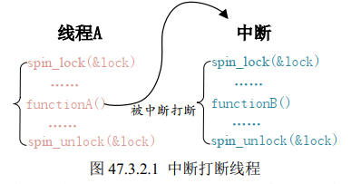
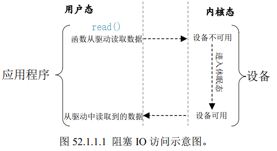
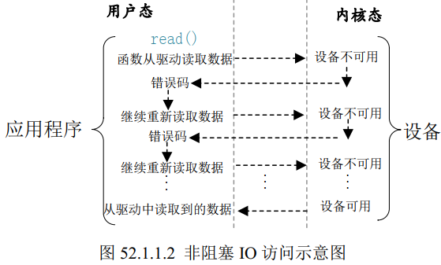

# I.MX6U嵌入式Linux驱动开发指南
- [I.MX6U嵌入式Linux驱动开发指南](#imx6u嵌入式linux驱动开发指南)
- [第四篇 ARM Linux 驱动开发篇](#第四篇-arm-linux-驱动开发篇)
  - [驱动相关知识总结](#驱动相关知识总结)
    - [1 Linux 设备号](#1-linux-设备号)
      - [1.1 设备号的组成](#11-设备号的组成)
      - [1.2 旧设备号的分配](#12-旧设备号的分配)
      - [1.3 新设备号的分配](#13-新设备号的分配)
    - [2 printk 函数消息级别](#2-printk-函数消息级别)
  - [第四十章 字符设备驱动开发](#第四十章-字符设备驱动开发)
    - [40.1 字符设备驱动简介](#401-字符设备驱动简介)
    - [40.2 字符设备驱动开发步骤](#402-字符设备驱动开发步骤)
      - [40.2.1 驱动模块的加载和卸载](#4021-驱动模块的加载和卸载)
      - [40.2.2 字符设备注册与注销](#4022-字符设备注册与注销)
      - [40.2.4 添加 LICENSE 和作者信息](#4024-添加-license-和作者信息)
    - [40.4](#404)
      - [40.4.3 编译驱动程序和测试APP](#4043-编译驱动程序和测试app)
  - [第四十一章 （物理地址和虚拟地址映射函数）](#第四十一章-物理地址和虚拟地址映射函数)
  - [第四十二章 新字符设备驱动实验](#第四十二章-新字符设备驱动实验)
    - [42.1 新字符设备驱动原理](#421-新字符设备驱动原理)
      - [42.1.1 分配和释放设备号](#4211-分配和释放设备号)
      - [42.1.2 新的字符设备注册方法](#4212-新的字符设备注册方法)
    - [42.2 自动创建设备节点](#422-自动创建设备节点)
    - [42.4 总结](#424-总结)
  - [第四十三章 设备树](#第四十三章-设备树)
    - [43.2 DTS、DTB 和 DTC](#432-dtsdtb-和-dtc)
    - [43.5 设备树在系统中的体现](#435-设备树在系统中的体现)
    - [43.9 设备树常用 OF 操作函数](#439-设备树常用-of-操作函数)
      - [43.9.1 查找节点的 OF 函数](#4391-查找节点的-of-函数)
      - [43.9.3 查找属性值的 OF 函数](#4393-查找属性值的-of-函数)
      - [43.9.4 其他常用的 OF 函数](#4394-其他常用的-of-函数)
  - [第四十五章 pinctrl 和 gpio 子系统实验](#第四十五章-pinctrl-和-gpio-子系统实验)
      - [45.2.3 gpio 子系统 API 函数](#4523-gpio-子系统-api-函数)
      - [45.2.5 与 gpio 相关的 OF 函数](#4525-与-gpio-相关的-of-函数)
  - [第四十七章 Linux 并发与竞争](#第四十七章-linux-并发与竞争)
    - [47.1 并发与竞争](#471-并发与竞争)
    - [47.2 原子操作](#472-原子操作)
      - [47.2.2 原子整型操作 API 函数](#4722-原子整型操作-api-函数)
      - [47.2.3 原子位操作 API 函数](#4723-原子位操作-api-函数)
    - [47.3 自旋锁](#473-自旋锁)
      - [47.3.2 自旋锁 API 函数](#4732-自旋锁-api-函数)
      - [47.3.3 自旋锁使用注意事项](#4733-自旋锁使用注意事项)
    - [47.4 信号量](#474-信号量)
      - [47.4.2 信号量 API 函数](#4742-信号量-api-函数)
    - [47.5 互斥体](#475-互斥体)
      - [47.5.2 互斥体 API 函数](#4752-互斥体-api-函数)
  - [第四十八章 Linux 并发与竞争实验](#第四十八章-linux-并发与竞争实验)
    - [48.1 原子操作实验](#481-原子操作实验)
  - [第五十章 Linux 内核定时器实验](#第五十章-linux-内核定时器实验)
  - [第五十一章 Linux中断实验](#第五十一章-linux中断实验)
    - [51.1 Linux 中断简介](#511-linux-中断简介)
      - [51.1.1 Linux 中断 API 函数](#5111-linux-中断-api-函数)
        - [申请释放中断](#申请释放中断)
        - [中断处理函数](#中断处理函数)
        - [中断使能与禁止函数](#中断使能与禁止函数)
      - [51.1.2 上半部与下半部](#5112-上半部与下半部)
        - [下半部机制](#下半部机制)
        - [1、软中断](#1软中断)
        - [2、tasklet](#2tasklet)
        - [3、工作队列](#3工作队列)
      - [51.1.4 获取中断号](#5114-获取中断号)
  - [第五十二章 Linux 阻塞和非阻塞 IO 实验](#第五十二章-linux-阻塞和非阻塞-io-实验)
    - [52.1 阻塞和非阻塞 IO](#521-阻塞和非阻塞-io)
      - [52.1.1 阻塞和非阻塞简介](#5211-阻塞和非阻塞简介)
          - [阻塞式 IO](#阻塞式-io)
          - [非阻塞式 IO](#非阻塞式-io)
      - [52.1.2 等待队列](#5212-等待队列)
        - [1、等待队列头](#1等待队列头)
        - [2、等待队列项](#2等待队列项)
        - [3、将队列添加/移除等待队列头](#3将队列添加移除等待队列头)
        - [4、等待唤醒](#4等待唤醒)
        - [5、等待事件](#5等待事件)
      - [52.1.3 轮询](#5213-轮询)
        - [1、select 函数](#1select-函数)
          - [fd_set](#fd_set)
          - [timeout](#timeout)
        - [2、poll 函数](#2poll-函数)
          - [pollfd 结构体](#pollfd-结构体)
        - [3、epoll 函数](#3epoll-函数)
  - [第五十八章 Linux INPUT子系统实验](#第五十八章-linux-input子系统实验)


# 第四篇 ARM Linux 驱动开发篇
&emsp;&emsp;查看设备状态总结
1. 查看设备号
```shell
cat /proc/devices
```
2. 查看设备树节点
```shell
cd /proc/device-tree/
```

## 驱动相关知识总结
### 1 Linux 设备号
#### 1.1 设备号的组成
&emsp;&emsp;Linux 中每个设备都有一个设备号，设备号由主设备号和次设备号两部分组成，**主设备号表示某一个具体的驱动，次设备号表示使用这个驱动的各个设备。**
&emsp;&emsp;Linux 提供了一个名为`dev_t`的数据类型表示设备号，其定义如下：
```c
typedef unsigned int __u32;
typedef __u32 __kernel_dev_t;
typedef __kernel_dev_t dev_t;
```
&emsp;&emsp;即`dev_t`是一个 unsigned int 类型。其中高12位为主设备号，低20位为次设备号。
&emsp;&emsp;几个操作设备号的操作函数（本质上就是宏，掩码和移位）：
```c
#define MINORBITS 20
#define MINORMASK ((1U << MINORBITS) - 1)

#define MAJOR(dev) ((unsigned int) ((dev) >> MINORBITS))
#define MINOR(dev) ((unsigned int) ((dev) & MINORMASK))
#define MKDEV(ma,mi) (((ma) << MINORBITS) | (mi))
```
* MAJOR：从`dev_t`中获取主设备号。
* MINOR：从`dev_t`中获取次设备号。
* MKDEV：将给定的主设备号和次设备号组成 dev_t 类型的设备号。
#### 1.2 旧设备号的分配
&emsp;&emsp;见 40.2.2 节。
#### 1.3 新设备号的分配
1. 静态分配设备号
&emsp;&emsp;静态分配设备号需要我们检查当前系统中所有被使用了的设备号，然后挑选一个没有使用的。
2. 动态分配设备号
&emsp;&emsp;在注册字符设备之前先申请一个设备号，系统自动分配一个没有被使用的设备号，卸载驱动时释放掉这个设备号即可。
```c
/* 
 * 静态申请设备号
 * from: 要申请的起始设备号，也就是给定的设备号。
 * count: 要申请的数量
 * name: 设备名字
 */
int register_chrdev_region(dev_t from, unsigned count, const char *name)

/* 
 * 动态申请设备号
 * dev: 保存申请到的设备号
 * baseminor: 次设备号起始地址，此函数可以申请一段连续的多个次设备号，
 *            这些设备号的主设备号一样，但是次设备号不同，次设备号以
 *            baseminor为起始地址开始递增。一般为0。
 * count: 要申请的设备号的数量。
 * name: 设备名字。
 */
int alloc_chrdev_region(dev_t *dev, unsigned baseminor, 
        unsigned count, const char *name)

/* 
 * 上面两个函数申请的设备号都通过此函数注销。
 * from: 要释放的设备号。
 * count: 表示从 from 开始，要释放的设备号的数量。
 */
void unregister_chrdev_region(dev_t from, unsigned count)
```

### 2 printk 函数消息级别
&emsp;&emsp;printk 可以根据日志级别对消息进行分类，一共有8个消息级别，0的优先级最高，7的优先级最低。定义在文件`include/linux/kern_level.h`中
```c
#define KERN_SOH "\001"
#define KERN_EMERG KERN_SOH "0"   /* 紧急事件，一般是内核崩溃 */
#define KERN_ALERT KERN_SOH "1"   /* 必须立即采取行动 */
#define KERN_CRIT KERN_SOH "2"    /* 临界条件，比如严重的软件或硬件错误*/
#define KERN_ERR KERN_SOH "3"     /* 错误状态，一般设备驱动程序中使用
                                     KERN_ERR 报告硬件错误 */
#define KERN_WARNING KERN_SOH "4" /* 警告信息，不会对系统造成严重影响 */
#define KERN_NOTICE KERN_SOH "5"  /* 有必要进行提示的一些信息 */
#define KERN_INFO KERN_SOH "6"    /* 提示性的信息 */
#define KERN_DEBUG KERN_SOH "7"   /* 调试信息 */
```
&emsp;&emsp;如果要设置消息级别，示例如下：
```c
printk(KERN_EMERG "gsmi: Log Shutdown Reason\n");
```
&emsp;&emsp;如果使用 printk 的时候不显示的设置消息级别，默认采用`MESSAGE_LOGLEVEL_DEFAULT`，默认为4。
&emsp;&emsp;在`include/linux/printk.h`中有个宏`CONSOLE_LOGLEVEL_DEFAULT`，定义如下：
```c
#define CONSOLE_LOGLEVEL_DEFAULT 7
```
&emsp;&emsp;此宏默认为 7，意味着只有优先级高于 7 的消息才能显示在控制台上。


## 第四十章 字符设备驱动开发
### 40.1 字符设备驱动简介
&emsp;&emsp;字符设备就是一个一个字节，按照字节流进行读写操作的设备，读写数据是分先后顺序的。
### 40.2 字符设备驱动开发步骤
#### 40.2.1 驱动模块的加载和卸载
&emsp;&emsp;可以使用`insmod`和`modprobe`来加载驱动模块。
* insmod：不能解决模块的依赖关系
* modprobe：会分析模块的依赖关系，然后会将所有依赖的模块都加载到内核中。modprobe 默认会去`lib/modules/<kernel-version>`目录中查找模块。一般自己制作的根文件系统中时不会有这个目录的，需要自己手动创建。  

&emsp;&emsp;模块的加载和卸载动作在驱动中体现为两个函数：
```c
module_init(xxx_init);      //注册模块加载函数
module_exit(xxx_exit);      //注册模块卸载函数
```
&emsp;&emsp;加载函数和卸载函数模板：
```c
static int __init xxx_init(void)
{
    /* 入口函数具体内容 */
    return 0;
}

static void __exit xxx_exit(void)
{
    /* 出口函数具体内容 */
}
/* 将上面两个函数指定为驱动的入口和出口函数 */
module_init(xxx_init);
module_exit(xxx_exit);
```
#### 40.2.2 字符设备注册与注销
&emsp;&emsp;驱动模块加载成功以后需要注册字符设备，卸载驱动模块的时候需要注销字符设备。
```c
static inline int register_chrdev(unsigned int major, 
    const char *name, const struct file_operations *fops)
static inline void unregister_chrdev(unsigned int major, 
    const char *name)
```
&emsp;&emsp;这两个函数的参数含义如下：
* major：主设备号。
* name：设备名字，指向一串字符串。
* fops：结构体 file_operations 类型的指针，指向设备的操作函数集合变量。


#### 40.2.4 添加 LICENSE 和作者信息
```c
MODULE_LICENSE() //添加模块 LICENSE 信息，必须添加
MODULE_AUTHOR()  //添加模块作者信息，可以不添加
```


&emsp;&emsp;总结起来，字符设备的驱动编写模板如下：
```c
static struct file_operations test_fops;

/* 下面这些是根据自己需求需要实现的回调函数 */
static struct file_operations test_fops = {
    .owner = THIS_MODULE,
    .open = chrtest_open,
    .read = chrtest_read,
    .write = chrtest_write,
    .release = chrtest_release,
};

/* 驱动入口函数 */
static int __init xxx_init(void)
{
    /* 入口函数具体内容 */
    int retvalue = 0;

    /* 注册字符设备驱动 */
    retvalue = register_chrdev(200, "chrtest", &test_fops);
    if(retvalue < 0){
        /* 字符设备注册失败,自行处理 */
    }
    return 0;
}

/* 驱动出口函数 */
static void __exit xxx_exit(void)
{
    /* 注销字符设备驱动 */
    unregister_chrdev(200, "chrtest");
}

/* 将上面两个函数指定为驱动的入口和出口函数 */
module_init(xxx_init);
module_exit(xxx_exit);
```
&emsp;&emsp;驱动加载成功以后需要在 /dev 下面创建一个与之对应的设备节点文件，应用程序通过此设备节点来操作具体的设备。
```shell
mknod /dev/chrdevbase c 200 0
```
&emsp;&emsp;然后操作此文件即可。
&emsp;&emsp;即，通过`module_init`，`module_exit`指定驱动出口入口函数，通过`register_chrdev`，`unregister_chrdev`注册注销字符设备，使用`insmode`，`rmmode`加载卸载驱动，通过`mknod`创建设备节点。

### 40.4 
#### 40.4.3 编译驱动程序和测试APP
1. 编译驱动程序（编译成 .ko 文件，insmod）
```Makefile
KERNELDIR := /home/zuozhongkai/linux/IMX6ULL/linux/temp/linux-imxrel_imx_4.1.15_2.1.0_ga_alientek
CURRENT_PATH := $(shell pwd)
obj-m := chrdevbase.o

build: kernel_modules

kernel_modules:
    $(MAKE) -C $(KERNELDIR) M=$(CURRENT_PATH) modules
clean:
    $(MAKE) -C $(KERNELDIR) M=$(CURRENT_PATH) clean
```
2. 编译测试APP
```Makefile
arm-linux-gnueabihf-gcc chrdevbaseApp.c -o chrdevbaseApp
```

## 第四十一章 （物理地址和虚拟地址映射函数）
&emsp;&emsp;物理地址和虚拟地址映射函数：`ioremap`和`iounmap`。
```c
/* 
 * cookie: 要映射的物理起始地址 
 * size: 要映射的内存空间大小
 * 返回值：__iomem 类型的指针，指向映射后的虚拟空间首地址
 */
ioremap(cookie,size)

/* 
 * addr: 要取消映射的虚拟地址空间首地址
 */
void iounmap (volatile void __iomem *addr)

//示例
#define SW_MUX_GPIO1_IO03_BASE (0X020E0068)
static void __iomem* SW_MUX_GPIO1_IO03;
SW_MUX_GPIO1_IO03 = ioremap(SW_MUX_GPIO1_IO03_BASE, 4);

iounmap(SW_MUX_GPIO1_IO03);
```

&emsp;&emsp;I/O内存访问函数，读操作函数和写操作函数，分别是 8 位，16 位，32 位：
```c
u8 readb(const volatile void __iomem *addr)
u16 readw(const volatile void __iomem *addr)
u32 readl(const volatile void __iomem *addr)
void writeb(u8 value, volatile void __iomem *addr)
void writew(u16 value, volatile void __iomem *addr)
void writel(u32 value, volatile void __iomem *addr)
```

## 第四十二章 新字符设备驱动实验
&emsp;&emsp;第四十章使用的函数`register_chrdev`会将一个主设备号下的所有次设备号都使用掉，新的字符设备驱动已经不再使用这两个函数。
### 42.1 新字符设备驱动原理
#### 42.1.1 分配和释放设备号
&emsp;&emsp;参见驱动相关知识总结，设备号一节。
#### 42.1.2 新的字符设备注册方法
&emsp;&emsp;使用一个结构体`cdev`来抽象表示一个字符设备，其定义如下：
```c
struct cdev {
    struct kobject kobj;
    struct module *owner;
    const struct file_operations *ops;
    struct list_head list;
    dev_t dev;
    unsigned int count;
};
```
&emsp;&emsp;成员变量`ops`时字符设备文件操作集合，`dev_t`是设备号，`owner`通常是`THIS_MODULE`。需要使用此结构体定义的变量来注册其代表的字符设备。注册注销函数流程如下：
```c
struct cdev testcdev;

/* 设备操作函数 */
static struct file_operations test_fops = {
    .owner = THIS_MODULE,
    /* 其他具体的初始项 */
};

testcdev.owner = THIS_MODULE;
cdev_init(&testcdev, &test_fops); /* 初始化 cdev 结构体变量 */
cdev_add(&testcdev, devid, 1); /* 添加字符设备 */

cdev_del(&testcdev); /* 删除 cdev */
```
&emsp;&emsp;各函数定义如下：
```c
/* 
 * cdev: 要注册的字符设备
 * fops: 对应的操作函数集合
 */
void cdev_init(struct cdev *cdev, const struct file_operations *fops)

/* 
 * cdev: 要添加的字符设备
 * dev: 要添加的设备的起始设备号
 * count: 此设备对应的连续的次设备号的数量
 */
int cdev_add(struct cdev *p, dev_t dev, unsigned count)

/* 
 * p: 要删除的字符设备
 */
void cdev_del(struct cdev *p)
```
### 42.2 自动创建设备节点
&emsp;&emsp;在驱动中实现自动创建设备节点的功能以后，使用 modprobe 加载驱动模块成功的话就会自动在 /dev 目录下创建对应的设备文件。
&emsp;&emsp;自动创建设备节点，需要在驱动入口函数中先创建一个类，再在这个类下创建一个设备。卸载驱动的时候需要删除掉创建的设备，先删除掉设备，再删除对应的类。流程如下：
```c
struct class *class; /* 类 */
struct device *device; /* 设备 */
dev_t devid; /* 设备号 */

/* 驱动入口函数 */
static int __init xxx_init(void)
{
    /* 创建类 */
    class = class_create(THIS_MODULE, "xxx");
    /* 创建设备 */
    device = device_create(class, NULL, devid, NULL, "xxx");
    return 0;
}

/* 驱动出口函数 */
static void __exit led_exit(void)
{
    /* 删除设备 */
    device_destroy(newchrled.class, newchrled.devid);
    /* 删除类 */
    class_destroy(newchrled.class);
}

module_init(led_init);
module_exit(led_exit);
```
&emsp;&emsp;各函数原型如下：
```c
/* 
 * class_create是一个宏，展开后如下所示
 * owner: 一般为 THIS_MODULE
 * name: 类名字
 * 返回值：指向结构体 class 的指针，也就是创建的类
 */
struct class *class_create (struct module *owner, const char *name)

/* 
 * cls: 要删除的类
 */
void class_destroy(struct class *cls);

/* 
 * class: 要创建在哪个类下面
 * parent: 父设备，如果没有，设为 NULL
 * devt: 设备号
 * drvdata: 设备可能会使用的私有数据，如果没有，设为 NULL
 * fmt: 设备名字
 * 返回值：创建好的设备
 */
struct device *device_create(struct class *class,
                             struct device *parent,
                             dev_t devt,
                             void *drvdata,
                             const char *fmt, ...)

/* 
 * class: 要删除的设备所处的类
 * devt: 要删除的设备号
 */
void device_destroy(struct class *class, dev_t devt)
```
### 42.4 总结
&emsp;&emsp;总的来说，新的字符设备注册以及自动创建设备节点示例如下：
```c
/* newchrled 设备结构体 */
struct newchrled_dev{
    dev_t devid; /* 设备号 */
    struct cdev cdev; /* cdev */
    struct class *class; /* 类 */
    struct device *device; /* 设备 */
};

struct newchrled_dev newchrled; /* led 设备 */

/* 设备操作函数 */
static struct file_operations newchrled_fops = {
    .owner = THIS_MODULE,
    .open = led_open,
    .read = led_read,
    .write = led_write,
    .release = led_release,
};

static int __init led_init(void)
{
    /* 对硬件设备的初始化配置 */

    /* 注册字符设备驱动，下面两个函数根据需要选择 */
    /* 1、设备号 */
    register_chrdev_region(newchrled.devid, NEWCHRLED_CNT,
        NEWCHRLED_NAME);
    alloc_chrdev_region(&newchrled.devid, 0, NEWCHRLED_CNT,
        NEWCHRLED_NAME); 

    /* 2、初始化抽象设备的结构体 cdev */
    newchrled.cdev.owner = THIS_MODULE;
    cdev_init(&newchrled.cdev, &newchrled_fops);

    /* 3、添加一个 cdev */
    cdev_add(&newchrled.cdev, newchrled.devid, NEWCHRLED_CNT);

    /* 上面已经完成了字符设备的注册，下面是自动创建设备节点 */
    /* 1、创建类 */
    newchrled.class = class_create(THIS_MODULE, NEWCHRLED_NAME);

    /* 2、创建设备 */
    newchrled.device = device_create(newchrled.class, NULL,
        newchrled.devid, NULL, NEWCHRLED_NAME);

    return 0;
}

static void __exit led_exit(void)
{
    /* 对硬件设备的操作 */

    /* 注销字符设备 */
    cdev_del(&newchrled.cdev);/* 删除 cdev */
    unregister_chrdev_region(newchrled.devid, NEWCHRLED_CNT);

    device_destroy(newchrled.class, newchrled.devid);
    class_destroy(newchrled.class);
}

module_init(led_init);
module_exit(led_exit);
MODULE_LICENSE("GPL");
MODULE_AUTHOR("zuozhongkai");
```

## 第四十三章 设备树
### 43.2 DTS、DTB 和 DTC
&emsp;&emsp;要编译 DTS 文件的话只需要进入到 Linux 源码根目录下，然后执行 `make dtbs` 即可。
&emsp;&emsp;在`arch/arm/boot/dts/Makefile`中（对于arm来说，是在arm架构下，别的架构去对应的路径下找即可，例如`arch/riscv/boot/dts/Makefile`）有如下内容：
```c
dtb-$(CONFIG_SOC_IMX6UL) += \
    imx6ul-14x14-ddr3-arm2.dtb \
......
dtb-$(CONFIG_SOC_IMX6ULL) += \
......
    imx6ull-14x14-evk-usb-certi.dtb \
    imx6ull-alientek-emmc.dtb \
    imx6ull-alientek-nand.dtb \
......
dtb-$(CONFIG_SOC_IMX6SLL) += \
    imx6sll-lpddr2-arm2.dtb \
```
&emsp;&emsp;当选中 I.MX6ULL 这个SOC以后（CONFIG_SOC_IMX6ULL=y），所有使用到 I.MX6ULL 这个 SOC 的板子对应的 .dts 文件都会被编译为 .dtb 如果我们使用 I.MX6ULL 新做了一个板子，只需要新建一个此板子对应的 .dts 文件，然后将对应的 .dtb 文件名添加到 dtb-$(CONFIG_SOC_IMX6ULL)下，这样在编译设备树的时候就会将对应的 .dts 编译为二进制的 .dtb 文件。

### 43.5 设备树在系统中的体现
&emsp;&emsp;Linux 内核启动的时候会解析设备树中各个节点的信息，并且在根文件系统的`/proc/device-tree`目录下根据节点名字创建不同的文件夹。其目录结构和设备树是一致的。
### 43.9 设备树常用 OF 操作函数
&emsp;&emsp;Linux 内核提供了一系列函数来获取设备树中的节点和节点中的属性信息。这一系列函数都有一个统一的前缀“of_”，这些函数原型定义在`include/linux/of.h`文件中。
#### 43.9.1 查找节点的 OF 函数
&emsp;&emsp;设备都是以节点的形式“挂”到设备树上的，因此要想获取这个设备的其他属性信息，必须先获取到这个设备节点。Linux 内核使用`device_node`来抽象一个节点，定义如下：
```c
struct device_node {
    const char *name; /* 节点名字 */
    const char *type; /* 设备类型 */
    phandle phandle;
    const char *full_name; /* 节点全名 */
    struct fwnode_handle fwnode;

    struct property *properties; /* 属性 */
    struct property *deadprops; /* removed 属性 */
    struct device_node *parent; /* 父节点 */
    struct device_node *child; /* 子节点 */
    struct device_node *sibling;
    struct kobject kobj;
    unsigned long _flags;
    void *data;
#if defined(CONFIG_SPARC)
    const char *path_component_name;
    unsigned int unique_id;
    struct of_irq_controller *irq_trans;
#endif
};
```
&emsp;&emsp;查找节点的 OF 函数共有 5 个：
```c
/* 
 * from: 开始查找的节点，如果为 NULL 表示从根节点开始查找整个设备树
 * name: 要查找的节点名字
 * 返回值：找到的节点，如果为 NULL 表示查找失败
 */
struct device_node *of_find_node_by_name(struct device_node *from,
                const char *name);

/* 
 * from: 开始查找的节点，如果为 NULL 表示从根节点开始查找整个设备树
 * type: 要查找的节点对应的 type 字符串，也就是 device_type 属性值
 */
struct device_node *of_find_node_by_type(struct device_node *from,
                const char *type)

/* 
 * type: 可以为 NULL，表示忽略掉 device_type 属性
 * compatible：要查找的节点所对应的 compatible 属性列表
 */
struct device_node *of_find_compatible_node(struct device_node *from,
                const char *type,
                const char *compatible)

/* 
 * matches：of_device_id 匹配表，也就是在此匹配表里面查找节点。
 * match：找到的匹配的 of_device_id。
 */
struct device_node *of_find_matching_node_and_match(struct device_node *from,
                const struct of_device_id *matches,
                const struct of_device_id **match)

/* 
 * path：带有全路径的节点名，可以使用节点的别名，
 * 比如“/backlight”就是 backlight 这个节点的全路径。
 */
inline struct device_node *of_find_node_by_path(const char *path)
```
&emsp;&emsp;查找父节点或子节点的 OF 函数
```c
/* 
 * node：要查找的父节点的节点
 * 返回值：找到的父节点
 */
struct device_node *of_get_parent(const struct device_node *node)

/* 
 * node：父节点
 * prev：前一个子节点，也就是从哪一个子节点开始迭代的查找下一个子节点。
 *       可以设置为 NULL，表示从第一个子节点开始。
 * 返回值：找到的父节点
 */
struct device_node *of_get_next_child(const struct device_node *node,
                            struct device_node *prev)
```
#### 43.9.3 查找属性值的 OF 函数
&emsp;&emsp;Linux 内核使用结构体 property 抽象属性，定义如下：
```c
struct property {
    char *name; /* 属性名字 */
    int length; /* 属性长度 */
    void *value; /* 属性值 */
    struct property *next; /* 下一个属性 */
    unsigned long _flags;
    unsigned int unique_id;
    struct bin_attribute attr;
};
```
&emsp;&emsp;Linux 内核提供了提取属性值的 OF 函数：
```c
/* 
 * 作用：查找指定的属性
 * np: 设备节点
 * name：属性名字
 * lenp：属性值的字节数
 * 返回值：找到的属性
 */
property *of_find_property(const struct device_node *np,
                            const char *name,
                            int *lenp)

/* 
 * 作用：用于获取属性中元素的数量，比如 reg 属性值是一个
 *       数组，那么使用此函数可以获取到这个数组的大小
 * np：设备节点
 * proname：需要统计元素数量的属性名字
 * elem_size：元素长度
 * 返回值：得到的属性元素数量
 */
int of_property_count_elems_of_size(const struct device_node *np,
                            const char *propname,
                            int elem_size)

/* 
 * 作用：用于从属性中获取指定标号的 u32 类型数据值(无符号 32 位)，比如
 *       某个属性有多个 u32 类型的值，那么就可以使用此函数来获取指定标号的数据值
 * np：设备节点
 * proname：要读取的属性名字
 * index：要读取的值标号
 * out_value：读取到的值
 * 返回值：0：读取成功
 *        负值：读取失败
 *              -EINVAL：属性不存在
 *              -ENODATA：没有要读取的数据
 *              -EOVERFLOW：属性值列表太小
 */
int of_property_read_u32_index(const struct device_node *np,
                            const char *propname,
                            u32 index,
                            u32 *out_value)

/* 
 * 作用：读取只有一个整型值的属性
 * np：设备节点
 * proname：要读取的属性名字
 * out_value：读取到的数组值
 * 返回值：0：读取成功
 *        负值：读取失败
 */
int of_property_read_u8(const struct device_node *np,
                            const char *propname,
                            u8 *out_value)
int of_property_read_u16(const struct device_node *np,
                            const char *propname,
                            u16 *out_value)
int of_property_read_u32(const struct device_node *np,
                            const char *propname,
                            u32 *out_value)
int of_property_read_u64(const struct device_node *np,
                            const char *propname,
                            u64 *out_value)

/* 
 * 作用：读取属性中的数组数据，例如可以一次读取 reg 属性中的所有数据
 * np：设备节点
 * proname：要读取的属性名字
 * out_value：读取到的数组值
 * sz：要读取的数组元素数量
 * 返回值：0：读取成功
 *        负值：读取失败
 */
int of_property_read_u8_array(const struct device_node *np,
                                const char *propname,
                                u8 *out_values,
                                size_t sz)
int of_property_read_u16_array(const struct device_node *np,
                                const char *propname,
                                u16 *out_values,
                                size_t sz)
int of_property_read_u32_array(const struct device_node *np,
                                const char *propname,
                                u32 *out_values,
                                size_t sz)
int of_property_read_u64_array(const struct device_node *np,
                                const char *propname,
                                u64 *out_values,
                                size_t sz)

/* 
 * 作用：读取属性中字符串的值
 * np：设备节点
 * proname：要读取的属性名字
 * out_string：读取到的字符串值
 * 返回值：0：读取成功
 *        负值：读取失败
 */
int of_property_read_string(struct device_node *np,
                                const char *propname,
                                const char **out_string)

/* 
 * 作用：获取 #address-cells 属性值
 * np：设备节点
 * 返回值：获取到的 #address-cells 属性值
 */
int of_n_addr_cells(struct device_node *np)

/* 
 * 作用：获取 #size-cells 属性值
 * np：设备节点
 * 返回值：获取到的 #size-cells 属性值
 */
int of_n_size_cells(struct device_node *np)
```
#### 43.9.4 其他常用的 OF 函数


## 第四十五章 pinctrl 和 gpio 子系统实验
&emsp;&emsp;这章讲的很浅，没啥用。
#### 45.2.3 gpio 子系统 API 函数
&emsp;&emsp;gpio 子系统提供的常用的 API 函数有下面几个：
```c
/* 
 * 作用：申请一个 gpio 管脚，在使用一个 gpio 之前一定要使用此函数进行申请。
 * gpio：要申请的 gpio 标号。使用 of_get_named_gpio 函数从设备树获取指定 gpio
 *      属性信息，此函数会返回这个 gpio 的标号。
 * label：给 gpio 设置个名字。
 * 返回值：0：申请成功；其他值：申请失败。
 */
int gpio_request(unsigned gpio, const char *label)

/* 
 * 作用：释放申请的 gpio
 * gpio：要释放的 gpio 标号
 * 返回值：无
 */
void gpio_free(unsigned gpio)

/* 
 * 作用：设置某个 gpio 为输入
 * gpio：要设置为输入的 gpio 标号
 * 返回值：0：设置成功；负值：设置失败
 */
int gpio_direction_input(unsigned gpio)

/* 
 * 作用：设置某个 gpio 为输出，并且设置为默认输出值
 * gpio：要设置为输出的 gpio 标号
 * value：gpio 默认输出值
 * 返回值：0，设置成功；负值，设置失败
 */
int gpio_direction_output(unsigned gpio, int value)

/* 
 * 作用：获取某个 gpio 的值
 * gpio：要获取的 gpio 标号
 * 返回值：非负值，得到的 gpio 值；负值，获取失败
 */
#define gpio_get_value __gpio_get_value
int __gpio_get_value(unsigned gpio)

/* 
 * 作用：设置某个 gpio 的值
 * gpio：要设置的 gpio 标号
 * value：要设置的值
 * 返回值：无
 */
#define gpio_set_value __gpio_set_value
void __gpio_set_value(unsigned gpio, int value)
```
#### 45.2.5 与 gpio 相关的 OF 函数
```c
/* 
 * 作用：获取设备树某个属性里面定义了几个 gpio 信息
 * np：设备节点
 * propname：要统计的 gpio 属性
 * 返回值：正值：统计到的 gpio 数量；
 */
int of_gpio_named_count(struct device_node *np, const char *propname)

/* 
 * 作用：统计“gpios”这个属性的 gpio 数量，上面的函数可以统计任意属性的
 *      gpio 信息。
 * np：设备节点
 * 返回值：正值：统计到的 gpio 数量；负值：失败
 */
int of_gpio_count(struct device_node *np)

/* 
 * 作用：获取 gpio 编号，此函数会将设备树中类似 <&gpio5 7 GPIO_ACTIVE_LOW>
 *      属性信息转换为对应的 gpio 编号
 * np：设备节点
 * propname：包含要获取 gpio 信息的属性名
 * index：gpio 索引
 */
int of_get_named_gpio(struct device_node *np,
                    const char *propname,
                    int index)
```


&emsp;&emsp;让我们来看看从驱动程序代码启用这个时钟： 
```c
	clk_enable(clk);
		clk->ops->enable(clk->hw);
		[resolves to...]
			clk_gate_enable(hw);
			[resolves struct clk gate with to_clk_gate(hw)]
				clk_gate_set_bit(gate);
```

## 第四十七章 Linux 并发与竞争
### 47.1 并发与竞争
&emsp;&emsp;保护内容是什么：一般像全局变量，设备结构体这些肯定是要保护的，至于其他的数据就要根据实际的驱动程序而定了。
### 47.2 原子操作
&emsp;&emsp;一般原子操作用于**变量**或者**位**操作。
&emsp;&emsp;Linux内核提供了两组原子操作API函数，一组是对整形变量进行操作的，一组是对位进行操作的。
#### 47.2.2 原子整型操作 API 函数
&emsp;&emsp;Linux内核定义了叫做atomic_t的结构体来完成整形数据的原子操作，在使用中用原子变量来代替整形变量，此结构体定义在include/linux/types.h文件中，定义如下：
```c
typedef struct {
    int counter;
} atomic_t;
```
&emsp;&emsp;如果要使用原子操作API函数，首先要定义一个stomic_t变量，如下所示：
```c
atomic_t a; //定义 a
```
&emsp;&emsp;也可以在定义原子变量的时候给原子变量赋初值，如下所示：
```c
atomic_t b = ATOMIC_INIT(0); //定义原子变量b并赋初值为0
```
&emsp;&emsp;可以通过宏ATOMIC_INIT向原子变量赋初值。
&emsp;&emsp;原子变量有了，接下来就是对原子变量进行操作，比如读、写、增加、减少等等， Linux 内核提供了大量的原子操作 API 函数，如表 47.2.2.1 所示：

| 函数                                        | 描述                                         |
| ------------------------------------------- | -------------------------------------------- |
| ATOMIC_INIT(int i)                          | 定义原子变量的时候对其初始化。               |
| int atomic_read(atomic_t *v)                | 读取 v 的值，并且返回。                      |
| void atomic_set(atomic_t *v, int i)         | 向 v 写入 i 值。                             |
| void atomic_add(int i, atomic_t *v)         | 给 v 加上 i 值。                             |
| void atomic_sub(int i, atomic_t *v)         | 从 v 减去 i 值。                             |
| void atomic_inc(atomic_t *v)                | 给 v 加 1，也就是自增。                      |
| void atomic_dec(atomic_t *v)                | 从 v 减 1，也就是自减。                      |
| int atomic_dec_return(atomic_t *v)          | 从 v 减 1，并且返回 v 的值。                 |
| int atomic_inc_return(atomic_t *v)          | 给 v 加 1，并且返回 v 的值。                 |
| int atomic_sub_and_test(int i, atomic_t *v) | 从 v 减 i，如果结果为 0 就返回真，否则返回假 |
| int atomic_dec_and_test(atomic_t *v)        | 从 v 减 1，如果结果为 0 就返回真，否则返回假 |
| int atomic_inc_and_test(atomic_t *v)        | 给 v 加 1，如果结果为 0 就返回真，否则返回假 |
| int atomic_add_negative(int i, atomic_t *v) | 给 v 加 i，如果结果为负就返回真，否则返回假  |
&emsp;&emsp;如果使用 64 位 SOC 的话，就要用到 64 位的原子变量，Linux内核也定义了 64 位原子结构体，如下所示：
```c
typedef struct {
    long long counter;
} atomic64_t;
```
&emsp;&emsp;相应的也提供了 64 位原子变量的操作 API 函数，只是将“atomic_”前缀换为“atomic64_”，将 int 换为 long long。
#### 47.2.3 原子位操作 API 函数
&emsp;&emsp;原子位操作是直接对内存进行操作。

| 函数                                     | 描述                                              |
| ---------------------------------------- | ------------------------------------------------- |
| void set_bit(int nr, void *p)            | 将 p 地址的第 nr 位置 1。                         |
| void clear_bit(int nr,void *p)           | 将 p 地址的第 nr 位清零。                         |
| void change_bit(int nr, void *p)         | 将 p 地址的第 nr 位进行翻转。                     |
| int test_bit(int nr, void *p)            | 获取 p 地址的第 nr 位的值。                       |
| int test_and_set_bit(int nr, void *p)    | 将 p 地址的第 nr 位置 1，并且返回 nr 位原来的值。 |
| int test_and_clear_bit(int nr, void *p)  | 将 p 地址的第 nr 位清零，并且返回 nr 位原来的值。 |
| int test_and_change_bit(int nr, void *p) | 将 p 地址的第 nr 位翻转，并且返回 nr 位原来的值。 |
### 47.3 自旋锁
&emsp;&emsp;使用锁的目的：达到同步的作用，使共享资源在同一时间内，只能有一个进程或者线程对它进行操作。为了使锁能够正常工作，为了保护共享资源，我们只有在设计线程的时候，所有线程都用同一种方法去访问共享数据，也就是访问数据之前，务必先获取锁，然后再操作，操作完之后要解锁（unlock）。操作系统提供锁机制，就是提供了一种所有程序员都必须遵循的规范。而不是说我们锁住资源，其他线程访问共享资源的时候，让操作系统去为我们检查数据是否有其他的线程在操作。
&emsp;&emsp;当一个线程要访问某个共享资源的时候首先要先获取相应的锁， 锁只能被一个线程持有，只要此线程不释放持有的锁，那么其他的线程就不能获取此锁。对于自旋锁而言，如果自旋锁正在被线程 A 持有，线程 B 想要获取自旋锁，那么线程 B 就会处于**忙循环-旋转-等待**状态，线程 B 不会进入休眠状态或者说去做其他的处理，而是会一直傻傻的在那里“转圈圈”的等待锁可用。
&emsp;&emsp;自旋锁的“自旋”也就是“原地打转”的意思，“原地打转”的目的是为了等待自旋锁可以用，可以访问共享资源。把自旋锁比作一个变量 a，变量 a=1 的时候表示共享资源可用，当 a=0的时候表示共享资源不可用。现在线程 A 要访问共享资源，发现 a=0(自旋锁被其他线程持有)，那么线程 A 就会不断的查询 a 的值，直到 a=1。从这里我们可以看到自旋锁的一个缺点：<u>那就等待自旋锁的线程会一直处于自旋状态，这样会浪费处理器时间，降低系统性能，所以自旋锁的持有时间不能太长</u>。所以自旋锁适用于短时期的轻量级加锁，如果遇到需要长时间持有锁的场景那就需要换其他的方法了。
&emsp;&emsp;Linux 内核使用结构体 spinlock_t 表示自旋锁，结构体定义如下所示：
```c
typedef struct spinlock {
    union {
        struct raw_spinlock rlock;

#ifdef CONFIG_DEBUG_LOCK_ALLOC
#define LOCK_PADSIZE (offsetof(struct raw_spinlock, dep_map))
        struct {
            u8 __padding[LOCK_PADSIZE];
            struct lockdep_map dep_map;
        };
#endif
    };
} spinlock_t;
```
&emsp;&emsp;在使用自旋锁之前，首先要定义一个自旋锁变量。
```c
spinlock_t lock;
```
&emsp;&emsp;定义好自旋锁变量以后就可以使用相应的API函数来操作自旋锁。
#### 47.3.2 自旋锁 API 函数
&emsp;&emsp;最基本的自旋锁API函数如下表所示：

| 函数                                 | 描述                                                         |
| ------------------------------------ | ------------------------------------------------------------ |
| DEFINE_SPINLOCK(spinlock_t lock)     | 定义并初始化一个自选变量。                                   |
| int spin_lock_init(spinlock_t *lock) | 初始化自旋锁。                                               |
| void spin_lock(spinlock_t *lock)     | 获取指定的自旋锁，也叫做加锁。                               |
| void spin_unlock(spinlock_t *lock)   | 释放指定的自旋锁。                                           |
| int spin_trylock(spinlock_t *lock)   | 尝试获取指定的自旋锁，如果没有获取到就返回 0                 |
| int spin_is_locked(spinlock_t *lock) | 检查指定的自旋锁是否被获取，如果没有被获取就返回非0，否则返回0。 |
&emsp;&emsp;表47.3.2.1中的自旋锁API函数适用于SMP或支持抢占的单CPU下线程之间的并发访问，也就是用于线程与线程之间，**被自旋锁保护的临界区一定不能调用任何能够引起睡眠和阻塞的API 函数，否则的话会可能会导致死锁现象的发生**。自旋锁会自动禁止抢占，也就说当线程 A得到锁以后会暂时禁止内核抢占。如果线程 A 在持有锁期间进入了休眠状态，那么线程 A 会自动放弃 CPU 使用权。线程 B 开始运行，线程 B 也想要获取锁，但是此时锁被 A 线程持有，而且内核抢占还被禁止了！线程 B 无法被调度出去，那么线程 A 就无法运行，锁也就无法释放，好了，死锁发生了！
&emsp;&emsp;表 47.3.2.1 中的 API 函数用于线程之间的并发访问，如果此时中断也要插一脚，中断也想访问共享资源，那该怎么办呢？首先可以肯定的是，中断里面可以使用自旋锁，**但是在中断里面使用自旋锁的时候，在获取锁之前一定要先禁止本地中断(也就是本 CPU 中断，对于多核 SOC来说会有多个 CPU 核)**，否则可能导致锁死现象的发生。
  
&emsp;&emsp;在图 47.3.2.1 中，线程 A 先运行，并且获取到了 lock 这个锁，当线程 A 运行 functionA 函数的时候中断发生了，中断抢走了 CPU 使用权。右边的中断服务函数也要获取 lock 这个锁，但是这个锁被线程 A 占有着，中断就会一直自旋，等待锁有效。但是在中断服务函数执行完之前，线程A是不可能执行的，线程 A 说“你先放手”，中断说“你先放手”，场面就这么僵持着，死锁发生！
&emsp;&emsp;最好的解决方法就是获取锁之前关闭本地中断， Linux 内核提供了相应的 API 函数。

| 函数                                                         | 描述                                                       |
| ------------------------------------------------------------ | ---------------------------------------------------------- |
| void spin_lock_irq(spinlock_t *lock)                         | 禁止本地中断，并获取自旋锁。                               |
| void spin_unlock_irq(spinlock_t *lock)                       | 激活本地中断，并释放自旋锁。                               |
| void spin_lock_irqsave(spinlock_t *lock,unsigned long flags) | 保存中断状态，禁止本地中断，并获取自旋锁。                 |
| void spin_unlock_irqrestore(spinlock_t *lock,unsigned long flags) | 将中断状态恢复到以前的状态，并且激活本地中断，释放自旋锁。 |

#### 47.3.3 自旋锁使用注意事项
1. 在等待自旋锁的时候处于自旋状态，因此锁的持有时间不能太长，否则的话会降低系统性能。如果临界区比较大，可以选择其他的并发处理方式，比如信号量和互斥体。
2. 自旋锁保护的临界区内不能调用任何可能导致线程休眠的 API 函数，否则的话可能导致死锁。
3. 不能递归申请自旋锁，因为一旦通过递归的方式申请一个你正在持有的锁，那么你就必须“自旋”，等待锁被释放，然而你正处于“自旋”状态，根本没法释放锁。结果就是自己导致死锁。

### 47.4 信号量
&emsp;&emsp;相比于自旋锁，信号量可以使线程进入休眠状态。信号量的特点如下：
1. 因为信号量可以使等待资源线程进入休眠状态，因此是用于那些占用资源比较久的场合；
2. 因此信号量不能用于中断中，因为信号量会引起休眠，中断不能休眠；
3. 如果共享资源的持有时间比较短，那就不适合信号量了，因为频繁的休眠、切换线程引起的开销要远大于信号量带来的那点优势。
&emsp;&emsp;相当于通过控制信号量控制访问资源的线程数，在初始化的时候将信号量值设置的大于 1，那么这个信号量就是计数型信号量，计数型信号量不能用于互斥访问，因为它允许多个线程同时访问共享资源。如果要互斥的访问共享资源那么信号量的值就不能大于 1，此使的信号量就是一个二值信号量。
#### 47.4.2 信号量 API 函数
&emsp;&emsp;Linux 内核使用 semaphore 结构体表示信号量，结构体内容如下所示：
```c
struct semaphore {
    raw_spinlock_t lock;
    unsigned int count;
    struct list_head wait_list;
};
```
&emsp;&emsp;有关信号量的 API 函数如下所示：

| 函数                                           | 描述                                                         |
| ---------------------------------------------- | ------------------------------------------------------------ |
| DEFINE_SEAMPHORE(name)                         | 定义一个信号量，并且设置信号量的值为 1。                     |
| void sema_init(struct semaphore *sem, int val) | 初始化信号量 sem，设置信号量值为 val。                       |
| void down(struct semaphore *sem)               | 获取信号量，因为会导致休眠，因此不能在中断中使用             |
| int down_trylock(struct semaphore *sem);       | 尝试获取信号量，如果能获取到信号量就获取，并返回0。如果不能就返回非0，并且不会进入休眠。 |
| int down_interruptible(struct semaphore *sem)  | 获取信号量，和down类似，只是使用down进入休眠状态的线程不能被信号打断。而使用此函数进入休眠以后是可以被信号打断的。 |
| void up(struct semaphore *sem)                 | 释放信号量。                                                 |
&emsp;&emsp;信号量的使用如下：
```c
struct semaphore sem; /* 定义信号量 */

sema_init(&sem, 1)； /* 初始化信号量 */

down(&sem); /* 申请信号量 */
/* 临界区 */
up(&sem); /* 释放信号量 */
```
### 47.5 互斥体
&emsp;&emsp;互斥访问表示一次只有一个线程可以访问共享资源，不能递归申请互斥体。Linux内核使用 mutex 结构体表示互斥体，定义如下：
```c
struct mutex {
    /* 1: unlocked, 0: locked, negative: locked, possible waiters */
    atomic_t count;
    spinlock_t wait_lock;
};
```
&emsp;&emsp;使用 mutex 之前要先定义一个 mutex 变量。在使用 mutex 的时候需要注意几点：
1. mutex 可以导致休眠，因此不能再中断中使用 mutex，中断中只能使用自旋锁。
2. 和信号量一样，mutex 保护的临界区可以调用引起阻塞的 API 函数。
3. 因为一次只能由一个线程可以持有 mutex，因此，必须由 mutex 的持有者释放 mutex。并且 mutex 不能递归上锁和解锁。
#### 47.5.2 互斥体 API 函数

| 函数                                             | 描述                                                    |
| ------------------------------------------------ | ------------------------------------------------------- |
| DEFINE_MUTEX(name)                               | 定义并初始化一个 mutex 变量。                           |
| void mutex_init(mutex *lock)                     | 初始化 mutex。                                          |
| void mutex_lock(struct mutex *lock)              | 获取 mutex，也就是给 mutex 上锁。如果获取不到就进休眠。 |
| void mutex_unlock(struct mutex *lock)            | 释放 mutex，也就给 mutex 解锁。                         |
| int mutex_trylock(struct mutex *lock)            | 尝试获取 mutex，如果成功就返回 1，如果失败就返回 0。    |
| int mutex_is_locked(struct mutex *lock)          | 判断 mutex 是否被获取，如果是的话就返回 1，否则返回 0。 |
| int mutex_lock_interruptible(struct mutex *lock) | 使用此函数获取信号量失败进入休眠以后可 以被信号打断。   |
&emsp;&emsp;互斥体的使用如下：
```c
struct mutex lock; /* 定义一个互斥体 */
mutex_init(&lock); /* 初始化互斥体 */

mutex_lock(&lock); /* 上锁 */
/* 临界区 */
mutex_unlock(&lock); /* 解锁 */
```
## 第四十八章 Linux 并发与竞争实验
### 48.1 原子操作实验

## 第五十章 Linux 内核定时器实验


## 第五十一章 Linux中断实验
&emsp;&emsp;Linux 内核提供了完善的中断框架，我们只需要**申请中断，然后注册中断处理函数即可**。
### 51.1 Linux 中断简介
#### 51.1.1 Linux 中断 API 函数
##### 申请释放中断
&emsp;&emsp;申请中断：request_irq
```c
/* 
 * irq：要申请中断的中断号，
 *      可以用类似下面这种方式从设备树中获得中断号
 *      priv->irq = platform_get_irq(pdev, 0);
 * handler：中断处理函数，当中断发生以后就会执行此函数
 * flags：中断标志，定义在 include/linux/interrupt.h中
 * name：中断名字，设置以后可以在 /proc/interrupts 
 *       文件中看到对应的中断名字
 * dev：如果将 flags 设置为 IRQF_SHARED 的话，dev 
 *      用来区分不同的中断，一般情况下将 dev 设置为设备结构体，
 *      dev 会传递给中断处理函数 irq_handler_t 的第二个参数
 * 返回值：0：申请成功
 *        其他负值：申请失败
 *        -EBUSY：中断已经被申请了
 */
int request_irq(unsigned int irq,
    irq_handler_t handler,
    unsigned long flags,
    const char *name,
    void *dev)
```
&emsp;&emsp;request_irq 函数可能会导致睡眠，因此不能在中断上下文或者其他禁止睡眠的代码段中使用。**request_irq 函数会使能中断，所以不需要我们手动去使能中断。**
&emsp;&emsp;中断标志（可以通过 | 来组合）：

| 标志                 | 描述                                                         |
| -------------------- | ------------------------------------------------------------ |
| IRQF_SHARED          | 多个设备共享一个中断线，共享的所有中断都必须指定此标志。如果使用共享中断的话，request_irq 函数的 dev 参数就是唯一区分他们的标志。 |
| IRQF_ONESHOT         | 单次中断，中断执行一次就结束。                               |
| IRQF_TRIGGER_NONE    | 无触发                                                       |
| IRQF_TRIGGER_RISING  | 上升沿触发                                                   |
| IRQF_TRIGGER_FALLING | 下降沿触发                                                   |
| IRQF_TRIGGER_HIGH    | 高电平触发                                                   |
| IRQF_TRIGGER_LOW     | 低电平触发                                                   |

&emsp;&emsp;释放中断
```c
/* 
 * irq：要释放的中断
 * dev：如果中断设置为共享（IRQF_SHARED）的话，
 *      此参数用来区分具体的中断。共享中断只有在释放最
 *      后中断处理函数的时候才会被禁止掉。
 * 
 */
void free_irq(unsigned int irq,
    void *dev)
```
&emsp;&emsp;如果中断不是共享的，那么 free_irq 会删除中断处理函数并且禁止中断。
##### 中断处理函数
&emsp;&emsp;使用 request_irq 函数申请中断的时候需要设置中断处理函数：
```c
void free_irq(unsigned int irq, void *dev)
```
&emsp;&emsp;第一个参数是中断号，第二个参数是一个指向 void 的指针，需要与 request_irq 函数的 dev 保持一致。用于区分共享中断的不同设备，dev 也可以指向设备数据结构。中断处理函数的返回值为 irqreturn_t 类型，irqreturn_t 类型定义如下：
```c
enum irqreturn {
    IRQ_NONE = (0 << 0),        // interrupt was not from this device
    IRQ_HANDLED = (1 << 0),     // interrupt was handled by this device
    IRQ_WAKE_THREAD = (1 << 1), // handler requests to wake the handler thread
};

typedef enum irqreturn irqreturn_t;
```

##### 中断使能与禁止函数
```c
void enable_irq(unsigned int irq)
void disable_irq(unsigned int irq)
```
&emsp;&emsp;用于使能和禁止指定的中断，irq 就是要禁止的中断号。disable_irq 函数要等到当前正在执行的中断处理函数执行完才返回，因此使用者需要保证不会产生新的中断，并且确保所有已经开始执行的中断处理程序已经全部退出。在这种情况下，可以使用另外一个中断禁止函数：
```c
void disable_irq_nosync(unsigned int irq)
```
&emsp;&emsp;disable_irq_nosync 函数调用以后立即返回，不会等待当前中断处理程序执行完毕。
&emsp;&emsp;关闭和使能全局中断使用以下函数：
```c
local_irq_enable()
local_irq_disable()
```
&emsp;&emsp;local_irq_enable 用于使能当前处理器中断系统，local_irq_disable 用于禁止当前处理中断系统。不能简单的关闭和使能中断系统，例如，任务 A 关闭全局中断 10s，任务 B 2s 后关闭全局中断，3s 后任务 B 打开全局中断，此时任务 A 关闭全局中断 10s 的愿望就破灭了。因此需要使用下面函数来将中断状态恢复到以前的状态：
```c
local_irq_save(flags)
local_irq_restore(flags)
```
&emsp;&emsp;这两个函数是一对， local_irq_save 函数用于禁止中断，并且将中断状态保存在 flags 中。
local_irq_restore 用于恢复中断，将中断到 flags 状态。

#### 51.1.2 上半部与下半部
&emsp;&emsp;上半部：上半部就是中断处理函数，那些处理过程比较快，不会占用很长时间的处理就可以放在上半部完成。
&emsp;&emsp;下半部：如果中断处理过程比较耗时，那么就将这些比较耗时的代码提出来，交给下半部去执行，这样中断处理函数就会快进快出。
##### 下半部机制
##### 1、软中断
&emsp;&emsp;没看懂怎么用
##### 2、tasklet
&emsp;&emsp;tasklet 是利用软中断来实现的另外一种下半部机制，即是在软中断类型的基础上实现的，因此如果不需要软中断的并行特性，tasklet 就是最好的选择。也就是说 tasklet 是软中断的一种特殊用法，即**延迟情况下的串行执行**。
&emsp;&emsp;1、tasklet 结构体，如果要使用 tasklet，必须先定义一个这样的结构体。
```c
struct tasklet_struct
{
    struct tasklet_struct *next; /* 下一个 tasklet */
    unsigned long state; /* tasklet 状态 */
    atomic_t count; /* 计数器，记录对 tasklet 的引用数 */
    void (*func)(unsigned long); /* tasklet 执行的函数 */
    unsigned long data; /* 函数 func 的参数 */
};
```
&emsp;&emsp;2、然后需要使用 tasklet_init 函数初始化 tasklet。
```c
/* 
 * t：要初始化的 tasklet
 * func：tasklet 的处理函数
 * data：要传递给 func 函数的参数
 * 返回值：没有返回值
 */
void tasklet_init(struct tasklet_struct *t,
        void (*func)(unsigned long),
        unsigned long data);
```
&emsp;&emsp;1 + 2、以上两步等效于使用宏 DECLARE_TASKLET 来一次性完成 tasklet 的定义和初始化。
```c
/* 
 * name：要定义的 tasklet 名字
 * func：tasklet 的处理函数
 * data：传递给 func 函数的参数
 */
DECLARE_TASKLET(name, func, data)
```
&emsp;&emsp;总结起来就是，
1. 定义 tasklet 结构体；
2. 定义 `void (*func)(unsigned long)` 下半部处理函数；
3. 定义中断处理函数；
   1. 中断处理函数中需要调度 tasklet；
4. 在驱动入口函数中对 tasklet 结构体初始化；
5. 在驱动入口函数中注册中断处理函数

&emsp;&emsp;示例：
```c
/* 定义 taselet */
struct tasklet_struct testtasklet;

/* tasklet 处理函数 */
void testtasklet_func(unsigned long data)
{
    /* tasklet 具体处理内容 */
}

/* 中断处理函数 */
irqreturn_t test_handler(int irq, void *dev_id)
{
    ......
    /* 调度 tasklet */
    tasklet_schedule(&testtasklet);
    ......
}

/* 驱动入口函数 */
static int __init xxxx_init(void)
{
    ......
    /* 初始化 tasklet */
    tasklet_init(&testtasklet, testtasklet_func, data);
    /* 注册中断处理函数 */
    request_irq(xxx_irq, test_handler, 0, "xxx", &xxx_dev);
    ......
}
```
##### 3、工作队列
&emsp;&emsp;工作队列是另外一种下半部执行方式，工作队列在进程上下文执行，工作队列将要退后的任务交给一个内核线程去执行，因为工作队列工作在进程上下文，因此工作队列允许睡眠或重新调度。因此如果你要推后的工作可以睡眠那么就可以选择工作队列，否则就只能选择软中断或者 tasklet。

#### 51.1.4 获取中断号
&emsp;&emsp;从设备树获取中断号：
```c
/* 
 * dev：设备节点
 * index：索引号，interrupts 属性可能包含多条中断信息，通过 index 指定要获取的信息
 */
unsigned int irq_of_parse_and_map(struct device_node *dev,
                                    int index)
```

## 第五十二章 Linux 阻塞和非阻塞 IO 实验
### 52.1 阻塞和非阻塞 IO
#### 52.1.1 阻塞和非阻塞简介
&emsp;&emsp;这里的“IO”并不是我们“GPIO”。这里的 IO 指的是 Input/Output，也就是输入/输出，是应用程序对驱动设备的输入/输出操作。
&emsp;&emsp;当应用程序对设备驱动进行操作的时候，如果不能获取到设备资源，那么阻塞式 IO 就会将应用程序对应的线程挂起，直到设备资源可以获取为止。对于非阻塞 IO，应用程序对应的线程不会挂起，它要么一直轮询等待，直到设备资源可以使用，要么就直接放弃。
###### 阻塞式 IO 
&emsp;&emsp;如下图所示：
  
&emsp;&emsp;应用程序调用 read 函数从设备中读取数据，当设备不可用或数据未准备好的时候就会进入到休眠状态。等设备可用的时候就会从休眠状态唤醒，然后从设备中读取数据返回给应用程序。
###### 非阻塞式 IO 
&emsp;&emsp;如下图所示：

&emsp;&emsp;应用程序使用非阻塞式方式从设备读取数据，当设备不可用或数据未准备好的时候会立即向内核返回一个错误码，表示数据读取失败。应用程序会再次重新读取数据，一直往复循环直到数据读取成功。
&emsp;&emsp;对于设备驱动文件的默认读取方式就是阻塞式的，如下所示：
```c
int fd;
int data = 0;

fd = open("/dev/xxx_dev", O_RDWR); /* 阻塞方式打开 */
ret = read(fd, &data, sizeof(data)); /* 读取数据 */
```
&emsp;&emsp;如果要采用非阻塞方式来访问驱动设备文件，可以使用如下代码：
```c
int fd;
int data = 0;

fd = open("/dev/xxx_dev", O_RDWR | O_NONBLOCK); /* 非阻塞方式打开 */
ret = read(fd, &data, sizeof(data)); /* 读取数据 */
```
#### 52.1.2 等待队列
##### 1、等待队列头
&emsp;&emsp;使用阻塞访问可以当设备不可用时使进程进入休眠态，这样可以将 CPU 资源让出来。但是，当设备文件可以操作的时候必须唤醒进程，这个工作由等待队列来实现（一般在驱动的中断函数中完成唤醒）。
&emsp;&emsp;如果我们要在驱动中使用等待队列，必须创建并初始化一个等待队列头，等待队列头使用结构体`wait_queue_head_t `，定义如下：
```c
struct __wait_queue_head {
    spinlock_t lock;
    struct list_head task_list;
};
typedef struct __wait_queue_head wait_queue_head_t;
```
&emsp;&emsp;定义好等待队列头以后需要初始化，使用`init_waitqueue_head`函数初始化等待队列头，函数原型如下，参数 q 就是要初始化的等待队列头。
```c
void init_waitqueue_head(wait_queue_head_t *q)
```
&emsp;&emsp;也可以使用宏`DECLARE_WAIT_QUEUE_HEAD`来一次性完成等待队列头的定义和初始化。
##### 2、等待队列项
&emsp;&emsp;等待队列头就是一个等待队列的头部，每个访问设备的进程都是一个队列项，当设备不可用的时候就要将这些进程对应的等待队列添加到等待队列里面。结构体`wait_queue_t `表示等待队列项，结构体内容如下：
```c
struct __wait_queue {
    unsigned int flags;
    void *private;
    wait_queue_func_t func;
    struct list_head task_list;
};
typedef struct __wait_queue wait_queue_t;
```
&emsp;&emsp;使用宏`DECLARE_WAITQUEUE `定义并初始化一个等待队列项，宏的内容如下：
```c
DECLARE_WAITQUEUE(name, tsk)
```
&emsp;&emsp;name 就是等待队列的名字，tsk 表示这个等待队列项属于哪个任务（进程），一般设置为 current，在 Linux 内核中 current 相当于一个全局变量，表示当前进程。因此宏`DECLARE_WAITQUEUE`就是给当前正在运行的进程创建并初始化了一个等待队列项。
##### 3、将队列添加/移除等待队列头
&emsp;&emsp;当设备不可访问的时候就需要将进程对应的等待队列项添加到前面创建的等待队列中，只有添加到等待队列头中以后进程才能进入休眠态。当设备可以访问以后再将进程对应的等待队列项从等待队列头中移除即可，等待队列项添加 API 函数如下:
```c
/* 
 * q：等待队列项要加入的等待队列头
 * wait：要加入的等待队列项
 * 返回值：无
 */
void add_wait_queue(wait_queue_head_t *q,
                wait_queue_t *wait)
```
##### 4、等待唤醒
&emsp;&emsp;当设备可以使用的时候就要唤醒进入休眠态的进程，唤醒可以使用如下两个函数：
```c
void wake_up(wait_queue_head_t *q)
void wake_up_interruptible(wait_queue_head_t *q)
```
&emsp;&emsp;参数 q 就是要唤醒的等待队列头，这两个函数会将这个等待队列头中的所有进程都唤醒。wake_up 函数可以唤醒处于 TASK_INTERRUPTIBLE 和 TASK_UNINTERRUPTIBLE 状态的进程，而 wake_up_interruptible 函数只能唤醒处于 TASK_INTERRUPTIBLE 状态的进程。
##### 5、等待事件
&emsp;&emsp;除了主动唤醒以外，也可以设置等待队列等待某个事件，当这个事件满足以后就自动唤醒等待队列中的进程，和等待事件有关的 API 函数如下所示：

| 函数                                                     | 描述                                                         |
| -------------------------------------------------------- | ------------------------------------------------------------ |
| wait_event(wq, condition)                                | 等待以 wq 为等待队列头的等待队列被唤醒，前提是 condition 条件必须满足（为真），否则一直阻塞。此函数会将进程设置为 TASK_UNINTERRUPTIBLE 状态。 |
| wait_event_timeout(wq, condition, timeout)               | 功能和 wait_event 类似，但是此函数可以添加超时时间，以 jiffies 为单位。此函数有返回值，如果返回 0 的话表示超时时间到，而且 condition 为假。为 1 的话表示 condition 为真，也就是条件满足了。 |
| wait_event_interruptible(wq, condition)                  | 与 wait_event 函数类似，但是此函数将进程设置为 TASK_INTERRUPTIBLE，就是可以被信号打断。 |
| wait_event_interruptible_timeout(wq, condition, timeout) | 与 wait_event_timeout 函数类似，此函数也将进程设置为 TASK_INTERRUPTIBLE，可以被信号打断。 |

#### 52.1.3 轮询
&emsp;&emsp;如果用户应用程序以非阻塞的方式访问设备，设备驱动程序就要提供非阻塞的处理方式，也就是轮询。poll、epoll 和 select 可以用于处理轮询，应用程序通过 select、epoll 或 poll 函数来查询设备是否可以操作，如果可以操作的话就从设备读取或者向设备写入数据。当应用程序调用 select、epoll 或 poll 函数的时候设备驱动程序中的 poll 函数就会执行，因此需要在设备驱动程序中编写 poll 函数。
##### 1、select 函数
&emsp;&emsp;函数原型如下：
```c
/* 
 * nfds：要监视的下面三种文件描述集合中，最大的文件描述符加 1。
 * readfds、writefds、exceptfds：指向描述符集合，这三个参数指明了关心
 *      哪些描述符、需要满足哪些条件。
 * timeout：超时时间，设置为 NULL　时表示无限期等待。
 * 返回值：0：表示超市发生，没有任何文件描述符可以进行操作；
 *        -1：发生错误值；
 *        其他值：可以进行操作的文件描述符个数
 */
int select(int nfds,
        fd_set *readfds,
        fd_set *writefds,
        fd_set *exceptfds,
        struct timeval *timeout)
```
###### fd_set
&emsp;&emsp;fd_set 类型变量的每一个位都代表了一个文件描述符。readfds 用于监视指定描述符集的读变化，也就是监视这些文件是否可以读取，只要这些集合里面有一个文件可以读取那么 select 就会返回一个大于 0 的值表示文件可以读取。如果没有文件可以读取，那么就会根据 timeout 参数来判断是否超时。可以将 readfds 设置为 NULL，表示不关心任何文件的读变化。writefds 和 readfds 类似，只是 writefds 用于监视这些文件是否可以进行写操作，exceptfds 用于监视这些文件的异常。
&emsp;&emsp;比如我们现在要从一个设备文件中读取数据，那么就可以定义一个 fd_set 变量，这个变量要传递给参数 readfds。当我们定义好一个 fd_set 变量以后可以使用如下所示几个宏进行操作：
```c
void FD_ZERO(fd_set *set)
void FD_SET(int fd, fd_set *set)
void FD_CLR(int fd, fd_set *set)
int FD_ISSET(int fd, fd_set *set)
```
&emsp;&emsp;FD_ZERO 用于将 fd_set 变量的所有位都清零， FD_SET 用于将 fd_set 变量的某个位置 1，也就是向 fd_set 添加一个文件描述符，参数 fd 就是要加入的文件描述符。 FD_CLR 用户将 fd_set 变量的某个位清零，也就是将一个文件描述符从 fd_set 中删除，参数 fd 就是要删除的文件描述符。 FD_ISSET 用于测试一个文件是否属于某个集合，参数 fd 就是要判断的文件描述符。
###### timeout
&emsp;&emsp;超时时间使用结构体 timeval 表示，结构体定义如下：
```c
struct timeval {
    long tv_sec; /* 秒 */
    long tv_usec; /* 微妙 */
};
```
&emsp;&emsp;使用 select 函数对某个设备驱动文件进行读非阻塞访问的操作示例如下所示：
```c
void main(void)
{
    int ret, fd; /* 要监视的文件描述符 */
    fd_set readfds; /* 读操作文件描述符集 */
    struct timeval timeout; /* 超时结构体 */

    fd = open("dev_xxx", O_RDWR | O_NONBLOCK); /* 非阻塞式访问 */

    FD_ZERO(&readfds); /* 清除 readfds */
    FD_SET(fd, &readfds); /* 将 fd 添加到 readfds 里面 */

    /* 构造超时时间 */
    timeout.tv_sec = 0;
    timeout.tv_usec = 500000; /* 500ms */

    ret = select(fd + 1, &readfds, NULL, NULL, &timeout);
    switch (ret) {
        case 0: /* 超时 */
            printf("timeout!\r\n");
            break;
        case -1: /* 错误 */
            printf("error!\r\n");
            break;
        default: /* 可以读取数据 */
            if(FD_ISSET(fd, &readfds)) { /* 判断是否为 fd 文件描述符 */
                /* 使用 read 函数读取数据 */
            }
            break;
    }
}
```
##### 2、poll 函数
&emsp;&emsp;在单个线程中， select 函数能够监视的文件描述符数量有最大的限制，一般为 1024，可以修改内核将监视的文件描述符数量改大，但是这样会降低效率！这个时候就可以使用 poll 函数，poll 函数本质上和 select 没有太大的差别，但是 poll 函数没有最大文件描述符限制， Linux 应用程序中 poll 函数原型如下所示：
```c
/* 
 * fds：要监视的文件描述符集合以及要监视的事件，为一个数组，数组元素
 *      都是结构体 pollfd 类型的。
 * nfds：poll 函数要监视的文件描述符数量。
 * timeout：超时时间，单位为 ms。
 * 返回值：返回 revents 域中不为 0 的 pollfd 结构体个数，也就是发生事件或错误的文件描述
 *      数量。
 *      0：超时
 *      -1：发生错误，并且设置 error 为错误类型
 */
int poll(struct pollfd *fds,
    nfds_t nfds,
    int timeout)
```
###### pollfd 结构体
```c
struct pollfd {
    int fd;         /* 文件描述符 */
    short events;   /* 请求的事件 */
    short revents;  /* 返回的事件 */
};
```
&emsp;&emsp;fd：要监视的文件描述符，如果 fd 无效的话 events 监视事件也就无效，并且 revents 返回 0。
&emsp;&emsp;events 是要监视的事件，可监视的事件类型如下所示：
```c
POLLIN      有数据可以读取。
POLLPRI     有紧急的数据需要读取。
POLLOUT     可以写数据。
POLLERR     指定的文件描述符发生错误。
POLLHUP     指定的文件描述符挂起。
POLLNVAL    无效的请求。
POLLRDNORM  等同于 POLLIN
```
&emsp;&emsp;revents 是返回参数，也就是返回的事件，由 Linux 内核设置具体的返回事件。
&emsp;&emsp;使用 poll 函数对某个设备驱动文件进行读写非阻塞访问的操作示例如下所示：
```c
void main(void)
{
    int ret;
    int fd; /* 要监视的文件描述符 */
    struct pollfd fds;

    fd = open(filename, O_RDWR | O_NONBLOCK); /* 非阻塞式访问 */

    /* 构造结构体 */
    fds.fd = fd;
    fds.events = POLLIN; /* 监视数据是否可以读取 */

    ret = poll(&fds, 1, 500); /* 轮询文件是否可操作，超时 500ms */
    if (ret) { /* 数据有效 */
        ......
        /* 读取数据 */
        ......
    } else if (ret == 0) { /* 超时 */
        ......
    } else if (ret < 0) { /* 错误 */
        ......
    }
}
```

##### 3、epoll 函数
&emsp;&emsp;使用传统的 select 和 poll 函数都会随着所监听的 fd 数量的增加，出现效率低下的问题，而且 poll 函数每次必须遍历所有的描述符来检查就绪的描述符，这个过程很浪费时间。为此，epoll 应运而生，epoll 就是为处理大并发而准备的，一般常常在网络编程中使用 epoll 函数。应用程序需要先使用 epoll_create 函数创建一个 epoll 句柄，epoll_create 函数原型如下：
```c
/* 
 * size：在2.6.8 以后就无意义了，随便填写一个大于 0 的值就可以。
 * 返回值：epoll 句柄，如果为 -1 的话表示创建失败。
 */
int epoll_create(int size)
```
&emsp;&emsp;epoll 句柄创建成功以后使用 epoll_ctl 函数向其中添加要监视的文件描述符以及监视的事件， epoll_ctl 函数原型如下所示：
```c
/* 
 * epfd：要操作的 epoll 句柄，也就是使用 epoll_create 函数创建的 epoll 句柄。
 * op：表示要对 epfd（epoll 句柄）进行的操作。
 * fd：要监视的文件描述符。
 * event：要监视的事件类型，为 epoll_event 结构体类型的指针。
 * 返回值：
 */
int epoll_ctl(int epfd,
            int op,
            int fd,
            struct epoll_event *event)
```
&emsp;&emsp;op 可以设置为：
```shell
EPOLL_CTL_ADD   向 epfd 添加文件参数 fd 表示的描述符。
EPOLL_CTL_MOD   修改参数 fd 的 event 事件。
EPOLL_CTL_DEL   从 epfd 中删除 fd 描述符。
```
&emsp;&emsp;epoll_event 事件类型。
```shell
struct epoll_event {
    uint32_t events; /* epoll 事件 */
    epoll_data_t data; /* 用户数据 */
};
```
&emsp;&emsp;其中的 events 成员变量表示要监视的事件，可选事件如下所示：
```shell
EPOLLIN         有数据可以读取。
EPOLLOUT        可以写数据。
EPOLLPRI        有紧急的数据需要读取。
EPOLLERR        指定的文件描述符发生错误。
EPOLLHUP        指定的文件描述符挂起。
EPOLLET         设置 epoll 为边沿触发，默认触发模式为水平触发。
EPOLLONESHOT    一次性的监视，当监视完成以后还需要再次监视某个 fd，
                那么就需要将 fd 重新添加到 epoll 里面。
```


## 第五十八章 Linux INPUT子系统实验
