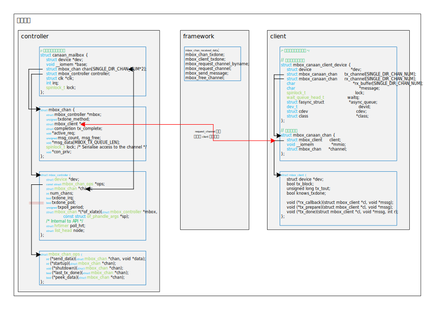

- [一、reboot](#一reboot)
  - [1.1 系统调用](#11-系统调用)
  - [1.2 复位函数的实现](#12-复位函数的实现)
    - [1.2.1 实例](#121-实例)
    - [1.2.2 注册与注销函数](#122-注册与注销函数)
    - [1.3 通知链表](#13-通知链表)
- [二、内核双链表](#二内核双链表)
  - [2.1 链表结构体](#21-链表结构体)
  - [2.2 链表操作 API](#22-链表操作-api)
  - [2.3 链表遍历宏定义](#23-链表遍历宏定义)
- [六、 /dev/mem](#六-devmem)
  - [6.1 使用示例](#61-使用示例)
  - [6.2](#62)
    - [6.2.1 "dev/mem"设备](#621-devmem设备)
    - [6.2.2 使用方法](#622-使用方法)
- [八、 零散的宏定义](#八-零散的宏定义)
  - [8.1 DEVICE_ATTR](#81-device_attr)
    - [8.1.1 介绍](#811-介绍)
    - [8.1.2 DEVICE_ATTR举例](#812-device_attr举例)
    - [8.1.3 DEVICE_ATTR分析](#813-device_attr分析)
    - [8.1.4 DEVICE_ATTR_RW、DEVICE_ATTR_RO、DEVICE_ATTR_WO分析](#814-device_attr_rwdevice_attr_rodevice_attr_wo分析)
    - [8.1.5 权限标识方法](#815-权限标识方法)
    - [8.1.6 pwm.c中宏定义的展开](#816-pwmc中宏定义的展开)
    - [8.1.7 device_attribute结构体的定义](#817-device_attribute结构体的定义)
    - [8.1.8 ATTRIBUTE_GROUPS](#818-attribute_groups)
    - [8.1.9 将属性公开到文件系统中](#819-将属性公开到文件系统中)
  - [8.2 bitmap DECLARE_BITMAP](#82-bitmap-declare_bitmap)
    - [8.2.1 使用bitmap的目的](#821-使用bitmap的目的)
    - [8.2.2 DECLARE_BITMAP](#822-declare_bitmap)
    - [8.2.3 API函数分析](#823-api函数分析)
      - [8.2.3.1](#8231)
  - [8.2 Radix tree基数树](#82-radix-tree基数树)
  - [8.3 mutex](#83-mutex)
    - [8.3.1 mutex的API函数](#831-mutex的api函数)
    - [8.3.2 互斥体的使用如下](#832-互斥体的使用如下)
  - [8.4 ioctl的cmd——_IO](#84-ioctl的cmd_io)
    - [8.4.1 示例](#841-示例)
    - [8.4.2 代码分析](#842-代码分析)
  - [8.5 一些变量初始化的定义](#85-一些变量初始化的定义)
    - [8.5.1 uninitialized_var](#851-uninitialized_var)
- [九、 高精度定时器hrtimer的使用](#九-高精度定时器hrtimer的使用)
  - [9.1 使用](#91-使用)
    - [9.1.1 数据结构](#911-数据结构)
    - [9.1.2 API函数](#912-api函数)
  - [9.2 示例](#92-示例)
- [十、 PWM框架](#十-pwm框架)
  - [10.1 core.c文件分析](#101-corec文件分析)
    - [10.1.1 函数分析](#1011-函数分析)
          - [alloc_pwms](#alloc_pwms)
          - [free_pwms](#free_pwms)
          - [pwmchip_find_by_name](#pwmchip_find_by_name)
          - [pwm_device_request](#pwm_device_request)
          - [of_pwm_xlate_with_flags](#of_pwm_xlate_with_flags)
          - [of_pwm_simple_xlate](#of_pwm_simple_xlate)
          - [of_pwmchip_add](#of_pwmchip_add)
          - [of_pwmchip_remove](#of_pwmchip_remove)
          - [pwm_set_chip_data](#pwm_set_chip_data)
          - [pwm_get_chip_data](#pwm_get_chip_data)
          - [pwm_ops_check](#pwm_ops_check)
          - [pwmchip_add_with_polarity](#pwmchip_add_with_polarity)
          - [pwmchip_add](#pwmchip_add)
  - [10.2 pwm.h文件分析](#102-pwmh文件分析)
    - [10.2.1 结构体分析](#1021-结构体分析)
      - [10.2.1.1 pwm_polarity](#10211-pwm_polarity)
      - [10.2.1.2 pwm_args和pwm_state](#10212-pwm_args和pwm_state)
      - [10.2.1.3 pwm_device](#10213-pwm_device)
      - [10.2.1.4 pwm_chip](#10214-pwm_chip)
    - [10.2.2 函数分析](#1022-函数分析)
  - [10.3 pwm.txt pwm接口](#103-pwmtxt-pwm接口)
    - [10.3.1 识别PWM](#1031-识别pwm)
    - [10.3.2 使用PWM](#1032-使用pwm)
    - [10.3.3 通过 sysfs 接口使用 PWM](#1033-通过-sysfs-接口使用-pwm)
    - [10.3.4 实现PWM驱动](#1034-实现pwm驱动)
    - [10.3.5 锁](#1035-锁)
    - [10.3.6 Helpers](#1036-helpers)
- [十一、 用户空间函数的使用](#十一-用户空间函数的使用)
  - [poll函数](#poll函数)
- [十二、clock framework](#十二clock-framework)
  - [12.1 内核文档](#121-内核文档)
    - [12.1.1 clock-bindings.txt](#1211-clock-bindingstxt)
      - [12.1.1.1 clock providers](#12111-clock-providers)
      - [12.1.1.2 clock consumers](#12112-clock-consumers)
      - [12.1.1.3 示例](#12113-示例)
      - [12.1.1.4 Assigned clock parents and rates](#12114-assigned-clock-parents-and-rates)
- [十三、mailbox 框架](#十三mailbox-框架)
  - [13.1 内核文档](#131-内核文档)
    - [13.1.1 mailbox.txt](#1311-mailboxtxt)
      - [13.1.1.1 介绍](#13111-介绍)
      - [13.1.1.2 Controller Driver (See include/linux/mailbox_controller.h)](#13112-controller-driver-see-includelinuxmailbox_controllerh)
      - [13.1.1.2 Client Driver (See include/linux/mailbox_client.h)](#13112-client-driver-see-includelinuxmailbox_clienth)
    - [13.1.2 mailbox.txt(bindings)](#1312-mailboxtxtbindings)
  - [13.2 框架代码分析](#132-框架代码分析)
    - [13.2.1 mailbox_controller.h](#1321-mailbox_controllerh)
    - [13.2.2 mailbox_client.h](#1322-mailbox_clienth)
    - [13.2.3 mailbox.c](#1323-mailboxc)
          - [add_to_rbuf](#add_to_rbuf)
          - [msg_submit](#msg_submit)
          - [tx_tick](#tx_tick)
          - [mbox_chan_received_data](#mbox_chan_received_data)
          - [mbox_chan_txdone](#mbox_chan_txdone)
          - [mbox_client_txdone](#mbox_client_txdone)
          - [mbox_send_message](#mbox_send_message)
          - [mbox_request_channel](#mbox_request_channel)
          - [mbox_request_channel_byname](#mbox_request_channel_byname)
          - [mbox_free_channel](#mbox_free_channel)
          - [mbox_controller_register 和 mbox_controller_unregister](#mbox_controller_register-和-mbox_controller_unregister)
  - [13.3 框架分析](#133-框架分析)
    - [13.3.1 client、controller 与 framework](#1331-clientcontroller-与-framework)
    - [13.3.2 数据结构](#1332-数据结构)
    - [13.3.3 函数调用流程](#1333-函数调用流程)
      - [13.3.3.1 发送数据流程](#13331-发送数据流程)
      - [13.3.3.1 接收数据流程](#13331-接收数据流程)
  - [13.4 硬件分析](#134-硬件分析)
  - [13.5 设备树分析](#135-设备树分析)
    - [13.5.1 controller](#1351-controller)
    - [13.5.2 client](#1352-client)
    - [13.5.3 该属性的使用方法](#1353-该属性的使用方法)
- [十四、debugfs](#十四debugfs)
  - [14.1 内核文档](#141-内核文档)
    - [14.1.1 debugfs.txt](#1411-debugfstxt)
  - [14.2 示例](#142-示例)
          - [echo 刷屏的问题](#echo-刷屏的问题)

# 一、reboot
[参考的帖子链接](https://blog.csdn.net/renlonggg/article/details/78204305)
## 1.1 系统调用
&emsp;&emsp;命令行输入reboot到busybox中的那部分内容没理解。直接从busybox结束开始调用标准C函数reboot开始。  
&emsp;&emsp;reboot函数直接进行系统调用进入内核。  
&emsp;&emsp;内核系统调用，位于/linux/kernel/reboot.c  
```c
SYSCALL_DEFINE4(reboot, int, magic1, int, magic2, unsigned int, cmd,
        void __user *, arg)
{
    ......

    mutex_lock(&reboot_mutex);
    switch (cmd) {
    case LINUX_REBOOT_CMD_RESTART:
        kernel_restart(NULL);
        break;

    case LINUX_REBOOT_CMD_CAD_ON:
        C_A_D = 1;
        break;

    case LINUX_REBOOT_CMD_CAD_OFF:
        C_A_D = 0;
        break;

    case LINUX_REBOOT_CMD_HALT:
        kernel_halt();
        do_exit(0);
        panic("cannot halt");

    case LINUX_REBOOT_CMD_POWER_OFF:
        kernel_power_off();
        do_exit(0);
        break;

    ......

    default:
        ret = -EINVAL;
        break;
    }
    mutex_unlock(&reboot_mutex);
    return ret;
}
```
&emsp;&emsp;进入kernel_restart(NULL)函数
```c
void kernel_restart(char *cmd)
{   
    kernel_restart_prepare(cmd);
    migrate_to_reboot_cpu();
    syscore_shutdown();
    if (!cmd)
        pr_emerg("Restarting system\n");
    else
        pr_emerg("Restarting system with command '%s'\n", cmd);
    kmsg_dump(KMSG_DUMP_RESTART);
    machine_restart(cmd);
}
EXPORT_SYMBOL_GPL(kernel_restart);
```
&emsp;&emsp;进入machine_restart(cmd)函数。  
&emsp;&emsp;machine_restart函数在arch目录下，不同的架构会定义不同的machine_restart函数，和链接中的不太一样，我调试的machine_restart函数位于`/linux/arch/riscv/kernel/reset.c`  
```c
void machine_restart(char *cmd)
 {   
     do_kernel_restart(cmd);
     while (1);
 }   
 
 void machine_halt(void)
 {
     machine_power_off();
 }   
 
 void machine_power_off(void)
 {
     sbi_shutdown();
     while (1);
 }   
```
&emsp;&emsp;调用了do_kernel_restart函数，此函数位于/linux/kernel/reboot.c中，
```c
void do_kernel_restart(char *cmd)
{
    atomic_notifier_call_chain(&restart_handler_list, reboot_mode, cmd);
}
```
&emsp;&emsp;atomic_notifier_call_chain此函数会调用restart_handler_list此链表中注册了的复位函数，如果注册了多个复位函数，则根据设置的结构体的优先级判定执行顺序，priority值越大，优先级越高。  
&emsp;&emsp;此链表的初始化位于reboot.c中
```c
static ATOMIC_NOTIFIER_HEAD(restart_handler_list);
```
&emsp;&emsp;就是说，只要实现了复位函数，并向此链表注册复位函数，在命令行输入reboot后，就会调用到复位函数。
## 1.2 复位函数的实现
### 1.2.1 实例
&emsp;&emsp;复位函数可以依赖于某个具有复位功能的模块，例如可以通过看门狗复位，那就可以在看门狗中模块中实现复位功能并注册对应的函数。其实只要实现复位函数并注册进restart_handler_list链表即可。例如：
```c
#define SYSCTL_BOOT_BASE_ADDR   0x97000000U
#define SOC_GLB_RST             0x60

static void __iomem *MMAP_ADDR;

//复位功能实现函数
static int k510_restart(struct notifier_block *this, unsigned long mode, void *cmd)
{
    MMAP_ADDR = ioremap(SYSCTL_BOOT_BASE_ADDR + SOC_GLB_RST, 4);
    
    writel(((1 << 0) | (1 << 16)), MMAP_ADDR);
    while(1);
}   

static int k510_restart_register(void)
{
    static struct notifier_block restart_handler;

    restart_handler.notifier_call = k510_restart;
    restart_handler.priority = 128; 
    
    //向链表注册
    return register_restart_handler(&restart_handler);
}   
#endif
```
&emsp;&emsp;然后，调用此函数即可，我把这段代码写在了linux/arch/riscv/kernel/setup.c中，在setup_arch函数最后调用了此函数。
### 1.2.2 注册与注销函数
```c
int register_restart_handler(struct notifier_block *nb)
{
    return atomic_notifier_chain_register(&restart_handler_list, nb);
}
EXPORT_SYMBOL(register_restart_handler);


int unregister_restart_handler(struct notifier_block *nb)
{
    return atomic_notifier_chain_unregister(&restart_handler_list, nb);
}
EXPORT_SYMBOL(unregister_restart_handler);
```
### 1.3 通知链表
[参考链接](http://bbs.chinaunix.net/thread-2011776-1-1.html)

# 二、内核双链表
&emsp;&emsp;[参考文章](https://blog.csdn.net/qb_2008/article/details/6839230)

&emsp;&emsp;文件位于`linux/include/linux/list.h`和`type.h`。
&emsp;&emsp;链表 API 实现时大致都分为两层：一层是外部的，用来消除一些例外情况，调用内部实现；一层是内部的，函数名前会加下划线，往往是几个操作的公共部分，或者排除例外后的实现。
## 2.1 链表结构体
&emsp;&emsp;list_head 的定义如下：
```c
struct list_head {
    struct list_head *next, *prev;
};

struct hlist_head {
    struct hlist_node *first;
};

struct hlist_node {
    struct hlist_node *next, **pprev;
};
```
&emsp;&emsp;链表初始化
```c
#define LIST_HEAD_INIT(name) { &(name), &(name) }

#define LIST_HEAD(name) \
    struct list_head name = LIST_HEAD_INIT(name)
```
&emsp;&emsp;LIST_HEAD(name)即
```c
struct list_head name = { &(name), &(name) }
```
&emsp;&emsp;声明一个双向链表，并将 next 和 prev 初始化为自己的地址。
```c
static inline void INIT_LIST_HEAD(struct list_head *list)
```
&emsp;&emsp;也是初始化链表，前向指针和后向指针都指向自己。
## 2.2 链表操作 API
```c
extern bool __list_add_valid(struct list_head *new,
                  struct list_head *prev,
                  struct list_head *next);
extern bool __list_del_entry_valid(struct list_head *entry);
```
&emsp;&emsp;这两个函数在`linux/lib/list_debug.c`中。
&emsp;&emsp;第一个函数：如果prev的next指向了next，next的prev指向了prev，且new不是prev和next中的任何一个，则返回真。（即是一个新的吧？）
&emsp;&emsp;第二个函数：判断节点是否有效。判断依据是，entry的prev和next有效，且entry->prev->next == entry，entry->next->prev == entry。
&emsp;&emsp;在两个已知的连续entry之间出入一个新的entry。
```c
static inline void __list_add(struct list_head *new,
                  struct list_head *prev,
                  struct list_head *next)
```
&emsp;&emsp;在指定的节点head后面插入一个新的entry——new。
```c
static inline void list_add(struct list_head *new, struct list_head *head)
```
&emsp;&emsp;在指定的节点head前面插入一个新的entry——new。
```c
static inline void list_add_tail(struct list_head *new, struct list_head *head)
```
&emsp;&emsp;通过已知的prev和next节点来实现删除节点的操作（即，把这两个节点连起来，中间的扔掉）。
```c
static inline void __list_del(struct list_head * prev, struct list_head * next)
```
&emsp;&emsp;从链表中删除entry节点（调用__list_del函数，使用entry的prev和next）。
```c
static inline void __list_del_entry(struct list_head *entry)
```
&emsp;&emsp;从链表中删除entry节点（调用了上面的函数，同时把entry的next和prev置成LIST_POISON1和LIST_POISION2）。
```c
static inline void list_del(struct list_head *entry)
```
&emsp;&emsp;使用新节点替换旧节点。
```c
static inline void list_replace(struct list_head *old,
                struct list_head *new)
```
&emsp;&emsp;新节点替换旧节点，旧节点被初始化。
```c
static inline void list_replace_init(struct list_head *old,
                    struct list_head *new)
```
&emsp;&emsp;删除节点entry并对entry初始化。
```c
static inline void list_del_init(struct list_head *entry)
```

&emsp;&emsp;将list节点从原来的链表中删除，并加入head所在链表，加入head之后。
```c
static inline void list_move(struct list_head *list, struct list_head *head)
```

&emsp;&emsp;将list节点从原来的链表中删除，并加入head所在链表，加入head之前。
```c
static inline void list_move_tail(struct list_head *list,
                  struct list_head *head)
```
&emsp;&emsp;检查list是不是head的前一个节点。
```c
static inline int list_is_last(const struct list_head *list,
                const struct list_head *head)
```
&emsp;&emsp;检查链表是否是空链表。通过head->next == head来判断。为空的意思就是只有一个链表头head。
```c
static inline int list_empty(const struct list_head *head)
```
&emsp;&emsp;检查链表是否是空链表。
```c
static inline int list_empty_careful(const struct list_head *head)
```
&emsp;&emsp;向左旋转链表（即，把head的下一个节点移动到head之前，即把head和head的下一个节点交换位置）。
```c
static inline void list_rotate_left(struct list_head *head)
```
&emsp;&emsp;判断链表是否只有一个entry，即除链表头外只有一个节点。
```c
static inline int list_is_singular(const struct list_head *head)
```
&emsp;&emsp;用于把head链表分为两部分。从head->next一直到entry被从head链表中删除，加入新的链表list。新链表list应该是空的，或者原来的节点都可以被忽略掉。
```c
static inline void __list_cut_position(struct list_head *list,
        struct list_head *head, struct list_head *entry)
{
    struct list_head *new_first = entry->next;
    list->next = head->next;
    list->next->prev = list;
    list->prev = entry;
    entry->next = list;
    head->next = new_first;
    new_first->prev = head;
}
```
&emsp;&emsp;list_cut_position中排除了一些意外情况，保证调用__list_cut_position时至少有一个元素会被加入新链表。
```c
static inline void list_cut_position(struct list_head *list,
        struct list_head *head, struct list_head *entry)
```
&emsp;&emsp;将链表list（不是一个节点，是整个链表，（好像不包括list节点？））插入到prev之后，next之前
```c
static inline void __list_splice(const struct list_head *list,
                 struct list_head *prev,
                 struct list_head *next)
{
    struct list_head *first = list->next;
    struct list_head *last = list->prev;

    first->prev = prev;
    prev->next = first;

    last->next = next;
    next->prev = last;
}
```
&emsp;&emsp;list_splice的功能和list_cut_position正相反，它合并两个链表。list_splice把list链表中的节点加入head链表中。在实际操作之前，要先判断list链表是否为空。它保证调用__list_splice时list链表中至少有一个节点可以被合并到head链表中。
```c
static inline void list_splice(const struct list_head *list,
                struct list_head *head)
```
&emsp;&emsp;将链表list插入到head之前。
```c
static inline void list_splice_tail(struct list_head *list,
                struct list_head *head)
```
&emsp;&emsp;list_splice_init 除了完成list_splice的功能，还把变空了的list链表头重新初始化。
&emsp;&emsp;list_splice_tail_init 除了完成list_splice_tail的功能，还把变空了得list链表头重新初始化。
```c
static inline void list_splice_init(struct list_head *list,
                    struct list_head *head)

static inline void list_splice_tail_init(struct list_head *list,
                     struct list_head *head)
```
&emsp;&emsp;list操作的API大致如以上所列，包括链表节点添加与删除、节点从一个链表转移到另一个链表、链表中一个节点被替换为另一个节点、链表的合并与拆分、查看链表当前是否为空或者只有一个节点。接下来，是操作链表遍历时的一些宏。
## 2.3 链表遍历宏定义
ptr：list_head结构体指针
type：被list_head嵌入的结构体的类型
member：list_head在被嵌入的结构体中的名称
链表节点多被封装在更复杂的结构中，使用专门的list_entry定义也是为了使用方便。通过list_head的地址获得被嵌套的结构体type的地址。
```c
list_entry(ptr, type, member)
```

list_first_entry是将ptr看做一个链表的链表头，取出其中第一个节点对应的结构地址。使用list_first_entry时应保证链表中至少有一个节点。
```c
#define list_first_entry(ptr, type, member) \
    list_entry((ptr)->next, type, member)
```
取出ptr前一个节点对应的结构地址。
```c
#define list_last_entry(ptr, type, member) \
    list_entry((ptr)->prev, type, member)
```
和list_first_entry一样，只是多了判断list是否为空的判断，如果为空，就返回NULL，否则，取出其中第一个节点对应的结构地址。
```c
#define list_first_entry_or_null(ptr, type, member) ({ \
    struct list_head *head__ = (ptr); \
    struct list_head *pos__ = READ_ONCE(head__->next); \
    pos__ != head__ ? list_entry(pos__, type, member) : NULL; \
})
```
pos：结构体指针
member：结构体中list_head结构体名字
取出pos结构体指针的下一个结构的地址。
```c
#define list_next_entry(pos, member) \
    list_entry((pos)->member.next, typeof(*(pos)), member)
```
取出pos结构体指针的前一个结构的地址。
```c
#define list_prev_entry(pos, member) \
    list_entry((pos)->member.prev, typeof(*(pos)), member)
```
list_for_each循环遍历链表中的每个节点，从链表头部的第一个节点，一直到链表尾部。
```c
#define list_for_each(pos, head) \
    for (pos = (head)->next; pos != (head); pos = pos->next)
```
list_for_each_prev与list_for_each的遍历顺序相反，从链表尾逆向遍历到链表头。
```c
#define list_for_each_prev(pos, head) \
    for (pos = (head)->prev; pos != (head); pos = pos->prev)
```
list_for_each_safe 也是链表顺序遍历，只是更加安全。即使在遍历过程中，当前节点从链表中删除，也不会影响链表的遍历。参数上需要加一个暂存的链表节点指针n。
```c
#define list_for_each_safe(pos, n, head) \
    for (pos = (head)->next, n = pos->next; pos != (head); \
        pos = n, n = pos->next)
```
list_for_each_prev_safe 与list_for_each_prev同样是链表逆序遍历，只是加了链表节点删除保护。
```c
#define list_for_each_prev_safe(pos, n, head) \
    for (pos = (head)->prev, n = pos->prev; \
         pos != (head); \
         pos = n, n = pos->prev)
```
list_for_each_entry不是遍历链表节点，而是遍历链表节点所嵌套进的结构。这个实现上较为复杂，但可以等价于list_for_each加上list_entry的组合。
pos：被list_head嵌套进的结构体的指针
head：list_head链表的“头”节点
member：结构体pos中list_head的名字
```c
#define list_for_each_entry(pos, head, member)              \
    for (pos = list_first_entry(head, typeof(*pos), member);    \
         &pos->member != (head);                    \
         pos = list_next_entry(pos, member))
```
list_for_each_entry_reverse 是逆序遍历链表节点所嵌套进的结构，等价于list_for_each_prev加上list_etnry的组合。
```c
#define list_for_each_entry_reverse(pos, head, member)          \
    for (pos = list_last_entry(head, typeof(*pos), member);     \
         &pos->member != (head);                    \
         pos = list_prev_entry(pos, member))
```
list_for_each_entry_continue也是遍历链表上的节点嵌套的结构。只是并非从链表头开始，而是从结构指针的下一个结构开始，一直到链表尾部。
```c
#define list_for_each_entry_continue(pos, head, member)         \
    for (pos = list_next_entry(pos, member);            \
         &pos->member != (head);                    \
         pos = list_next_entry(pos, member))
```
list_for_each_entry_continue_reverse 是逆序遍历链表上的节点嵌套的结构。只是并非从链表尾开始，而是从结构指针的前一个结构开始，一直到链表头部。
```c
#define list_for_each_entry_continue_reverse(pos, head, member)     \
    for (pos = list_prev_entry(pos, member);            \
         &pos->member != (head);                    \
         pos = list_prev_entry(pos, member))
```
list_for_each_entry_from 是从当前结构指针pos开始，顺序遍历链表上的结构指针。
```c
#define list_for_each_entry_from(pos, head, member)             \
    for (; &pos->member != (head);                  \
         pos = list_next_entry(pos, member))
```
list_for_each_entry_from_reverse逆序
```c
#define list_for_each_entry_from_reverse(pos, head, member)     \
    for (; &pos->member != (head);                  \
         pos = list_prev_entry(pos, member))
```
list_for_each_entry_safe 也是顺序遍历链表上节点嵌套的结构。只是加了删除节点的保护。
```c
#define list_for_each_entry_safe(pos, n, head, member)          \
    for (pos = list_first_entry(head, typeof(*pos), member),    \
        n = list_next_entry(pos, member);           \
         &pos->member != (head);                    \
         pos = n, n = list_next_entry(n, member))
```
list_for_each_entry_safe_continue 是从pos的下一个结构指针开始，顺序遍历链表上的结构指针，同时加了节点删除保护。
```c
#define list_for_each_entry_safe_continue(pos, n, head, member)      \
    for (pos = list_next_entry(pos, member),                \
        n = list_next_entry(pos, member);               \
         &pos->member != (head);                        \
         pos = n, n = list_next_entry(n, member))
```
list_for_each_entry_safe_from 是从pos开始，顺序遍历链表上的结构指针，同时加了节点删除保护。
```c
#define list_for_each_entry_safe_from(pos, n, head, member)           \
    for (n = list_next_entry(pos, member);                  \
         &pos->member != (head);                        \
         pos = n, n = list_next_entry(n, member))
```
list_for_each_entry_safe_reverse 是从pos的前一个结构指针开始，逆序遍历链表上的结构指针，同时加了节点删除保护。
```c
#define list_for_each_entry_safe_reverse(pos, n, head, member)      \
    for (pos = list_last_entry(head, typeof(*pos), member),     \
        n = list_prev_entry(pos, member);           \
         &pos->member != (head);                    \
         pos = n, n = list_prev_entry(n, member))
```


# 六、 /dev/mem
## 6.1 使用示例
```c
#include <sys/types.h>
#include <sys/stat.h>
#include <fcntl.h>      //open
#include <stdio.h>
#include <unistd.h>     //read, write
#include <stdlib.h>     //exit
#include <stdint.h>     //uint32_t
#include <stdbool.h>
#include <sys/mman.h>

#define MMAP_SIZE           0X1000

#define IOMUX_BASE_ADDR     0X020E0000
#define MUX_GPIO1_IO03      0X68

int main()
{
    int fd_mux;
    uint32_t *mmap_mux_addr = NULL;
    bool reserve_level = false;

    fd_mux = open("/dev/mem", O_RDWR | O_NDELAY);      （1）
    if(fd_mux < 0)
    {
        perror("/dev/mem");
        exit(-1);   
    }

    mmap_mux_addr = (uint32_t *)mmap(NULL, MMAP_SIZE, PROT_READ | PROT_WRITE, MAP_SHARED, fd_mux, IOMUX_BASE_ADDR);       （2）
    if(mmap_mux_addr == NULL)
    {
        perror("mmap_mux_addr or mmap_gpio_addr");
        exit(-1);
    }

    *(mmap_mux_addr + MUX_GPIO1_IO03/4) = 0X05;              （3）

    munmap(mmap_mux_addr, MMAP_SIZE);

    return 0;
}
```
## 6.2 
### 6.2.1 "dev/mem"设备
&emsp;&emsp;“/dev/mem”是 Linux 系统的一个虚拟字符设备，无论是标准的 Linux 系统还是嵌入式 Linux 系统，都支持该设备。
&emsp;&emsp;“/dev/mem”设备是内核所有物理地址空间的全映像，这些地址包括：
* 物理内存（RAM）空间
* 物理存储（ROM）空间
* cpu 总线地址
* cpu 寄存器地址
* 外设寄存器地址、GPIO、定时器、ADC

&emsp;&emsp;“/dev/mem”设备通常与“mmap”结合使用，将该设备的物理内存映射到用户态，这样用户空间可以直接访问内存态
&emsp;&emsp;因为涉及访问内核空间，因此只有**root 用户才有访问“/dev/mem”设备的权限。**
### 6.2.2 使用方法
1. open 一个“/dev/mem”文件描述符，访问权限可以为只读（O_RDONLY ）、只写（O_WRONLY ）、读写（O_RDWR ）的阻塞或者非阻塞方式。
2. 通过 mmap 把需要访问的目标物理地址与“/dev/mem”文件描述符建立映射。

# 八、 零散的宏定义
## 8.1 DEVICE_ATTR
### 8.1.1 介绍
&emsp;&emsp;使用DEVICE_ATTR，可以实现驱动在sys目录自动创建文件，我们只需要实现show和store函数即可。然后在应用层就能通过cat和echo命令来对sys创建出来的文件进行读写驱动设备，实现交互。
### 8.1.2 DEVICE_ATTR举例
以pwm中的sysfs.c为例。文件位置位于/drivers/pwm/sysfs.c
```c
static ssize_t polarity_show(struct device *child,
                 struct device_attribute *attr,
                 char *buf)
{
    const struct pwm_device *pwm = child_to_pwm_device(child);
    /* 省略具体的处理内容 */

    return sprintf(buf, "%s\n", polarity);
}

static ssize_t polarity_store(struct device *child,
                  struct device_attribute *attr,
                  const char *buf, size_t size)
{
    struct pwm_export *export = child_to_pwm_export(child);
    /* 省略具体的处理内容 */

    return ret ? : size;
}

static DEVICE_ATTR_RW(polarity);
```
在`/sys/class/pwm`下可以看到polarity属性


通过
```shell
echo 0 > polarity
cat polarity
```
来对该属性进行读写操作。
### 8.1.3 DEVICE_ATTR分析
DEVICE_ATTR定义在/include/linux/device.h中
```c
#define DEVICE_ATTR(_name, _mode, _show, _store) \
    struct device_attribute dev_attr_##_name = __ATTR(_name, _mode, _show, _store)
```
__ATTR定义在/include/linux/sysfs.h中
```c
#define __ATTR(_name, _mode, _show, _store) {               \
    .attr = {.name = __stringify(_name),                \
         .mode = VERIFY_OCTAL_PERMISSIONS(_mode) },     \
    .show   = _show,                        \
    .store  = _store,                       \
}
```
### 8.1.4 DEVICE_ATTR_RW、DEVICE_ATTR_RO、DEVICE_ATTR_WO分析
```c
#define DEVICE_ATTR_RW(_name) \
    struct device_attribute dev_attr_##_name = __ATTR_RW(_name)
#define DEVICE_ATTR_RO(_name) \
    struct device_attribute dev_attr_##_name = __ATTR_RO(_name)
#define DEVICE_ATTR_WO(_name) \
    struct device_attribute dev_attr_##_name = __ATTR_WO(_name)
```
__ATTR_RW、__ATTR_RO、__ATTR_WO和__ATTR类似，定义在/include/linux/sysfs.h中
```c
#define __ATTR_RO(_name) {                      \
    .attr   = { .name = __stringify(_name), .mode = 0444 },     \
    .show   = _name##_show,                     \
}

#define __ATTR_WO(_name) {                      \
    .attr   = { .name = __stringify(_name), .mode = 0200 },     \
    .store  = _name##_store,                    \
}

#define __ATTR_RW(_name) __ATTR(_name, 0644, _name##_show, _name##_store)
```
&emsp;&emsp;__ATTR_RO只定义了show函数，函数名字是“_name_show”，类似的__ATTR_WO只定义了store函数，函数名字是”_name_store”，__ATTR_RW同时定义了show、store函数。这三个宏定义是DEVICE_ATTR的简化使用，默认对权限进行了配置。
### 8.1.5 权限标识方法
umask变量表示方法
|加权数值|第1位            |第2位          |第3位              |
|:---:  |:---             |:---           |:---              |
|100    |所有者拥有读权限  |群组拥有读权限  |其他用户拥有读权限  |
|010    |所有者拥有写权限  |群组拥有写权限  |其他用户拥有写权限  |
|001    |所有者拥有执行权限|群组拥有执行权限|其他用户拥有执行权限 |

与上面权限对应的宏定义是

|参数	|说明	|参数	|说明	|参数	|说明|
|---    |---   |---    |---    |------|----|
|S_IRUSR	|所有者拥有读权限	|S_IRGRP	|群组拥有读权限	|S_IROTH	|其他用户拥有读权限|
|S_IWUSR	|所有者拥有写权限	|S_IWGRP	|群组拥有写权限	|S_IWOTH	|其他用户拥有写权限|
|S_IXUSR	|所有者拥有执行权限	|S_IXGRP	|群组拥有执行权限	|S_IXOTH	|其他用户拥有执行权限|
### 8.1.6 pwm.c中宏定义的展开
因此
```c
static DEVICE_ATTR_RW(polarity);
```
展开以后就是
```c
struct device_attribute dev_attr_polarity = {                
    .attr = {.name = __stringify(polarity),                
         .mode = VERIFY_OCTAL_PERMISSIONS(0644) },     
    .show   = polarity_show,                        
    .store  = polarity_store,                       
}
```
其中polarity_show和polarity_store已经在上面实现了。
### 8.1.7 device_attribute结构体的定义
attribute结构体定义在include/linux/sysfs.h
```c
struct attribute {
    const char      *name;
    umode_t         mode;
#ifdef CONFIG_DEBUG_LOCK_ALLOC
    bool            ignore_lockdep:1;
    struct lock_class_key   *key;
    struct lock_class_key   skey;
#endif
};
```
&emsp;&emsp;此结构体中name代表属性名称，一般表示为文件名，mode代表该属性的读写权限。device_attribute定义在/include/linux/device.h中
```c
struct device_attribute {
    struct attribute    attr;
    ssize_t (*show)(struct device *dev, struct device_attribute *attr, char *buf);
    ssize_t (*store)(struct device *dev, struct device_attribute *attr, const char *buf, size_t count);
};
```
&emsp;&emsp;该结构体是对attribute结构体的进一步封装，并提供了两个函数指针，show函数用于读取设备的属性文件，而store则是用于写设备的属性文件，**当我们在linux驱动程序中实现了这两个函数后，便可以使用cat和echo命令对设备属性文件进行读写操作。**
### 8.1.8 ATTRIBUTE_GROUPS
&emsp;&emsp;可以通过 ATTRIBUTE_GROUPS 宏定义来实现，在 pwm 的 sysfs.c 中可以看到，其中的 dev_attr_name 就是在 DEVICE_ATTR 中定义的结构体。
```c
static struct attribute *pwm_attrs[] = {
    &dev_attr_period.attr,
    &dev_attr_duty_cycle.attr,
    &dev_attr_enable.attr,
    &dev_attr_polarity.attr,
    &dev_attr_capture.attr,
    NULL
};
ATTRIBUTE_GROUPS(pwm);
```
&emsp;&emsp;ATTRIBUTE_GROUPS 的宏定义
```c
#define __ATTRIBUTE_GROUPS(_name)				\
static const struct attribute_group *_name##_groups[] = {	\
	&_name##_group,						\
	NULL,							\
}

#define ATTRIBUTE_GROUPS(_name)					\
static const struct attribute_group _name##_group = {		\
	.attrs = _name##_attrs,					\
};								\
__ATTRIBUTE_GROUPS(_name)
```
&emsp;&emsp;以上面的 pwm 为例，展开定义以后如下所示：
```c
static const struct attribute_group pwm_group = {
    .attrs = pwm_attrs,
};

static const struct attribute_group pwm_groups[] = {
    &pwm_group,
    NULL,
};
```
&emsp;&emsp;即，定义了一个 attribute_group 的结构体数字组：pwm_groups，其第一个成员的`.attrs`属性为上面定义的`pwm_attrs`。
### 8.1.9 将属性公开到文件系统中
&emsp;&emsp;将上面的`pwm_groups`赋给 device 结构体的`groups`成员（该设备的默认 attribute 集合，将会在设备注册时自动在 sysfs 中创建对应的文件），然后在`device_register`此设备时，会自动创建相关属性。  
&emsp;&emsp;在`/drivers/pwm/sysfs.c`中，将一个类似的集合赋值给了一个 class 变量的`.dev_groups`成员，然后在`device_create`此 class 变量时也导出了其属性集合，不知道是不是一样的原理，待研究。

## 8.2 bitmap DECLARE_BITMAP
### 8.2.1 使用bitmap的目的
&emsp;&emsp;bitmap用于实现bool的数组，标识一个事件有没有发生。bitmap将一片连续的空间作为一个数据类型，其中的成员都是1位，长度是bitmap的容量。例如设备驱动中设备号的分配，就可以使用bitmap来标识该设备号是否被使用了。
### 8.2.2 DECLARE_BITMAP
```c
#define DECLARE_BITMAP(name,bits) \
	unsigned long name[BITS_TO_LONGS(bits)]
#define BITS_TO_LONGS(nr)       DIV_ROUND_UP(nr, BITS_PER_BYTE * sizeof(long))
#define DIV_ROUND_UP(n,d)       (((n) + (d) - 1) / (d))
#define BITS_PER_BYTE           8
```
在32位系统中展开以后就是
```c
unsigned long name[(bits + 31)/32]
```
在64位系统中展开以后就是
```c
unsigned long name[(bits + 63)/64]
```
宏定义的功能如下：
```shell
以sizeof(long)为基本单位声明一个bits位的容器（以bit为单位的“数组”），容器的名字是name。
例如，
DECLARE_BITMAP(allocated_pwms, 1023)
就声明了一个名为allocated_pwms的容器，其大小是1023bit（实际上在内存中占据了32个字节，即1024bit）。
```
对bitmap操作的API函数
```c
    bitmap_zero(dst, nbits)                     *dst = 0UL
    bitmap_fill(dst, nbits)                     *dst = ~0UL
    bitmap_copy(dst, src, nbits)                *dst = *src
    bitmap_and(dst, src1, src2, nbits)          *dst = *src1 & *src2
    bitmap_or(dst, src1, src2, nbits)           *dst = *src1 | *src2
    bitmap_xor(dst, src1, src2, nbits)          *dst = *src1 ^ *src2
    bitmap_andnot(dst, src1, src2, nbits)       *dst = *src1 & ~(*src2)
    bitmap_complement(dst, src, nbits)          *dst = ~(*src)
    bitmap_equal(src1, src2, nbits)             Are *src1 and *src2 equal?
    bitmap_intersects(src1, src2, nbits)        Do *src1 and *src2 overlap?
    bitmap_subset(src1, src2, nbits)            Is *src1 a subset of *src2?
    bitmap_empty(src, nbits)                    Are all bits zero in *src?
    bitmap_full(src, nbits)                     Are all bits set in *src?
    bitmap_weight(src, nbits)                   Hamming Weight: number set bits
    bitmap_set(dst, pos, nbits)                 Set specified bit area
    bitmap_clear(dst, pos, nbits)               Clear specified bit area
    /* 在bitmap中找到整块的零区域 */
    bitmap_find_next_zero_area(buf, len, pos, n, mask)  Find bit free area
    bitmap_find_next_zero_area_off(buf, len, pos, n, mask)  as above
    bitmap_shift_right(dst, src, n, nbits)      *dst = *src >> n
    bitmap_shift_left(dst, src, n, nbits)       *dst = *src << n
    bitmap_remap(dst, src, old, new, nbits)     *dst = map(old, new)(src)
    bitmap_bitremap(oldbit, old, new, nbits)    newbit = map(old, new)(oldbit)
    bitmap_onto(dst, orig, relmap, nbits)       *dst = orig relative to relmap
    bitmap_fold(dst, orig, sz, nbits)           dst bits = orig bits mod sz
    bitmap_parse(buf, buflen, dst, nbits)       Parse bitmap dst from kernel buf
    bitmap_parse_user(ubuf, ulen, dst, nbits)   Parse bitmap dst from user buf
    bitmap_parselist(buf, dst, nbits)           Parse bitmap dst from kernel buf
    bitmap_parselist_user(buf, dst, nbits)      Parse bitmap dst from user buf
    bitmap_find_free_region(bitmap, bits, order)  Find and allocate bit region
    bitmap_release_region(bitmap, pos, order)   Free specified bit region
    bitmap_allocate_region(bitmap, pos, order)  Allocate specified bit region
    bitmap_from_arr32(dst, buf, nbits)          Copy nbits from u32[] buf to dst
    bitmap_to_arr32(buf, src, nbits)            Copy nbits from buf to u32[] dst
```
### 8.2.3 API函数分析
#### 8.2.3.1 
```c
bitmap_find_next_zero_area(buf, len, pos, n, mask)  Find bit free area
bitmap_find_next_zero_area_off(buf, len, pos, n, mask)  as above
```
`buf`：搜寻的起始地址，`size`：buf中包含的位的总长度，`start`：从buf中start的位置处开始搜寻，`nr`：从start处开始要找到nr个连续的0，`align_mask`：，`align_offset`：。
示例：
```c
static DECLARE_BITMAP(allocated_pwms, MAX_PWMS);
start = bitmap_find_next_zero_area(allocated_pwms, MAX_PWMS, from, 
            count, 0);
/* 申请了一个名为allocated_pwms的位组，长度位MAX_PWMS。  
从allocated_pwms处开始，搜寻的最大长度是MAX_PWMS，  
从from偏移处开始搜寻，找到连续count个0. */  
```
源码分析：
```c
unsigned long bitmap_find_next_zero_area_off(unsigned long *map,
                                             unsigned long size,
                                             unsigned long start,
                                             unsigned int nr,
                                             unsigned long align_mask,
                                             unsigned long align_offset)
{
        unsigned long index, end, i;
again:
        //查找第一个值是0的bit的索引号，从start开始到size结束的区间查找
        index = find_next_zero_bit(map, size, start);

        /* Align allocation */
        index = __ALIGN_MASK(index + align_offset, align_mask) - align_offset;

        //判断从找到的值为0的bit的索引开始，加上所需的nr个值以后，
        //是否超过了总数size。超过就直接返回end。
        end = index + nr;
        if (end > size)
                return end;
        //如果没有超过，那么就检查从index到end之间有没有值是1的bit，
        //有的话表示被占用了，需要重新查找。
        //因为需要连续nr个为0的bit位
        i = find_next_bit(map, end, index);
        if (i < end) {  //发现index到end之间有为1的bit位
                start = i + 1;
                goto again; //重新找下一个为0的bit
        }
        return index;   //找到连续nr个bit为0的，返回起始下标。
}
EXPORT_SYMBOL(bitmap_find_next_zero_area_off);
```

## 8.2 Radix tree基数树
[原帖链接](https://ivanzz1001.github.io/records/post/data-structure/2018/11/18/ds-radix-tree)
&emsp;&emsp;使用目的：对于`长整型`数据的映射，怎样解决Hash冲突和Hash表大小的设计是一个非常头疼的问题。radix树就是针对这样的稀疏长整型数据查找，能告诉且节省空间地完成映射。借助于Radix树，我们能够实现对于长整型数据类型地路由。利用radix树能够依据一个长整型（比如一个长ID）高速的找到其相应的对象指针。这比用hash映射来的简单，也更节省空间，使用Hash映射hash函数难以设计，不恰当的hash函数可能增大冲突，或浪费空间。
## 8.3 mutex
&emsp;&emsp;互斥访问表示一次只有一个线程可以访问共享资源，不能递归申请互斥体。在我们编写Linux驱动的时候遇到需要互斥访问的地方建议使用mutex。Linux内核使用mutex结构体表示互斥体。  
### 8.3.1 mutex的API函数
|函数                                            |描述                                                |
|------------------------------------------------|---------------------------------------------------|
|DEFINE_MUTEX(name)                              |定义并初始化一个 mutex 变量。                        |
|void mutex_init(mutex *lock)                    |初始化mutex                                         |
|void mutex_lock(struct mutex *lock)             |获取 mutex，也就是给 mutex 上锁。如果获取不到就进休眠。|
|void mutex_unlock(struct mutex *lock)           |释放 mutex，也就给 mutex 解锁。                      |
|int mutex_trylock(struct mutex *lock)           |尝试获取 mutex，如果成功就返回 1，如果失败就返回 0。   |
|int mutex_is_locked(struct mutex *lock)         |判断 mutex 是否被获取，如果是的话就返回1，否则返回 0。 |
|int mutex_lock_interruptible(struct mutex *lock)|使用此函数获取信号量失败进入休眠以后可以被信号打断。    |
### 8.3.2 互斥体的使用如下
```c
struct mutex lock; /* 定义一个互斥体 */
mutex_init(&lock); /* 初始化互斥体 */

mutex_lock(&lock); /* 上锁 */
/* 临界区 */
mutex_unlock(&lock); /* 解锁 */
```

## 8.4 ioctl的cmd——_IO
该宏定义在头文件`/include/uapi/asm-generic/ioctl.h`中。下面分析一下该文件。  
### 8.4.1 示例
&emsp;&emsp;例如用户空间测试rtc的文件rtctest.c中有这样的用法：
```c
retval = ioctl(fd, RTC_UIE_ON, 0);
```
&emsp;&emsp;`RTC_UIE_ON`定义在`rtc.h`中：
```c
#define RTC_UIE_ON	_IO('p', 0x03)	/* Update int. enable on */
```
&emsp;&emsp;在驱动程序中，有对命令`RTC_UIE_ON`的处理：
```c
case RTC_UIE_ON:
    mutex_unlock(&rtc->ops_lock);
    return rtc_update_irq_enable(rtc, 1);
```
&emsp;&emsp;用户空间调用ioctl函数，其命令最终在驱动中得到解释并执行，此命令的格式与解析就是通过`_IO`等函数实现的。
### 8.4.2 代码分析
&emsp;&emsp;ioctl的命令一共有32bit，区域划分为：
* bit31-bit30  共2位，区分读写命令
* bit29-bit16  共14位，表示ioctl中的arg变量传送的内存大小
* bit15-bit08  共8位，也成为“魔数”，用于与其他设备驱动程序的ioctl命令进行区分
* bit07-bit00  共8位，是区分命令的命令顺序序号

&emsp;&emsp;上面这些位的宏定义经过化简后如下：
```c
#define _IOC_NRSHIFT	0
#define _IOC_TYPESHIFT	8
#define _IOC_SIZESHIFT	16
#define _IOC_DIRSHIFT	30
```
&emsp;&emsp;实现命令最基本的宏定义如下：
```c
#define _IOC(dir,type,nr,size) \
	(((dir)  << _IOC_DIRSHIFT) | \
	 ((type) << _IOC_TYPESHIFT) | \
	 ((nr)   << _IOC_NRSHIFT) | \
	 ((size) << _IOC_SIZESHIFT))
//即
#define _IOC(dir,type,nr,size) \
	(((dir)  << 30) | \
	 ((type) <<  8) | \
	 ((nr)   <<  0) | \
	 ((size) << 16))
```
&emsp;&emsp;别的命令就是对上面命令的一层封装，如下：
```c
#define _IO(type,nr)		_IOC(_IOC_NONE,(type),(nr),0)
#define _IOR(type,nr,size)	_IOC(_IOC_READ,(type),(nr),(_IOC_TYPECHECK(size)))
#define _IOW(type,nr,size)	_IOC(_IOC_WRITE,(type),(nr),(_IOC_TYPECHECK(size)))
#define _IOWR(type,nr,size)	_IOC(_IOC_READ|_IOC_WRITE,(type),(nr),(_IOC_TYPECHECK(size)))
```
&emsp;&emsp;对命令的解析就是上面过程的逆过程，如下：
```c
#define _IOC_DIR(nr)		(((nr) >> _IOC_DIRSHIFT) & _IOC_DIRMASK)
#define _IOC_TYPE(nr)		(((nr) >> _IOC_TYPESHIFT) & _IOC_TYPEMASK)
#define _IOC_NR(nr)		    (((nr) >> _IOC_NRSHIFT) & _IOC_NRMASK)
#define _IOC_SIZE(nr)		(((nr) >> _IOC_SIZESHIFT) & _IOC_SIZEMASK)
```

## 8.5 一些变量初始化的定义
### 8.5.1 uninitialized_var
&emsp;&emsp;在 kernel中有一些变量不想或者没有必要初始化，但是这样编译器会报警告，这样可以采用宏`uninitialized_var`来解决这个未初始化的警告，宏定义如下，可以看到是将自己赋值给自己，这样就消除了没有初始化的警告。
```c
#define uninitialized_var(x) x = x
```


# 九、 高精度定时器hrtimer的使用
[原帖链接1](https://blog.csdn.net/fuyuande/article/details/82193600?spm=1001.2101.3001.6650.1&utm_medium=distribute.pc_relevant.none-task-blog-2%7Edefault%7ECTRLIST%7Edefault-1.tagcolumn&depth_1-utm_source=distribute.pc_relevant.none-task-blog-2%7Edefault%7ECTRLIST%7Edefault-1.tagcolumn)
[原帖链接2](https://blog.csdn.net/qq_33406883/article/details/99641461)
## 9.1 使用
### 9.1.1 数据结构
数据结构定义在<include/linux/hrtimer.h>中
```c
/*
 * The hrtimer structure must be initialized by hrtimer_init()
 */
struct hrtimer {
	struct timerqueue_node		node;
	ktime_t				_softexpires;
	enum hrtimer_restart		(*function)(struct hrtimer *);
	struct hrtimer_clock_base	*base;
	u8				state;
	u8				is_rel;
	u8				is_soft;
};
```
* 字段_softexpires：记录了定时器到期时间
* 字段function：定时器回调函数，该函数返回一个枚举值，它决定了该hrtimer是否需要被重新激活。
```c
enum hrtimer_restart {
	HRTIMER_NORESTART,	/* Timer is not restarted */
	HRTIMER_RESTART,	/* Timer must be restarted */
};
//在回调函数返回前需要手动设置下一次超时时间。如下所示：  
enum hrtimer_restart gpio_pwm_timer(struct hrtimer *timer)
{
    struct gpio_pwm_data *gpio_data = container_of(timer,
						      struct gpio_pwm_data,
						      timer);
    ......  
    /* 设置下一次超时时间 */  
    hrtimer_forward_now(&gpio_data->timer, ns_to_ktime(gpio_data->on_time));
    ......  
    return HRTIMER_RESTART;
}
//另外，回调函数执行时间不宜过长，因为是在中断上下文中，如果有什么任务的话，最好使用工作队列等机制。  
//设置回调函数示例如下：
static struct hrtimer timer;

timer.function = hrtimer_hander;
```
* 字段state：用于表示hrtimer当前的状态，有以下几种：
```c
#define HRTIMER_STATE_INACTIVE	0x00  // 定时器未激活
#define HRTIMER_STATE_ENQUEUED	0x01  // 定时器已经被排入红黑树中
#define HRTIMER_STATE_CALLBACK	0x02  // 定时器的回调函数正在被调用
#define HRTIMER_STATE_MIGRATE	0x04  // 定时器正在CPU之间做迁移
```
### 9.1.2 API函数
1. 初始化函数：`void hrtimer_init(struct hrtimer *timer, clockid_t clock_id, enum hrtimer_mode mode);`
```c
    //参数timer是hrtimer指针，
    //参数clock_id有如下常用几种选项：
    CLOCK_REALTIME	//实时时间，如果系统时间变了，定时器也会变
    CLOCK_MONOTONIC	//递增时间，不受系统影响
    //参数mode有如下几种选项：
    HRTIMER_MODE_ABS = 0x0,     /* 绝对模式 */
    HRTIMER_MODE_REL = 0x1,     /* 相对模式 */
    HRTIMER_MODE_PINNED = 0x02,	/* 和CPU绑定 */
    HRTIMER_MODE_ABS_PINNED = 0x02, /* 第一种和第三种的结合 */
    HRTIMER_MODE_REL_PINNED = 0x03, /* 第二种和第三种的结合 */
```
2. 启动定时器：  
* 无需是指定一个到期范围`hrtimer_start`
```c
/*
 * 参数timer是hrtimer指针
 * 参数tim是时间，可以使用ktime_set()函数设置时间，
 * 参数mode和初始化的mode参数一致
 */
hrtimer_start(struct hrtimer *timer, ktime_t tim, const enum hrtimer_mode mode)；
```
* 需要指定到期范围`hrtimer_start_range_ns`
```c
hrtimer_start_range_ns(struct hrtimer *timer, ktime_t tim,
			unsigned long range_ns, const enum hrtimer_mode mode);
```
1. 设置时间
```c
/*
 * 单位为秒和纳秒组合
 */
ktime_t ktime_set(const long secs, const unsigned long nsecs)；
 
/* 设置超时时间，当定时器超时后可以用该函数设置下一次超时时间 */
hrtimer_forward_now(struct hrtimer *timer, ktime_t interval)
```
4. 关闭定时器：`int hrtimer_cancel(struct hrtimer *timer);`

## 9.2 示例
示例1
```c
#include <linux/module.h>
#include <linux/kernel.h>
#include <linux/hrtimer.h>
#include <linux/jiffies.h>
 
//定义一个hrtimer
static struct hrtimer timer;
ktime_t kt;
 
//定时器回调函数
static enum hrtimer_restart hrtimer_hander(struct hrtimer *timer)
{
    printk("I am in hrtimer hander\r\n");
    hrtimer_forward(timer,timer->base->get_time(),kt);//hrtimer_forward(timer, now, tick_period);
    return HRTIMER_RESTART;  //重启定时器
}
 
static int __init test_init(void)
{
    printk("---------%s-----------\r\n",__func__);
 
    kt = ktime_set(0,1000000);// 0s  1000000ns  = 1ms 定时
    hrtimer_init(&timer,CLOCK_MONOTONIC,HRTIMER_MODE_REL);
    hrtimer_start(&timer,kt,HRTIMER_MODE_REL);
    timer.function = hrtimer_hander;
    return 0;
}
 
static void __exit test_exit(void)
{
    hrtimer_cancel(&timer);
    printk("------------test over---------------\r\n");
}
 
module_init(test_init);
module_exit(test_exit);
MODULE_LICENSE("GPL");
```
示例2
```c
#include <linux/module.h>
#include <linux/kernel.h>
#include <linux/hrtimer.h>
#include <linux/jiffies.h>
#include <linux/time.h>
#include <linux/timekeeping.h>
 
static struct hrtimer timer;
ktime_t kt;
struct timespec oldtc;
 
static enum hrtimer_restart hrtimer_hander(struct hrtimer *timer)
{
	struct timespec tc;
    printk("I am in hrtimer hander : %lu... \r\n",jiffies);
	getnstimeofday(&tc); //获取新的当前系统时间
	
	printk("interval: %ld - %ld = %ld us\r\n",tc.tv_nsec/1000,oldtc.tv_nsec/1000,tc.tv_nsec/1000-oldtc.tv_nsec/1000);
	oldtc = tc;
    hrtimer_forward(timer,timer->base->get_time(),kt);
    return HRTIMER_RESTART;
}
 
static int __init test_init(void)
{
    printk("---------test start-----------\r\n");
    
	getnstimeofday(&oldtc);  //获取当前系统时间
    kt = ktime_set(0,1000000);//1ms
    hrtimer_init(&timer,CLOCK_MONOTONIC,HRTIMER_MODE_REL);
    hrtimer_start(&timer,kt,HRTIMER_MODE_REL);
    timer.function = hrtimer_hander;
    return 0;
}
 
static void __exit test_exit(void)
{
    hrtimer_cancel(&timer);
    printk("------------test over---------------\r\n");
}
 
module_init(test_init);
module_exit(test_exit);
MODULE_LICENSE("GPL");
```
Makefile
```Makefile
KERNELDIR := /linux内核路径
CURRENT_PATH := $(shell pwd)
obj-m := hrtimer.o

build: kernel_modules

kernel_modules:
	$(MAKE) -C $(KERNELDIR) M=$(CURRENT_PATH) modules
clean:
	$(MAKE) -C $(KERNELDIR) M=$(CURRENT_PATH) clean
```
# 十、 PWM框架
文件
```shell
drivers/pwm/core.c
drivers/pwm/sysfs.c
drivers/pwm/驱动.c
include/linux/pwm.h
```
## 10.1 core.c文件分析
### 10.1.1 函数分析
###### alloc_pwms
函数：`static int alloc_pwms(int pwm, unsigned int count)`
作用：为编号值为`pwm`的pwmchip申请`count`个pwm编号。
```c
static int alloc_pwms(int pwm, unsigned int count)
{
    ······
    start = bitmap_find_next_zero_area(allocated_pwms, MAX_PWMS, from,
                        count, 0);

    //申请成功的条件：申请的pwm编号值需要大于零，且申请到的count个连续为0
    //的地址的起始索引`start`需要等于申请的pwm编号；或者申请的 pwm 编号小
    //于 0，即 chip->base < 0。
    //例如：有两个pwmchip，每个pwmchip有三路pwm输出，即（npwm），那么，第一个
    //pwm编号是0，申请的count值是3，返回的start值是0，相等，申请成功；
    //第二个pwm编号是2，申请的count值是3，返回的count值是2，相等，申请成功。
    if (pwm >= 0 && start != pwm)
        return -EEXIST;
    ······
    return start;
}
```
###### free_pwms
函数：`static void free_pwms(struct pwm_chip *chip)`
作用：释放 pwmchip 及其下面的 pwm_device。就是清除 pwmchip 的 pwm 编号和它在 radix_tree 中的记录，然后释放之前申请的 pwm_device 的内存。
```c
static void free_pwms(struct pwm_chip *chip)
{
    unsigned int i;

    //一个pwmchip下面可以有npwm个pwm_device
    for (i = 0; i < chip->npwm; i++) {
        struct pwm_device *pwm = &chip->pwms[i];
    
        //释放基数树中的pwmchip->pwms
        radix_tree_delete(&pwm_tree, pwm->pwm);
    }
    //清除pwmchip之前申请的npwm个pwm编号
    bitmap_clear(allocated_pwms, chip->base, chip->npwm);
    
    kfree(chip->pwms);
    chip->pwms = NULL;
}
```
###### pwmchip_find_by_name
函数：`static struct pwm_chip *pwmchip_find_by_name(const char *name)`
作用：根据`name`来查找pwmchip

###### pwm_device_request
函数：`static int pwm_device_request(struct pwm_device *pwm, const char *label)`
作用：使用回调`pwm->chip->ops->request`请求一个 pwm_device，实现相应的成员的赋值之类的，很多驱动都没有实现此回调。
1. 检查`pwm_device.flags`是否置位了`PWMF_REQUESTED`，该位标记 pwm_device 的请求情况；
2. 使用`try_module_get`将模块 module 的引用计数加 1；
3. 如果实现了回调函数 request，调用此回调函数做一些驱动自己的事情；
4. 置位`pwm_device.flags`，表明此 pwm_device 已经被请求了。

###### of_pwm_xlate_with_flags
```c
/* 
 * pc：pwm_chip
 * args：pwm_chip 对应的 handler。
 */
struct pwm_device *
of_pwm_xlate_with_flags(struct pwm_chip *pc, const struct of_phandle_args *args)
```
作用：该函数主要根据设备树中使用 pwm consumer 的`pwms`属性来设置 pwm_device 的周期和极性。如果 pwm_chip 的`#pwm-cells`属性值 >= 3，那么可以在驱动的 probe 函数中将`pwm_chip.of_xlate`成员赋值为此函数。如果`#pwm-cells`值为 2，那么在驱动中不用管，框架会将其赋值为另一个回调函数。

`#pwm-cells`指明了`pwms`中有几个 cell，其含义依次是：pwm provider，pwm 通道，周期，极性。
示例一：
```c
/* pwm_chip provider */
pwm1: pwm@02080000 {
    compatible = "fsl,imx6ul-pwm", "fsl,imx27-pwm";
    ......
    #pwm-cells = <2>;
};

/* pwm_device consumer */
backlight {
    compatible = "pwm-backlight";
    pwms = <&pwm1 0 5000000>;
    ......
};
```
&emsp;&emsp;此驱动的 probe 函数中没有给 .of_xlate 赋值。
示例二：
```c
pwm1: pwm@02080000 {
    ......
    #pwm-cells = <3>;
};

/* pwm_device consumer */
backlight {
    pwms = <&pwm2 0 500000 PWM_POLARITY_INVERTED>;
    ......
};

/* driver probe */
{
    ......
    pwm_chip.of_xlate = of_pwm_xlate_with_flags;
}
```

###### of_pwm_simple_xlate
```c
/* 
 * pc：pwm_chip
 * args：pwm_chip 对应的 handler。
 */
static struct pwm_device *
of_pwm_simple_xlate(struct pwm_chip *pc, const struct of_phandle_args *args)
```
&emsp;&emsp;由函数参数及名字可以看出，此函数是上面函数的简化版，做的工作基本一样，只是没有极性设置。此函数给`#pwm-cells`属性为 2的设备使用，且在驱动中不需要给`pwm_chip.of_xlate`赋值，框架会进行赋值。
###### of_pwmchip_add
函数：`static void of_pwmchip_add(struct pwm_chip *chip)`
作用：调用了`of_node_get`，增加节点的引用计数。其次还做了判断：如果`of_xlate`回调没有在驱动中实现，那么将其赋值为`of_pwm_simple_xlate`。
###### of_pwmchip_remove
函数：`static void of_pwmchip_remove(struct pwm_chip *chip)`
作用：主要调用了`of_node_put`，减少节点的引用计数。
###### pwm_set_chip_data
函数：`int pwm_set_chip_data(struct pwm_device *pwm, void *data)`
作用：为 pwm_device 配置私有数据
###### pwm_get_chip_data
函数：`void *pwm_get_chip_data(struct pwm_device *pwm)`
作用：获取 pwm_device 中配置的私有数据
###### pwm_ops_check
函数：`static bool pwm_ops_check(const struct pwm_ops *ops)`
作用：检查驱动是否添加了操作函数，要么同时添加了`config`, `enable`, `disable`这三个传统的非原子操作的函数，要么添加了`apply`原子操作函数。否则返回false
###### pwmchip_add_with_polarity
函数：`int pwmchip_add_with_polarity(struct pwm_chip *chip,
			      enum pwm_polarity polarity)`
作用：注册一个新的pwm chip。如果chip->base < 0，使用动态申请的base号。所有通道的极性被参数`polarity`指定。
###### pwmchip_add
函数：`int pwmchip_add(struct pwm_chip *chip)`
作用：与上面的一样，只是没有添加默认的极性。注册一个 pwm_chip，驱动中就是调用此函数完成注册。
```c
/* 省略了一些返回值的判断 */
int pwmchip_add(struct pwm_chip *chip)
{
    struct pwm_device *pwm;

	if (!chip || !chip->dev || !chip->ops || !chip->ops->config ||
	    !chip->ops->enable || !chip->ops->disable || !chip->npwm)
		return -EINVAL;

	ret = alloc_pwms(chip->base, chip->npwm);

	chip->pwms = kzalloc(chip->npwm * sizeof(*pwm), GFP_KERNEL);

	chip->base = ret;

	for (i = 0; i < chip->npwm; i++) {
		pwm = &chip->pwms[i];

		pwm->chip = chip;
		pwm->pwm = chip->base + i;
		pwm->hwpwm = i;

		radix_tree_insert(&pwm_tree, pwm->pwm, pwm);
	}

	bitmap_set(allocated_pwms, chip->base, chip->npwm);

	INIT_LIST_HEAD(&chip->list);
	list_add(&chip->list, &pwm_chips);

	ret = 0;

	if (IS_ENABLED(CONFIG_OF))
		of_pwmchip_add(chip);

	pwmchip_sysfs_export(chip);

out:
	mutex_unlock(&pwm_lock);
	return ret;
}
```
&emsp;&emsp;此函数的主要流程如下：
1. 判断必要的回调函数是否都注册了；
2. 调用 alloc_pwms 申请一段标号，数量为 npwm，返回值是申请的那段标号的起始值，然后赋值给 base；
3. 给每个 pwm_device 的成员赋值，包括其所属的 pwm_chip，pwm 代表其在所有 pwm 设备中的标号，hwpwm 代表其在 pwm_chip 中的标号。然后将每个 pwm_device 和其在所有设备中的标号一起加入 radix_tree 中；
4. 如果配置了设备树，那么
* pwmchip_remove
函数：`int pwmchip_remove(struct pwm_chip *chip)`
作用：移除pwm_chip
* pwm_apply_state
函数：`int pwm_apply_state(struct pwm_device *pwm, struct pwm_state *state)`
作用：将新的pwm状态设到pwm device中，如果driver中使用的新的apply函数，则使用apply函数，否则使用旧的enable, config等函数。
* pwm_capture
函数：`int pwm_capture(struct pwm_device *pwm, struct pwm_capture *result,
		unsigned long timeout)`
作用：捕获pwm_device的数据
* pwm_adjust_config
函数：`int pwm_adjust_config(struct pwm_device *pwm)`
作用：此函数将根据设备树或PWM查找表提供的PWM参数调整PWM配置。这对于bootloader配置Linux很有用。就是根据结构体pwm_args中的参数来配置pwm，pwm_state结构体保存的是读取的pwm的参数信息，pwm_args结构体保存的是要配给pwm的参数。  
* of_node_to_pwmchip
函数：`static struct pwm_chip *of_node_to_pwmchip(struct device_node *np)`
作用：根据设备节点找到pwm_chip


## 10.2 pwm.h文件分析
### 10.2.1 结构体分析
#### 10.2.1.1 pwm_polarity
```c
enum pwm_polarity {
	PWM_POLARITY_NORMAL,    //duty_cycle是高电平持续时间
	PWM_POLARITY_INVERSED,  //duty_cycle是低电平持续时间
};
```
#### 10.2.1.2 pwm_args和pwm_state
&emsp;&emsp;pwm_args是我们要配置给pwm设备的参数，pwm_state是从pwm设备中读回来的现在pwm设备的状态。
#### 10.2.1.3 pwm_device
结构体Pwm_chip表示一个pwm模块，pwm_device表示一路pwm输出，pwm_chip可以包括多个pwm_device
```c
struct pwm_device {
	const char *label;     //pwm设备的名字
	unsigned long flags;   //pwm设备的flags，是否使用的标志
	unsigned int hwpwm;    //每个pwm_chip中pwm_device的索引
	unsigned int pwm;      //pwm_device的全局索引
	struct pwm_chip *chip; //提供了此pwm_device设备的pwm_chip
	void *chip_data;       //于pwm_device相关的芯片私有数据

	struct pwm_args args;
	struct pwm_state state;
};
```
#### 10.2.1.4 pwm_chip
```c
struct pwm_chip {
	struct device *dev;        
	struct list_head list;     
	const struct pwm_ops *ops;  //pwm控制器的回调函数
	int base;                   //这个chip控制的第一路pwm输出的number
	unsigned int npwm;          //这个chip一共控制了多少路pwm输出

	struct pwm_device *pwms;    //框架申请的pwm设备的数组

    /* 根据设备树 PWM 说明符请求 PWM 设备  */
	struct pwm_device * (*of_xlate)(struct pwm_chip *pc,
					const struct of_phandle_args *args);
	unsigned int of_pwm_n_cells;//设备树 PWM 说明符中预期的单元数
};
```
### 10.2.2 函数分析
&emsp;&emsp;就是一些简单的获取状态，设置状态的函数。
&emsp;&emsp;函数调用关系：
```c
pwm_config-->pwm_apply_state-->驱动中的apply//配置周期和占空比
pwm_set_polarity-->pwm_apply_state-->驱动中的apply//配置极性
pwm_enable-->pwm_apply_state-->驱动中的apply//使能
pwm_disable-->pwm_apply_state-->驱动中的apply//失能
```
## 10.3 pwm.txt pwm接口
&emsp;&emsp;提供了有关 Linux PWM 接口的概述。  
&emsp;&emsp;PWM 通常用于控制手机中的 LED、风扇或振动器。 具有固定目的的 PWM 不需要实现 Linux PWM API（尽管它们可以）。 然而，PWM 经常被设计为 SoC 上的分立器件，它们没有固定的用途。 由电路板设计人员将它们连接到 LED 或风扇。 为了提供这种灵活性，存在通用 PWM API。
### 10.3.1 识别PWM
&emsp;&emsp;传统 PWM API 的使用者使用唯一 ID 来引用 PWM 设备。   
&emsp;&emsp;板级设置代码不应通过其唯一 ID 来引用 PWM 设备，而是应注册一个静态映射，该映射可用于将 PWM 消费者与提供者进行匹配，如下例所示：  
```c
static struct pwm_lookup board_pwm_lookup[] = {
    PWM_LOOKUP("tegra-pwm", 0, "pwm-backlight", NULL,
           50000, PWM_POLARITY_NORMAL),
};

static void __init board_init(void)
{
    ...
    pwm_add_table(board_pwm_lookup, ARRAY_SIZE(board_pwm_lookup));
    ...
}
```
### 10.3.2 使用PWM
&emsp;&emsp;传统用户可以使用 pwm_request() 请求 PWM 设备，并在使用后使用 pwm_free() 将其释放。 
&emsp;&emsp;新用户应该使用 pwm_get() 函数并将消费者设备或消费者名称传递给它。 pwm_put() 用于释放 PWM 设备。 这些函数的托管变体 devm_pwm_get() 和 devm_pwm_put() 也存在。 
&emsp;&emsp;请求后，必须使用以下命令配置 PWM：
`int pwm_apply_state(struct pwm_device *pwm, struct pwm_state *state);`
&emsp;&emsp;此API控制PWM周期/占空比配置和启用/禁用状态。
&emsp;&emsp;pwm_config()、pwm_enable() 和 pwm_disable() 函数只是pwm_apply_state()的包装器，如果用户想一次更改多个参数，则不应使用。 例如，如果您在同一个函数中看到 pwm_config()和pwm_{enable,disable}()调用，这可能意味着您应该切换到 pwm_apply_state()。
&emsp;&emsp;PWM用户API还允许使用pwm_get_state()查询PWM状态。 
&emsp;&emsp;除了PWM状态之外，PWM API 还公开了PWM参数，这些参数是应该在此PWM上使用的参考 PWM 配置。PWM参数通常是特定于平台的，并且允许PWM用户只关心相对于整个周期的占空比（例如，占空比=50%的周期）。 struct pwm_args 包含2个字段（周期和极性），应该用于设置初始PWM配置（通常在PWM用户的探测功能中完成）。PWM参数使用 pwm_get_args()检索。
### 10.3.3 通过 sysfs 接口使用 PWM
&emsp;&emsp;如果在内核配置中启用了 CONFIG_SYSFS，则会在用户空间提供一个简单的 sysfs 接口来使用PWM。 它在 /sys/class/pwm/ 公开。 每个探测到的 PWM 控制器/芯片将导出为 pwmchipN，其中 N 是 PWM 芯片的基数。 在目录中，您将找到：
```C
  npwm
    The number of PWM channels this chip supports (read-only).

  export
    导出与 sysfs 一起使用的 PWM 通道（只写）。
  unexport
    Unexports a PWM channel from sysfs (write-only).
```
&emsp;&emsp;PWM 通道使用从 0 到 npwm-1 的每芯片索引编号。   
&emsp;&emsp;当一个 PWM 通道被导出时，一个 pwmX 目录将在它关联的 pwmchipN 目录中创建，其中 X 是被导出的通道的编号。 然后将提供以下属性：
```C
 period
    PWM 信号的总周期（读/写）。
    值以纳秒为单位，是 PWM 的活动和非活动时间的总和。 

  duty_cycle
    PWM 信号的有效时间（读/写）。
    值以纳秒为单位，必须小于周期。

  polarity
    更改 PWM 信号的极性（读/写）。 
    仅当 PWM 芯片支持更改极性时，写入此属性才有效。 只有在未启用 PWM 时才能更改极性。 
    值是字符串“normal”或“inversed”。 

  enable
    Enable/disable the PWM signal (read/write).

    - 0 - disabled
    - 1 - enabled
```
### 10.3.4 实现PWM驱动
&emsp;&emsp;目前有两种方法可以实现 pwm 驱动程序。 传统上只有准系统 API 意味着每个驱动程序必须自己实现 pwm_*() 函数。 这意味着系统中不可能有多个 PWM 驱动器。 因此，新驱动程序必须使用通用 PWM 框架。  
&emsp;&emsp;可以使用 pwmchip_add() 添加新的 PWM 控制器/芯片，然后使用 pwmchip_remove() 再次删除。 pwmchip_add() 将填充的 struct pwm_chip 作为参数，该参数提供 PWM 芯片的描述、芯片提供的 PWM 设备数量以及支持的 PWM 操作的芯片特定实现到框架。  
&emsp;&emsp;在 PWM 驱动器中实现极性支持时，请确保遵守 PWM 框架中的信号约定。 根据定义，正常极性表征信号在占空比的持续时间内从高电平开始，并在剩余时间段内变为低电平。 相反，极性相反的信号在占空比的持续时间内从低电平开始，在剩余的周期内变为高电平。  
&emsp;&emsp;鼓励驱动程序实现 ->apply() 而不是传统的 ->enable()、->disable() 和 ->config() 方法。 这样做应该在 PWM 配置工作流中提供原子性，这是 PWM 控制关键设备（如调节器）时所必需的。  
&emsp;&emsp;出于同样的原因，也鼓励实现 ->get_state()（一种用于检索初始 PWM 状态的方法）：让 PWM 用户知道当前的 PWM 状态可以让他避免故障。
### 10.3.5 锁
&emsp;&emsp;PWM 内核列表操作受互斥锁保护，因此不能从原子上下文调用 pwm_request() 和 pwm_free()。 当前 PWM 内核不强制对 pwm_enable()、pwm_disable() 和 pwm_config() 进行任何锁定，因此当前调用上下文是特定于驱动程序的。 这是源自以前的准系统 API 的问题，应尽快修复。  
### 10.3.6 Helpers
&emsp;&emsp;目前 PWM 只能配置 period_ns 和 duty_ns。 对于几个用例，freq_hz 和 duty_percent 可能更好。 不要在您的驱动程序中计算这个，请考虑向框架添加适当的帮助程序。  

# 十一、 用户空间函数的使用
## poll函数
&emsp;&emsp;函数原型：`int poll(struct pollfd *fds, nfds_t nfds, int timeout);`
&emsp;&emsp;头文件：`#include <poll.h>`
&emsp;&emsp;作用：等待给定的文件描述符上的事件发生。执行与select(2)类似的任务：等待一组文件描述符中的一个文件描述符变为准备好执行I/O的状态。要监视的文件描述符集在 `fds` 参数中指定，它是以下形式的结构数组：
```c
struct pollfd {
    int   fd;         /* file descriptor */
    short events;     /* requested events */
    short revents;    /* returned events */
};
```
&emsp;&emsp;参数含义：
* fds：要监视的文件描述符集
* nfds：文件描述符的个数
* timeout：以毫秒为单位，设置poll的等待超时时间。timeout为负数表示无限等待，为0表示调用后立即返回，成功则返回结构体`revents`中不为0的文件描述符的个数。
  
poll调用将会在以下情况返回：
* 有一个文件描述符变为准备好的状态
* 调用被signal handler中断
* 超时

&emsp;&emsp;pollfd结构键控的时间类型如下：
```c
#define POLLIN     0x0001  //有数据可读
#define POLLPRI    0x0002  //有紧迫数据可读
#define POLLOUT    0x0004  //写数据不会导致阻塞
#define POLLERR    0x0008  //指定的文件描述符发生错误。
#define POLLHUP    0x0010  //指定的文件描述符挂起事件。
#define POLLNVAL   0x0020  //指定的文件描述符非法。
#define POLLRDNORM 0x0040  //有普通数据可读
#define POLLRDBAND 0x0080  //有优先数据可读
#define POLLWRNORM 0x0100  //写普通数据不会导致阻塞
#define POLLWRBAND 0x0200  //写优先数据不会导致阻塞。
#define POLLMSG    0x0400  //
#define POLLREMOVE 0x1000  //
#define POLLRDHUP  0x2000  //
```
&emsp;&emsp;如上是events事件掩码的值域，POLLIN|POLLPRI类似于select的读事件，POLLOUT|POLLWRBAND类似于select的写事件。当events属性为POLLIN|POLLOUT，表示监控是否可读或可写。在poll返回时，即可通过检查revents变量对应的标志位与events是否相同，比如revents中POLLIN事件标志位被设置，则表示文件描述符可以被读取。代码段示例：
```c
int sockfd;				//套接字句柄
struct pollfd pollfds;
int timeout;
 
timeout = 5000;
pollfds.fd = sockfd;				//设置监控sockfd
pollfds.events = POLLIN|POLLPRI;			//设置监控的事件
 
for(;;){
	switch(poll(&pollfds,1,timeout)){		//开始监控
	case -1:					//函数调用出错
		printf("poll error \r\n");
	break;
	case 0:
		printf("time out \r\n");
	break;
	default:					//得到数据返回
		printf("sockfd have some event \r\n");
		printf("event value is 0x%x",pollfds.revents);
	break;
	}
} 
```

# 十二、clock framework
## 12.1 内核文档
### 12.1.1 clock-bindings.txt
&emsp;&emsp;时钟信号源可以由设备树中的任何节点表示。这些节点被设计为 clock providers。clock consumer 节点使用<u>句柄和 clock specifier 对</u>来连接 clock provider 的输出和时钟输入。和 gpio specifier 类似，clock specifier 是一个由零个，一个或多个 cells 组成的数组，用于标识设备上的时钟输出。clock specifier 的长度由 clock provider 节点上的 #clcok-cells 属性定义。
#### 12.1.1.1 clock providers
* 必须的属性：#clock-cells
一个 clock specifier 的 cells 的数量。0：节点有单个时钟输出；1：节点有多个时钟输出。
* 可选的属性
  *  clock-output-names：推荐是由字符串组成的时钟输出信号的名字，该属性是 clock specifier 索引的第一个 cell。然而，clock-output-names 是特定于 clock provider 的域，并且只用于鼓励对大多数 clock providers 使用相同的含义。此格式对于使用复杂的 clock specifier 格式的 clock providers 可能不能正常工作。在这些情况下，建议忽略此属性而创建一个绑定了特定名称的属性。
  clock consumers 节点绝不能直接引用 provider 的 clock-output-names 属性。
  示例：
  ```c
    oscillator {
        #clock-cells = <1>;
        clock-output-names = "ckil", "ckih";
    };
  ```
  此节点定义了一个有两个时钟输出的设备，第一个名为“ckil”，第二个名为“ckih”。consumers 节点总是以 index 来引用时钟。名字应该反映出设备时钟输出信号的特点。

  * clock-indices：如果节点中时钟的标识号不是从零开始线性定义的，此属性允许将 identifiers 和 clock-output-names 数组进行映射。
  示例，如果我们有两个时钟<&oscillator 1> 和 <&oscillator 3>：
  ```c
	oscillator {
		compatible = "myclocktype";
		#clock-cells = <1>;
		clock-indices = <1>, <3>;
		clock-output-names = "clka", "clkb";
	}
  ```
  这确保我们在 clock-output-names 属性中没有任何空字符串。
#### 12.1.1.2 clock consumers
* 必须的属性：clocks
  <u>phandle 和 clock specifier 对</u>的表，设备的每个时钟输入都表示为一对。注意：如果 clock provider 的 #clock-cells 属性是“0”，那么将只有 phandle 出现在对中。
  示例:
  ```c
    /* imx6ull */
    clks: ccm@020c4000 {
        compatible = "fsl,imx6ul-ccm";
        reg = <0x020c4000 0x4000>;
        interrupts = <GIC_SPI 87 IRQ_TYPE_LEVEL_HIGH>,
                    <GIC_SPI 88 IRQ_TYPE_LEVEL_HIGH>;
        #clock-cells = <1>;
        clocks = <&ckil>, <&osc>, <&ipp_di0>, <&ipp_di1>;
        clock-names = "ckil", "osc", "ipp_di0", "ipp_di1";
    };

    cpu0: cpu@0 {
        compatible = "arm,cortex-a7";

        clocks = <&clks IMX6UL_CLK_ARM>,
                <&clks IMX6UL_CLK_PLL2_BUS>,
                <&clks IMX6UL_CLK_PLL2_PFD2>,
                <&clks IMX6UL_CA7_SECONDARY_SEL>,
                <&clks IMX6UL_CLK_STEP>,
                <&clks IMX6UL_CLK_PLL1_SW>,
                <&clks IMX6UL_CLK_PLL1_SYS>,
                <&clks IMX6UL_PLL1_BYPASS>,
                <&clks IMX6UL_CLK_PLL1>,
                <&clks IMX6UL_PLL1_BYPASS_SRC>,
                <&clks IMX6UL_CLK_OSC>;
        clock-names = "arm", "pll2_bus",  "pll2_pfd2_396m", "secondary_sel", "step",
                    "pll1_sw", "pll1_sys", "pll1_bypass", "pll1", "pll1_bypass_src", "osc";
    };

    /* canaan */
    pll0: pll0 {
        #clock-cells = <0>; /* only one output */
        ......
    };
    pll0_div2: pll0_div2 {
        ......
        clocks = <&pll0>;
    };
  ```
* 可选属性
  * clock-names：设备时钟输入名称列表，每个名称都是一个字符串，其顺序与 clocks 属性中的顺序相同。consumers 驱动会使用 clock-names 来将 clocks specifiers 与时钟输入名称匹配。
  * clock-ranges：空属性表示子节点可以从该节点继承命名时钟。 用于总线节点为其子节点提供时钟。 
  示例:
  ```c
    device {
        clocks = <&osc 1>, <&ref 0>;
        clock-names = "baud", "register";
    };
  ```
  这表明 device 设备有两个时钟输入，叫“baud”和“register”。baud 时钟与 &osc 第一路输出关联，register 时钟与 &ref 第零路输出关联。
#### 12.1.1.3 示例
```c
    /* 外部晶振 */
    osc: oscillator {
        compatible = "fixed-clock";
        #clock-cells = <1>;
        clock-frequency  = <32678>;
        clock-output-names = "osc";
    };

    /* phase-locked-loop device, 通过外部晶振产生高频时钟 */
    pll: pll@4c000 {
        compatible = "vendor,some-pll-interface"
        #clock-cells = <1>;
        clocks = <&osc 0>;
        clock-names = "ref";
        reg = <0x4c000 0x1000>;
        clock-output-names = "pll", "pll-switched";
    };

    /* UART, using the low frequency oscillator for the baud clock,
     * and the high frequency switched PLL output for register
     * clocking */
    uart@a000 {
        compatible = "fsl,imx-uart";
        reg = <0xa000 0x1000>;
        interrupts = <33>;
        clocks = <&osc 0>, <&pll 1>;
        clock-names = "baud", "register";
    };
```
&emsp;&emsp;这个设备树片段定义了三个设备：一个提供低频参考时钟的外部振荡器、一个生成更高频率时钟信号的 PLL 设备和一个 UART。 
* 外部晶振频率固定，并且提供了一个时钟输出，名字是“osc”。
* PLL 即是 clock provider 也是 clock consumer。它使用外部晶振产生时钟信号，并且提供两路输出。
* uart 有两路输入：外部晶振与 baud 关联，register 与 pll-switched 关联。
#### 12.1.1.4 Assigned clock parents and rates
&emsp;&emsp;一些平台可能需要初始化 parent clocks 和时钟频率的默认配置。这样的配置可以通过指定设备树节点的 assigned-clocks, assigned-clock-parents 和 assigned-clock-rates 属性来实现。assigned-clock-parents 属性应该包含父时钟列表，列表形式是 phandle 和 clock specifier 对，the assigned-clock-parents
property the list of assigned clock frequency values - corresponding to clocks listed in the assigned-clocks property.
&emsp;&emsp;要跳过设置时钟的父级或速率，其相应的条目应设置为 0，如果后面没有任何非零条目，则可以省略。 
```c
uart@a000 {
    compatible = "fsl,imx-uart";
    reg = <0xa000 0x1000>;
    ...
    clocks = <&osc 0>, <&pll 1>;
    clock-names = "baud", "register";

    assigned-clocks = <&clkcon 0>, <&pll 2>;
    assigned-clock-parents = <&pll 2>;
    assigned-clock-rates = <0>, <460800>;
};
```
&emsp;&emsp;此例中，时钟 <&pll 2> 被设为时钟 <&clkcon 0>的父级，且 <&pll 2> 的频率被设为 460800 Hz。
&emsp;&emsp;通过时钟的设备节点配置时钟的父级和速率只能针对具有单个用户的时钟完成。禁止在多个 consumer 节点中为共享时钟指定冲突的父节点或速率配置。 
&emsp;&emsp;对于影响了多个 consumer 设备的共用时钟，可以在时钟 provider 节点中指定。

# 十三、mailbox 框架
```shell
# 文档
Documentation
    -->mailbox.txt #client 和 controller 驱动开发说明
    devicetree/bindings/mailbox/
                                -->mailbox.txt #设备树绑定说明
# 代码
include/linux/
    -->mailbox_controller.h 
    -->mailbox_client.h
drivers/mailbox/
    -->mailbox.h
    -->mailbox.c
    -->mailbox-test.c #client driver test
```
## 13.1 内核文档
### 13.1.1 mailbox.txt
#### 13.1.1.1 介绍
&emsp;&emsp;本文档旨在帮助开发人员编写 client 和 controller 驱动程序的 API。 但在此之前，让我们注意 client（especially）和 controller 驱动程序可能会是非常依赖于特定平台的，因为远程硬件可能是专有的并且实现了非标准协议。 因此，即使两个平台使用，例如，PL320 控制器，client driver 也不能在它们之间共享。 甚至 PL320 驱动程序也可能需要适应某些特定于平台的特性。 因此，API 主要是为了避免为每个平台编写类似的代码副本。 话虽如此，没有什么能阻止远程 f/w 也基于 Linux 并在那里使用相同的 api。 然而，这些都对我们本地没有帮助，因为我们只在客户端的协议级别进行处理。 
&emsp;&emsp;在实施过程中做出的一些选择是这个“通用”框架的这种特殊性的结果。 
#### 13.1.1.2 Controller Driver (See include/linux/mailbox_controller.h)
&emsp;&emsp;分配 mbox_controller 和 mbox_chan 数组。 填充 mbox_chan_ops，mbox_chan_ops 回调中除了 peek_data() 都是必需的。 控制器驱动程序可能会通过获取 IRQ 或轮询某些硬件标志来知道远程已消耗了一条消息，或者它永远不会知道（客户端通过协议知道）。 按优先顺序排列的方法是 IRQ -> Poll -> None，控制器驱动程序应通过 'txdone_irq' 或 'txdone_poll' 或 none 来设置。 
#### 13.1.1.2 Client Driver (See include/linux/mailbox_client.h)
&emsp;&emsp;客户端可能希望在阻塞模式（在返回之前同步发送消息）或非阻塞/异步模式（向 API 提交消息和回调函数并立即返回）下操作。 
```c
struct demo_client {
    struct mbox_client cl;
    struct mbox_chan *mbox;
    struct completion c;
    bool async;
    /* ... */
};

/*
* This is the handler for data received from remote. The behaviour is purely
* dependent upon the protocol. This is just an example.
*/
static void message_from_remote(struct mbox_client *cl, void *mssg)
{
    struct demo_client *dc = container_of(cl, struct demo_client, cl);
    if (dc->async) {
        if (is_an_ack(mssg)) {
            /* An ACK to our last sample sent */
            return; /* Or do something else here */
        } else { /* A new message from remote */
            queue_req(mssg);
        }
    } else {
        /* Remote f/w sends only ACK packets on this channel */
        return;
    }
}

static void sample_sent(struct mbox_client *cl, void *mssg, int r)
{
    struct demo_client *dc = container_of(cl, struct demo_client, cl);
    complete(&dc->c);
}

static void client_demo(struct platform_device *pdev)
{
    struct demo_client *dc_sync, *dc_async;
    /* The controller already knows async_pkt and sync_pkt */
    struct async_pkt ap;
    struct sync_pkt sp;

    dc_sync = kzalloc(sizeof(*dc_sync), GFP_KERNEL);
    dc_async = kzalloc(sizeof(*dc_async), GFP_KERNEL);

    /* Populate non-blocking mode client */
    dc_async->cl.dev = &pdev->dev;
    dc_async->cl.rx_callback = message_from_remote;
    dc_async->cl.tx_done = sample_sent;
    dc_async->cl.tx_block = false;
    dc_async->cl.tx_tout = 0; /* doesn't matter here */
    dc_async->cl.knows_txdone = false; /* depending upon protocol */
    dc_async->async = true;
    init_completion(&dc_async->c);

    /* Populate blocking mode client */
    dc_sync->cl.dev = &pdev->dev;
    dc_sync->cl.rx_callback = message_from_remote;
    dc_sync->cl.tx_done = NULL; /* operate in blocking mode */
    dc_sync->cl.tx_block = true;
    dc_sync->cl.tx_tout = 500; /* by half a second */
    dc_sync->cl.knows_txdone = false; /* depending upon protocol */
    dc_sync->async = false;

    /* ASync mailbox is listed second in 'mboxes' property */
    dc_async->mbox = mbox_request_channel(&dc_async->cl, 1);
    /* Populate data packet */
    /* ap.xxx = 123; etc */
    /* Send async message to remote */
    mbox_send_message(dc_async->mbox, &ap);

    /* Sync mailbox is listed first in 'mboxes' property */
    dc_sync->mbox = mbox_request_channel(&dc_sync->cl, 0);
    /* Populate data packet */
    /* sp.abc = 123; etc */
    /* Send message to remote in blocking mode */
    mbox_send_message(dc_sync->mbox, &sp);
    /* At this point 'sp' has been sent */

    /* Now wait for async chan to be done */
    wait_for_completion(&dc_async->c);
}
```
### 13.1.2 mailbox.txt(bindings)
通用 mailbox controller 和 client 驱动的绑定
通用绑定为 mailobx 驱动程序提供了一种将 mailbox channel 分配给客户端驱动的合适的方法。 
1. Mailbox Controller
必须的属性:
   * #mbox-cells: 必须至少为1. Number of cells in a mailbox specifier.
示例:
```c
	mailbox: mailbox {
		...
		#mbox-cells = <1>;
	};
```

2. Mailbox Client
* 必须的属性:
   * mboxes: List of phandle and mailbox channel specifiers.
* 可选的属性:
   * mbox-names: List of identifier strings for each mailbox channel.
   * shmem : 共享内存区域的（SHM）phandle 列表，此共享内存区域是为了 mailboxs 使用者进程间通信使用的，每个 mailbox 一个。该共享内存可以是为 mailbox client 和 remote 之间的通信而保留的任何内存的一部分。 
示例:
```c
	pwr_cntrl: power {
		...
		mbox-names = "pwr-ctrl", "rpc";
		mboxes = <&mailbox 0 &mailbox 1>;
	};
```
&emsp;&emsp;带共享内存的示例(shmem):
```c
	sram: sram@50000000 {
		compatible = "mmio-sram";
		reg = <0x50000000 0x10000>;

		#address-cells = <1>;
		#size-cells = <1>;
		ranges = <0 0x50000000 0x10000>;

		cl_shmem: shmem@0 {
			compatible = "client-shmem";
			reg = <0x0 0x200>;
		};
	};

	client@2e000000 {
		...
		mboxes = <&mailbox 0>;
		shmem = <&cl_shmem>;
		..
	};

```
## 13.2 框架代码分析
### 13.2.1 mailbox_controller.h
&emsp;&emsp;定义了`mbox_controller`（对 mailbox 硬件的抽象）、`mbox_chan`（对 channel 的抽象）`mbox_chan_ops`（操作 channel 的回调函数的集合）。
```c
struct mbox_controller {
    /* 此 controller 对应的设备，在 probe 时赋值，dev = &pdev->dev */
	struct device *dev;                  
	const struct mbox_chan_ops *ops;    // 对 channel 进行操作的函数集合
	struct mbox_chan *chans;            // channel 的指针数组，channel 的集合
	int num_chans;                      // 支持的 channel 的个数
    /* 是否支持通过中断来检查 remote 消费了一条消息。
     * 例如：硬件上有一些 TX ACK irq（传输完成后收到中断回复表明传输完成了） */
	bool txdone_irq;                  
    /* 是否支持通过 poll 机制来检查 remote 消费了一条消息。
     * 此标志用于硬件没有 TX ACK irq 机制，但是可以通过查询相关寄存器的某些位
     * 来检查是否完成传输。如果设置了 txdone_irq，此标志位会被忽略 */  
	bool txdone_poll;                   
	unsigned txpoll_period;             // POLL 周期，以 ms 计
    /* controller 驱动中通过此函数返回设备树参数中设定的通道 */
	struct mbox_chan *(*of_xlate)(struct mbox_controller *mbox,
				      const struct of_phandle_args *sp);
	/* Internal to API */
	struct hrtimer poll_hrt;
	struct list_head node;
};

struct mbox_chan {
	struct mbox_controller *mbox;           // 此通道所属的 controller
	unsigned txdone_method;                 // 传输完成的通知方式，在 mailbox.h中定义
    /* 指向占有此 channel 的 client 的指针，client 在 client driver 中声明 */
	struct mbox_client *cl;                 
	struct completion tx_complete;          
	void *active_req;                       // 如果不为 NULL，说明还有数据在传输
	unsigned msg_count, msg_free;           // 在代码中会详细分析
	void *msg_data[MBOX_TX_QUEUE_LEN];
	spinlock_t lock; /* Serialise access to the channel */
	void *con_priv;                         // controller 的私有数据，我用作了channel number
};

/**
 * struct mbox_chan_ops - 控制 mailbox channels 的函数
 * @send_data:	此 API 在 MBOX 驱动中使用, 在原子上下文中尝试在总线上
 *		发送消息. 如果发送的消息被远端接受，则返回0；如果远端还没有读取
 *		上一次的数据，会被拒绝并返回 -EBUSY（这个 -EBUSY 怎么使用还没
 *		看懂）。如果有 TX ACK irq 的话，实际的数据传输完成的通知是由 MBOX 
 *		controller 通过 mbox_chan_txdone 来完成的（在中断中）。此函数
 *      禁止睡眠。
 *      实际上，如果硬件没有发送数据的寄存器，那此函数只进行开始传输数据
 *      的通知。例如触发 remote 的中断，告诉远端开始发送数据了。
 * @startup:	Called when a client requests the chan. The controller
 *		could ask clients for additional parameters of communication
 *		to be provided via client's chan_data. This call may
 *		block. After this call the Controller must forward any
 *		data received on the chan by calling mbox_chan_received_data.
 *		The controller may do stuff that need to sleep.
 * @shutdown:	Called when a client relinquishes control of a chan.
 *		This call may block too. The controller must not forward
 *		any received data anymore.
 *		The controller may do stuff that need to sleep.
 * @last_tx_done: If the controller sets 'txdone_poll', the API calls
 *		  this to poll status of last TX. The controller must
 *		  give priority to IRQ method over polling and never
 *		  set both txdone_poll and txdone_irq. Only in polling
 *		  mode 'send_data' is expected to return -EBUSY.
 *		  The controller may do stuff that need to sleep/block.
 *		  Used only if txdone_poll:=true && txdone_irq:=false
 * @peek_data: Atomic check for any received data. Return true if controller
 *		  has some data to push to the client. False otherwise.
 */
struct mbox_chan_ops {
	int (*send_data)(struct mbox_chan *chan, void *data);
	int (*startup)(struct mbox_chan *chan);
	void (*shutdown)(struct mbox_chan *chan);
	bool (*last_tx_done)(struct mbox_chan *chan);
	bool (*peek_data)(struct mbox_chan *chan);
};

/* 
 * client 要送的消息的 buffer 队列，此队列是循环缓冲区。
 * 'msg_count' 记录缓冲消息的数量；
 * 'msg_free' 是下一条将被缓存的消息的 index。
 * 此缓冲区长度不需要太大，因为每次传输都会触发中断，如果有大量数据需要传输，
 * 终端延迟将会成为瓶颈，而不是缓冲区长度。
 * 此外，mbox_send_message 可以在原子上下文中调用，并且 client 可以在它的
 * 回调函数 tx_done 中发送下一条要发送的数据（tx_done 是传输完成的通知函数）。
 */
#define MBOX_TX_QUEUE_LEN	20
```
### 13.2.2 mailbox_client.h
```c
/**
 * struct mbox_client - User of a mailbox
 * @dev:		此 client 对应的设备
 * @tx_block:		如果 mbox_send_message 在数据传输完之前应该是阻塞的，那么
 *                  设置为 true。
 * @tx_tout:		最大阻塞时间，如果超过此时间，认为传输失败。
 * @knows_txdone:	在可以知道 TX 状态的机器上使用. 如果已经有了 TX_Done/RTR 
 *                  中断，那就不需要此位，置为 false 即可。
 * @rx_callback:	Atomic callback to provide client the data received
 * @tx_prepare: 	原子回调函数，在初始化开始传输的寄存器之前，在此函数中准备
 *                  要传输的数据。
 *                  实际上：如果硬件只负责通知消息已经开始传输（例如触发远端中
 *                  断），而没有实际的数据传输寄存器，那么在此函数中完成实际的
 *                  数据传输（从源地址拷贝到目的地址）。
 * @tx_done:		原子回调函数，通知 client 传输已经完成，可以在此函数中准备
 *                  下一次要发送的数据，见 MBOX_TX_QUEUE_LEN 的注释。
 */
struct mbox_client {
	struct device *dev;
	bool tx_block;
	unsigned long tx_tout;
	bool knows_txdone;

	void (*rx_callback)(struct mbox_client *cl, void *mssg);
	void (*tx_prepare)(struct mbox_client *cl, void *mssg);
	void (*tx_done)(struct mbox_client *cl, void *mssg, int r);
};
```

### 13.2.3 mailbox.c
###### add_to_rbuf
```c
/* 
 * 缓存通道传输的消息。
 * 'msg_count' 记录缓冲消息的数量；
 * 'msg_free' 是下一条将被缓存的消息的 index。
 */
static int add_to_rbuf(struct mbox_chan *chan, void *mssg)
```
&emsp;&emsp;该函数逻辑如下：  
<div align=center>

</div>

###### msg_submit
```c
/* 判断存在有效数据以后，调用准备数据和发送数据的回调函数。*/
static void msg_submit(struct mbox_chan *chan)
{
    ......
    /* 
     * index -= count 是为了取出还未传输的最早缓存的 data
     * 缓存区是环形的，当 index < count 时，需要 + MBOX_TX_QUEUE_LEN - count。
     */
	count = chan->msg_count;
	idx = chan->msg_free;
	if (idx >= count)
		idx -= count;
	else
		idx += MBOX_TX_QUEUE_LEN - count;

	data = chan->msg_data[idx];

    ......
}
```
&emsp;&emsp;该函数逻辑如下：  
<div align=center>

</div>  

###### tx_tick
```c
/* 
 * 此函数的作用应该是更新状态，在 txdone 传输完成函数中调用，或者超时以后
 * 调用此函数。
 * 如果正确传输完成，complete(&chan->tx_complete) 结束此次传输。
 *
 * active_req 在此函数中清空。
 */
static void tx_tick(struct mbox_chan *chan, int r)
{
    ......

	/* 如果缓冲区还有消息，会继续发送下一条，如果没有，
       msg_submit 函数会直接返回 */
	msg_submit(chan);

	/* Notify the client */
	if (chan->cl->tx_done)
		chan->cl->tx_done(chan->cl, mssg, r);

	if (r != -ETIME && chan->cl->tx_block)
		complete(&chan->tx_complete);
}
```
###### mbox_chan_received_data
```c
/* 
 * 此函数的作用是在 controller 驱动接收到远端数据时，调用此函数来通知
 * 上层（client）接收到的数据。通知上层的方式是调用 client 中的回调函
 * 数 rx_callback。
 * @chan: RX chennel
 * @mssg: 数据指针，如果没有传输数据的寄存器，可以为空
 * 
 * 一般在 controller 驱动的中断处理函数中调用，在收到远端传输数据的中断
 * 后调用。
 */
void mbox_chan_received_data(struct mbox_chan *chan, void *mssg)
```
###### mbox_chan_txdone
```c
/* 
 * controller 驱动中通知框架数据传输完成的方式，在 controller 驱动的中
 * 断处理函数中调用，在接收到远端 ACK irq 以后调用。
 * 调用了 tx_tick 来完成状态更新。
 */
void mbox_chan_txdone(struct mbox_chan *chan, int r)
```
###### mbox_client_txdone
```c
/* 
 * 在 client 驱动中完成 tx 状态更新的方式
 * 此函数主要是为了不支持 ACK irq 的芯片服务的。例如，txdone_poll 的方式，
 * 芯片提供 tx 传输完成的标志位，此时，可以在 client 驱动中调用此函数完成
 * tx 状态更新。
 */
void mbox_client_txdone(struct mbox_chan *chan, int r)
```
###### mbox_send_message
```c
/* 
 * 为了 client 驱动准备的向 remote 传输数据的函数。
 * 如果在 client 中设置为 tx_block，此函数会在远端接收数据以后或者超时 
 * tx_out 以后返回。
 */
mbox_send_message(struct mbox_chan *chan, void *mssg)
```
&emsp;&emsp;该函数逻辑如下：  
<div align=center>

</div>  

###### mbox_request_channel
```c
/* 
 * cl：请求通道的 client，在 client 驱动中调用，当客户端驱动声明了一个
 *     struct mbox_client 变量，并为其各个成员赋值以后，调用此函数来
 *     绑定 client 和 chan。
 * index：设备树中的通道的索引，下面会分析。
 * 返回值：如果 client 申请 channel 成功，返回对应 channel 的指针。
 */
struct mbox_chan *mbox_request_channel(struct mbox_client *cl, int index)
{
    ......

	if (of_parse_phandle_with_args(dev->of_node, "mboxes",
				       "#mbox-cells", index, &spec)) {
		dev_dbg(dev, "%s: can't parse \"mboxes\" property\n", __func__);
		mutex_unlock(&con_mutex);
		return ERR_PTR(-ENODEV);
	}

	chan = ERR_PTR(-EPROBE_DEFER);
	list_for_each_entry(mbox, &mbox_cons, node)
		if (mbox->dev->of_node == spec.np) {
			chan = mbox->of_xlate(mbox, &spec);
			break;
		}

	......

    chan->msg_free = 0;
	chan->msg_count = 0;
	chan->active_req = NULL;
	chan->cl = cl;
	init_completion(&chan->tx_complete);

    ......
}
```
&emsp;&emsp;此函数，通过`of_parse_phandle_with_args`来从设备树中获得 index 对应请求的 channel。
* `mboxes`指向节点中 phandle 列表属性名；
* `#mbox-cells`指明 phandle 指向的节点所含的 cell 个数；
* `index`表示 phandle 列表的索引，0 代表第一个 phandle，1 代表第二个 phandle；
* `out_args`存储 phandle 中的参数。

&emsp;&emsp;例如，在我们的设备树中
```c
/* 
 * #mbox-cells 指明了 mboxes 属性只有一个 cell；
 * mboxes 是对应的通道的参数列表，我们将其用作了通道的索引
 * 此时，在 client 中调用上面申请通道的函数时，index = 1，就得到了
 * <&mailbox 1>，然后在 of_xlate 函数中进行处理并返回对应 channel 
 * 的指针。（of_xlate 函数是controller 驱动中注册的回调，可以参看
 * mbox_controller 结构体。）
 */
&mailbox {
    #mbox-cells = <1>;
};

&manage_subsys {
    mailbox_client: mailbox_client@0 {
        mboxes =    <&mailbox 0>, <&mailbox 1>, <&mailbox 2>, <&mailbox 3>,
                    ......
                    <&mailbox 12>, <&mailbox 13>, <&mailbox 14>, <&mailbox 15>;
        mbox-names = "tx_chan_0", "tx_chan_1", "tx_chan_2", "tx_chan_3", 
                    ......
                    "rx_chan_7";                    
};
```
&emsp;&emsp;后面是对通道信息的初始化，包括缓存计数的清零，chan 的 cl 和客户端申请 channel 的 client 绑定，tx_complete 的初始化等。
&emsp;&emsp;该函数逻辑如下：  
<div align=center>

</div>

###### mbox_request_channel_byname
&emsp;&emsp;此函数就是根据 name（mbox-names 属性） 从设备树中获取对应的 mboxes 列表，最后还是调用了 mbox_request_channel 函数申请通道。

###### mbox_free_channel
&emsp;&emsp;通道释放函数，将指定通道的成员清空，如果对应的硬件寄存器需要配置的，实现`shutdown`回调函数。
###### mbox_controller_register 和 mbox_controller_unregister
&emsp;&emsp;顾名思义，没仔细看里面内容。

## 13.3 框架分析
### 13.3.1 client、controller 与 framework
&emsp;&emsp;mailbox 框架用于处理多处理器之间的通信。框架分为 controller 与 client。
&emsp;&emsp;controller 是直接操作硬件 mailbox 的驱动。它向下直接操作硬件寄存器，通过发送与接收中断（如果硬件支持）完成与 remote 的通信；向上通过框架提供的接口完成与 client 驱动的交流。 
&emsp;&emsp;client 是 controller 的消费者，向下与 controller 沟通，完成通道申请，数据准备等功能；向上提供可供用户空间操作的接口。
&emsp;&emsp;mailbox 框架所负责的就是 controller 与 client 之间的接口，内核文档中说：“client 和 controller 驱动程序可能是会非常依赖于特定平台的，因此，client 驱动大概率不能在多个平台之间共享”，所以在`/drivers/mailbox`目录下，只能找到有关 controller 的驱动而找不到 client 的驱动，只能找到一个测试 controller 的`mailbox-test.c`的 client 驱动。client 驱动如何与用户空间交换数据也就由驱动开发者自己决定。
&emsp;&emsp;下图是两个驱动注册的基本框架：  
<div align=center>

</div>  

### 13.3.2 数据结构
&emsp;&emsp;controller 与 client 的数据结构如下图所示：
<div align=center>

</div>

&emsp;&emsp;框架中使用`struct mbox_controller`抽象 mailbox 控制器，使用`struct mbox_chan`抽象通道，使用函数集合`struct mbox_chan_ops`来对通道进行操作。上面三个数据结构是针对 controller 的。框架使用`struct mbox_client`抽象客户端，是针对 client 的。  
&emsp;&emsp;除此之外，我们需要针对我们的设备与驱动定义一个我们自己的设备结构体，如上图所示。client 与 controller 的联系是通过在 client 中申请通道时，在`mbox_request_channel`函数中完成的，一个通道绑定一个`struct mbox_client`结构体。

### 13.3.3 函数调用流程
&emsp;&emsp;函数调用流程如下图所示：
<div align=center>

</div>  

&emsp;&emsp;用户空间与 client 驱动的数据传递使用 ioctl 加异步通知的方式，这一部分内容由驱动开发者自己决定，不属于框架的内容。
&emsp;&emsp;我们在 client 驱动中创建了设备节点`/dev/mailbox-client`，用户空间通过此文件进行数据读取与发送。8 个发送通道，8 个接收通道。
#### 13.3.3.1 发送数据流程
&emsp;&emsp;如上图所示：
1. 用户空间操作文件句柄发送数据；
2. 进入 client 驱动的 ioctl 函数，此函数将用户空间数据复制到内核空间，最终调用了`mbox_send_message`函数；
3. 此函数的具体处理流程可以看后面章节的代码分析，主要就是调用了两个回调函数：client 驱动实现的`tx_prepare`，controller 驱动实现的`send_data`。看名字就可以知道这两个函数的作用。需要注意的是，有些硬件的 mailbox 是有硬件数据传输寄存器的，那么此时，数据传输就可以在`send_data`中完成；有些硬件没有硬件数据传输寄存器，那么也可以在`tx_prepare`中完成实际的数据传输，`send_data`的作用就变成了单纯的**触发中断通知远端处理器**；
4. 当远端处理器收到中断，并接收数据以后，需要回复给 controller 一个中断表明 Tx 已经完成；
5. 收到 Tx ACK 以后，controller 注册的中断处理函数需要调用`mbox_chan_txdone`来通知上层本次传输已被远端接收；
6. `mbox_chan_txdone`通过 client 注册的`tx_done`来告知 client 本次传输已完成。由 client 决定后续处理，`tx_done`的参数记录了数据传输的状态。

#### 13.3.3.1 接收数据流程
&emsp;&emsp;如上图所示：
1. 远端处理器发送给 controller 传输数据的中断；
2. 收到中断以后，controller 注册的中断处理函数调用`mbox_chan_received_data`通知上层收到远端传来的数据，并回复给远端 Rx ACK。
3. `mbox_chan_received_data`调用客户端注册的`rx_callback`；
4. `rx_callback`中从设备树指定的地址读取数据，然后使用异步通知的方式通知用户空间；
5. 用户空间的异步处理函数中调用 ioctl 读取接收通道的数据。

## 13.4 硬件分析
&emsp;&emsp;我们的 mailbox 简单而言，就是 CPU 设置`CPU2DSP_INT_SET`以后，可以触发 DSP 的中断，DSP 接收中断以后通过`CPU2DSP_INT_CLEAR`清除中断。DSP 设置`DSP2CPU_INT_SET`以后，可以触发 CPU 的中断，CPU 接收中断以后通过`DSP2CPU_INT_CLEAR`清除中断。
&emsp;&emsp;每个方向各有 16 个中断，mailbox 框架要求“控制器驱动程序可能会通过获取 IRQ 或轮询某些硬件标志来知道远程已消耗了一条消息，或者它永远不会知道（客户端通过协议知道）。 按优先顺序排列的方法是 IRQ -> Poll -> None，控制器驱动程序应通过 'txdone_irq' 或 'txdone_poll' 或 none 来设置。”
&emsp;&emsp;我们的硬件不支持 poll 的方式，因为没有 tx 发送完寄存器标志发送完的功能；内核不推荐“None”的方式，即由协议控制。因此我们将每个方向的 16 个中断改为 8 作为 interrupt，8 个作为 ACK 的方式实现`txdone_irq`。

## 13.5 设备树分析
&emsp;&emsp;示例：
```c
/* controller */
mailbox: mailbox@970e0000 {
    ......
    compatible          = ;
    ......
    #mbox-cells = <1>;
};

/* client */
&manage_subsys {
    mailbox_client: mailbox_client@0 {
        compatible = "mailbox-client";
        mboxes =    <&mailbox 0>, <&mailbox 1>, <&mailbox 2>, <&mailbox 3>,
                    ......
                    <&mailbox 12>, <&mailbox 13>, <&mailbox 14>, <&mailbox 15>;
        mbox-names = "tx_chan_0", "tx_chan_1", "tx_chan_2", "tx_chan_3", 
                    ...... 
                    "rx_chan_4", "rx_chan_5", "rx_chan_6", "rx_chan_7";                    
        reg =   <0x1 0x087ffe00 0x0 0x20>, /* cpu2dsp channel 0 */
                <0x1 0x087ffe20 0x0 0x20>, /* cpu2dsp channel 1 */
                ......
                <0x1 0x087fffc0 0x0 0x20>, /* dsp2cpu channel 6 */
                <0x1 0x087fffe0 0x0 0x20>; /* dsp2cpu channel 7 */
    };
};
```
### 13.5.1 controller
&emsp;&emsp;必须有属性`#mbox-cells`，值至少为 1。它指明了 client 属性`mboxes` cell 的个数。
### 13.5.2 client
&emsp;&emsp;必须有属性`mboxes`，它会提供给驱动通道的信息。
&emsp;&emsp;可选属性`mbox-names`，是`mboxes`的别名。
&emsp;&emsp;可选属性`reg`，mailbox client 与 remote 通信而保留的任何内存的一部分。
### 13.5.3 该属性的使用方法
&emsp;&emsp;`mbox-cells`、`mboxes`、`mbox-names`三个属性是在申请通道时用到的。
```c

/* mailbox.c */
struct of_phandle_args spec;

if (of_parse_phandle_with_args(dev->of_node, "mboxes",
                    "#mbox-cells", index, &spec)) {
    dev_dbg(dev, "%s: can't parse \"mboxes\" property\n", __func__);
    mutex_unlock(&con_mutex);
    return ERR_PTR(-ENODEV);
}

chan = ERR_PTR(-EPROBE_DEFER);
list_for_each_entry(mbox, &mbox_cons, node)
    if (mbox->dev->of_node == spec.np) {
        chan = mbox->of_xlate(mbox, &spec);
        break;
    }

/* controller driver */
static struct mbox_chan *canaan_mailbox_xlate(struct mbox_controller *controller,
                        const struct of_phandle_args *spec)
{
    unsigned int ch = spec->args[0];
    ......
    return &mbox->chan[ch];
}
```
&emsp;&emsp;在这里我们将其用作了通道号，也可以添加别的特定于硬件的信息，具体解释由驱动开发者自行决定。


# 十四、debugfs
## 14.1 内核文档
### 14.1.1 debugfs.txt
[翻译连接](https://www.kernel.org/doc/html/latest/translations/zh_CN/filesystems/debugfs.html)
&emsp;&emsp;Debugfs是内核开发人员在用户空间获取信息的简单方法。与/proc不同，proc只提供进程信息。也不像sysfs,具有严格的“每个文件一个值“的规则。debugfs根本没有规则,开发人员可以在这里放置他们想要的任何信息。debugfs文件系统也不能用作稳定的ABI接口。从理论上讲，debugfs导出文件的时候没有任何约束。但是[1]实际情况并不总是那么简单。即使是debugfs接口，也最好根据需要进行设计,并尽量保持接口不变。
&emsp;&emsp;Debugfs通常使用以下命令安装:
```shell
mount -t debugfs none /sys/kernel/debug
```
&emsp;&emsp;（或等效的 /etc/fstab 行）。debugfs 根目录默认仅可由 root 用户访问。要更改对文件树的访问，请使用“ uid”，“ gid” 和“ mode”挂载选项。请注意，debugfs API仅按照GPL协议导出到模块。
&emsp;&emsp;使用debugfs的代码应包含<linux/debugfs.h>。然后，首先是创建至少一个目录来保存一组debugfs文件:
```shell
struct dentry *debugfs_create_dir(const char *name, struct dentry *parent);
```
&emsp;&emsp;如果成功，此调用将在指定的父目录下创建一个名为 name 的目录。如果 parent 参数为空， 则会在 debugfs 根目录中创建。创建目录成功时，返回值是一个指向 dentry 结构体的指针。 该 dentry 结构体的指针可用于在目录中创建文件（以及最后将其清理干净）。ERR_PTR （-ERROR）返回值表明出错。如果返回 ERR_PTR（-ENODEV），则表明内核是在没有debugfs 支持的情况下构建的，并且下述函数都不会起作用。
&emsp;&emsp;在debugfs目录中创建文件的最通用方法是:
```shell
struct dentry *debugfs_create_file(const char *name, umode_t mode,
                                   struct dentry *parent, void *data,
                                   const struct file_operations *fops);
```
&emsp;&emsp;在这里，name是要创建的文件的名称，mode描述了访问文件应具有的权限，parent指向应该保存文件的目录，data将存储在产生的inode结构体的i_private字段中，而fops是一组文件操作函数，这些函数中实现文件操作的具体行为。至少，read（）和/或 write（）操作应提供；其他可以根据需要包括在内。同样的，返回值将是指向创建文件的dentry指针，错误时返回ERR_PTR（-ERROR），系统不支持debugfs时返回值为ERR_PTR （-ENODEV）。创建一个初始大小的文件，可以使用以下函数代替:
```shell
struct dentry *debugfs_create_file_size(const char *name, umode_t mode,
                            struct dentry *parent, void *data,
                            const struct file_operations *fops,
                            loff_t file_size);
```
&emsp;&emsp;file_size是初始文件大小。其他参数跟函数debugfs_create_file的相同。
&emsp;&emsp;在许多情况下，没必要自己去创建一组文件操作;对于一些简单的情况,debugfs代码提供 了许多帮助函数。包含单个整数值的文件可以使用以下任何一项创建:
```shell
void debugfs_create_u8(const char *name, umode_t mode,
                       struct dentry *parent, u8 *value);
void debugfs_create_u16(const char *name, umode_t mode,
                        struct dentry *parent, u16 *value);
struct dentry *debugfs_create_u32(const char *name, umode_t mode,
                                  struct dentry *parent, u32 *value);
void debugfs_create_u64(const char *name, umode_t mode,
                        struct dentry *parent, u64 *value);
```
&emsp;&emsp;value 是模块中的变量。
&emsp;&emsp;这些文件支持读取和写入给定值。如果某个文件不支持写入，只需根据需要设置mode 参数位。这些文件中的值以十进制表示；如果需要使用十六进制，可以使用以下函数替代:
```shell
void debugfs_create_x8(const char *name, umode_t mode,
                       struct dentry *parent, u8 *value);
void debugfs_create_x16(const char *name, umode_t mode,
                        struct dentry *parent, u16 *value);
void debugfs_create_x32(const char *name, umode_t mode,
                        struct dentry *parent, u32 *value);
void debugfs_create_x64(const char *name, umode_t mode,
                        struct dentry *parent, u64 *value);
```
&emsp;&emsp;这些功能只有在开发人员知道导出值的大小的时候才有用。某些数据类型在不同的架构上有不同的宽度，这样会使情况变得有些复杂。在这种特殊情况下可以使用以下函数:
```shell
void debugfs_create_size_t(const char *name, umode_t mode,
                           struct dentry *parent, size_t *value);
```
&emsp;&emsp;不出所料，此函数将创建一个debugfs文件来表示类型为size_t的变量。
&emsp;&emsp;同样地，也有导出无符号长整型变量的函数，分别以十进制和十六进制表示如下:
```shell
struct dentry *debugfs_create_ulong(const char *name, umode_t mode,
                                    struct dentry *parent,
                                    unsigned long *value);
void debugfs_create_xul(const char *name, umode_t mode,
                        struct dentry *parent, unsigned long *value);
```
&emsp;&emsp;布尔值可以通过以下方式放置在debugfs中:
```shell
struct dentry *debugfs_create_bool(const char *name, umode_t mode,
                                   struct dentry *parent, bool *value);
```
&emsp;&emsp;读取结果文件将产生Y（对于非零值）或N，后跟换行符。写入的时候，它只接受大写或小写值或1或0。任何其他输入将被忽略。
&emsp;&emsp;同样，atomic_t类型的值也可以放置在debugfs中:
```shell
void debugfs_create_atomic_t(const char *name, umode_t mode,
                             struct dentry *parent, atomic_t *value)
```
&emsp;&emsp;另一个选择是通过以下结构体和函数导出一个任意二进制数据块:
```shell
struct debugfs_blob_wrapper {
    void *data;
    unsigned long size;
};

struct dentry *debugfs_create_blob(const char *name, umode_t mode,
                                   struct dentry *parent,
                                   struct debugfs_blob_wrapper *blob);
```
&emsp;&emsp;读取此文件将返回由指针指向debugfs_blob_wrapper结构体的数据。一些驱动使用 “blobs” 作为一种返回几行（静态）格式化文本的简单方法。这个函数可用于导出二进制信息，但似乎在主线中没有任何代码这样做。请注意，使用debugfs_create_blob（）命令创建的所有文件是只读的。
&emsp;&emsp;如果您要转储一个寄存器块（在开发过程中经常会这么做，但是这样的调试代码很少上传到主线中。Debugfs提供两个函数：一个用于创建仅寄存器文件，另一个把一个寄存器块插入一个顺序文件中:
```shell
struct debugfs_reg32 {
    char *name;
    unsigned long offset;
};

struct debugfs_regset32 {
    struct debugfs_reg32 *regs;
    int nregs;
    void __iomem *base;
};

struct dentry *debugfs_create_regset32(const char *name, umode_t mode,
                                 struct dentry *parent,
                                 struct debugfs_regset32 *regset);

void debugfs_print_regs32(struct seq_file *s, struct debugfs_reg32 *regs,
                     int nregs, void __iomem *base, char *prefix);
```
&emsp;&emsp;“base”参数可能为0，但您可能需要使用__stringify构建reg32数组，实际上有许多寄存器名称（宏）是寄存器块在基址上的字节偏移量。（没看懂）
&emsp;&emsp;如果要在debugfs中转储u32数组，可以使用以下函数创建文件:
```shell
void debugfs_create_u32_array(const char *name, umode_t mode,
                   struct dentry *parent,
                   u32 *array, u32 elements);
```
&emsp;&emsp;“array”参数提供数据，而“elements”参数为数组中元素的数量。注意：数组创建后，数组大小无法更改。
&emsp;&emsp;有一个函数来创建与设备相关的seq_file:
```shell
struct dentry *debugfs_create_devm_seqfile(struct device *dev,
                             const char *name,
                             struct dentry *parent,
                             int (*read_fn)(struct seq_file *s,
                                     void *data));
```
&emsp;&emsp;“dev”参数是与此debugfs文件相关的设备，并且“read_fn”是一个函数指针，这个函数在打印seq_file内容的时候被回调。（没看懂）
&emsp;&emsp;还有一些其他的面向目录的函数:
```shell
struct dentry *debugfs_rename(struct dentry *old_dir,
                              struct dentry *old_dentry,
                              struct dentry *new_dir,
                              const char *new_name);

struct dentry *debugfs_create_symlink(const char *name,
                                      struct dentry *parent,
                                      const char *target);
```
&emsp;&emsp;调用debugfs_rename()将为现有的debugfs文件重命名，可能同时切换目录。 new_name 在函数调用之前不能存在；返回值为old_dentry，其中包含更新的信息。可以使用 debugfs_create_symlink（）创建符号链接。
&emsp;&emsp;所有debugfs用户必须考虑的一件事是：
&emsp;&emsp;debugfs不会自动清除在其中创建的任何目录。如果一个模块在不显式删除debugfs目录的 情况下卸载模块，结果将会遗留很多野指针，从而导致系统不稳定。因此，所有debugfs 用户-至少是那些可以作为模块构建的用户-必须做模块卸载的时候准备删除在此创建的所有文件和目录。一份文件可以通过以下方式删除:
```shell
void debugfs_remove(struct dentry *dentry);
```
&emsp;&emsp;dentry值可以为NULL或错误值，在这种情况下，不会有任何文件被删除。
&emsp;&emsp;很久以前，内核开发者使用debugfs时需要记录他们创建的每个dentry指针，以便最后所有文件都可以被清理掉。但是，现在debugfs用户能调用以下函数递归清除之前创建的文件:
```shell
void debugfs_remove_recursive(struct dentry *dentry);
```
&emsp;&emsp;如果将对应顶层目录的dentry传递给以上函数，则该目录下的整个层次结构将会被删除。


## 14.2 示例
```c
...
#include <linux/debugfs.h>

...
struct dentry *led_debugfs;
int debugfs_int_variable = 369;
unsigned char debugfs_u8_variable = 255;
struct dentry *int_variable;
struct dentry *u8_variable;
struct dentry *x_u8_variable;
...

static ssize_t int_variable_read(struct file *filp, char __user *buf,
                size_t cnt, loff_t *offt)
{
    printk("[%s,%d], int_variable: %d\n", __func__, __LINE__, debugfs_int_variable);
    return 0;
}

static ssize_t int_variable_write(struct file *filp, const char __user *buf,
                    size_t cnt, loff_t *offt)
{
    int ret;
    char kernbuf[16], *end, *pbuf;

    if(cnt > (sizeof(kernbuf) -1))
        return -EINVAL;

    if (copy_from_user(kernbuf, buf, cnt))
        return -EFAULT;

    kernbuf[cnt] = '\0';
    pbuf = kernbuf;

    debugfs_int_variable = simple_strtoull(pbuf, &end, 10);

    printk("[%s,%d], debugfs_int_variable:%d\n", __func__, __LINE__, debugfs_int_variable);
    return cnt;
}

static const struct file_operations debugfs_int_variable_ops = {
    .read = int_variable_read,
    .write = int_variable_write,
};


static int __init led_init(void)
{
    ...
    struct dentry *led_debugfs;

    ...
    led_debugfs = debugfs_create_dir("gpioled", NULL);
    int_variable = debugfs_create_file("int_variable", 0644, led_debugfs, 
                        &debugfs_int_variable, &debugfs_int_variable_ops);
    u8_variable = debugfs_create_u8("u8_variable", 0644, led_debugfs, &debugfs_u8_variable);
    x_u8_variable = debugfs_create_x8("x_u8_variable", 0644, led_debugfs, &debugfs_u8_variable);
}
```
&emsp;&emsp;上面的工作在模块加载以后，再加载 debugfs 即可在目录下面看到`gpioled`的目录，如下图所示：
  
&emsp;&emsp;使用 echo 输入文件的是字符，因此在需要将字符转换为数字，使用标准接口则不存在这个问题，如下所示：

&emsp;&emsp;还存在一个问题，就是没法使用文档中所说的删除目录的函数，使用以后并没有删除对应目录，而且继续读取相应文件会导致错误，问题待查。
###### echo 刷屏的问题
[echo 或 cat 文件打印信息刷屏的问题](https://www.cnblogs.com/pengdonglin137/p/8012793.html)


