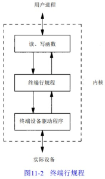

# Unix高级环境编程
## 第1章 UNIX 基础知识
### 1.3 文件和目录
#### 1.3.2 文件名
&emsp;&emsp;不能出现在文件名中的字符只有两个，斜线（/）和空操作符（null）。斜线分隔构成路径名的各文件名，空操作符则终止一个路径名。尽管如此，好的习惯是只是用印刷字符的一个子集作为文件名字符（只使用子集的理由是：如果在文件名中使用了某些 shell 特殊字符，则必须使用 shell 的引号机制来引用文件名）。
#### 1.3.4 工作目录
&emsp;&emsp;每个进程都有一个工作目录，有时称为当前工作目录。所有相对滤镜都从工作目录开始解释。

## 第2章 UNIX 标准化及实现

## 第3章 文件 I/O


## 第11章 终端I/O
### 11.2 综述
&emsp;&emsp;终端I/O有两种不同的工作方式：  
1. 规范方式输入处理。在这种方式中，终端输入以行为单位进行处理。对于每个读要求，终端驱动程序最多返回一行。  
2. 非规范方式输入处理。输入字符不以行为单位进行装配。系统不会对特殊字符进行处理。
如果不做特殊处理，则默认方式是规范方式。  

&emsp;&emsp;POSIX.1定义了11个特殊字符，其中9个可以改变。  
&emsp;&emsp;大多数UNIX系统在一个称为终端行规程的模块中进行规范处理。它是位于内核类属读、写函数和实际设备驱动程序之间的模块。  
<div align=center>

</div>
&emsp;&emsp;所有我们可以检测和更改的终端设备特性都包含在termios结构中。  

```c
typedef unsigned char   cc_t;
typedef unsigned int    speed_t;
typedef unsigned int    tcflag_t;

#define NCCS 19
struct termios {
    tcflag_t c_iflag;       /* input mode flags */
    tcflag_t c_oflag;       /* output mode flags */
    tcflag_t c_cflag;       /* control mode flags */
    tcflag_t c_lflag;       /* local mode flags */
    cc_t c_line;            /* line discipline */
    cc_t c_cc[NCCS];        /* control characters */
};

struct termios2 {
    tcflag_t c_iflag;       /* input mode flags */
    tcflag_t c_oflag;       /* output mode flags */
    tcflag_t c_cflag;       /* control mode flags */
    tcflag_t c_lflag;       /* local mode flags */
    cc_t c_line;            /* line discipline */
    cc_t c_cc[NCCS];        /* control characters */
    speed_t c_ispeed;       /* input speed */
    speed_t c_ospeed;       /* output speed */
};
```
* c_iflag：输入标志，由终端设备驱动程序用来控制输入特性（剥除输入字节的第8位，允许输入奇偶校验等）；
* c_oflag：输出标志，控制输出特性（执行输出处理，将新行映照为CR/LF等）；
* c_cflag：控制标志，影响到RS-232串行线（忽略调制解调器的状态线，每个字符的一个或两个停止位等）；
* c_lfalg：本地标志：影响驱动程序和用户之间的界面（回送的开或关，可视的擦除符，允许终端产生的信号，对后台作业输出的控制停止信号等）。  
  

&emsp;&emsp;下表列出了所有可以更改影响终端设备特性的终端标志。其中POSIX.1定义的是SVR4和4.3+BSD都支持的，但是他们还有自己的扩充部分。

| 字段    | 标志       | 说明                           | POSIX.1 | SVR4扩展 | 4.3+BSD扩展 |
| ------- | ---------- | ------------------------------ | ------- | -------- | ----------- |
| c_iflag | BRKINT     | 接到BREAK时产生SIGINT          | √       |          |             |
|         | ICRNL      | 将输入的CR转换为NL             | √       |          |             |
|         | IGNBRK     | 忽略BREAK条件                  | √       |          |             |
|         | IGNCR      | 忽略CR                         | √       |          |             |
|         | IGNPAR     | 忽略奇偶错字符                 | √       |          |             |
|         | IMAXBEL    | 在输入队列空时振铃             |         | √        | √           |
|         | INLCR      | 将输入的NL转换为CR             | √       |          |             |
|         | INPCK      | 打开输入奇偶校验               | √       |          |             |
|         | ISTRIP     | 剥除输入字符的第8位            | √       |          |             |
|         | IUCLC      | 将输入的大写字符转换为小写字符 |         | √        |             |
|         | IXANY      | 使任一字符都重新启动输出       |         | √        | √           |
|         | IXOFF      | 使起动/停止输入控制流起作用    | √       |          |             |
|         | IXON       | 使起动/停止输出控制流起作用    | √       |          |             |
|         | PARMRK     | 标记奇偶错                     | √       |          |             |
| c_oflag | BSDLY      | 退格延迟屏蔽                   |         | √    |             |
|         | CRDLY      | CR延迟屏蔽                     |         | √   |             |
|         | FFDLY      | 换页延迟屏蔽                   |         | √    |             |
|         | NLDLY      | NL延迟屏蔽                     |         | √    |             |
|         | OCRNL      | 将输出的CR转换为NL             |         |   √      |             |
|         | OFDEL      | 填充符为DEL，否则为NUL         |         |   √      |             |
|         | OFILL      | 对于延迟使用填充符             |         |   √      |             |
|         | OLCUC      | 将输出的小写字符转换为大写字符 |         |   √      |             |
|         | ONLCR      | 将NL转换为CR-NL                |         |   √      |   √         |
|         | ONLRET     | NL执行CR功能                   |         |   √      |             |
|         | ONOCR      | 在0列不输出CR                  |         |   √      |             |
|         | ONOEOT     | 在输出中删除EOT字符            |         |          |   √         |
|         | OPOST      | 执行输出处理                   |   √     |          |             |
|         | OXTABS     | 将制表符扩充为空格             |         |          |   √         |
|         | TABDLY     | 水平制表符延迟屏蔽             |         |   √      |             |
|         | VTDLY      | 垂直制表符延迟屏蔽             |         |   √      |             |
| c_cflag | CCTS_OFLOW | 输出的CTS流控制                |         |          |   √         |
|         | CIGNORE    | 忽略控制标志                   |         |          |   √         |
|         | CLOCAL     | 忽略解制-解调器状态行          |   √     |          |             |
|         | CREAD      | 启用接收装置                   |   √     |          |             |
|         | CRTS_IFLOW | 输入的RTS流控制                |         |          |   √         |
|         | CSIZE      | 字符大小屏蔽                   |   √     |          |             |
|         | CSTOPB     | 送两个停止位，否则为1位        |   √     |          |             |
|         | HUPCL      | 最后关闭时断开                 |   √     |          |             |
|         | MDMBUF     | 经载波的流控输出               |         |          |   √         |
|         | PARENB     | 进行奇偶校验                   |   √     |          |             |
|         | PARODD     | 奇校，否则为偶校               |   √     |          |             |
| c_lflag | ALTWERASE  | 使用替换WERASE算法             |         |          |   √         |
|         | ECHO       | 进行回送                       |   √     |          |             |
|         | ECHOCTL    | 回送控制字符为^(char)          |         | √        |   √         |
|         | ECHOE      | 可见擦除符                     | √       |          |             |
|         | ECHOK      | 回送kill符                     | √       |          |             |
|         | ECHOKE     | kill的可见擦除                 |         |   √      |   √         |
|         | ECHONL     | 回送NL                         |   √     |          |             |
|         | ECHOPRT    | 硬拷贝的可见擦除方式           |         |   √      |   √         |
|         | FLUSHO     | 刷清输出                       |         |   √      |   √         |
|         | ICANON     | 规范输入                       |   √     |          |             |
|         | IEXTEN     | 使扩充的输入字符处理起作用     |   √     |          |             |
|         | ISIG       | 使终端产生的信号起作用         |   √     |          |             |
|         | NOFLSH     | 在中断或退出键后不刷清         |   √     |          |             |
|         | NOKERNINFO | STATUS不使内核输出             |         |          |   √         |
|         | NOKERNINFO | STATUS不使内核输出             |         |          |   √         |
|         | PENDIN     | 重新打印                       |         |   √      |   √         |
|         | TOSTOP     | 对于后台输出发送SIGTTOU        |   √     |          |             |
|         | XCASE      | 规范大/小写表示                |         |   √      |             |


