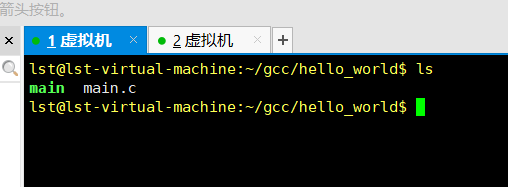
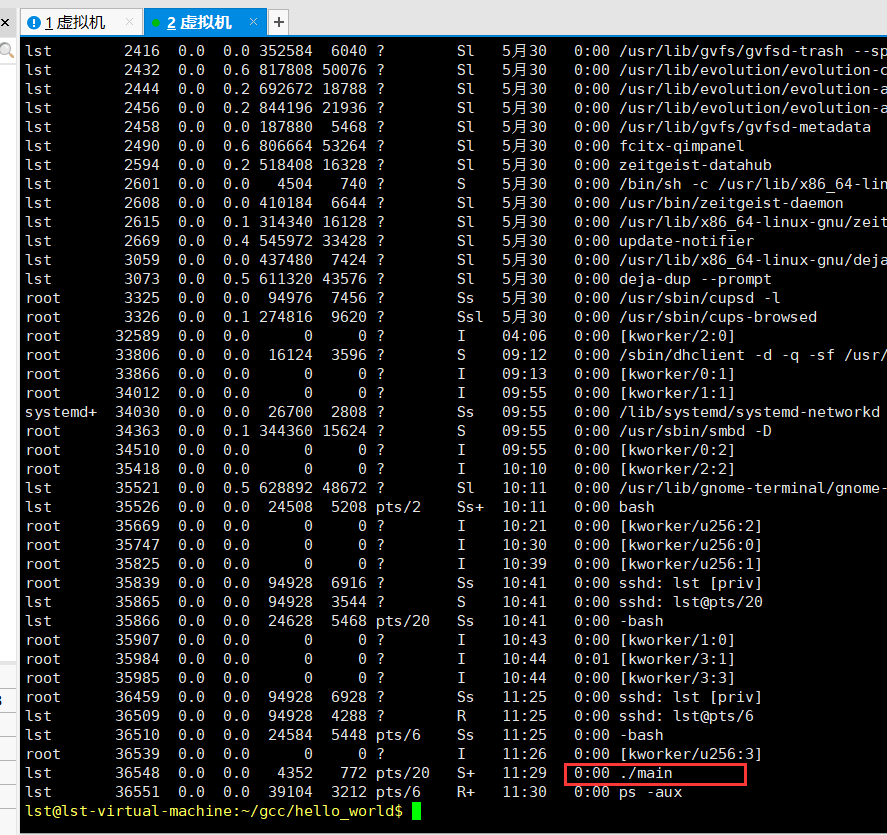
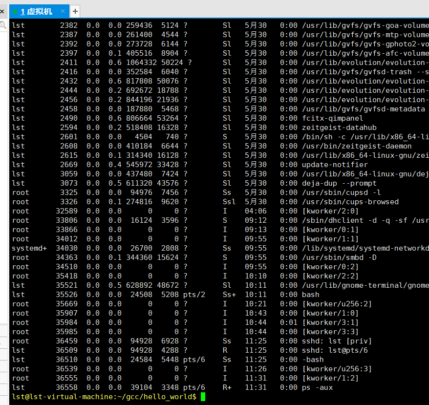

### 一、screen 是什么
&emsp;&emsp;Screen 是 Linux 下的一款远程会话管理工具，可以在多个进程之间多路复用一个物理终端的全屏窗口管理器。它可以创建多个会话，每个会话中可以创建多个窗口，每个窗口中可以运行单独的任务，并且相互之间不受影响，还可以方便快速的在不同的窗口和会话之间切换。

### 二、screen 有什么用
&emsp;&emsp;在虚拟专用服务器中执行一些非常耗时的任务时，我们通常是单独开一个远程中断窗口来执行这个任务，且在任务执行过程中不能关闭这个窗口或者中断连接，否则正在执行的任务会被终止掉。而有了 screen，我们可以在一个窗口中安装程序，然后在另一个窗口中下载文件，再在第三个窗口中编译程序，只需要一个 SSH 连接就可以同时执行这三个任务，还可以方便的在不同会话或窗口中切换，即使因为意外导致窗口关闭或者连接中断，也不会影响这三个任务的执行。
&emsp;&emsp;总体来说，screen 的功能有三个：
* 会话恢复：只要 screen 本身没有终止，在其内部运行的会话都可以恢复。这一点对于远程登录的用户特别有用——即使网络连接中断，用户也不会失去对已经打开的命令行会话的控制。只要再次登录到主机上执行screen -r就可以恢复会话的运行。同样在暂时离开的时候，也可以执行分离命令detach，在保证里面的程序正常运行的情况下让Screen挂起（切换到后台）。这一点和图形界面下的VNC很相似。
* 多窗口：在 screen 环境下，所有的会话都独立的运行，并拥有各自的编号、输入、输出和窗口缓存。用户可以通过快捷键在不同的窗口下切换，并可以自由的重定向各个窗口的输入和输出。
* 会话共享：screen 可以让一个或多个用户从不同终端多次登录一个会话，并共享会话的所有特性（比如可以看到完全相同的输出）。它同时提供了窗口访问权限的机制，可以对窗口进行密码保护。

###### 关闭窗口，正在执行的任务会被终止掉
&emsp;&emsp;打开两个窗口连接虚拟机，如图所示：
  
&emsp;&emsp;现在我在第一个窗口运行 hello world 示例，如下所示：
  
&emsp;&emsp;在第二个窗口查看有哪些进程，可以看到 ./main 正在运行，如下所示：

&emsp;&emsp;关闭第一个窗口再查看有哪些进程，可以看到 ./main 已经结束运行了。


### 三、安装 screen
```shell
sudo apt install screen
```

### 四、screen 简单使用 
#### 4.1 状态介绍
&emsp;&emsp;通常情况下，screen 创建的虚拟终端，有两个工作模式：
* Attached：表示当前 screen 正在作为主终端使用，为活跃状态。
* Detached：表示当前 screen 正在后台使用，为非激活状态。

#### 4.2 基础命令
##### 4.2.1 帮助查询
```shell
screen -help
```

##### 4.2.2 终端列表
&emsp;&emsp;查看已经存在的 screen 终端：
```shell
screen -ls
```
&emsp;&emsp;如果没有没有创建，则列表是空的，如下所示：
```shell
lst@lst-virtual-machine:~/gcc/hello_world$ screen -ls
No Sockets found in /var/run/screen/S-lst.
```
&emsp;&emsp;如果已经有创建的终端，则会打印如下所示类似的信息：
```shell
lst@lst-virtual-machine:~/gcc/hello_world$ screen -ls
There are screens on:
        37039.new       (2022年05月31日 14时43分00秒)   (Attached)
        37027.hello     (2022年05月31日 14时42分52秒)   (Attached)
2 Sockets in /var/run/screen/S-lst.
```
##### 4.2.3 新建终端
&emsp;&emsp;大部分人使用 screen，是为了让进程以前端运行的方式，后端存活（运行）。所以，使用 screen 新建一个虚拟终端，后端运行很重要。screen创建虚拟终端的方法很多,比如：直接输入 screen 回车，即可新建一个虚拟终端，但是这样的名称太乱（以 Linux 的 hostname 命名）。
&emsp;&emsp;screen 官方推荐的创建虚拟终端的方法是：
```shell
# 创建一个叫Hello的虚拟终端
screen -S Hello
```
&emsp;&emsp;还可以使用：
```shell
screen -R Hello
```
&emsp;&emsp;三种创建方法比较：
* 使用`-R`创建，如果之前有创建唯一一个同名的 screen，则直接进入之前创建的 screen
* 使用`-S`创建和直接输入 screen 创建的虚拟终端，不会检录之前创建的 screen（也就是会创建同名的screen）

##### 4.2.4 回到终端
&emsp;&emsp;重新回到虚拟终端，使用`-R`或`-r`命令：
```shell
# 使用screen -r命令
screen -r [pid/name]
```
&emsp;&emsp;其中，pid/name：为虚拟终端 PID 或 Name。

##### 4.2.5 清除终端
&emsp;&emsp;有时候，我们的进程已经“守护”完毕，不需要这个虚拟终端了，也就是需要释放资源，如何操作呢？
&emsp;&emsp;比较推荐的方法，是进入对应虚拟终端，然后输入：
```shell
# 退出终端
exit
```
&emsp;&emsp;之后，就会回到主终端。
&emsp;&emsp;当然，你如果对 screen 运行程序，确定已经停止运行了，也可以在主终端内，使用命令释放：
```shell
# 使用-R/-r/-S均可
screen -R [pid/Name] -X quit
```

#### 4.3 高阶命令
##### 绑定键
&emsp;&emsp;在虚拟终端内，输入 Ctril+a 将等待接受预先设置的绑定键，这个时候可以输入对应的一些命令，来操作虚拟终端，如：
* d：保存会话，后台运行改虚拟终端
* k：关闭对话，等同输入：exit
* c：新建一个虚拟终端
* ?：显示所有绑定键盘


### 五、问题
#### 5.1 无法进入Attached状态虚拟终端
&emsp;&emsp;上文提到，screen 有两种状态，Attached 状态，其实代表此虚拟终端，用户正在使用，这个时候，是无法进入的。但是，有时候，我们创建虚拟终端，并没有使用`Ctril+a`再按`d`退出并挂起虚拟终端，反而因为长时间没操作，或者本地网络掉包等问题，非正常退出虚拟终端，导致出现 SSH 连接服务器，并没有在虚拟终端内，却出现 Attached 状态。使用`screen -r` tool`无法进入，更会创建新的虚拟终端。这个时候，只需要：
```shell
screen -d [终端]
```
&emsp;&emsp;之后，再使用`screen -r`进入即可。

