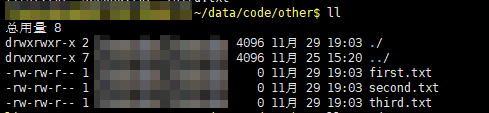
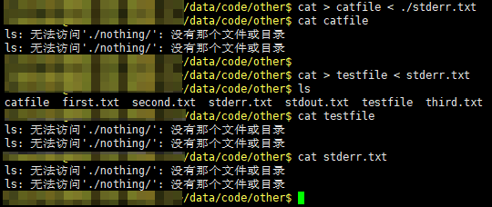
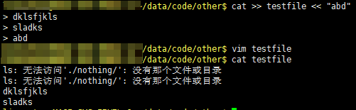

# 鸟哥的私房菜
## 第十章 认识与学习BASH
#### 10.1.4 Bash shell的功能
###### 命令别名设置功能：alias
```shell
alias ll='ls -al'
```
### 10.2 Shell的变量功能
&emsp;&emsp;示例：
```shell
echo $PATH
输出结果
/demo:/usr/bin:/usr/sbin:/bin:/sbin

myname=mara
echo $myname
输出结果
mara
```
&emsp;&emsp;变量的设置规则:
* 变量与变量的内容以一个等号“=”连接；
* 等号两边不能直接接空白字符；
* 变量名称只能是英文字母与数字，但是开头字符不能是数字；
* 变量内容若有空白符号可使用双引号或单引号将变量内容括起来，但：
  * 双引号内的特殊字符如“$”等，可以保留原本的特性；
  * 单引号内的特殊字符则仅为一般字符（纯文本）。
* 可用跳脱字符“\”将特殊符号（[Enter]，$，空白符号）变成一般字符，如`myname=mara\ sys`
* 可以使用`反单引号`（即波浪线下的单引号）或者`$`来引用别的指令。例如
  ```shell
  version=$(uname -r)
  或
  version=`uname -r`
  ```
* 可以使用`变量="$变量"新增内容`或`变量=${变量}新增内容`的方式来扩增变量内容，例如
  ```shell
  PATH="$PAHT":/home/bin
  PATH=${PATH}:/home/bin
  ```
* 取消变量的设置：`unset 变量名称`
#### 10.2.3 环境变量的功能
&emsp;&emsp;变量分类：
1. 用户自定义变量（本地变量）：只在当前shell中生效。
2. 环境变量：环境变量会在当前shell和这个shell的所有子shell中生效。

&emsp;&emsp;子程序会继承父程序的环境变量，但不会继承父程序的自定义变量，即原本bash的自定义变量在进入子程序以后就会消失不见，直到离开子程序并回到父程序中，自定义变量才会再出现。
&emsp;&emsp;如果想把自定义变量变成环境变量，可以使用`export`指令：
```shell
export 变量名称
```
#### 10.2.8 变量内容的删除、取代与替换
```shell
${var#pattern}  从变量头部开始匹配模式，将符合的最短数据删除
${var##pattern}  从变量头部开始匹配模式，将符合的最长数据删除
${var%pattern}  从变量尾部开始匹配模式，将符合的最短数据删除
${var%%pattern}  从变量尾部开始匹配模式，将符合的最长数据删除
```
**没看懂，和实际操作起来好像不一样**
### 10.3 命令别名与历史命令
#### 10.3.1 alias, unalias
```shell
alias 别名='指令 选项; 指令 选项'
//例如
alias lm='ls -al | more'

//取消别名
unalias 别名
//例如
unalias lm

//查看所有别名
alias
```
### 10.4 bash shell 的操作环境
#### 10.4.5 bash下的万用字符与特殊符号
##### 万用字符

| 符号 | 意义                                                         |
| ---- | ------------------------------------------------------------ |
| *    | 0到无穷多个任意字符                                          |
| ?    | 一定有一个任意字符                                           |
| []   | 一定有一个括号内的字符，例如[abcd]，一定有且只有a, b, c, d中的一个 |
| [-]  | 在编码顺序内的所有字符                                       |
| [^]  | 反向选择，\[^abc]，只要不是abc中任意一个就接受               |

##### 特殊符号

| 符号  | 意义                                                 |
| ----- | ---------------------------------------------------- |
| #     | 注释，在脚本中最常使用                               |
| \     | 跳脱符号：将特殊符号或万用符号还原成一般字符         |
| \|    | 管线(pipe)：分隔两个管线命令的界定                   |
| ;     | 连续指令下达分隔符号：连续性命令的界定               |
| ~     | 使用者的主文件夹                                     |
| $     | 取用变量前置字符，即变量之前需要加的表明这是一个变量 |
| &     | 工作控制：将指令变为后台运行                         |
| !     | 逻辑运算意义上的“非‘ not 的意思                      |
| /     | 目录符号：路径分隔的符号                             |
| >, >> | 数据流重导向：输出导向，分别是”取代“与”累加“         |
| <, << | 数据流重导向：输入导向                               |
| ''    | 单引号，不具有变量置换功能（$变为纯文本）            |
| ""    | 具有变量置换功能（$后接变量）                        |
|       | 没看懂啥意思                                         |
| ()    | 没看懂啥意思                                         |
| {}    | 没看懂啥意思                                         |

### 10.5 数据流重导向
&emsp;&emsp;数据流重导向就是将某个指令执行之后应该要出现屏幕上的数据，给他传输到其他的地方，例如文件或者是设备。
####标准输入输出：
1. 标准输入(stdin)：代码为0，使用 < 或 <<；
2. 标准输出(stdout)：代码为1，使用 > 或 >>；
3. 标准错误输出(stderr)：代码为2，使用 2> 或 2>>

&emsp;&emsp;标准输入默认指向键盘，标准输出和标准错误输出默认指向屏幕。
#### 示例
##### 输出
&emsp;&emsp;文件夹内容如下所示：
  
&emsp;&emsp;重定位标准输出：
```shell
//如果stdout.txt不存在，会自动创建，运行完下面命令以后
//屏幕上不会有输出，可以通过cat stdout.txt查看文件内容
//文件内容就是本来该输出到屏幕上的内容
ll > stdout.txt
```
&emsp;&emsp;重定位标准错误输出：
```shell
//查看不存在的文件夹的内容，会输出错误信息
//通过 2> 将错误输出重定向到stderr.txt文件中
ll ./nothing/ > stdout.txt 2>stderr.txt
```
&emsp;&emsp;以上重定向输出会覆盖原来文件的内容，可以通过 >> 将输出累加到源文件末尾，如下所示：
```shell
ll ./nothing/ >> stdout.txt 2>>stderr.txt
```
&emsp;&emsp;将输出和错误输出定位到同一个文件中，可以使用`2>&1`（将错误输出定位到标准输出中）或者`1>&2`（将标准输出定位到错误输出中）。
##### 输入
&emsp;&emsp;`<`将原本需要由键盘输入的数据，改由文件内容来取代。例如
```
cat > testfile < stderr.txt
```
  
&emsp;&emsp;可以看到testfile中的内容即是stderr.txt文件的内容。
&emsp;&emsp;`<<`代表“结束的输入字符”，例如
  
&emsp;&emsp;当输入`abd`时结束了输入。

## 第十二章 学习Shell Scripts
### 12.1 什么是shell scripts
&emsp;&emsp;shell script是利用shell的功能缩写的一个程序，这个程序使用纯文本文件，将一些shell的语法和指令写在里面，搭配正则表达式、管线命令与数据流重导向等功能，以达到我们所想要的处理目的。
#### 12.1.2 第一支script的撰写与执行
&emsp;&emsp;假设写的程序文件名是/home/dmtsai/shell.sh，执行此文件的方法有下面几种：
* 直接指令下达：shell.sh文件必须具备可读与可执行（rx）的权限，然后：
  * 绝对路径：使用`/home/dmtsai/shell.sh`来下达指令；
  * 相对路径：假设工作目录再/home/dmtsai/，则使用`./shell.sh`来执行；
  * 变量“PATH”功能：讲shell.sh放在PATH指定的目录内，例如：~/bin/
* 以bash程序来执行：通过`bash shell.sh`或`sh shell.sh`来执行
示例：
```shell
#!/bin/bash
file=first_test
if [ ! -f "first_test" ]; then
    touch $file
fi
```
&emsp;&emsp;该脚本检查当前目录下是否有`first_test`这个文件，如果没有就创建`first_test`这个文件.
&emsp;&emsp;第一行`#!/bin/bash`表明这个script使用的shell名称：因为我们使用的是bash，所以，必须要以`#!/bin/bash`来宣告这个文件内的语法使用bash的语法。那么当这个程序被执行时，他就能够载入bash的相关环境变量配置文件，并且执行bash来使我们下面的指令能够执行。**（这很重要，在很多状况中，如果没有设置好这一行，那么该程序很可能会无法执行，因为系统可能无法判断该程序需要使用什么shell来执行）**

## 快捷指令
* 命令行指令快速删除与定位
  * `ctrl+u`：从光标处向前删除指令串
  * `ctrl+k`：从光标处向后删除指令串
  * `ctrl+a`：让光标移动到整个指令串最前面
  * `ctrl+e`：让光标移动到整个指令串最后面


* grep
```shell
grep -r ./* 'regular expression'
```
* find
```shell
find ./* -name 'regular expression'
```