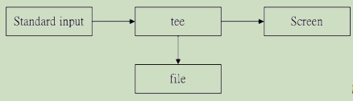

# 鸟哥的私房菜
## 第九章 vim 程序编辑器
### 9.2 vi 的使用
#### 9.2.2 按键说明

第一部分：一般指令模式可用的按钮说明

| 移动光标的方法 |                        |
| -------------- | ---------------------- |
| h 或 ←         | 光标向左移动一个字符   |
| j 或 ↓         | 光标向下移动一个字符   |
| k 或 ↑         | 光标向上移动过一个字符 |
| l 或 →         | 光标向右移动一个字符   |

&emsp;&emsp;使用数字加以上按键可以实现多次移动，例如“30↓”，向下移动 30 行。

|                       |                                                              |
| --------------------- | ------------------------------------------------------------ |
| ctrl + f              | 屏幕向下移动一页，page down                                  |
| ctrl + b              | 屏幕向上移动一页，page up                                    |
| ctrl + d              | 屏幕向下移动半页                                             |
| ctrl + u              | 屏幕向上移动半页                                             |
| +                     | 光标移动到非空白字符的下一列                                 |
| -                     | 光标移动到非空白字符的上一列                                 |
| n<space>              | 光标向右移动这一行的 n 个字符                                |
| 0 或 home             | 移动到这一行的最前面字符处                                   |
| $ 或 end              | 移动到这一行的最后面字符处                                   |
| H                     | 光标移动到这个屏幕最上方的那一行的第一个字符                 |
| M                     | 光标移动到这个屏幕的中央那一行的第一个字符处                 |
| L                     | 光标移动到这个屏幕的最下方那一行的第一个字符                 |
| G                     | 移动到这个文件的最后一行                                     |
| nG                    | 移动到这个文件的第 n 行。                                    |
| gg                    | 移动到这个文件的第一行。                                     |
| n<Enter>              | 光标向下移动 n 行                                            |
| **搜寻与取代**        |                                                              |
| /word                 | 向光标之下寻找一个名称为 word 的字串。                       |
| ?word                 | 向光标之上寻找一个字串名称为 word 的字串                     |
| n                     | 重复前一个搜寻动作                                           |
| N                     | 与 n 相反，如果执行 /word 开始搜寻以后，那么按下 n 表示向下寻找，N 表示向上寻找；如果执行 ?word 开始搜寻以后，那么按下 N 表示向上寻找，N 表示向下寻找。 |
| :n1,n2s/word1/word2/g | n1 与 n2 为数字。 在第 n1 与 n2 行之间寻找 word1 这个字串， 并将该字串取代为 word2 |
| :1,$s/word1/word2/g   | 从第一行到最后一行寻找 word1 字串， 并将 该字串取代为 word2  |
| :1,$s/word1/word2/gc  | 从第一行到最后一行寻找 word1 字串， 并将 该字串取代为 word2 ！ 且在取代前显示提示 字符给使用者确认 （ confirm） 是否需要取代 |
| **删除、赋值与粘贴**  |                                                              |
| x，X                  | 在一行字当中，x 为向后删除一个字符，X 为向前删除一个字符     |
| nx                    | 连续向后删除 n 个字符。                                      |
| dd                    | 删除光标所在的那一整行                                       |
| ndd                   | 删除光标所在向下的 n 行。                                    |
| d1G                   | 删除光标所在到第一行的所有数据                               |
| dG                    | 删除光标所在到最后一行的所有数据                             |
| d$                    | 删除光标所在处，到改行的最后一个字符                         |
| d0                    | 删除光标所在处，到改行最前面一个字符                         |
| yy                    | 复制光标所在的那一行                                         |
| nyy                   | 复制光标所在的向下 n 行                                      |
| y1G                   | 复制光标所在行到第一行的所有数据                             |
| yG                    | 复制光标所在行到最后一行的所有数据                           |
| y0                    | 复制光标所在的那个字符到该行最开始的所有数据                 |
| y$                    | 复制光标所有的那个字符到该行最后的所有数据                   |
| p, P                  | p 为将已复制的数据在光标下一行贴上，P 则为贴在光标上一行     |
| J                     | 将光标所在行与下一行的数据结合成同一行                       |
| c                     | 重复删除多个数据， 例如向下删除 10 列， [ 10cj ]             |
| u                     | 复原前一个动作（撤销）                                       |
| ctrl+r                | 重做上一个动作（反撤销）                                     |

第二部分：一般指令模式切换到编辑模式可用的按钮说明

| 进入插入或取代的编辑模式 |                                                              |
| ------------------------ | ------------------------------------------------------------ |
| i, I                     | i：从目前光标所在处插入。I：在目前所在行的第一个非空白字符处开始插入 |
| a, A                     | a：从目前光标所在的下一个字符处开始插入。A：从光标所在行的最后一个字符处开始插入 |
| o, O                     | o：在目前光标所在的下一行处插入新的一行；O：在目前光标所在处的下一行插入新的一行 |
| r，R                     | 进入取代模式。r：只会取代光标所在的那一个字符一次；R：一直取代光标所在的文字，直到按下 ESC 为止 |
| ESC                      | 退出编辑模式，回到一般指令模式中                             |

### 9.3 vim 的额外功能
#### 9.3.1 区块选择

| 区块选择按键的含义 |                                      |
| ------------------ | ------------------------------------ |
| v                  | 字符选择，会将光标经过的地方反白选择 |
| V                  | 行选择，会将光标经过的行反白选择     |
| ctrl+v             | 区块选择                             |
| y                  | 将反白的地方复制                     |
| d                  | 将反白的地方删除掉                   |
| p                  | 将刚刚复制的区块，在光标所在处贴上   |

#### 9.3.2 多文件编辑
&emsp;&emsp;可以使用 vim 后面同时接好几个文件来同时打开。

| 多文件编辑的按键 |                                   |
| ---------------- | --------------------------------- |
| :n               | 编辑下一个文件                    |
| :N               | 编辑上一个文件                    |
| :files           | 列出目前这个 vim 的打开的所有文件 |

#### 9.3.3 多窗口功能
&emsp;&emsp;`:sp filename`：堆叠显示窗口
&emsp;&emsp;`:vsp filename`：并排显示窗口
&emsp;&emsp;窗口之间的切换：先按下`ctrl+w`，再按下上下左右方向键。

#### 9.3.4 vim 挑字补全功能

| 组合按钮         | 补齐的内容                                                   |
| ---------------- | ------------------------------------------------------------ |
| ctrl+x -> ctrl+n | 通过目前正在编辑的这个“文件的内容文字”作为关键字，予以补齐   |
| ctrl+x -> ctrl+f | 以当前目录内的“文件名”作为关键字，予以补齐                   |
| ctrl+x -> ctrl+o | 以扩展名作为语法补充，以 vim 内置的关键字，予以补齐。（此功能需要注意编辑文件的扩展名） |

#### 9.3.5 vim 环境设置与记录：~/.vimrc, ~/.viminfo
&emsp;&emsp;~/.viminfo 我会将曾经做过的行为记录下来，好让用户下次可以轻松的作业。
&emsp;&emsp;可以在 vim 的一般指令模式下输入`:set all`来查阅。

| vim 的环境设置参数                   |                                                              |
| ------------------------------------ | ------------------------------------------------------------ |
| :set nu<br>:set nonu                 | 设置与取消行号                                               |
| :set autoindent<br>:set noautoindent | 是否自动缩排                                                 |
| :set backup                          | 是否自动存储备份文件。一般是 nobackup 的，如果设置为 backup，那么当更改任何一个文件时，则原始文件会被存成一个文件名为`filename~`的文件。 |
| :set ruler                           | 是否显示 vim 右下角的一些状态列                              |
| :set showmode                        | 是否显示`--INSERT--`之类的字眼在左下角的状态列               |
| :set backspace=(0 1 2)               | 一般来说，如果我们按下 i 进入编辑模式后，可以利用倒退键（backspace）来删除任意字符。但是，某些 不允许如此。此时，我们就可以通过 backspace 来设置。当 backspace 为 2 时，就是可以删除任意值；0 或 1 时，仅可删除刚刚输入的字符，而无法删除原本就已经存在的文字。 |
| :set all                             | 显示目前所有的环境参数设置值。                               |
| :set                                 | 显示与系统默认值不同的设置参数                               |
| :syntax on<br>:syntax off            | 是否一句程序相关语法显示不同颜色。例如，如果要编写纯文本，就可以取消这个设置 |
| :set bg=dart<br>:set bg=light        |                                                              |

&emsp;&emsp;我们可以通过配置文件来直接规定我们习惯的 vim 操作环境。整体 vim 的设置值一般是放在 /etc/vimrc 这个文件，不过，不建议修改它。可以修改 ~/.vimrc 这个文件（默认不存在，请手动创建）。
&emsp;&emsp;示例：
```shell
set hlsearch
set backspace=2
set autoindent
set ruler
set shownode
set nu
set bg=dark
syntax on
```
&emsp;&emsp;在这个文件中，使用“set hlsearch”或“:set hlsearch”，亦即最前面有没有冒号效果都是一样的，双引号是注释符号。创建好这个文件以后，下次重新以 vim 编辑某个文件时，就会使用该文件中的设置。

### 9.n vim 插件安装
#### 9.n.1 官方文档
[vim 插件安装官方文档](https://github.com/vim/vim/blob/03c3bd9fd094c1aede2e8fe3ad8fd25b9f033053/runtime/doc/repeat.txt#L515)  
1. 使用 Vim packages
&emsp;&emsp;Vim packages 是包含一个或多个插件的目录。这与普通插件相比的优势：
* 软件包可以作为存档下载并解压缩到其自己的目录中。因此，这些文件不会与其他插件的文件混合。这使得它易于更*和删除。
* 包可以是 git、mercurial 等存储库。这使得它真的易于更新。
* 一个包可以包含多个相互依赖的插件。
* 软件包可以包含启动时自动加载的插件，并且在需要时使用`：packadd`仅加载需要的那些包。

###### 使用包并自动加载

假设您的 Vim 文件位于"~/.vim"目录中，并且您想要添加一个
来自 zip 存档 "/tmp/foopack.zip" 的包：
```shell
% mkdir -p ~/.vim/pack/foo
% cd ~/.vim/pack/foo
% unzip /tmp/foopack.zip
```
&emsp;&emsp;目录名称"foo"是任意的，你可以选择任何你喜欢的名称。
&emsp;&emsp;现在，您将在 ~/.vim 下拥有这些文件：
```shell
pack/foo/README.txt
pack/foo/start/foobar/plugin/foo.vim
pack/foo/start/foobar/syntax/some.vim
pack/foo/opt/foodebug/plugin/debugger.vim
```
&emsp;&emsp;当 Vim 启动时，在处理您的 .vimrc 后，它会扫描 "pack/*/start" 目录下的插件的 "packpath"。首先这些目录被添加到"运行时路径"中。然后加载所有插件。
&emsp;&emsp;请参见 |packload-two-steps| 这两个步骤的用处。
&emsp;&emsp;在示例中，Vim 会找到 "pack/foo/start/foobar/plugin/foo.vim"，并添加 "~/.vim/pack/foo/start/foobar" 到 "runtimepath"。
&emsp;&emsp;如果 "foobar" 插件启动并将 "filetype" 设置为 "some"，Vim 将找到 syntax/some.vim 文件，因为它的目录位于 "runtimepath" 中。
&emsp;&emsp;Vim 还将加载 ftdetect 文件（如果有）。
&emsp;&emsp;请注意，"pack/foo/opt" 下的文件不会自动加载，只有在 "pack/foo/start" 下的文件会自动加载。请参见 |pack-add| 下介绍的如何使用 "opt" 目录。
&emsp;&emsp;如果加载插件被 disabled，则不会自动加载包，请参阅 |load-plugins|。
&emsp;&emsp;要更早地加载包，以便更新 "runtimepath"，可以运行命令：
```shell
:p ackloadall
```
&emsp;&emsp;当加载插件被禁用时，这也有效。自动加载将只发生一次。
&emsp;&emsp;如果包具有 "after "目录，则该目录将添加到 "runtimepath"，以便以后加载其中的任何内容。

###### 使用单个插件并自动加载
&emsp;&emsp;如果您没有软件包，但只有一个插件，则需要创建额外的插件目录级别：
```shell
% mkdir -p ~/.vim/pack/foo/start/foobar
% cd ~/.vim/pack/foo/start/foobar
% unzip /tmp/someplugin.zip
```
&emsp;&emsp;您现在将拥有这些文件：
```shell
pack/foo/start/foobar/plugin/foo.vim
pack/foo/start/foobar/syntax/some.vim
```
&emsp;&emsp;从这里开始，它的工作方式与上面相同。

###### 可选插件
&emsp;&emsp;要从包中加载可选插件，请使用`：packadd`命令：
```shell
:packadd foodebug
```
&emsp;&emsp;这会在"packpath"中搜索 "pack/*/opt/foodebug"，并将找到`~/.vim/pack/foo/opt/foodebug/plugin/debugger.vim`并获取它。
&emsp;&emsp;如果满足某些条件，则可以执行此操作。例如，取决于Vim 是否支持某个功能或缺少依赖项。
&emsp;&emsp;您还可以在启动时加载可选插件，方法是将此命令放入您的 |.vimrc|：运行命令：
```shell
:packadd! foodebug
```
&emsp;&emsp;额外的``是为了让在 Vim 启动时如果 |--noplugin| 则不会加载插件。
&emsp;&emsp;对于一个软件包来说，只有 "opt" 中的文件是完全正常的目录。然后，当您想要使用每个插件时，您需要加载它。

###### 放什么地方
&emsp;&emsp;由于加载了"：colorscheme"的配色方案可以在下面找到 "pack/*/start"和"pack/*/opt"，你可以把它们放在任何地方。我们推荐例如，您将它们放在"pack/*/opt"下面 ".vim/pack/mycolors/opt/dark/colors/very_dark.vim"。
&emsp;&emsp;Filetype 插件应位于 "pack/*/start" 下，以便它们始终能被发现。除非您有多个文件类型插件并希望选择使用`：packadd`加载哪一个。例如，取决于编译器版本：>
```shell
if foo_compiler_version > 34
    packadd foo_new
else
    packadd foo_old
endif
```
&emsp;&emsp;"after"目录很可能在包中没有用处。It's not disallowed though。


## 第十章 认识与学习BASH
#### 10.1.4 Bash shell的功能
###### 命令别名设置功能：alias
```shell
alias ll='ls -al'
```
### 10.2 Shell的变量功能
&emsp;&emsp;示例：
```shell
echo $PATH
输出结果
/demo:/usr/bin:/usr/sbin:/bin:/sbin

myname=mara
echo $myname
输出结果
mara
```
&emsp;&emsp;变量的设置规则:
* 变量与变量的内容以一个等号“=”连接；
* 等号两边不能直接接空白字符；
* 变量名称只能是英文字母与数字，但是开头字符不能是数字；
* 变量内容若有空白符号可使用双引号或单引号将变量内容括起来，但：
  * 双引号内的特殊字符如“$”等，可以保留原本的特性；
  * 单引号内的特殊字符则仅为一般字符（纯文本）。
* 可用跳脱字符“\”将特殊符号（[Enter]，$，空白符号）变成一般字符，如`myname=mara\ sys`
* 可以使用`反单引号`（即波浪线下的单引号）或者`$`来引用别的指令。例如
  ```shell
  version=$(uname -r)
  或
  version=`uname -r`
  ```
* 可以使用`变量="$变量"新增内容`或`变量=${变量}新增内容`的方式来扩增变量内容，例如
  ```shell
  PATH="$PAHT":/home/bin
  PATH=${PATH}:/home/bin
  ```
* 取消变量的设置：`unset 变量名称`
#### 10.2.3 环境变量的功能
&emsp;&emsp;变量分类：
1. 用户自定义变量（本地变量）：只在当前shell中生效。
2. 环境变量：环境变量会在当前shell和这个shell的所有子shell中生效。

&emsp;&emsp;子程序会继承父程序的环境变量，但不会继承父程序的自定义变量，即原本bash的自定义变量在进入子程序以后就会消失不见，直到离开子程序并回到父程序中，自定义变量才会再出现。
&emsp;&emsp;如果想把自定义变量变成环境变量，可以使用`export`指令：
```shell
export 变量名称
```
#### 10.2.8 变量内容的删除、取代与替换
```shell
${var#pattern}  从变量头部开始匹配模式，将符合的最短数据删除
${var##pattern}  从变量头部开始匹配模式，将符合的最长数据删除
${var%pattern}  从变量尾部开始匹配模式，将符合的最短数据删除
${var%%pattern}  从变量尾部开始匹配模式，将符合的最长数据删除
```
**没看懂，和实际操作起来好像不一样**
### 10.3 命令别名与历史命令
#### 10.3.1 alias, unalias
```shell
alias 别名='指令 选项; 指令 选项'
//例如
alias lm='ls -al | more'

//取消别名
unalias 别名
//例如
unalias lm

//查看所有别名
alias
```
### 10.4 bash shell 的操作环境
#### 10.4.5 bash下的万用字符与特殊符号
##### 万用字符

| 符号 | 意义                                                         |
| ---- | ------------------------------------------------------------ |
| *    | 0到无穷多个任意字符                                          |
| ?    | 一定有一个任意字符                                           |
| []   | 一定有一个括号内的字符，例如[abcd]，一定有且只有a, b, c, d中的一个 |
| [-]  | 在编码顺序内的所有字符                                       |
| [^]  | 反向选择，\[^abc]，只要不是abc中任意一个就接受               |

##### 特殊符号

| 符号  | 意义                                                 |
| ----- | ---------------------------------------------------- |
| #     | 注释，在脚本中最常使用                               |
| \     | 跳脱符号：将特殊符号或万用符号还原成一般字符         |
| \|    | 管线(pipe)：分隔两个管线命令的界定                   |
| ;     | 连续指令下达分隔符号：连续性命令的界定               |
| ~     | 使用者的主文件夹                                     |
| $     | 取用变量前置字符，即变量之前需要加的表明这是一个变量 |
| &     | 工作控制：将指令变为后台运行                         |
| !     | 逻辑运算意义上的“非‘ not 的意思                      |
| /     | 目录符号：路径分隔的符号                             |
| >, >> | 数据流重导向：输出导向，分别是”取代“与”累加“         |
| <, << | 数据流重导向：输入导向                               |
| ''    | 单引号，不具有变量置换功能（$变为纯文本）            |
| ""    | 具有变量置换功能（$后接变量）                        |
|       | 没看懂啥意思                                         |
| ()    | 没看懂啥意思                                         |
| {}    | 没看懂啥意思                                         |

### 10.5 数据流重导向
&emsp;&emsp;数据流重导向就是将某个指令执行之后应该要出现屏幕上的数据，给他传输到其他的地方，例如文件或者是设备。
#### 10.5.1 数据流重导向
##### 标准输入输出：
1. 标准输入(stdin)：代码为0，使用 < 或 <<；
2. 标准输出(stdout)：代码为1，使用 > 或 >>；
3. 标准错误输出(stderr)：代码为2，使用 2> 或 2>>

&emsp;&emsp;标准输入默认指向键盘，标准输出和标准错误输出默认指向屏幕。
##### 示例
###### 输出
&emsp;&emsp;文件夹内容如下所示：
  
&emsp;&emsp;重定位标准输出：
```shell
//如果stdout.txt不存在，会自动创建，运行完下面命令以后
//屏幕上不会有输出，可以通过cat stdout.txt查看文件内容
//文件内容就是本来该输出到屏幕上的内容
ll > stdout.txt
```
&emsp;&emsp;重定位标准错误输出：
```shell
//查看不存在的文件夹的内容，会输出错误信息
//通过 2> 将错误输出重定向到stderr.txt文件中
ll ./nothing/ > stdout.txt 2>stderr.txt
```
&emsp;&emsp;以上重定向输出会覆盖原来文件的内容，可以通过 >> 将输出累加到源文件末尾，如下所示：
```shell
ll ./nothing/ >> stdout.txt 2>>stderr.txt
```
&emsp;&emsp;将输出和错误输出定位到同一个文件中，可以使用`2>&1`（将错误输出定位到标准输出中）或者`1>&2`（将标准输出定位到错误输出中）。
###### 输入
&emsp;&emsp;`<`将原本需要由键盘输入的数据，改由文件内容来取代。例如
```
cat > testfile < stderr.txt
```
  
&emsp;&emsp;可以看到testfile中的内容即是stderr.txt文件的内容。
&emsp;&emsp;`<<`代表“结束的输入字符”，例如
  
&emsp;&emsp;当输入`abd`时结束了输入。
#### 10.5.2 多命令执行
###### 一次执行多个命令
&emsp;&emsp;在命令与命令之间用分号“;”来隔开。
```shell
ll; ls; ll
```
###### 指令执行条件
&emsp;&emsp;如果两个指令之间有依赖性，可以通过“&&”和“||”来进行判断。在Linux下面，若前一个指令执行结果正确，会回传一个“$?=0”的值。
* cmd1 && cmd2：若cmd1执行完毕且正确，则执行cmd2；否则不执行cmd2。
* cmd1 || cmd2：若cmd1执行完毕且正确，则不执行cmd2；否则执行cmd2。

### 10.6 管线命令（pipe）
&emsp;&emsp;管线命令是一种通信机制，通常用于进程间的通信，它表现出来的形式是将前面每一个进程的输出（stdout）直接作为下一个进程的输入（stdin）。
&emsp;&emsp;**管线命令使用“|”作为界定符**，管线命令与上面说的连续执行命令不一样。
&emsp;&emsp;在每个管线后面接的第一个数据必定是“指令”，而且这个指令必须要能够接受stdin的数据才行，这样的指令才可以视为管线命令，例如less，more，head，tail等都可以接受stdout的管线命令。至于mv，ls，cp等就不是管线命令，因为它们并不会接受来自stdin的数据。管线命令有两个需要注意的地方：
* 管线命令金会处理stdout，对于stderr会忽略；
* 管线命令必须能够接受前一个指令的数据成为stdin继续处理才行。

下面是一些可以作为管线命令的命令
#### 10.6.1 cut，grep
#### 10.6.2 排序命令 sort，wc，uniq
#### 10.6.3 双向重导向 tee
&emsp;&emsp;tee会同时将数据流分送到文件与屏幕；输出到屏幕的，其实就是stdout，那就可以让下个指令继续处理了。
  
```shell
tee [-a] file
-a：以累加的方式，将数据加入file中
//示例：last指令显示登陆用户，结果输出给tee，tee将一份输出到stdout，
//一份输出到指定的文件testfile，输出到stdout的交给grep作为stdin，由
//grep进行处理
last | tee -a testfile | grep 'mara'
```

#### 还有一些指令，还没用过，就先不看了


## 第十二章 学习Shell Scripts
### 12.1 什么是shell scripts
&emsp;&emsp;shell script是利用shell的功能缩写的一个程序，这个程序使用纯文本文件，将一些shell的语法和指令写在里面，搭配正则表达式、管线命令与数据流重导向等功能，以达到我们所想要的处理目的。
#### 12.1.2 第一支script的撰写与执行
&emsp;&emsp;假设写的程序文件名是/home/dmtsai/shell.sh，执行此文件的方法有下面几种：
* 直接指令下达：shell.sh文件必须具备可读与可执行（rx）的权限，然后：
  * 绝对路径：使用`/home/dmtsai/shell.sh`来下达指令；
  * 相对路径：假设工作目录再/home/dmtsai/，则使用`./shell.sh`来执行；
  * 变量“PATH”功能：讲shell.sh放在PATH指定的目录内，例如：~/bin/
* 以bash程序来执行：通过`bash shell.sh`或`sh shell.sh`来执行
示例：
```shell
#!/bin/bash
file=first_test
if [ ! -f "first_test" ]; then
    touch $file
fi
```
&emsp;&emsp;该脚本检查当前目录下是否有`first_test`这个文件，如果没有就创建`first_test`这个文件.
&emsp;&emsp;第一行`#!/bin/bash`表明这个script使用的shell名称：因为我们使用的是bash，所以，必须要以`#!/bin/bash`来宣告这个文件内的语法使用bash的语法。那么当这个程序被执行时，他就能够载入bash的相关环境变量配置文件，并且执行bash来使我们下面的指令能够执行。**（这很重要，在很多状况中，如果没有设置好这一行，那么该程序很可能会无法执行，因为系统可能无法判断该程序需要使用什么shell来执行）**

### 12.2 script的执行方式差异（source, sh script, ./script）
* 直接执行或bash（sh）执行
  &emsp;&emsp;直接指令下达（不论是绝对路径，相对路径还是${PATH}），或者利用bash（或sh）来下达脚本时，**该脚本都会使用一个新的bash环境来执行脚本内的指令，即，脚本是在子程序的bash内执行的。**
* 使用 source 执行
  &emsp;&emsp;使用 source 执行脚本，脚本是在父程序中执行的，因此各项动作都会在原本的bash内生效。**这也是使用`source ~/.bashrc`可以不登出系统就能使变量生效的原因。**

### 12.3 善用判断式
#### 12.3.1 test 指令
&emsp;&emsp;检查某些文件或相关属性。

| 参数                                                         | 代表意义                                                     |
| ------------------------------------------------------------ | ------------------------------------------------------------ |
| 关于某些文件名的“文件类型”判断，如 test -e filename 表示是否存在 |                                                              |
| -e                                                           | 该文件名是否存在                                             |
| -f                                                           | 该文件名是否存在且为文件                                     |
| -d                                                           | 该文件名是否存在且为目录                                     |
| -b                                                           | 该文件名是否存在且为一个 block device 设备                   |
| -c                                                           | 该文件名是否存在且为一个 character device 设备               |
| -S                                                           | 该文件名是否存在且为一个 Socket 文件                         |
| -p                                                           | 该文件名是否存在且为一个 FIFO（pipe）文件                    |
| -L                                                           | 该文件名是否存在且为一个链接文件                             |
| 关于文件的权限侦测，如 test -r filename 表示可读否（但 root 权限常有例外） |                                                              |
| -r                                                           | 侦测该文件名是否存在且具有可读的权限                         |
| -w                                                           | 侦测该文件名是否存在且具有可写的权限                         |
| -x                                                           | 侦测该文件名是否存在且具有可执行的权限                       |
| -u                                                           | 侦测该文件名是否存在且具有“SUID”的属性                       |
| -g                                                           | 侦测该文件名是否存在且具有“SGID”的权限                       |
| -k                                                           | 侦测该文件名是否存在且具有“Sticky bit”的权限                 |
| -s                                                           | 侦测该文件名是否存在且为非空白文件                           |
| 两个文件之间的比较，如 test file1 -nt file2                  |                                                              |
| -nt                                                          | (newer than)判断 file1 是否比 file2 新                       |
| -ot                                                          | (older than)判断 file1 是否比 file2 旧                       |
| -ef                                                          | 判断 file1 与 file2 是否为同一文件，可用在判断 hard link 的判定上。主要意义在判定，两个文件是否均指向同一个 inode |
| 关于两个整数之间的判定，例如 test n1 -eq n2                  |                                                              |
| -eq                                                          | 两数值相等（equal）                                          |
| -ne                                                          | 两数值不等（not equal）                                      |
| -gt                                                          | n1 大于 n2（greater than）                                   |
| -lt                                                          | n1 小于 n2（less than）                                      |
| -ge                                                          | n1 大于等于 n2（greater than or equal）                      |
| -le                                                          | n1 小于等于 n2（less than or equal）                         |
| 判定字串的数据                                               |                                                              |
| test -z string                                               | 判定字串是否为 0？若 string 为空字串，则为 true。            |
| test -n string                                               | 判定字串是否为 0？若 string 为空字串，则为 false。-n 亦可省略 |
| test str1 == str2                                            | 判定 str1 是否等于 str2 ， 若相等， 则回传 true              |
| test str1 != str2                                            | 判定 str1 是否不等于 str2 ， 若相等， 则回传 false           |
| 多重条件判定， 例如： test -r filename -a -x filename        |                                                              |
|                                                              | and） 两状况同时成立！ 例如 test -r file -a -x file，则 file 同时具有 r 与 x 权限时， 才回传 true。 |
| -o                                                           | or） 两状况任何一个成立！ 例如 test -r file -o -x file， 则 file 具有 r 或 x 权限时， 就可回传 true。 |

#### 12.3.2 利用判断符号 []
&emsp;&emsp;可以利用判断符号“[]”来进行数据的判断。
&emsp;&emsp;使用中括号要特别注意，因为中括号用在很多地方，包括万用字符与正则表达式，所以如果要在 bash 的语法当中使用中括号作为 shell 的判断式时，必须要注意**中括号内每个原件的两端需要有空白字符来分隔**。例如像下面这样（以 _ 表示空格）：
```shell
[_"$HOME"_==_"$MSIL"_]
```
&emsp;&emsp;在上面的例子中使用了“==”，其实在 bash 中使用一个等号和两个等号的结果是一样的。
&emsp;&emsp;在中括号中要注意：
* 在中括号 [] 内的每个原件都需要有空白键来分割；
* 在中括号内的变量，最好都以双引号号括起来；
* 在中括号内的常熟，最好都以单或双引号括起来。

&emsp;&emsp;最好用双引号括起来的原因是，假如设置了 name="VBird Tsai"，然后判定：
```shell
[ ${name} == "VBird ]

#其实等价于：
[ VBird Tsai == "VBird ]

#我们期望的：
[ "VBird Tsai" == "VBird ]
```

#### 12.3.3 Shell script 的默认变量（$0，$1...）
&emsp;&emsp;示例：
```shell
/path/to/scriptname opt1 opt2 opt3 opt4
        $0           $1   $2   $3   $4
```
&emsp;&emsp;执行的脚本的文件名为 $0 这个变量，第一个接的参数就是 $1，依此类推。除了这些数字变量之外，还有一些较为特殊的变量可以在 script 内使用来调用这些参数：
* $#：代表后接的参数个数，上例中是 4；
* $@：代表“$1”“$2”“$3”“$4”之意，每个变量是独立的；
* $*：代表“$1 $2 $3 $4”之意。

###### shift：造成参数变量号码偏移
&emsp;&emsp;示例：
```shell
#!/bin/bash
echo "Total parameter number is $#"
echo "Your whole parameter is $@"
shift
echo "Total parameter number is $#"
echo "Your whole parameter is $@"
shift 3
echo "Total parameter number is $#"
echo "Your whole parameter is $@"
```
&emsp;&emsp;执行结果如下所示：
```shell
Total parameter number is 6
Your whole parameter is one two three four five six
Total parameter number is 5
Your whole parameter is two three four five six
Total parameter number is 2
Your whole parameter is five six
```
### 12.4 条件判断式
#### 12.4.1 if...then
&emsp;&emsp;单层、简单条件判断式
```shell
if [ 条件判断式 ]; then
    工作内容;
fi
```
&emsp;&emsp;条件判断式的判断方法，与前一小节介绍相同。较特别的是，如果我有多个条件要判别时，除了可以将多个条件写入一个中括号内，还可以有多个中括号来隔开，而括号与括号之间，则以 && 或 || 来隔开。  
&emsp;&emsp;多重、复杂条件判断式
```shell
if [ 条件判断式 ]; then
    当条件判断式成立时，可以进行的指令工作内容;
else
    当条件判断式不成立时，可以进行的指令工作内容;
fi
```
&emsp;&emsp;如果考虑更复杂的情况，则可是使用这个语法：
```shell
if [ 条件判断式一 ]; then
    当条件判断式一成立时，可以进行的指令共组内容;
elif [ 条件判断式二 ]; then 
    当条件判断式二成立时，可以进行的指令工作内容;
fi
```
&emsp;&emsp;需要注意的是，elif 也是个判断式，因此出现 elif 后面都要接 then 来处理。但是 else 已经是最后的没有成立的结果了，所以 else 后面并没有 then。

#### 12.4.2 case ... esac 
&emsp;&emsp;case ... esac 是多选择语句，是一种多分枝选择结构，每个 case 分支用右圆括号开始，用两个分号 ;; 表示 break，即执行结束，跳出整个 case ... esac 语句。
```shell
case ${变量名称} in
    "变量内容")
        程序段
    ;;
    "变量内容")
        程序段
    ;;
esac
```

#### 12.4.3 functions
&emsp;&emsp;linux shell 用户可以自定义函数，然后可以在任意 shell 脚本中随时调用。
##### 12.4.3.1 定义 shell 函数格式
```shell
[ function ] funname [()]
{
    action;
    [return int;]
}
```
&emsp;&emsp;说明：
1. 可以带 function func() 定义，也可以直接 func() 定义，不带任何参数。
2. 参数返回，可以显示加：return 返回，如果不加，将以最后一条命令运行结果，作为返回值。return 后跟数值 n（0-255）。
  
&emsp;&emsp;下面的例子定义了一个函数并进行调用：
```shell
demoFun() {
    echo "这是我的第一个 shell 函数!"
}

echo "-----函数开始执行-----"
demoFun
echo "-----函数执行完毕-----"
```
&emsp;&emsp;输出结果：
```shell
-----函数开始执行-----
这是我的第一个 shell 函数!
-----函数执行完毕-----
```
&emsp;&emsp;下面是一个带有 return 语句的函数：
```shell
funWithReturn() {
    echo "这个函数会对输入的两个数字进行相加运算..."
    echo "输入第一个数字: "
    read aNum
    echo "输入第二个数字: "
    read anotherNum
    echo "两个数字分别为 $aNum 和 $anotherNum !"
    return $(($aNum+$anotherNum))
}

funWithReturn
echo "输入的两个数字之和为 $? !"
```
&emsp;&emsp;输出结果如下：
```shell
这个函数会对输入的两个数字进行相加运算...
输入第一个数字: 
1
输入第二个数字: 
2
两个数字分别为 1 和 2 !
输入的两个数字之和为 3 !
```
&emsp;&emsp;注意：**所有函数在使用前必须定义**。这意味着必须将函数放在脚本开始部分，直至shell解释器首次发现它时，才可以使用。调用函数仅使用其函数名即可。
##### 12.4.3.2 函数返回值
&emsp;&emsp;函数返回值可以在调用该函数后通过 $? 来获得。
##### 12.4.3.3 函数参数
&emsp;&emsp;在Shell中，调用函数时可以向其传递参数。在函数体内部，通过 $n 的形式来获取参数的值，例如，$1表示第一个参数，$2表示第二个参数...
&emsp;&emsp;带参数的函数示例：
```shell
funWithParam() {
    echo "第一个参数为 $1 !"
    echo "第二个参数为 $2 !"
    echo "第十个参数为 $10 !"
    echo "第十个参数为 ${10} !"
    echo "第十一个参数为 ${11} !"
    echo "参数总数有 $# 个!"
    echo "作为一个字符串输出所有参数 $* !"
}

funWithParam 1 2 3 4 5 6 7 8 9 34 73
```
&emsp;&emsp;输出结果：
```shell
第一个参数为 1 !
第二个参数为 2 !
第十个参数为 10 !
第十个参数为 34 !
第十一个参数为 73 !
参数总数有 11 个!
作为一个字符串输出所有参数 1 2 3 4 5 6 7 8 9 34 73 !
```
&emsp;&emsp;注意，$10 不能获取第十个参数，获取第十个参数需要 ${10}。当 n >= 10 时，需要使用 ${n} 来获取参数。
&emsp;&emsp;另外，还有几个特殊字符用来处理参数：
| 参数处理  | 说明  |
|---|---|
| $#   | 传递到脚本或函数的参数的个数  |
| $*   | 以一个单字符串显示所有向脚本传递的参数 |
| $$   | 脚本运行的当前进程 ID 号 |
| $!   | 后台运行的最后一个进程的 ID 号 |
| $@   | 与 $* 相同，但是使用时加引号，并在引号中返回每个参数 |
| $-   | 显示 shell 使用的当前选项，与 set 命令功能相同 |
| $?   | 显示最后命令的退出状态。0 表示没有错误，其他任何值表明有错误 |

### 12.5 循环 loop
#### 12.5.1 for 循环
##### 12.5.1.1
&emsp;&emsp;for 循环一般格式为：
```shell
for var in item1 item2 ... itemN
do
    command1
    command2
    ...
    commandN
done
```
&emsp;&emsp;当变量值在列表里，for 循环即执行一次所有命令，使用变量名获取列表中的当前取值。命令可为任何有效的 shell 命令和语句。in 列表可以包含替换、字符串和文件名。
&emsp;&emsp;in 列表是可选的，如果不用它，for 循环使用命令行的位置参数。
&emsp;&emsp;示例：
```shell
for loop in 1 2 3 4 5
do
    echo "The value is: $loop"
done
```
&emsp;&emsp;输出结果：
```shell
The value is: 1
The value is: 2
The value is: 3
The value is: 4
The value is: 5
```
&emsp;&emsp;顺序输出字符串中的字符：
```shell
#!/bin/bash

for str in This is a string
do
    echo $str
done
```
&emsp;&emsp;输出结果：
```shell
This
is
a
string
```

##### 12.5.1.2
&emsp;&emsp;除了上述的方法之外，for 循环还有另外一种写法：
```shell
for ( ( 初始值; 限制值; 执行步阶) )
do
    程序段
done
```
&emsp;&emsp;这种语法适合于数值方式的运算当中，在 for 后面的括号内的三串内容意义为：
* 初始值：当某个变量在循环当中的起始值，直接以类似 i=1 设置好；
* 限制值：当变量的值在这个限制值的范围内，就集训进行循环。例如 i<=100；
* 执行步阶：每作一次循环时，变量的变化量。例如 i=i+1。


## 快捷指令
* 命令行指令快速删除与定位
  * `ctrl+u`：从光标处向前删除指令串
  * `ctrl+k`：从光标处向后删除指令串
  * `ctrl+a`：让光标移动到整个指令串最前面
  * `ctrl+e`：让光标移动到整个指令串最后面

* 统计字符串出现次数
```shell
:%s/字符串//ng
```

* grep
```shell
grep -r ./* 'regular expression'
```
* find
```shell
find ./* -name 'regular expression'
```

vim 替换指定行内的关键词
```shell
:5,15s/dog/cat/g
```