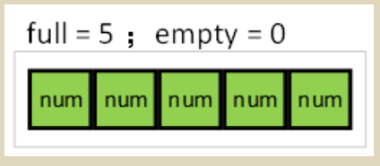

# RT-THREAD 内核实验手册

## 第二章 线程的使用
###### 优先级
&emsp;&emsp;优先级数字越小，优先级越高。

###### 创建动态线程
&emsp;&emsp;thread1 创建动态线程，优先级为 25。
&emsp;&emsp;定义了待创建线程需要用到的优先级，栈空间，时间片的宏，定义线程 thread1 的线程句柄。
```c
# include <rtthread.h>
# define THREAD_PRIORITY 25
# define THREAD_STACK_SIZE 512
# define THREAD_TIMESLICE 5
static rt_thread_t tid1 = RT_NULL;
```
&emsp;&emsp;线程 1 的入口函数
```c
/* 线 程 1 的 入 口 函 数 */
static void thread1_entry(void *parameter)
{
    rt_uint32_t count = 0;
    while (1)
    {
        /* 线 程 1 采 用 低 优 先 级 运 行， 一 直 打 印 计 数 值 */
        rt_kprintf("thread1 count: %d\n", count ++);
        rt_thread_mdelay(500);
    }
}
```

###### 初始化静态线程
&emsp;&emsp;thread2 是初始化的静态线程，优先级为 24.
&emsp;&emsp;下面是线程 thread2 线程栈、控制块以及线程 2 入口函数的定义。
```c
ALIGN(RT_ALIGN_SIZE)
static char thread2_stack[1024];
static struct rt_thread thread2;

/* 线 程 2 入 口 */
static void thread2_entry(void *param)
{
    rt_uint32_t count = 0;

    /* 线 程 2 拥 有 较 高 的 优 先 级， 以 抢 占 线 程 1 而 获 得 执 行 */
    for (count = 0; count < 10 ; count++)
    {
        /* 线 程 2 打 印 计 数 值 */
        rt_kprintf("thread2 count: %d\n", count);
    }
    rt_kprintf("thread2 exit\n");

    /* 线 程 2 运 行 结 束 后 也 将 自 动 被 系 统 脱 离 */
}
```

###### 创建动态线程，初始化静态线程
```c
/* 线 程 示 例 */
int thread_sample(void)
{
    /* 创 建 线 程 1， 名 称 是 thread1， 入 口 是 thread1_entry*/
    tid1 = rt_thread_create("thread1",
                            thread1_entry, RT_NULL,
                            THREAD_STACK_SIZE,
                            THREAD_PRIORITY, THREAD_TIMESLICE);

    /* 如 果 获 得 线 程 控 制 块， 启 动 这 个 线 程 */
    if (tid1 != RT_NULL)
        rt_thread_startup(tid1);

    /* 初 始 化 线 程 2， 名 称 是 thread2， 入 口 是 thread2_entry */
    rt_thread_init(&thread2,
                    "thread2",
                    thread2_entry,
                    RT_NULL,
                    &thread2_stack[0],
                    sizeof(thread2_stack),
                    THREAD_PRIORITY - 1, THREAD_TIMESLICE);
    rt_thread_startup(&thread2);
    
    return 0;
}
```


## 第五章 信号量——生产者消费者问题
### 5.2 实验原理
&emsp;&emsp;信号量在大于 0 时才能获取，在中断、线程中均可释放信号量。
&emsp;&emsp;信号量是一种轻型的用于解决线程间同步问题的内核对象，线程可以获取或释放它，从而达到同步或互斥的目的。信号量就像一把钥匙，把一段临界区给锁住，只允许有钥匙的线程进行访问：线程拿到了钥匙，才允许它进入临界区；而离开后把钥匙传递给排队在后面的等待线程，让后续线程一次进入临界区。
&emsp;&emsp;信号量是一种非常灵活的同步方式，可以运用在多种场合中。形成锁，同步，资源计数等关系，也能方便的用于线程与线程，中断与线程的同步中。
&emsp;&emsp;[信号量 API](https://www.rt-thread.org/document/api/group__semaphore.html#gaae61bc48262a327841eff7616d3af9c0)  

#### 5.2.1 实验设计
&emsp;&emsp;本实验设计了 producer、consumer 两个线程，producer 优先级为 24，consumer 优先级为 26。线程 producer 每生产一个数据进入 20ms 延时，生产 10 个数据后结束。线程 consumer 每消费一个数据进入 5 0ms 延时，消费 10 个数据后结束。

1. 在 tshell 线程中初始化 3 个信号量，lock 初始化为 1（用作保护临界区，保护数组），empty 初始化为 5，full 初始化为 0；信号量情况：
  
2. 创建并启动线程 producer，优先级为 24；创建并启动线程和 consumer，优先级为 26；
3. 在操作系统的调度下，producer 优先级高，首先被投入运行；
4. producer 获取一个 empty 信号量，产生一个数据放入数组，再释放一个 full 信号量，然后进入
2 OS Tick 延时；之后的信号量情况：
  
5. 随后 consumer 投入运行，获取一个 full 信号量，消费一个数据用于累加，再释放一个 empty 信号量，然后进入 5 OS Tick 延时；之后的信号量情况：

6. 由于生产速度 > 消费速度，所以在某一时刻会存在 full = 5 / empty = 0 的情况，如下：
  
&emsp;&emsp;比如第 18 个 OS Tick 时， producer 延时结束，操作系统调度 producer 投入运行，获取一个 empty 信号量，由于此时 empty 信号量为 0， producer 由于获取不到信号量挂起；等待有 empty 信号时，才可以继续生产。
7. 直到 producer 产生 10 个 num 后， producer 线程结束，被系统删除。
8. 直到 consumer 消费 10 个 num 后， consumer 线程结束，被系统删除。

#### 5.2.2 源程序说明
&emsp;&emsp;定义了待创建线程需要用到的优先级，栈空间，时间片的宏，以及生产消费过程中用于存放产生数据的数字和相关变量、线程句柄、信号量控制块。
```c
#include <rtthread.h>

#define THREAD_PRIORITY 6
#define THREAD_STACK_SIZE 512
#define THREAD_TIMESLICE 5

/* 定 义 最 大 5 个 元 素 能 够 被 产 生 */
#define MAXSEM 5

/* 用 于 放 置 生 产 的 整 数 数 组 */
rt_uint32_t array[MAXSEM];

/* 指 向 生 产 者、 消 费 者 在 array 数 组 中 的 读 写 位 置 */
static rt_uint32_t set, get;

/* 指 向 线 程 控 制 块 的 指 针 */
static rt_thread_t producer_tid = RT_NULL;
static rt_thread_t consumer_tid = RT_NULL;

struct rt_semaphore sem_lock;
struct rt_semaphore sem_empty, sem_full;
```


&emsp;&emsp;生产者 producer 线程的入口函数，每 20ms 就获取一个空位（获取不到时挂起），上锁, 产生一个数字写入数组, 解锁，释放一个满位， 10 次后结束。
```c
/* 生 产 者 线 程 入 口 */
void producer_thread_entry(void *parameter)
{
    int cnt = 0;

    /* 运 行 10 次 */
    while (cnt < 10)
    {
        /* 获 取 一 个 空 位 */
        rt_sem_take(&sem_empty, RT_WAITING_FOREVER);

        /* 修 改 array 内 容， 上 锁 */
        rt_sem_take(&sem_lock, RT_WAITING_FOREVER);
        array[set % MAXSEM] = cnt + 1;
        rt_kprintf("the producer generates a number: %d\n", array[set % MAXSEM]);
        set++;
        rt_sem_release(&sem_lock);

        /* 发 布 一 个 满 位 */
        rt_sem_release(&sem_full);
        cnt++;

        /* 暂 停 一 段 时 间 */
        rt_thread_mdelay(20);
    }
    rt_kprintf("the producer exit!\n");
}
```
&emsp;&emsp;消费者 consumer 线程的入口函数，每 50ms 获取一个满位（获取不到时挂起），上锁, 将数组中的内容相加, 解锁，释放一个空位， 10 次后结束。
```c
/* 消 费 者 线 程 入 口 */
void consumer_thread_entry(void *parameter)
{
    rt_uint32_t sum = 0;

    while (1)
    {
        /* 获 取 一 个 满 位 */
        rt_sem_take(&sem_full, RT_WAITING_FOREVER);

        /* 临 界 区， 上 锁 进 行 操 作 */
        rt_sem_take(&sem_lock, RT_WAITING_FOREVER);
        sum += array[get % MAXSEM];
        rt_kprintf("the consumer[%d] get a number: %d\n", (get % MAXSEM), array[get
        % MAXSEM]);
        get++;
        rt_sem_release(&sem_lock);

        /* 释 放 一 个 空 位 */
        rt_sem_release(&sem_empty);

        /* 生 产 者 生 产 到 10 个 数 目， 停 止， 消 费 者 线 程 相 应 停 止 */
        if (get == 10) break;

        /* 暂 停 一 小 会 时 间 */
        rt_thread_mdelay(50);
    }

    rt_kprintf("the consumer sum is: %d\n", sum);
    rt_kprintf("the consumer exit!\n");
}
```
&emsp;&emsp;生产者与消费者问题的示例函数，示例函数首先初始化了 3 个信号量，创建并启动生产者线程 producer，然后创建、启动消费者线程 consumer。并将函数使用 MSH_CMD_EXPORT 导出命令。
```c
int producer_consumer(void)
{
    set = 0;
    get = 0;

    /* 初 始 化 3 个 信 号 量 */
    rt_sem_init(&sem_lock, "lock", 1, RT_IPC_FLAG_FIFO);
    rt_sem_init(&sem_empty, "empty", MAXSEM, RT_IPC_FLAG_FIFO);
    rt_sem_init(&sem_full, "full", 0, RT_IPC_FLAG_FIFO);

    /* 创 建 生 产 者 线 程 */
    producer_tid = rt_thread_create("producer",
                                    producer_thread_entry, RT_NULL,
                                    THREAD_STACK_SIZE,
                                    THREAD_PRIORITY - 1, THREAD_TIMESLICE);

    if (producer_tid != RT_NULL)
        rt_thread_startup(producer_tid);

    /* 创 建 消 费 者 线 程 */
    consumer_tid = rt_thread_create("consumer",
                                    consumer_thread_entry, RT_NULL,
                                    THREAD_STACK_SIZE,
                                    THREAD_PRIORITY + 1, THREAD_TIMESLICE);

    if (consumer_tid != RT_NULL)
        rt_thread_startup(consumer_tid);

    return 0;
}
```


