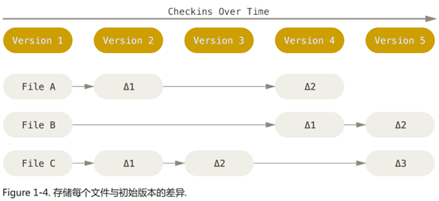
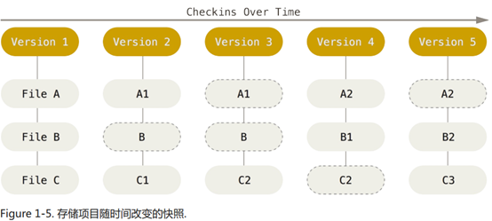
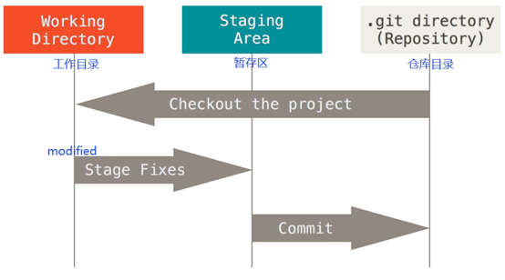

# Pro Git
## 第一章 起步
### 1.3 Git 基础
#### 直接记录快照，而非差异比较
&emsp;&emsp;Git和其他版本控制系统的主要差别在于Git对待数据的方法。概念上来区分，其他大部分系统以文件变更列表的方式存储信息。这类系统将他们保存的信息看作是一组基本文件和每个文件随时间逐步积累的差异。  
  
&emsp;&emsp;Git不按照以上方式对待或保存数据。反之，Git更像是把数据看作是对小型文件系统的一组快照。每次提交更新，或在Git中保存项目状态时，它主要对当时的全部文件制作一个快照并保存这个快照的索引。为了高效，如果文件没有修改，Git不再重新存储该文件，而是只保留一个链接指向之前存储的文件。Git对待数据更像是一个快照流。  
  
#### 三种状态
&emsp;&emsp;Git有三种状态，文件可能处于其中之一：已提交（commit）（暂存区->仓库目录）、已修改（modified）（工作目录）和已暂存（staged）（工作目录->暂存区）。  
   
* Git仓库目录：是Git用来保存项目的元数据和对象数据库的地方。从其他计算机克隆仓库时，拷贝的就是这里的数据。
* 工作目录：是对项目某个版本独立提取出来的内容。这些从Git仓库的压缩数据库提取出来的文件，放在磁盘上供你使用或修改。
* 暂存区域：是一个文件，保存了下次将提交的文件列表信息，一般在Git仓库目录中。  

&emsp;&emsp;基本的 Git 工作流程如下：
  1. 在工作目录中修改文件；
  2. 暂存文件，将文件的快照放入暂存区域；
  3. 提交更新，找到暂存区域的文件，将快照永久性存储到 Git 仓库目录。

&emsp;&emsp;如果 Git 目录中保存着的特定版本文件， 就属于已提交状态。 如果作了修改并已放入暂存区域， 就属于已暂存状态。 如果自上次取出后， 作了修改但还没有放到暂存区域， 就是已修改状态。
## 第二章 Git 基础
