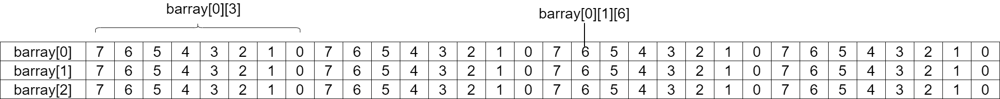

## 第二章 数据类型 
### 2.1 内建数据类型
&emsp;&emsp;verilog 有两种基本的数据类型：变量和线网（net）。它们各自都可以有四种取值：0，1，Z 和 X。RTL 代码使用变量来存放组合和时序值。变量可以是单比特或多比特的无符号数（reg[7:0] m），32 比特的有符号数（integer），64 比特的无符号数（time）或浮点数（real）。
&emsp;&emsp;若干变量可以被一起存放到定宽数组里。
&emsp;&emsp;所有的存储都是静态的，意味着所有的变量在整个仿真过程中都是存活的，子程序不能通过堆栈来保存形式变量和局部变量。
&emsp;&emsp;SystemVerilog 增加了很多新的数据类型。
#### 2.1.1 逻辑（logic）类型
#### 2.1.2 双状态数据类型
&emsp;&emsp;相比四状态数据类型，SystemVerilog 引入的双状态数据类型有利于提高仿真器的性能并减少内存的使用量。
&emsp;&emsp;最简单的双状态数据类型是 bit，它是无符号的。另四种带符号的双状态数据类型是 byte，shortint，int 和 longint。
```verilog
bit b;              // 双状态，单比特
bit[31:0] b32;      // 双状态，32 比特无符号整数
int unsigned ui;    // 双状态，32 比特无符号整数
int i;              // 双状态，32 比特有符号整数
byte b8;            // 双状态，8 比特有符号整数
shortint s;         // 双状态，16 比特有符号整数
longint l;          // 双状态，64 比特有符号整数
integer i4;         // 四状态，32 比特有符号整数
time t;             // 四状态，64 比特无符号整数
real r;             // 双状态，双精度浮点数
```

### 2.2 定宽数组
&emsp;&emsp;相比 verilog 中的一维定宽数组，SystemVerilog 提供了更加多样的数组类型，功能上也大大增强。
#### 2.2.1 定宽数组的声明和初始化
&emsp;&emsp;Verilog 要求在声明中必须给出数组的上下界，SystemVerilog 允许只给出数组宽度的便捷声明方式。
```verilog
int lo_hi[0:15];    // 16 个整数 [0] ... [15]
int c_style[16];    // 16 个整数 [0] ... [15]
```
&emsp;&emsp;可以通过在变量名后面指定维度的方式来创建多维定宽数组，下面的例子创建了几个二维的整数数组，大小都是 8 行 4 列，最后一个元素的值被设置为1。
```verilog
int array2[0:7][0:3];   // 完整声明
int array3[8][4];       // 紧凑声明
array2[7][3] = 1;       // 设置最后一个元素
```
&emsp;&emsp;如果你的代码试图从一个越界的地址中读取数据，那么 SystemVerilog 将返回数组元素类型的缺省值。也就是说，对于一个元素为四状态类型的数组，例如 logic，返回的是 X，而对于双状态类型例如 int 或 bit，则返回 0.这适用于所有数组类型，包括定宽数组、动态数组、关联数组和队列，也同时适用于地址中含有 X 或 Z 的情况。线网在没有驱动的时候输出是 Z。
&emsp;&emsp;很多 SystemVerilog 仿真器在存放数组元素时使用 32 比特的字边界，所以 byte，shortint 和 int 都是存放在一个字中，而 longint 则存放到两个字中。
&emsp;&emsp;仿真器通常使用两个或两个以上连续的字来存放 logic 和 integer 等四状态类型，这会比存放双状态变量多占用一倍的空间。
#### 2.2.2 常量数组
&emsp;&emsp;下例示范了如何使用常量数组，即一个单引号（双引号下面那个）加大括号来初始化数组。可以一次性地为数组的部分或所有元素赋值。在大括号前标上重复次数可以对多个元素重复赋值，还可以为哪些没有显式赋值的元素指定一个缺省值。
```verilog
int ascend[4] = '{0,1,2,3};
int descend[5];

descend = '{4,3,2,1,0};
descend[0:2] = '{5,6,7};
ascend = '{4{8}};           // 四个值全部为 8
descend = '{9,8,default:1}; // {9,8,1,1,1}
```
#### 2.2.3 基本的数组操作——for 和 foreach
&emsp;&emsp;操作数组的最常见的方式是使用 for 或 foreach 循环。下例中，i 被声明为 for 循环内的局部变量。 SystemVerilog 的 $size 函数返回数组的宽度。在 foreach 循环中，只需要指定数组名并在其后面的方括号中给出索引变量，SystemVerilog 便会自动便利数组中的元素。索隐变量将自动声明，并只在循环内有效。
```verilog
initial begin
    bit[31:0] src[5],dst[5];
    for (int i = 0; i < $size(src); i+=)
        src[i] = i;
    foreach (dst[j])
        dst[j] = src[j] * 2;
end
```
&emsp;&emsp;对多维数组使用 foreach 语法，并不是像 [i][j] 这样把每个下标分别列在不同的括号里，而是用逗号分隔开后放在同一个方括号里，像 [i,j]。
```verilog
int md[2][3] = '{'{0,1,2},'{3,4,5}};

initial begin
    foreach (md[i,j])
        $display("md[%0d][%0d]", i, j, md[i][j]);
end
```
&emsp;&emsp;如果需要遍历数组中的所有维度，可以在 foreach 循环里忽略掉它们。下例把一个二维数组打印成一个方形的阵列。它在外层循环中遍历第一个维度，然后在内层循环中遍历第二个维度。
```verilog
initial begin
    byte twoD[4][6];
    foreach(twoD[i,j])
        twoD[i][j] = i * 10 + j;

    foreach (twoD[i]) begin     // 遍历第一个维度
        $write("%2d:", i);
        foreach (twoD[,j])      // 遍历第二个维度
            $write("%3d",twoD[i][j]);
        $display;
    end
end
```
&emsp;&emsp;对于数组 f[5] 等同于 f[0:4]，而 `foreach(f[i])` 等同于 `for(int i = 0; i <= 4; i++)`。对于数组 rev[6:2] 来说，`foreach(rev[i])`等同于`for(int i = 6; i >= 2; i--)`。
#### 2.2.4 基本的数组操作——复制和比较
&emsp;&emsp;可以在不使用循环的情况下对数组进行聚合比较和复制（聚合操作适用于整个数组而不是单个元素），其中比较只限于等于比较或不等于比较。
```verilog
bit[31:0] src[5] = '{0,1,2,3,4};
          dst[5] = '{5,4,3,2,1};

// 两个数组的聚合比较
if (src == dst)
    $display("src == dst");

// 把 src 的所有元素值复制给 dst
dst = src;

// 只比较了数组的一部分，它实际上产生了一个含有四个元素的临时数组
if (src[1:4] == dst[1:4])
    $display("src[1:4] == dst[1:4]");
```
&emsp;&emsp;对数组的算术运算（如加法运算）不能使用聚合操作，而应使用循环。对于逻辑运算（如异或运算），只能使用循环或 2.26 节中描述的合并数组。

#### 2.2.5 同时使用位下标和数组下标
&emsp;&emsp;在 verilog-1995 中一个很不方便的地方就是数组下标和位下标不能同时使用。verilog-2001 对定宽数组取消了这个限制。
```verilog
initial begin
    bit[31:0] src[5] = '{5{5}};
    $displayb (src[0],          // 'b101
               src[0][0],       // 'b1
               src[0][2:1]);    // 'b10
end
```
#### 2.2.6 合并数组
&emsp;&emsp;对某些数据类型，你可能既希望把它作为一个整体来访问，也可以把它分解成更小的单元。例如，有一个 32 比特的寄存器，有时候希望把它看成四个 8 比特的数据，有时候则希望把它看成单个的无符号数据。SystemVerilog 的合并数组就可以实现这个功能，它既可以用作数组，也可以当成单独的数据。与非合并数组不同的是，它的存放方式是连续的比特集合，中间没有任何闲置的空间。

#### 2.2.7 合并数组的例子
&emsp;&emsp;声明合并数组时，合并的位和数组大小作为数据类型的一部分必须在变量名前面指定。数组大小定义的格式必须是`[msb:lsb]`，而不是`[size]`。下例中的变量 bytes 是一个有 4 个字节的合并数组，使用单独的 32 比特的字来存放。
```verilog
bit[3:0][3:0] bytes;
bytes = 32'hCafe_Data;
$displayh(bytes,        // 显示所有的 32 比特
        bytes[3],       // 最高字节“CA”
        bytes[3][7]);   // 最高比特位“1”
```
&emsp;&emsp;合并数组和非合并数组可以混合使用，下例中，barray 是一个具有 3 个合并元素的非合并数组。
```verilog
bit [3:0][7:0] barray[3];       // 合并数组
bit [31:0] lw = 32'h0123_4567;  // 字
bit [7：0][3:0] nibbles;        // 合并数组
barray[0] = lw;
barray [0][3] = 8'h01;
barray [0][1][6] = 1'b1;
nibbles = barray[0];            // 复制合并数组的元素
```
<div align=center>

</div>

&emsp;&emsp;使用一个下标可以得到一个字的数据 barray[2]。使用两个下标，可以得到一个字节的数据 barray[0][3]。使用三个下标，可以访问到单个比特位 barray[0][1][6].
&emsp;&emsp;最后一行在两个合并数组间实现复制。由于操作是以比特为单位进行的，所以即使数组维度不同也可以进行复制。

#### 2.2.8 合并数组和非合并数组的选择
&emsp;&emsp;当需要和标量进行相互转换时，使用合并数组会非常方便。例如，你可能需要以字节或字为单位对存储单元进行操作。任何数组类型都可以合并，包括动态数组、队列和关联数组。
&emsp;&emsp;如果你需要等待数组中的变化，则必须使用合并数组。当测试平台需要通过存储器数据的变化来唤醒时，你会想到使用 @ 操作符。但这个操作符只能用于标量或者合并数组。在上例中，可以把 lw 和 barray[0] 用作敏感信号，但却不能用整个的 barray 数组，除非把它扩展成：@(barray[0] or barray[1] or barray[2])。

### 2.3 动态数组
&emsp;&emsp;SystemVerilog 提供了动态数组类型，可以在仿真时分配空间或调整宽度，这样在仿真中就可以使用最小的存储量。
&emsp;&emsp;动态数组再声明时使用空的下标[]。这意味着数组的宽度不在编译时给出，而在程序运行时再指定。数组在最开始时是空的，所以必须调用 new[] 操作符来分配空间，同时在方括号中传递数组宽度。可以把数组名传给 new[] 构造符，并把已有数组的值复制到新数组里，如下例所示：
```verilog
int dyn[], d2[];                    // 声明动态数组

initial begin
    dyn = new[5];                   // A：分配 5 个元素
    foreach (dyn[j]) dyn[j] = j;    // B：对元素进行初始化
    d2 = dyn;                       // C：复制一个动态数组
    d2[0] = 5;                      // D：修改复制值
    $display (dyn[0], d2[0]);       // E：显示数值（0 和 5）
    dyn = new[20](dyn);             // F：分配 20 个整数值并进行复制
    dyn = new[100];                 // G：分配 100 个新的整数值
                                    // 旧值不复存在
    dyn.delete();                   // H：删除所有元素    
end
```
&emsp;&emsp;E 行首先分配了 20 个新元素并把原来的 dyn 数组复制给开始的 5 个元素，然后释放 dyn 数组原有的 5 个元素所占的空间，所以最终 dyn 指向了一个具有 20 个元素的数组。最后调用了 new[] 分配了 100 个元素，但并不复制原有的值，原有的 20 个元素随即被释放。
&emsp;&emsp;系统函数 $size 的返回值是数组的宽度。动态数组内有一些内建的子程序，例如 delete 和 size。
&emsp;&emsp;如果想声明一个常数数组但又不想统计元素的个数，可以使用动态数组并使用常量数组进行赋值。
&emsp;&emsp;只要基本数据类型相同，定宽数组和动态数组之间就可以相互赋值。在元素数目相同的情况下，可以把动态数组的值复制到定宽数组。
&emsp;&emsp;当你把一个定宽数组复制给一个动态数组时，SystemVerilog 会调用构造函数 new[] 来分配空间并复制数值。

### 2.7 数组的方法
&emsp;&emsp;SystemVerilog 提供了很多数组的方法，可用于任何一种非合并的数组类型，包括定宽数组、动态数组、队列和关联数组。如果不带参数，则方法中的圆括号可以省略。
#### 2.7.1 数组缩减方法
&emsp;&emsp;基本的数组缩减方法是把一个数组缩减成一个值。
&emsp;&emsp;最常用的缩减方法是 sum，它对数组中的所有元素求和。这里必须对 SystemVerilog 处理操作位宽的规则十分小心。缺省情况下，如果把一个单比特数组的所有元素相加，其和也是单比特的。但如果使用 32 比特的表达式，或者把结果保存在 32 比特的变量里，或者与一个 32 比特的变量进行比较，或者使用适当的 with 表达式，SystemVerilog 都会在数组求和的过程中使用 32 比特位宽。
```verilog
bit on[10];
int total;

initial begin
    foreach (on[i])
        on[i] = i;                          // on[i] 的值为 0 或 1

    $display("on.sum=%0d", on.sum);         // on[i] = 1

    $display("on.sum=%0d", on.sum + 32'd0); // on[i] = 5

    total = on.sum;
    $display("on.sum=%0d", total);          // total = 5

    if (on.sum >= 32'd5)                    // 条件成立
        ...

    // 使用带 32 比特有符号运算的 with 表达式
    $display("int sum = %0d", on.sum with (int'(item)));
end
```
&emsp;&emsp;其他的数组缩减方法还有 product（积），and（与），or（或），和 xor（异或）。


