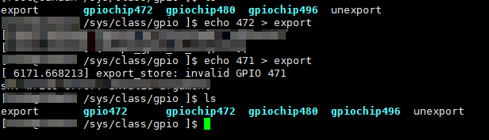

### gpio.txt GPIO接口
&emsp;&emsp;此目录中的文档详细说明了如何访问驱动程序中的 GPIO，以及如何编写 GPIO 的设备驱动程序。  
&emsp;&emsp;由于内核中 GPIO 接口的历史，有两种不同的方式来获取和使用 GPIO：
* 基于描述符的接口是操作 GPIO 的首选方式，并且由该目录中除 gpio-legacy.txt 之外的所有文件进行描述。
* gpio-legacy.txt 中记录了被认为已弃用（但出于兼容性原因仍可使用）的旧式基于整数的接口。 
#### 1 什么是GPIO
&emsp;&emsp;“通用输入/输出”(GPIO) 是一种灵活的软件控制数字信号。许多芯片都提供GPIO，这对于使用嵌入式和定制硬件的 Linux 开发人员来说是很熟悉的。每个 GPIO 代表一个连接到特定引脚或球栅阵列 (BGA) 封装上的“球”的位。电路板原理图显示了哪些外部硬件连接到哪些 GPIO。可以编写通用驱动程序，以便板子设置代码将此类引脚的配置数据传递给驱动程序。  
&emsp;&emsp;片上系统 (SOC) 处理器严重依赖 GPIO。在某些情况下，每个非专用引脚都可以配置为 GPIO；大多数芯片至少有几十个GPIO。可编程逻辑器件（如 FPGA）可以轻松提供 GPIO；电源管理器和音频编解码器等多功能芯片通常有一些这样的引脚，以帮助解决 SOC 上的引脚稀缺问题；还有使用 I2C 或 SPI 串行总线连接的“GPIO 扩展器”芯片。大多数 PC 南桥都有几十个支持 GPIO 的引脚（只有 BIOS 固件知道它们是如何使用的）。     
&emsp;&emsp;GPIO 的确切功能因系统而异。常用选项：
* 输出值是可写的（高=1，低=0）。一些芯片还可以选择如何驱动该值，例如，可能只驱动一个值，支持“线或”和其他值的类似方案（特别是“开漏”信号）。
* 输入值同样可读 (1, 0)。一些芯片支持配置为“输出”的引脚回读，这在这种“线或”情况下非常有用（以支持双向信号）。 GPIO 控制器可能具有输入去毛刺/去抖动逻辑，有时带有软件控制。
* 输入通常可以用作 IRQ 信号，通常是边沿触发，但有时是电平触发。此类 IRQ 可配置为系统唤醒事件，以将系统从低功率状态唤醒。
* 通常，GPIO 可配置为输入或输出，根据不同产品板的需要；单向的也存在。
* 大多数 GPIO 可以在持有自旋锁时访问，但那些通过串行总线访问的通常不能。一些系统支持这两种类型。  

&emsp;&emsp;在给定的板上，每个 GPIO 都用于一个特定的目的，例如监控 MMC/SD 卡的插入/移除、检测卡写保护状态、驱动 LED、配置收发器、位冲击串行总线、戳硬件看门狗、感测一个开关，等等。
#### 2 GPIO的常用属性
&emsp;&emsp;这些属性都在GPIO接口的其他文档中实现，理解他们很有用，尤其是当您需要定义GPIO映射时。  
##### 2.1 高电平有效和低电平有效
将GPIO输出“1”（高电平）作为有效，输出“0”（低电平）作为无效是很自然的事情。然而，实际上，GPIO的输出信号可能在输出之前被反转，也可能由设备通过反转来决定“有效”的定义。这样的决定应该对驱动透明，因此无论GPIO是高有效还是低有效，驱动程序都只需要考虑逻辑信号，而不是线路级的事情。
##### 2.2 开漏和Open source
&emsp;&emsp;有时共享信号需要使用“开漏”（实际上只驱动低信号电平），或“开源”（仅驱动高信号平）信号。该术语适用于 CMOS 晶体管； “集电极开路”用于 TTL。上拉或下拉电阻导高或低信号电平。这有时被称为“线与”；或者更实际地，从否定逻辑（低=真）的角度看，这是一个“线或”。  
&emsp;&emsp;开漏信号的一个常见示例是共享的低电平有效 IRQ 线。此外，双向数据总线信号有时使用开漏信号。  
&emsp;&emsp;一些GPIO控制器直接支持开漏和开源输出；许多控制器不支持。当您需要开漏信号但您的硬件不直接支持它时，您可以使用一个常见的用法来使用任何可用作输入或输出的 GPIO 引脚来模拟它：
```
 LOW：gpiod_direction_output(gpio, 0) ...这会驱动信号并覆盖上拉。
 HIGH：gpiod_direction_input(gpio) ...这会关闭输出，因此上拉（或其他设备）控制信号。
```
&emsp;&emsp;可以应用相同的逻辑来模拟开源信号，通过驱动高电平信号并将 GPIO 配置为低电平输入来实现。这种开漏/开源仿真可以由 GPIO 框架透明地处理。  
&emsp;&emsp;如果您将信号“驱动”为高电平，但 gpiod_get_value(gpio) 报告一个低值（在适当的上升时间过去之后），您就知道某个其他组件正在将共享信号驱动为低电平。这不一定是错误。举一个常见的例子，这就是 I2C 时钟的延长方式：需要较慢时钟的从设备延迟 SCK 的上升沿，而 I2C 主设备相应地调整其信号速率。
### consumer.txt GPIO描述符消费者接口
&emsp;&emsp;本文档描述了 GPIO 框架的消费者接口。 请注意，它描述了新的基于描述符的接口。 有关已弃用的基于整数的 GPIO 接口的说明，请参阅 gpio-legacy.txt。  
#### 1 GPIO消费者指南
&emsp;&emsp;没有标准 GPIO 调用就无法工作的驱动程序应该具有依赖于 GPIOLIB 的 Kconfig 条目。 通过包含以下文件，来允许驱动程序获取和使用 GPIO 的函数：   
&emsp;&emsp;`#include <linux/gpio/consumer.h>`  
&emsp;&emsp;所有与基于描述符的 GPIO 接口一起使用的函数都以 gpiod_ 为前缀。 gpio_ 前缀用于旧接口。 内核中的任何其他函数都不应使用这些前缀。 
#### 2 获取和处理GPIO
&emsp;&emsp;使用基于描述符的接口，GPIO由不透明、不可伪造的handler来标识，该handler必须通过调用gpiod_get()系列函数中的一个来获得。像许多其他内核子系统一样， gpiod_get() 获取将使用 GPIO 的设备以及请求的 GPIO 应该完成的功能：  
```c
struct gpio_desc *gpiod_get(struct device *dev, const char *con_id, 
        enum gpiod_flags flags) 
```
&emsp;&emsp;如果一个功能是通过一起使用多个 GPIO 来实现的（例如一个显示数字的简单 LED 设备），则可以指定一个额外的索引参数： 
```c
struct gpio_desc *gpiod_get_index(struct device *dev, const char *con_id,
        unsigned int idx, enum gpiod_flags flags)
```
&emsp;&emsp;flags 参数用于选择性地指定 GPIO 的方向和初始值。值可以是：
* GPIOD_ASIS 或 0 不初始化GPIO. 稍后必须使用专用函数之一设置方向 .
* GPIOD_IN 初始化GPIO为输入.
* GPIOD_OUT_LOW 初始化GPIO为输出，输出0.
* GPIOD_OUT_HIGH 初始化GPIO为输出，输出1.  
  
&emsp;&emsp;这两个函数都返回一个有效的 GPIO 描述符，或者一个可通过 IS_ERR() 检查的错误代码（它们永远不会返回 NULL 指针）。 `-ENOENT`当且仅当没有 GPIO 分配给设备/功能/索引三元组时才会返回，其他错误代码用于已分配 GPIO 但在尝试获取它时发生错误的情况。 这对于区分纯错误和可选 GPIO 参数缺少 GPIO 很有用。 对于 GPIO 可选的常见模式，可以使用 `gpiod_get_optional()` 和 `gpiod_get_index_optional()` 函数。 如果未将 GPIO 分配给请求的函数，这些函数将返回 NULL 而不是 -ENOENT：
```c
struct gpio_desc *gpiod_get_optional(struct device *dev, 
        const char *con_id, enum gpiod_flags flags)
struct gpio_desc *gpiod_get_index_optional(struct device *dev, 
        const char *con_id, unsigned int index, enum gpiod_flags flags)
```
&emsp;&emsp;对于使用多个 GPIO 的函数，所有这些都可以通过一次调用获得： 
```c
struct gpio_descs *gpiod_get_array(struct device *dev, const char *con_id,
					   enum gpiod_flags flags)
```
&emsp;&emsp;此函数返回一个结构 gpio_descs，此结构包含一个描述符数组： 
```c
struct gpio_descs { 
    unsigned int ndescs;
	struct gpio_desc *desc[]; 
    }
```
&emsp;&emsp;如果没有 GPIO 分配给请求的函数，以下函数返回 NULL 而不是 -ENOENT： 
```c
struct gpio_descs *gpiod_get_array_optional(struct device *dev, 
        const char *con_id, enum gpiod_flags flags)
```
&emsp;&emsp;还定义了这些功能的设备管理变体：
```c
struct gpio_desc *devm_gpiod_get(struct device *dev, 
        const char *con_id, enum gpiod_flags flags)
struct gpio_desc *devm_gpiod_get_index(struct device *dev, 
        const char*con_id, unsigned int idx, enum gpiod_flags flags)
struct gpio_desc *devm_gpiod_get_optional(struct device *dev, 
        const char *con_id, enum gpiod_flags flags)
struct gpio_desc *devm_gpiod_get_index_optional(struct device *dev, 
        const char *con_id, unsigned int index, enum gpiod_flags flags)
struct gpio_descs *devm_gpiod_get_array(struct device *dev, 
        const char *con_id, enum gpiod_flags flags)
struct gpio_descs *devm_gpiod_get_array_optional(struct device *dev,
        const char *con_id, enum gpiod_flags flags)
```
&emsp;&emsp;可以使用 gpiod_put() 函数处理 GPIO 描述符： 
```c
void gpiod_put(struct gpio_desc *desc)
```
&emsp;&emsp;对于 GPIO 数组，可以使用此函数：
```c
void gpiod_put_array(struct gpio_descs *descs)
```
&emsp;&emsp;严禁在调用这些函数后使用描述符。 也不允许从使用 gpiod_get_array() 获取的数组中单独释放描述符（使用 gpiod_put()）。 
&emsp;&emsp;不出所料，设备管理的变体是： 
```c
void devm_gpiod_put(struct device *dev, struct gpio_desc *desc)
void devm_gpiod_put_array(struct device *dev, struct gpio_descs *descs)
```

#### 3 使用GPIOs
##### 3.1 设置方向
&emsp;&emsp;驱动程序必须对 GPIO 做的第一件事是设置其方向。 如果没有给 gpiod_get*() 提供方向设置标志，可以通过调用 gpiod_direction_*() 函数之一来完成： 
```c
int gpiod_direction_input(struct gpio_desc *desc) 
int gpiod_direction_output(struct gpio_desc *desc, int value) 
```
&emsp;&emsp;成功时返回值为零，否则为负 errno。 应该检查返回值，因为 get/set 调用不会返回错误，因此可能配置错误。 您通常应该从任务上下文发起这些调用。 但是，作为早期电路板设置的一部分，对于自旋锁安全的 GPIO，在使能任务之前调用它们也是可以的。   
&emsp;&emsp;对于输出 GPIO，提供的值成为初始输出值。 这有助于避免系统启动期间的信号故障。   
&emsp;&emsp;驱动程序还可以查询 GPIO 的当前方向：
```c
int gpiod_get_direction(const struct gpio_desc *desc)
```
&emsp;&emsp;此函数将返回 `GPIOF_DIR_IN` 或` GPIOF_DIR_OUT`。  
&emsp;&emsp;请注意，GPIO 没有默认方向。 因此，**使用 GPIO 而不先设置其方向是非法的，将导致未定义的行为！** 
##### 3.2 自旋锁安全 GPIO 访问 
&emsp;&emsp;大多数 GPIO 控制器都可以通过内存读/写指令进行访问。 那些不需要休眠，并且可以从硬（非线程）IRQ 处理程序和类似上下文中安全地完成。  
&emsp;&emsp;使用以下调用从原子上下文访问 GPIO： 
```c
int gpiod_get_value(const struct gpio_desc *desc);
void gpiod_set_value(struct gpio_desc *desc, int value);
```
&emsp;&emsp;值是布尔值，零表示低，非零表示高。 读取输出引脚的值时，返回的值应该是在引脚上看到的值。 由于开漏信号和输出延迟等问题，这并不总是与指定的输出值匹配。  
&emsp;&emsp;get/set 调用不会返回错误，因为应该更早从 gpiod_direction_*() 报告“无效的 GPIO”。 但是，请注意并非所有平台都可以读取输出引脚的值； 那些不能的应该总是返回零。 此外，将这些调用用于在不休眠的情况下无法安全访问的 GPIO（见下文）是一个错误。 
##### 3.3 GPIO访问时可能休眠
&emsp;&emsp;某些 GPIO 控制器必须使用基于消息的总线（如 I2C 或 SPI）进行访问。 读取或写入这些 GPIO 值的命令需要等待到达队列的头部以传输命令并获得其响应。 这需要休眠，而不能从 IRQ 处理程序内部完成。  
&emsp;&emsp;支持这种类型的 GPIO 的平台通过从这个调用中返回非零值来将它们与其他 GPIO 区分开来：
```c
int gpiod_cansleep(const struct gpio_desc *desc)
```
&emsp;&emsp;为了访问此类 GPIO，定义了一组不同的访问器： 
```c
int gpiod_get_value_cansleep(const struct gpio_desc *desc)
void gpiod_set_value_cansleep(struct gpio_desc *desc, int value)
```
&emsp;&emsp;访问这些GPIOs需要一个可休眠的上下文，例如IRQ线程handler，必须使用这些accessors，而不能使用没有cansleep()名称后缀的自旋锁安全访问器。  
&emsp;&emsp;除了这些访问器可能会休眠，并且这些访问器可以在<u>无法通过hardIRQ处理程序访问的GPIO</u>上工作以外 ，这些调用与spinlcok-lock调用的行为是一样的。  
##### 3.4 低电平有效状态和原始GPIO值
&emsp;&emsp;设备驱动程序通常要管理GPIO的逻辑状态，即设备实际接收的值，而不管驱动和GPIO线之间又怎样的逻辑转换。在某些情况下，控制实际的GPIO线值是有意义的。一下一系列调用忽略GPIO的低电平有效属性并白处理原始线值：
```c
int gpiod_get_raw_value(const struct gpio_desc *desc)
void gpiod_set_raw_value(struct gpio_desc *desc, int value)
int gpiod_get_raw_value_cansleep(const struct gpio_desc *desc)
void gpiod_set_raw_value_cansleep(struct gpio_desc *desc, int value)  
int gpiod_direction_output_raw(struct gpio_desc *desc, int value)
```
&emsp;&emsp;也可以使用以下调用查询 GPIO 的低电平有效状态：
```c
int gpiod_is_active_low(const struct gpio_desc *desc)
```
&emsp;&emsp;请注意，这些功能只能适度使用； 驱动程序不必关心物理线路电平。
##### 3.5 使用单个函数调用设置多个GPIO输出
&emsp;&emsp;以下函数设置 GPIO 数组的输出值：
```c
    void gpiod_set_array(unsigned int array_size, 
                        struct gpio_desc **desc_array,
                        int *value_array) 
    void gpiod_set_raw_array(unsigned int array_size, 
                        struct gpio_desc **desc_array,
                        int *value_array) 
    void gpiod_set_array_cansleep(unsigned int array_size, 
                        struct gpio_desc **desc_array,
                        int *value_array) 
    void gpiod_set_raw_array_cansleep(unsigned int array_size, 
                        struct gpio_desc **desc_array,
                        int *value_array)
```
&emsp;&emsp;上面的array可以是任意一组 GPIO。 如果相应的芯片驱动程序支持，这些函数将尝试同时设置属于同一 bank 或芯片的 GPIO。 在这种情况下，可以预期性能会显着提高。 如果无法同时设置，GPIO 将按顺序设置。 
&emsp;&emsp;gpiod_set_array() 函数接受三个参数：
* array_size	- 数组元素的数量 
* desc_array	- 一组 GPIO 描述符 
* value_array	- 要分配给 GPIO 的一组值

&emsp;&emsp;可以使用 gpiod_get_array() 函数或其变体之一获取描述符数组。 如果该函数返回的描述符组与所需的 GPIO 组匹配，则只需使用 gpiod_get_array() 返回的 struct gpio_descs 即可设置这些 GPIO： 
```c
struct gpio_descs *my_gpio_descs = gpiod_get_array(...); 
gpiod_set_array(my_gpio_descs->ndescs, my_gpio_descs->desc, my_gpio_values);
```
&emsp;&emsp;也可以设置完全任意的描述符数组。 可以使用 gpiod_get() 和 gpiod_get_array() 的任意组合来获得描述符。 之后，必须手动设置描述符数组，然后才能将其与 gpiod_set_array() 一起使用。 
&emsp;&emsp;请注意，为了获得最佳性能，属于同一芯片的 GPIO 应在描述符数组中连续。 
##### 3.5 GPIO 映射到 IRQ
&emsp;&emsp;GPIO 线可以经常用作 IRQ。 您可以使用以下调用获取与给定 GPIO 对应的 IRQ 编号： 
```c
int gpiod_to_irq(const struct gpio_desc *desc) 
```
&emsp;&emsp;如果无法完成映射，它将返回一个 IRQ 编号或一个负的 errno 代码（很可能是因为该特定 GPIO 不能用作 IRQ）。 使用未通过 gpiod_direction_input() 设置为输入的 GPIO 或使用不是来自 gpiod_to_irq() 的 IRQ 编号是未经检查的错误。 gpiod_to_irq() 不允许休眠。 
&emsp;&emsp;从 gpiod_to_irq() 返回的非错误值可以传递给 request_irq() 或 free_irq()。 它们通常通过特定于板子的初始化代码存储到平台设备的 IRQ 资源中。 请注意，**IRQ 触发选项是 IRQ 接口的一部分，例如 IRQF_TRIGGER_FALLING，以及系统唤醒功能**。
#### 4 GPIOa and ACPI
&emsp;&emsp;在 ACPI 系统上，GPIO 由设备的 _CRS 配置对象列出的 GpioIo()/GpioInt() 资源描述。 这些资源不为 GPIO 提供连接 ID（名称），因此有必要为此使用额外的机制。
符合 ACPI 5.1 或更新版本的系统可能会提供一个 _DSD 配置对象，除其他外，该对象可用于为 _CRS 中的 GpioIo()/GpioInt() 资源描述的特定 GPIO 提供连接 ID。 如果是这种情况，它将由 GPIO 子系统自动处理。 但是，如果 _DSD 不存在，则 GpioIo()/GpioInt() 资源和 GPIO 连接 ID 之间的映射需要由设备驱动程序提供。
&emsp;&emsp;详情请参考文档/acpi/gpio-properties.txt 
#### 5 与传统的GPIO子系统交互
&emsp;&emsp;许多内核 子系统仍然使用传统的基于整数的接口处理 GPIO。 尽管强烈建议将它们升级为更安全的基于描述符的 API，但以下两个函数允许您将 GPIO 描述符转换为 GPIO 整数命名空间，反之亦然：
```c
int desc_to_gpio(const struct gpio_desc *desc)
struct gpio_desc *gpio_to_desc(unsigned gpio)
```
&emsp;&emsp;只要 GPIO 描述符尚未释放，desc_to_gpio() 返回的 GPIO 编号就可以安全使用。 同样，必须正确获取传递给 gpio_to_desc() 的 GPIO 编号，并且只有在释放 GPIO 编号后才能使用返回的 GPIO 描述符。
&emsp;&emsp;禁止使用一个 API 释放另一个 API 获得的 GPIO，这是一个未经检查的错误。
### driver.txt 
#### 1 GPIO描述符驱动接口
本文档可作为 GPIO 芯片驱动程序编写者的指南。 请注意，它描述了新的基于描述符的接口。 有关已弃用的基于整数的 GPIO 接口的说明，请参阅 gpio-legacy.txt。
每个 GPIO 控制器驱动程序都需要包含以下头文件，它定义了用于定义 GPIO 驱动程序的结构： 
```c
#include <linux/gpio/driver.h>
```
#### 2 GPIOs的内部表示形式
&emsp;&emsp;在 GPIO 驱动程序中，各个 GPIO 由其硬件编号标识，该编号是 0 和 n 之间的唯一编号，n 是芯片管理的 GPIO 数量。这个数字纯粹是内部的：特定 GPIO 描述符的硬件编号永远不会在驱动程序之外可见。
&emsp;&emsp;除了这个内部编号之外，每个 GPIO 还需要在整数 GPIO 命名空间中有一个全局编号，以便它可以与传统 GPIO 接口一起使用。因此，每个芯片必须有一个“基数”编号（可以自动分配），并且对于每个 GPIO，全局编号将是（基数 + 硬件编号）。虽然整数表示被认为已过时，但它仍然有很多用户，因此需要维护。
&emsp;&emsp;例如，一个platform可以将数字 32-159 用于 GPIO，控制器定义 128 个 GPIO，“基数”为 32 。而另一个platform使用数字 0..63 标识一组 GPIO 控制器控制的GPIO，64-79 来标识另一种类型的 GPIO 控制器所控制的GPIO，以及用80-95 来标识一个特定于FPGA板子控制的GPIO。数字不必是连续的；这些平台也可以使用数字 2000-2063 来识别一组 I2C GPIO 扩展器中的 GPIO。 
#### 3 控制器驱动：gpio_chip
&emsp;&emsp;在gpiolib框架中，每个GPIO控制器都被抽象为`struct gpio_chip`（参见 linux/gpio/driver.h 了解其完整定义），它的每个成员是每个控制器都有的：
* 设置GPIO方向的方法
* 访问GPIO值的方法
* 返回与指定的GPIO关联的IRQ编号的方法
* 表示对其方法的调用是否可以休眠的标志
* 可选的debufgs转储方法（显示像pullup配置这样的扩展状态）
* 可选的base编号（如果省略将自动分配）
* 使用platform数据进行诊断和GPIOs映射的label

&emsp;&emsp;实现 gpio_chip 的代码应该支持控制器的多个实例，可能使用驱动程序模型。 该代码将配置每个 gpio_chip 并发出 gpiochip_add()。 移除 GPIO 控制器应该很少见； 在不可避免时使用 gpiochip_remove() 来进行移除。  
&emsp;&emsp;大多数情况下，gpio_chip 是特定于实例的结构的一部分，其状态未由 GPIO 接口公开，例如寻址、电源管理等。 编解码器等芯片将具有复杂的非 GPIO 状态。
&emsp;&emsp;任何 debugfs 转储方法通常都应该忽略未被请求为 GPIO 的信号。 他们可以使用 gpiochip_is_requested()，它在请求时返回 NULL 或与该 GPIO 关联的标签。 
##### 3.1 提供IRQ的GPIO驱动程序
&emsp;&emsp;习惯上 GPIO 驱动程序（GPIO 芯片）也提供中断，最常见的是从父中断控制器级联，并且在某些特殊情况下，GPIO 逻辑与 SoC 的主中断控制器融合在一起。
&emsp;&emsp;GPIO 块的 IRQ 部分是使用 irqchip 实现的，使用头文件 <linux/irq.h>。 所以基本上这样的驱动程序同时使用两个子系统：gpio 和 irq。 
&emsp;&emsp;GPIO irqchips通常属于以下两类之一：
* CHAINED GPIO irqchips：这些通常是嵌入在 SoC 上的类型。 这意味着有一个用于 GPIO 的快速 IRQ 处理程序，此IRQ快速处理程序从父 IRQ 处理程序链中调用（最典型的是系统中断控制器）。 这意味着 GPIO irqchip 是使用 irq_set_chained_handler() 或相应的 gpiochip_set_chained_irqchip() 辅助函数注册的，并且 GPIO irqchip 处理程序将立即从父 irqchip 调用，同时禁用 IRQ。 GPIO irqchip 最终将在其中断处理程序中调用如下序列：
```c
    static irqreturn_t tc3589x_gpio_irq(int irq, void *data) 
    chained_irq_enter(...);
    generic_handle_irq(...);
    chained_irq_exit(...);
```
&emsp;&emsp;链式的 GPIO irqchips 通常不能在 struct gpio_chip 上设置 .can_sleep 标志，因为一切都直接在回调中发生。 
* NESTED THREADED GPIO irqchips（线程嵌套GPIO riqchips）：这些是片外 GPIO 扩展器和驻留在睡眠总线另一侧的任何其他 GPIO irqchip。 当然，这样的驱动程序需要缓慢的总线流量来读取 IRQ 状态和类似的流量，而这些流量又可能导致其他 IRQ 发生，在禁用 IRQ 的快速 IRQ 处理程序中无法处理。 相反，他们需要生成一个线程，然后屏蔽父 IRQ 线，直到驱动程序处理中断。 这个驱动程序的特点是在它的中断处理程序中调用这样的东西： 
```c
static irqreturn_t tc3589x_gpio_irq(int irq, void *data) ...
handle_nested_irq(irq);
```
&emsp;&emsp;线程 GPIO irqchips 的标志是它们将 struct gpio_chip 上的 .can_sleep 标志设置为 true，表明该芯片在访问 GPIO 时可能会休眠。  

&emsp;&emsp;为了帮助处理 GPIO irqchips 和相关的 irqdomain 和资源分配回调的设置和管理，gpiolib 有一些可以通过选择 GPIOLIB_IRQCHIP Kconfig 符号启用的帮助程序： 
* gpiochip_irqchip_add()：将 irqchip 添加到 gpiochip。 它会将芯片的 struct gpio_chip* 传递给所有 IRQ 回调，因此回调需要将 gpio_chip 嵌入其状态容器并使用 container_of() 获取指向该容器的指针。(See Documentation/driver-model/design-patterns.txt)
* gpiochip_set_chained_irqchip()：从父 IRQ 为 gpio_chip 设置链式的 irq 处理程序，并将 struct gpio_chip* 作为handler data传递。 （注意handler data，因为 irqchip 数据很可能被父 irqchip 使用！）这是针对链式芯片的。 如果 NULL 作为handler传递，这也用于设置嵌套的 irqchip。 
  
&emsp;&emsp;要使用helpers，请注意下面事项：
* 确保分配 struct gpio_chip 的所有相关成员，以便 irqchip 可以初始化。 例如。 .dev 和 .can_sleep 应正确设置。 

&emsp;&emsp;任何IRQ消费者从任何irqchip请求IRQ都是合法的，无论它是否是GPIO+IRQ的组合驱动程序。基本前提是gpio_chip和irq_chip是正交的，并且提供彼此独立的服务。

未完待续

### board.txt

### sysfs.txt 用户空间的GPIO sysfs接口
&emsp;&emsp;使用“gpiolib”实现框架的平台可以选择将GPIO配置为sysfs user interface。这和debugfs接口不同，因为它提供了对GPIO方向和值的控制，而不仅仅是显示GPIO状态。此外，它可以在没有调试支持的环境下出现在生产系统上。
&emsp;&emsp;给出系统适配的硬件文档，在用户空间就可以知道例如GPIO_23用于控制flash memory中引导程序的写保护线等信息。系统升级程序可能需要暂时取消该保护，首先导入 GPIO，然后更改其输出状态，然后在重新启用写保护之前更新代码。在正常使用中，GPIO #23 永远不会被触及，内核也不需要知道它。
&emsp;&emsp;同样取决于适当的硬件文档，在某些系统上，用户空间 GPIO 可用来确定标准内核不知道的系统配置数据。对于某些任务，简单的用户空间 GPIO 驱动程序可能就是系统真正需要的。
&emsp;&emsp;请注意，标准内核驱动程序存在用于常见的“LED 和按钮”GPIO 任务：分别为“leds-gpio”和“gpio_keys”。使用它们而不是直接与 GPIO 对话；它们与内核框架的集成比您的用户空间代码更好。 
#### 1 sysfs路径
sys/class/gpio 有三种入口：
* 用于获得用户空间对 GPIO 的控制的控制接口； 
* GPIO 本身；
* GPIO 控制器（“gpio_chip”实例）。 
  
这是标准文件的补充，包括“设备”符号链接。
控制接口是只写的： /sys/class/gpio/
* “export”：用户空间可以通过将其编号写入该文件来要求内核将GPIO的控制导出到用户空间。
  示例：如果内核代码没有请求gpio19，那么`echo 19 > export`将为gpio_19创建一个“gpio 19”节点。
* “unexport”：撤销export到用户空间的效果
  示例：“echo 19 > unexport”将删除使用"export"文件导出的“gpio 19”节点。

GPIO信号有这样的路径：`sys/class/gpio/gpio42/`（对于GPIO 42来说），在该路径下有这样的读写特性：
&emsp;&emsp;/sys/class/gpio/gpioN/
* “direction”：读的值为“in”或者“out”。此值通常可以被写入。为确保无故障运行，可以写入值“低”和“高”以将 GPIO 配置为具有该初始值的输出。
  请注意，如果内核不支持更改 GPIO 的方向，或者它是由未明确允许用户空间重新配置此 GPIO 方向的内核代码导出的，则此属性**将不存在**。
* “value”：读的值为“0（low）”或“1（high）”。如果GPIO被配置为输出，此值可以被写入，非零值被作为高电平对待。
  &emsp;&emsp;如果引脚可以被配置为中断触发并且已经被配置为中断触发（参见“edge”的描述），你可以使用poll(2)来查询该文件，只要中断被触发poll(2)就会返回。如果使用poll(2)，需要设置events POLLPRI 和 POLLERR。如果使用select(2)，set the file descriptor in exceptfds。在poll(2)返回之后，要么lseek(2)到sysfs文件的开头并读取新值，要么关闭该文件并重新打开它以读取该值。
* “edge”：读的值为“none”，“rising”，“falling”或“both”。Write these strings to select the signal edge(s) that will make poll(2) on the "value" file return.
  此文件只有在引脚可以被配置为输入中断触发引脚时才存在。
  “active_low”：读的值为0（false）或1（true）。写入任何非零值来反转读取和写入的 value 属性。现有和后续的<u> poll(2) 支持通过“rising”和“falling”边缘的边缘属性进行的配置</u>将遵循此设置。 

&emsp;&emsp;GPIO控制器有像下面这样的路径`sys/class/gpio/gpiochip42`（实现了从42开始的GPIO的控制器）且具有以下只读属性：
&emsp;&emsp;/sys/class/gpio/gpiochipN/
* “base”：与N相同，此chip控制的第一个GPIO
* “label”：用于诊断（并不总是唯一的） 
* “ngpio”：控制了多少个gpio（N to N + ngpio - 1）

&emsp;&emsp;在大多数情况下，板子的文档应该涵盖不同的GPIO用于什么目的。然而，这些编号并不总是稳定的。子卡上的GPIO可能会有所不同，具体取决于所使用的base board或者cards in the stack。在这种情况下，您可能需要使用 gpiochip 节点（可能与原理图结合使用）来确定用于给定信号的正确 GPIO 编号。 

#### 2 从内核代码中导出
&emsp;&emsp;内核代码可以显式管理已使用 gpio_request() 请求的 GPIO 的导出：
```c
/* export the GPIO to userspace */
int gpiod_export(struct gpio_desc *desc, bool direction_may_change);
/* reverse gpio_export() */
void gpiod_unexport(struct gpio_desc *desc);
/* create a sysfs link to an exported GPIO node */
int gpiod_export_link(struct device *dev, const char *name, struct gpio_desc*desc);
/* change the polarity of a GPIO node in sysfs */
int gpiod_sysfs_set_active_low(struct gpio_desc *desc, int value);
```
&emsp;&emsp;在内核驱动程序请求 GPIO 后，它可能只能通过 gpiod_export() 在 sysfs 接口中可用。驱动可以控制信号方向是否可以改变。这有帮助驱动程序避免用户空间代码意外破坏重要的系统状态。  
&emsp;&emsp;这种显式导出可以帮助调试（使某些类型的实验更容易），或者可以提供一个始终存在的接口，适合作为电路板支持包的一部分进行记录。  
&emsp;&emsp;GPIO 导出后， gpiod_export_link() 允许从 sysfs 中的其他地方创建符号链接到 GPIO sysfs 节点。驱动程序可以使用它在 sysfs 中为自己设备下的接口提供一个描述性名称。  
&emsp;&emsp;驱动程序可以使用 gpiod_sysfs_set_active_low() 向用户空间隐藏板之间的 GPIO 线极性差异。可以在 gpiod_export() 之前和之后进行极性更改，并且之前启用的对上升沿或下降沿的 poll(2) 支持将重新配置为遵循此设置。   

---------------------
reg_dat    dat：gpio输入数据寄存器的地址
reg_set    set：gpio输出数据寄存器中的地址
reg_dir    dirout：gpio的方向寄存器的地址

---------------------

### gpio-mmio.c 文件分析
memory-mapped GPIO 控制器通用驱动程序
* `bgpio_readn`和`bgpio_writen`：就是调用了对应的`readl`和`writel`等函数进行寄存器读写。
* `bgpio_line2mask(struct gpio_chip *gc, unsigned int line)`：把参数line转换成BIT(line)，根据gpio_chip的be_bits位判断是否进行大小端转换。
* `bgpio_get_set(struct gpio_chip *gc, unsigned int gpio)`：如果方向是输出，获取输出寄存器的值；如果方向是输入，获取输入寄存器的值。是gpio_chip的get的回调函数。
* `bgpio_get_set_multiple(struct gpio_chip *gc, unsigned long *mask, unsigned long *bits)`：我猜是得到多个gpio的数据，根据gpio_chip的bgpio_dir来决定返回多个gpio的输出数据的值还是输入数据的值
* `bgpio_get(struct gpio_chip *gc, unsigned int gpio)`：得到第gpio个的gpio输入的值。
* `bgpio_get_multiple(struct gpio_chip *gc, unsigned long *mask, unsigned long *bits)`：我猜是得到多个gpio的输入值。
* `bgpio_set(struct gpio_chip *gc, unsigned int gpio, int val)`：设置第gpio个gpio的输入值为val。
* `bgpio_set_with_clear(struct gpio_chip *gc, unsigned int gpio, int val)`：根据value的值设置或清除第gpio个gpio的输出值，同时清除其他gpio的输出值
* `bgpio_set_set(struct gpio_chip *gc, unsigned int gpio, int val)`：根据value的值设置或清除第gpio个gpio的输出值，gpio_chip的set的回调函数。
---
* `bgpio_multiple_get_masks(struct gpio_chip *gc, unsigned long *mask, unsigned long *bits, unsigned long *set_mask, unsigned long *clear_mask)`：不知道是干嘛
* 这后面几个都没看懂要干嘛
---
* `bgpio_simple_dir_out(struct gpio_chip *gc, unsigned int gpio, int val)`：将第gpio个gpio的方向按val设置。
* `bgpio_dir_in(struct gpio_chip *gc, unsigned int gpio)`：将第gpio个gpio的方向设置为输入。
* `bgpio_get_dir(struct gpio_chip *gc, unsigned int gpio)`：得到第gpio个gpio的方向：返回0表示输出，返回1表示输入。
* `bgpio_dir_out(struct gpio_chip *gc, unsigned int gpio, int val)`：将第gpio个gpio的方向设置为输出。
* `bgpio_dir_in_inv(struct gpio_chip *gc, unsigned int gpio)`：将第gpio个gpio的输入方向反转为输出。
* `bgpio_dir_out_inv(struct gpio_chip *gc, unsigned int gpio, int val)`：将第gpio个gpio的输出方向反转为输入。
* `bgpio_get_dir_inv(struct gpio_chip *gc, unsigned int gpio)`：得到第gpio个gpio的方向的反转：返回1表示输出，返回0表示输入（内核代码注释不对）。
---
* `bgpio_setup_accessors(struct device *dev, struct gpio_chip *gc, bool byte_be)`：设置gpio_chip的write_reg和read_reg回调函数。
* `bgpio_setup_io`：
```c
static int bgpio_setup_io(struct gpio_chip *gc,
			  void __iomem *dat,
			  void __iomem *set,
			  void __iomem *clr,
			  unsigned long flags)
```
&emsp;&emsp;此函数设置输入寄存器的地址，输出寄存器的地址，输出清除寄存器的地址。因为不同的芯片其存器是不同的，例如有的芯片在同一个输出寄存器写入0表示输出低电平，写入1表示输出高电平有的芯片在输出寄存器写入1表示输出高电平，在clear寄存器写入1表示输出低电平等。此函数根输入参数set，clr的有无等来判断，对gpio_chip的回调函数进行设置。
&emsp;&emsp;除了设置这几个寄存器地址以外，还设置了set（设置输出数据寄存器的值，即`bgpio_set_set`）和get（如果方向为输入，获取输入数据寄存器的值，如果方向为输出，获取输出寄存器的值，即`bgpio_get_set`）的回调函数

* `bgpio_setup_direction`：和上面的处理逻辑一样，设置gpio_chip的方向回调函数。
* `bgpio_request`：如果申请的gpio编号大于chip管理的gpio的数量，返回错误，否则返回0。
* `bgpio_init`：此文件的最终目的。
```c
int bgpio_init(struct gpio_chip *gc, struct device *dev,
	       unsigned long sz, void __iomem *dat, void __iomem *set,
	       void __iomem *clr, void __iomem *dirout, void __iomem *dirin,
	       unsigned long flags)
```
&emsp;&emsp;参数sz代表size，需要是2的幂，如果是4，表示gpio寄存器的位数是4*8=32。  
&emsp;&emsp;然后就是调用上面的几个函数设置gpio_chip的回调函数，并获取一些初始值到影子寄存器中（在这里表示软件上的寄存器）。

### gpiolib.c 文件分析
* `desc_set_label(struct gpio_desc *d, const char *label)`：设置gpio_desc描述符的label。
* `struct gpio_desc *gpio_to_desc(unsigned gpio)`：返回参数gpio编号所属的gpio_desc描述符。
  此函数中的关键部分：
```c
list_for_each_entry(gdev, &gpio_devices, list) {
	if (gdev->base <= gpio &&
	    gdev->base + gdev->ngpio > gpio) {
		spin_unlock_irqrestore(&gpio_lock, flags);
		return &gdev->descs[gpio - gdev->base];
	}
}
```
&emsp;&emsp;判断gpio编号是否在gpio_device控制的范围之内：  
  `(gpio_device->base ~ gpio_device->base + ngpio`,如果不在此范围之内，会输出`invalid GPIO number`。  
&emsp;&emsp;示例，在`/sys/class/gpio`下有文件`gpiochip472`，此gpiochip的ngpio是8，如下图所示：  
  
&emsp;&emsp;如果输入`echo 472 > export`会导出gpio472，如果输入`echo 471 > export`，会输出无效信息，如下图所示：   
  
&emsp;&emsp;**所以，一个gpio_desc描述的是一个gpio，一个gpio_device是控制了多个gpio的chip吗**
* `gpiochip_get_desc(struct gpio_chip *chip, u16 hwnum)`：根据输入的hwnum，得到该chip中第hwnum个gpio的gpio_desc。如果hwnum > ngpio，输入参数无效信息。
* `desc_to_gpio(const struct gpio_desc *desc)`：根据输入的gpio_desc返回对应的gpio在gpio_chip中的编号，即gpio是gpio_chip中的第几个gpio。
```c
//注意此处的实现方式，地址相减，得到的是number，这个写到另一个地方。
return desc->gdev->base + (desc - &desc->gdev->descs[0]);
```
* `gpiod_to_chip(const struct gpio_desc *desc)`：根据输入的gpio_desc返回该描述符属于的chip的地址。
* `gpiochip_find_base(int ngpio)`：寻找可以申请（即还没有占用的）gpio_base的值。和通常想的不一样，base的值是从最大的base开始往下找的。  
  例如，如果我要申请三个gpio_chip的base，ngpio分别是16, 16, 8。系统中宏定义`ARCH_NR_GPIOS`是512，那么申请后的gpiochip的值是：gpiochip496,gpiochip480,gpiochip472。
```c
//
static int gpiochip_find_base(int ngpio)
{
	struct gpio_device *gdev;
    /* 在我的系统中ARCH_NR_GPIOS是512 */
	int base = ARCH_NR_GPIOS - ngpio;

    /* 整个系统第一次申请时，此链表是空的，不会进下面的循环 */
	list_for_each_entry_reverse(gdev, &gpio_devices, list) {
		/* found a free space? */
        /* 这里的gdev是之前的gdev的值 */
		if (gdev->base + gdev->ngpio <= base)
			break;
		else
			/* nope, check the space right before the chip */
			base = gdev->base - ngpio;
	}

	if (gpio_is_valid(base)) {
		pr_debug("%s: found new base at %d\n", __func__, base);
		return base;
	} else {
		pr_err("%s: cannot find free range\n", __func__);
		return -ENOSPC;
	}
}
```
* `piod_get_direction(struct gpio_desc *desc)`：根据输入的desc获取该desc的方向，主要是根据desc地址算出偏移个数，即第几个gpio，再调用了`gpio_chip->get_direction`回调函数。同时设置相应的描述符的flags标志位。
* `gpiodev_add_to_list(struct gpio_device *gdev)`：就是注释中的向gpio_device链表中添加新的chip。
* `gpio_desc *gpio_name_to_desc(const char * const name)`：根据名字查找对应的desc，方法就是在gpio_device链表中循环查找每个gpio_chip的每个gpio_desc。
* `gpiochip_set_desc_names(struct gpio_chip *gc)`：从gpio_chip的成员names[]中获取名字赋给gpio_device->descs[].name。如果发现有重复的名字，则会输出警告，但是仍然会把名字赋给该desc。
---
* 有几个掩码函数没看，感觉是类似有效位的东西
---
* `linehandle_ioctl`：这个函数我也没看，但是看起来像是ioctl的实现。通过调用`gpiod_get_array_value_complex`和`gpiod_set_array_value_complex`来设置具体的值。
* 后面的几个函数应该类似
---


## interrupt
### IRQ-domain.txt irq_domain 中断号映射库 
&emsp;&emsp;当前 Linux 内核的设计使用一个大的数字空间来为每个单独的 IRQ 源分配一个不同的数字。当只有一个中断控制器时，这很简单，但是在具有多个中断控制器的系统中，内核必须确保每个控制器都被分配到不重叠的 Linux IRQ 编号分配。  
&emsp;&emsp;将中断控制器注册为单独的irqchips的数量呈上升趋势：例如，不同类型的子驱动程序（如 GPIO 控制器）通过将其中断处理程序建模为 irqchip，即实际上级联中断控制器，从而避免重新实现与 IRQ 核心系统相同的回调机制。  
&emsp;&emsp;在这里，中断号与硬件中断号失去了所有对应关系：而在过去，可以选择 IRQ 号，以便它们将硬件 IRQ 线匹配到根中断控制器（即组件实际将中断线触发到 CPU）。现在，这个数字只是一个数字。  
&emsp;&emsp;出于这个原因，我们需要一种机制来将控制器本地中断号（称为硬件 irq's）与 Linux IRQ 号分开。   
&emsp;&emsp;`irq_alloc_desc*()` 和 `irq_free_desc*()` API 提供 irq 编号的分配，但它们不支持将控制器本地 IRQ (hwirq) 编号反向映射到 Linux IRQ 编号空间。   
&emsp;&emsp;irq_domain 库在 irq_alloc_desc*() API 之上添加了 hwirq 和 IRQ 编号之间的映射。 用于管理映射的 irq_domain 优于中断控制器驱动开放编码自己的反向映射方案。   
&emsp;&emsp;irq_domain 还实现了从抽象 irq_fwspec 结构到 hwirq 编号（到目前为止的设备树和 ACPI GSI）的转换，并且可以轻松扩展以支持其他 IRQ 拓扑数据源。   
#### 1 irq_domain 用法
&emsp;&emsp;一个中断控制器驱动程序通过调用 irq_domain_add_*() 函数之一来创建和注册 irq_domain（每种映射方法都有不同的分配器函数，稍后会详细介绍）。 该函数将在成功时返回一个指向 irq_domain 的指针。 调用者必须为分配器函数提供一个 irq_domain_ops 结构。   
&emsp;&emsp;在大多数情况下，irq_domain 最开始的时候是空的，hwirq 和 IRQ 编号之间没有任何映射。 通过调用irq_create_mapping() 将映射添加到 irq_domain（此函数以 irq_domain 和 hwirq 编号作为参数） 。 如果 hwirq 的映射尚不存在，那么它将分配一个新的 Linux irq_desc，将其与 hwirq 关联，并调用 .map() 回调，以便驱动程序可以执行任何所需的硬件设置。   
&emsp;&emsp;当接收到中断时，应使用 irq_find_mapping() 函数用 hwirq 编号来查找 Linux IRQ 编号。  
&emsp;&emsp;在调用irq_find_mapping（）之前，必须至少调用一次irq_create_mapping（）函数，以免无法分配描述符。
&emsp;&emsp;如果驱动程序有Linux IRQ 编号或irq_data 指针，并且需要知道关联的hwirq 编号（例如在irq_chip 回调中），则可以直接从irq_data->hwirq 中获取。  
#### 2 irq_domain映射类型
&emsp;&emsp;有多种机制可用于从 hwirq 到 Linux irq 的反向映射，每种机制使用不同的分配函数。 应该使用哪种反向映射类型取决于用例。 下面描述了每种反向映射类型： 
##### 2.1 Linear线性
```c
irq_domain_add_linear()
irq_domain_create_linear()
```
&emsp;&emsp;linear反向映射维护一个由 hwirq 编号索引的固定大小的表。 当映射一个 hwirq 时，会为 hwirq 分配一个 irq_desc，并将 IRQ 编号存储在表中。  
&emsp;&emsp;当 hwirqs 的最大数量固定且数量相对较小 (~ < 256) 时，线性贴图是一个不错的选择。 此映射的优点是查找 IRQ 编号的时间是固定的，并且 irq_descs 仅分配给使用中的 IRQ。 缺点是该表必须与最大可能的 hwirq 数一样大。  
&emsp;&emsp;`irq_domain_add_linear()` 和 `irq_domain_create_linear()` 在功能上是等效的，除了第一个参数不同——前者接受Open Firmware特定的`struct device_node`，而后者接受更通用的抽象`struct fwnode_handle`。  
&emsp;&emsp;大多数驱动应该使用linear映射。  
##### 2.2 Tree树
```c
irq_domain_add_tree()
irq_domain_create_tree()
```
&emsp;&emsp;irq_domain 维护一个从 hwirq 数字到 Linux IRQ 的radix tree映射。 当映射 hwirq 时，会分配一个 irq_desc 并将 hwirq 用作基数树的查找键。  
&emsp;&emsp;如果 hwirq 数可能非常大，树图是一个不错的选择，因为它不需要分配与最大 hwirq 数一样大的表。 缺点是 hwirq 到 IRQ 编号查找取决于表中有多少条目。  
&emsp;&emsp;`irq_domain_add_tree()` 和 `irq_domain_create_tree()` 在功能上是等效的，除了第一个参数不同——前者接受Open Firmware特定的`struct device_node`，而后者接受更通用的抽象`struct fwnode_handle`。  
&emsp;&emsp;很少有驱动程序需要此映射。  
##### 2.3 No Map
```c
irq_domain_add_nomap()
```
&emsp;&emsp;当 hwirq 编号在硬件中可编程时，将使用 No Map 映射。 在这种情况下，最好将 Linux IRQ 编号编程到硬件本身中，这样就不需要映射了。 调用 irq_create_direct_mapping() 将分配一个 Linux IRQ 编号并调用 .map() 回调，以便驱动程序可以将 Linux IRQ 编号编程到硬件中。   
&emsp;&emsp;大多数驱动程序不能使用此映射。  
##### 2.4 Legacy
```c
irq_domain_add_simple()
irq_domain_add_legacy()
irq_domain_add_legacy_isa()
```
&emsp;&emsp;对于已经为 hwirqs 分配了一系列 irq_descs 的驱动程序，传统映射是一种特殊情况。 当驱动程序不能立即转换为使用线性映射时使用。 例如，许多嵌入式系统板子支持文件对传递给结构设备注册的 IRQ 编号使用一组 #defines。 在这种情况下，无法动态分配 Linux IRQ 编号，应使用旧映射。  
&emsp;&emsp;传统映射假定已经为控制器分配了连续范围的 IRQ 编号，并且可以通过向 hwirq 编号添加固定偏移量来计算 IRQ 编号，反之亦然。 缺点是它需要中断控制器来管理 IRQ 分配，并且需要为每个 hwirq 分配一个 irq_desc，即使它没有被使用。   
&emsp;&emsp;仅当必须支持固定 IRQ 映射时才应使用旧映射。 例如，ISA 控制器将使用旧映射来映射 Linux IRQ 0-15，以便现有 ISA 驱动程序获得正确的 IRQ 编号。   
&emsp;&emsp;大多数传统映射的用户应该使用 irq_domain_add_simple() ，此函数只会在系统提供 IRQ 范围时使用legacy domain，否则将使用线性域映射。 此调用的语义是，如果指定了 IRQ 范围，则将为其动态分配描述符，如果未指定范围，它将落入 irq_domain_add_linear() ，这意味着将 **没有** irq 描述符被分配。    
&emsp;&emsp;simple domain的典型用例是 irqchip 提供者支持动态和静态 IRQ 分配。  
&emsp;&emsp;为了避免出现使用线性域并且没有分配描述符的情况，确保驱动在使用简单域调用irq_find_mapping() 之前先调用 irq_create_mapping()是非常重要的，因为后者实际上适用于静态 IRQ 分配情况。  
#### 3 IRQ domain层次结构
&emsp;&emsp;在某些体系结构上，从设备向目标 CPU 传送中断可能涉及多个中断控制器。 让我们看一下 x86 平台上典型的中断传递路径： 
```shell
Device --> IOAPIC -> Interrupt remapping Controller -> Local APIC -> CPU
```
此过程包含了三个中断控制器：
1) IOAPIC controller
2) Interrupt remapping controller
3) Local APIC controller
   
&emsp;&emsp;为了支持这样的硬件拓扑并使软件架构与硬件架构相匹配，为每个中断控制器构建了一个 irq_domain 数据结构，并将这些 irq_domains 组织成层次结构。 在构建 irq_domain 层次结构时，靠近设备的 irq_domain 是 child，靠近 CPU 的 irq_domain 是 parent。 因此，将为上面的示例构建如下层次结构： 
```c
CPU Vector irq_domain (root irq_domain to manage CPU vectors)
	^
	|
Interrupt Remapping irq_domain (manage irq_remapping entries)
	^
	|
IOAPIC irq_domain (manage IOAPIC delivery entries/pins)
```
&emsp;&emsp;有四个主要接口可以使用层次结构 irq_domain： 
1) irq_domain_alloc_irqs(): 分配 IRQ 描述符和中断控制器相关资源来传递这些中断。  
2) irq_domain_free_irqs(): 释放 IRQ 描述符和中断控制器相关资源。 
3) irq_domain_activate_irq(): 激活中断控制器硬件以传递中断。 
4) irq_domain_deactivate_irq(): 停用中断控制器硬件以停止传递中断。
 
&emsp;&emsp;需要进行以下更改以支持层次结构 irq_domain： 
1) struct irq_domain 中添加了一个新字段“parent”； 它用于维护 irq_domain 层次结构信息。
2) struct irq_data 增加了一个新的字段'parent_data'； 它用于构建层次结构 irq_data 以匹配层次结构 irq_domains。 irq_data 用于存储 irq_domain 指针和硬件 irq 编号。
3) struct irq_domain_ops 中添加了新的回调以支持层次结构 irq_domain 操作。 

&emsp;&emsp;在支持hierarchy irq_domain 和hierarchy irq_data 的情况下，为每个中断控制器构建一个irq_domain 结构，并为每个与IRQ 关联的irq_domain 分配一个irq_data 结构。 现在我们可以更进一步支持stacked(hierarchy) irq_chip。 也就是说，一个 irq_chip 与层次结构中的每个 irq_data 相关联。 子 irq_chip 可以自己或通过与其父 irq_chip 合作来实现所需的操作。  
&emsp;&emsp;使用堆叠的 irq_chip，中断控制器驱动程序只需要处理自己管理的硬件，并在需要时可以向其父 irq_chip 请求服务。 所以我们可以实现一个更干净的软件架构。  
&emsp;&emsp;对于支持层次结构 irq_domain 的中断控制器驱动程序，它需要： 
1) 实现 irq_domain_ops.alloc 和 irq_domain_ops.free
2) 可选地实现 irq_domain_ops.activate 和 irq_domain_ops.deactivate。
3) 可选地实现一个 irq_chip 来管理中断控制器硬件。
4) 不需要实现 irq_domain_ops.map 和 irq_domain_ops.unmap，它们在层次结构 irq_domain 中不使用。 

&emsp;&emsp;层次结构 irq_domain 绝不是特定于 x86 的，并且大量用于支持其他架构，例如 ARM、ARM64 等。  

&emsp;&emsp;通过打开 CONFIG_GENERIC_IRQ_DEBUGFS，IRQ 子系统的大部分内部结构都在 debugfs 中公开。  

## RTC
&emsp;&emsp;闰年：规定，每四年一个闰年，但是遇到整百的倍数时，不是400的倍数的就是平年，是400的倍数就是闰年。  
&emsp;&emsp;原因：
* 四年一闰：一个回归年大约等于365.24220日。因为在平年公历只计算365日，结果四年后便会累积0.24220*4=0.9688日，大约等于一日，所以便逢四年增加一日闰日以抵销这0.9688日。
* 百年不闰：每四年一个闰年计算，平均每年就要多算出0.0078天，这样经过四百年就会多算出大约3天来，因此，每四百年中要减少三个闰年。  
### 1 rtc.txt linux的RTC驱动
&emsp;&emsp;当 Linux 开发人员谈论“实时时钟”时，他们通常指的是可以跟踪挂钟时间并由电池供电的东西，因此即使系统断电也能正常工作。 此类时钟通常不会跟踪本地时区或夏令时，而是将设置成协调世界时间（UTC，以前称为“格林威治标准时间”），除非它们与 MS-Windows 双启动。  
&emsp;&emsp;最新的非 PC 硬件往往只计算秒数，如 time(2) 系统调用报告，但 RTC 也非常普遍地使用公历和 24 小时时间表示时间，如 gmtime(3) 报告的那样。  
&emsp;&emsp;Linux 有两个高度兼容的用户空间 RTC API 系列，您可能需要了解：
* /dev/rtc ... 是 PC 兼容系统提供的 RTC，因此对于非 x86 系统不是很适应.
* /dev/rtc0, /dev/rtc1 ... 是所有系统上各种 RTC 芯片支持的框架的一部分 .

&emsp;&emsp;程序员需要了解 PC/AT 功能并不总是可用的，有些系统可以做的更多。 也就是说，RTC 使用相同的 API 在两个 RTC 框架中发出请求（当然使用不同的文件名），但硬件可能不提供相同的功能。 例如，并非每个 RTC 都连接到一个 IRQ，因此它们不能都发出警报； 标准 PC RTC 只能在未来 24 小时内发出警报，而其他硬件可能能够在下个世纪的任何时间安排警报。   
#### 1.1 旧的 PC/AT 兼容驱动程序：/dev/rtc 
&emsp;&emsp;所有 PC（甚至 Alpha 机器）都内置有实时时钟。通常它们内置在计算机的芯片组中，但有些实际上可能在板上安装（或克隆）了摩托罗拉 MC146818。这是在计算机关闭时维持日期和时间的时钟。  
&emsp;&emsp;ACPI 已对 MC146818 功能进行了标准化，并以几种方式对其进行了扩展（启用更长的警报周期和从休眠状态唤醒）。该功能未在旧驱动程序中公开。  
&emsp;&emsp;然而，它也可以用于生成从慢 2Hz 到相对较快 8192Hz 的信号，以 2 的幂为增量。这些信号由中断号 8 报告。（哦！所以这就是 IRQ 8 的用途......）它也可以用作 24 小时警报，当警报响起时引起 IRQ 8。闹钟也可以设置为仅检查三个编程值的任何一个，这意味着它可以设置为例如在每小时的第 30 分钟的第 30 秒响铃。时钟也可以设置为在每次时钟更新时产生中断，从而产生 1Hz 信号。    
&emsp;&emsp;中断通过 /dev/rtc（主要 10，次要 135，只读字符设备）以 unsigned long 的形式报告。低字节包含引发的中断类型（更新完成、警报范围或周期性），其余字节包含自上次读取以来的中断数。如果 /proc 文件系统已启用，状态信息将通过伪文件 /proc/driver/rtc 报告。驱动程序内置了锁定功能，因此一次只允许一个进程打开 /dev/rtc 接口。  
&emsp;&emsp;用户进程可以通过在 /dev/rtc 上执行 read(2) 或 select(2) 来监视这些中断——要么将阻止/停止用户进程直到收到下一个中​​断。这对于诸如不希望通过轮询 gettimeofday 等来消耗 100% CPU 的合理高频数据采集之类的事情很有用。  
&emsp;&emsp;在高频率或高负载下，用户进程应该检查自上次读取以来接收到的中断数量，以确定是否有任何中断“堆积”。仅供参考，对于 1024Hz 以上的频率，在典型的 486-33 上的/dev/rtc 上运行紧密读取循环将开始遇到偶尔的中断堆积（即自上次读取以来 > 1 个 IRQ 事件）。所以你真的应该检查你读取的值的高字节，尤其是在高于正常定时器中断频率（100Hz）的情况下。     
&emsp;&emsp;只有 root 才允许编程和/或启用大于 64Hz 的中断频率。这可能有点保守，但我们不希望邪恶的用户在缓慢的 386sx-16 上生成大量 IRQ，这可能会对性能产生负面影响。可以通过向 /proc/sys/dev/rtc/max-user-freq 写入不同的值来更改此 64Hz 限制。请注意，中断处理程序只有几行代码，可以最大限度地减少这种影响的可能性。  
&emsp;&emsp;此外，如果内核时间与外部源同步，内核将每 11 分钟将时间写回 CMOS 时钟。在执行此操作的过程中，内核会暂时关闭 RTC 周期性中断，因此如果您正在认真工作，请注意这一点。如果您不将内核时间与外部源（通过 ntp 或其他方式）同步，那么内核将远离 RTC，允许您的应用程序独占访问设备。  
&emsp;&emsp;警报和/或中断频率通过 ./include/linux/rtc.h 中列出的各种 ioctl(2) 调用被编程到 RTC 中而不是写 50 页描述 ioctl() 等。包含一个演示如何使用它们的小测试程序，并演示驱动程序的功能可能更有用。对于有兴趣编写将使用此驱动程序的应用程序的人来说，这可能更有用。请参阅本文档末尾的代码。 
#### 1.2 新的便携式“RTC 类”驱动程序：/dev/rtcN 
&emsp;&emsp;由于 Linux 支持许多非 ACPI 和非 PC 平台，其中一些平台具有不止一个 RTC 样式的时钟，因此它需要一种更便携的解决方案，而不是期望每个系统上都有一个由电池供电的 MC146818 克隆。 因此，定义了一个新的“RTC 类”框架。 它提供了三种不同的用户空间界面： 
* /dev/rtcN ... 和旧的 /dev/rtc 接口差不多
* /sys/class/rtc/rtcN ... sysfs 属性支持对某些 RTC 属性的只读访问。 .
* /proc/driver/rtc ... 系统时钟 RTC 可能会使用 procfs 接口暴露自己。 如果系统时钟没有 RTC，则默认使用 rtc0。 此处显示的信息比通过 sysfs 显示的信息更多。 

&emsp;&emsp;RTC 类框架支持各种 RTC，从集成到嵌入式片上系统 (SOC) 处理器的 RTC 到使用 I2C、SPI 或其他一些总线与主机 CPU 通信的离散芯片。 甚至支持 PC 风格的 RTC……包括通过 ACPI 在较新的 PC 上公开的功能。
&emsp;&emsp;新框架还取消了“每个系统一个 RTC”的限制。 例如，低功耗电池支持的 RTC 可能是一个分立的 I2C 芯片，但高性能 RTC 集成到 SOC 中。 该系统可能会从分立式 RTC 读取系统时钟，但使用集成式 RTC 执行所有其他任务，因为它具有更强大的功能。
&emsp;&emsp;**查看 tools/testing/selftests/timers/rtctest.c 以获取 ioctl 接口的示例用法**。

### 2 rtctest.c文件解析
1. 首先对命令行输入参数进行判断，如果只有一个参数，即rtctest.c编译的可执行文件名，如`rtctestApp`，那么默认使用`/dev/rtc0`，如果有两个参数，那么第二个参数是rtc的设备名，如`/dev/rtc3`。如果有三个参数，第三个参数应该是`d`。


### 3 module
#### 3.1 fprintf()函数
&emsp;&emsp;fprintf是C/C++的一个格式化库函数，位于头文件<stdio.h>中，函数原型如下：
```c
int fprintf( FILE *stream, const char *format, [ argument ]...)
```
&emsp;&emsp;fprintf()函数根据指定的格式（format），向输出流（stream）写入数据（argument）。
&emsp;&emsp;stream可以stdout，stderr或者指定的文件。（stdin是标准输入，stdout是标准输出，stderr是标准错误输出）。
示例：
```c
fprintf(stderr, "usage:  rtctest [rtcdev] [d]\n");
```
示例：
```c
FILE *in;
in = fopen("\\AUTOEXEC.BAT", "rt");
fprintf(in, "Can not open inputfile.\n");
```
#### 3.2 sscanf()函数
&emsp;&emsp;从字符串读取格式化输入，函数原型如下：
```c
int sscanf(const char *str, const char *format, ...)
```
示例：
```c
const char* g_TestUtcDate = "2021-10-11";
const char* g_TestUtcTime = "19:54:30";
int year, month, day, hour, minute, second;
sscanf(g_TestUtcDate, "%d-%d-%d",  &year, &month, &day);
sscanf(g_TestUtcTime, "%d:%d:%d",  &hour, &minute, &second); 
```
#### 3.3 sprintf()函数
&emsp;&emsp;sprintf()函数主要是把格式化的数据写入某个字符串中，位于头文件<stdio.h>中，函数原型如下：
```c
int sprintf(char *string, char *format [,argument,...]);
```
&emsp;&emsp;参数列表：
* string：这是指向一个字符数组的指针，该数组存储了C字符串。
* format：这是字符串，包含了要被写入到字符串str的文本。它可以包含嵌入了format的标签，format标签可被随后的附加参数中指定的值替换，并按需求进行格式化。format的标签属性是`%[flags][width][.precision][length]specifier`。
* argument：根据不同的 format 字符串，函数可能需要一系列的附加参数，每个参数包含了一个要被插入的值，替换了 format 参数中指定的每个 % 标签。参数的个数应与 % 标签的个数相同。

示例：
```c
void main(int argc, char **argv)
{
	char path[256];
	sprintf(path, "dev/%s", argv[1]);

	return 0;
}
```

#### 3.4 perror()函数
&emsp;&emsp;perror()函数用于抛出最近的一次系统错误信息，位于头文件<stdio.h>中，函数原型如下：
```c
void perror(char *string);
```
&emsp;&emsp;perror()用来将上一个函数发生错误的原因输出到标准错误(stderr)。参数string所指的字符串会先打印出，后面再加上错误原因字符串，此错误原因依照全局变量errno 的值来决定要输出的字符串。  
&emsp;&emsp;在库函数中有个errno变量，每个errno值对应着以字符串表示的错误类型。当你调用"某些"函数出错时，该函数已经重新设置了errno的值。perror函数只是将你输入的一些信息和现在的errno所对应的错误一起输出。  
示例：
```c
FILE *fp;

/* 打开一个不存在的文件 */
fp = fopen("file.txt", "r");
if( fp == NULL ) {
    perror("Error: ");
    return(-1);
}
```
&emsp;&emsp;将会输出下面的结果：
```shell
Error: : No such file or directory
```


### 4 rtc-lib.c文件分析
&emsp;&emsp;这个文件是时间计算的一些函数，从以秒为单位的时间转换到年月日为单位的结构体中。
* `rtc_days_in_month`定义了每个月份的天数
* `rtc_ydays`定义了平年和闰年每个月份的结束的总天数
* `LEAPS_THRU_END_OF`计算从0000年开始到y年一共闰了多少天
```c
#define LEAPS_THRU_END_OF(y) ((y)/4 - (y)/100 + (y)/400)
```
* `rtc_month_days`输入月份和年份，返回当月的天数
* `rtc_year_days`输入年月日，返回该日期在当年的总天数，月份输入的是0-13。
* `rtc_time64_to_tm`时间转换函数，这个.c文件的核心。
```c
struct rtc_time {
	int tm_sec;  //秒
	int tm_min;  //分
	int tm_hour; //时
	int tm_mday; //该月的第几天
	int tm_mon;  //月
	int tm_year; //年
	int tm_wday; //该周的第几天
	int tm_yday; //当年的第几天
	int tm_isdst;//
};

typedef __s64 time64_t;

/*
 * rtc_time_to_tm64 - Converts time64_t to rtc_time.
 * Convert seconds since 01-01-1970 00:00:00 to Gregorian date.
 */
void rtc_time64_to_tm(time64_t time, struct rtc_time *tm)
{
	unsigned int month, year, secs;
	int days;

	/* time must be positive */
    //用秒数除以每天的秒数，得到从1970年到现在一共多少天了，
    //剩余的秒数存储在secs中
	days = div_s64_rem(time, 86400, &secs);

	/* day of the week, 1970-01-01 was a Thursday */
    //计算星期几
	tm->tm_wday = (days + 4) % 7;

    /* 在下面这段程序中，首先按一年365天计算一共有多少年，
     * 加上1970得到年份。
     * 再通过宏定义计算从00年到该年份一共闰了多少天，
     * 再通过宏定义计算从00年到1969年一共闰了多少天，
     * 两次宏定义的结果相减得到从1970年到该年份一共闰了多少天。
     * 用(year - 1970) * 365 + 两次宏定义之差，得到按365一年计算出来的年份来算
     * 实际该有多少天
     */
	year = 1970 + days / 365;
	days -= (year - 1970) * 365
		+ LEAPS_THRU_END_OF(year - 1)
		- LEAPS_THRU_END_OF(1970 - 1);
	while (days < 0) {
		year -= 1;
		days += 365 + is_leap_year(year);
	}
	tm->tm_year = year - 1900;//得到的年份时从1900年开始一共过了多少年，
                              //例如2001年就是101
	tm->tm_yday = days + 1;

	for (month = 0; month < 11; month++) {
		int newdays;

		newdays = days - rtc_month_days(month, year);
		if (newdays < 0)
			break;
		days = newdays;
	}
	tm->tm_mon = month;
	tm->tm_mday = days + 1;

	tm->tm_hour = secs / 3600;
	secs -= tm->tm_hour * 3600;
	tm->tm_min = secs / 60;
	tm->tm_sec = secs - tm->tm_min * 60;

	tm->tm_isdst = 0;
}
EXPORT_SYMBOL(rtc_time64_to_tm);
```
* `rtc_valid_tm`判断得到的时间是否有效
* `rtc_tm_to_time64`将年月日为单位的结果改为按秒计数的结果
* `rtc_tm_to_ktime`将年月日为单位的结果改为按纳秒计数的结果
* `rtc_ktime_to_tm`将纳秒计数的结果改为年月日为单位的结果


## watchdog
### wdt文档
看门狗的文档结构如下：
```shell
Documentation
    -->watchdog-->watchdog-kernel-api.txt
    -->watchdog-->watchdog-api.txt
drivers
    -->watchdog-->watchdog_dev.c
    -->watchdog-->watchdog_core.c
    -->watchdog-->watchdog_core.h
    -->watchdog-->dw_wdt.c（具体的驱动文件，这里是新思的）
include
    -->linux-->watchdog.h
```
#### 1 watchdog-api.txt
##### 1.1 介绍
&emsp;&emsp;看门狗定时器 (WDT) 是一种硬件电路，可以在出现软件故障时重置计算机系统。 你可能已经知道了。  
&emsp;&emsp;通常，用户空间守护进程会定期通过 /dev/watchdog 特殊设备文件通知内核看门狗驱动程序用户空间仍处于活动状态。 当出现这样的通知时，驱动程序通常会告诉硬件看门狗一切正常，看门狗应该再等待一段时间来重置系统。 如果用户空间失败（RAM 错误、内核错误等），通知将停止发生，并且硬件看门狗将在超时发生后重置系统（导致重新启动）。 
&emsp;&emsp;Linux 看门狗 API 是一种相当特殊的结构，不同的驱动程序实现了其中的不同部分，有时甚至是不兼容的部分。该文件试图记录现有用法并允许未来的驱动程序编写者将其用作参考。  
##### 1.2 最简单的API
&emsp;&emsp;所有驱动程序都支持基本的操作模式，当 /dev/watchdog 打开时，看门狗会立即激活，除非在一定时间内 ping 看门狗，否则将重新启动，这个时间称为超时或余量。 ping 看门狗的最简单方法是向设备写入一些数据。 所以一个非常简单的看门狗守护进程看起来像这个源文件：参见 samples/watchdog/watchdog-simple.c   
&emsp;&emsp;例如，更高级的驱动程序可以在执行写入调用以 ping 看门狗之前检查 HTTP 服务器是否仍在响应。 
&emsp;&emsp;当设备关闭时，看门狗被禁用，除非支持“魔术关闭”功能（见下文）。 这并不总是一个好主意，因为如果看门狗守护程序中存在错误并且它崩溃，系统将不会重新启动。 因此，一些驱动程序支持配置选项“关闭时禁用看门狗关闭”，CONFIG_WATCHDOG_NOWAYOUT。 如果在编译内核时设置为Y，则一旦启动就无法禁用看门狗。 因此，如果看门狗守护进程崩溃，系统将在超时过后重新启动。 看门狗设备通常也支持nowayout 模块参数，以便可以在运行时控制此选项。  
##### 1.3 魔数关闭功能 
&emsp;&emsp;如果驱动程序支持“魔术关闭”，则驱动程序不会禁用看门狗，除非在关闭文件之前将特定的魔术字符“V”发送到 /dev/watchdog。 如果用户空间守护进程在没有发送这个特殊字符的情况下关闭文件，驱动程序将假定守护进程（以及一般的用户空间）死亡，并且将停止 ping 看门狗而不先禁用它。 如果看门狗没有在足够的时间内重新打开，这将导致重新启动。  
##### 1.4 ioctl API
&emsp;&emsp;所有符合要求的驱动程序也支持 ioctl API。
###### 1.4.1 使用 ioctl ping 看门狗
&emsp;&emsp;所有具有 ioctl 接口的驱动程序都至少支持一个 ioctl，KEEPALIVE。 这个 ioctl 做的事情和写看门狗设备完全一样，所以上面程序中的主循环可以替换为： 
```c
while (1) {
	ioctl(fd, WDIOC_KEEPALIVE, 0);
	sleep(10);
}
```
&emsp;&emsp;ioctl 的参数被忽略。  

###### 1.4.2 设置和获取超时
&emsp;&emsp;对于某些驱动程序，可以使用 SETTIMEOUT ioctl 动态修改看门狗超时，这些驱动程序在其选项字段中设置了 WDIOF_SETTIMEOUT 标志。 参数是一个整数，以秒为单位表示超时。 驱动程序返回在同一变量中使用的实际超时，**由于硬件限制，该超时可能与请求的超时不同**。 
```c
int timeout = 45;
ioctl(fd, WDIOC_SETTIMEOUT, &timeout);
printf("The timeout was set to %d seconds\n", timeout);
```
&emsp;&emsp;如果设备的超时粒度为分钟，则此示例实际上可能会打印“超时设置为 60 秒”。
&emsp;&emsp;从 Linux 2.4.18 内核开始，可以使用 GETTIMEOUT ioctl 查询当前超时。 
```c
ioctl(fd, WDIOC_GETTIMEOUT, &timeout);
printf("The timeout was is %d seconds\n", timeout);
```
###### 1.4.3 超时
&emsp;&emsp;一些看门狗定时器可以设置为：在它们重置系统的实际时间之前，触发一个trigger。 这可以通过 NMI、中断或其他机制来完成。 这允许 Linux 在重置之前记录有用的信息（如panic information和kernel coredumps）。 
```c
pretimeout = 10;
ioctl(fd, WDIOC_SETPRETIMEOUT, &pretimeout);
```
&emsp;&emsp;请注意，pretimeout 是超时时间之前的秒数。 它不是预超时的秒数。 因此，例如，如果您将超时设置为 60 秒并将预超时设置为 10 秒，则预超时将在 50 秒后触发。 将预超时设置为零会禁用它。
&emsp;&emsp;还有一个用于获取预超时的 get 函数： 
```c
ioctl(fd, WDIOC_GETPRETIMEOUT, &timeout);
printf("The pretimeout was is %d seconds\n", timeout);
```
&emsp;&emsp;并非所有看门狗驱动程序都支持预超时。
&emsp;&emsp;获取重启前的秒数：
&emsp;&emsp;某些看门狗驱动程序能够报告系统重新启动之前的剩余时间。 WDIOC_GETTIMELEFT 是返回重启前秒数的 ioctl。 
```c
ioctl(fd, WDIOC_GETTIMELEFT, &timeleft);
printf("The timeout was is %d seconds\n", timeleft);
```
###### 1.4.4 环境监测
&emsp;&emsp;所有看门狗驱动程序都需要返回有关系统的更多信息，有些会进行温度、风扇和功率级别的监控，有些可以告诉您上次重新启动系统的原因。 GETSUPPORT ioctl 可用于询问设备可以做什么： 
```c
struct watchdog_info ident;
ioctl(fd, WDIOC_GETSUPPORT, &ident);
```
&emsp;&emsp;ident 结构中返回的字段是：
```shell
identity 标识看门狗驱动程序的字符串
firmware_version 卡的固件版本（如果可用）
options 描述设备支持的标志 
```
&emsp;&emsp;options 字段可以设置以下位，并且 ioctls 可以 通过GET_STATUS 和 GET_BOOT_STATUS 返回的描述的信息类型。 [修正——这是正确的吗？] 
```shell
WDIOF_OVERHEAT   由于CPU过热而复位。机器上次由看门狗重新启动，因为超出了热限制 
WDIOF_FANFAULT   风扇故障。看门狗板卡监控的系统风扇出现故障 
WDIOF_EXTERN1    外部继电器1。外部监控继电器/源1被触发。 
                 用于实际应用的控制器包括将触发复位的外部监控引脚。 
WDIOF_EXTERN2    外部继电器2。外部监控继电器/源2被触发。
WDIOF_POWERUNDER 电源损坏/电源故障。机器显示低压状态
WDIOF_CARDRESET  板子先前复位了CPU。上次重启是看门狗板卡引起的 
WDIOF_POWEROVER  电源过压。机器显示高压状态。请注意，如果低压和高压位同时被设置  
                 了，这可能看起来有点奇怪，但是是有理由的。
WDIOF_KEEPALIVEPING 保持活跃 ping 回复。自上次查询以来，看门狗看到了一个  
                    keepalive ping。 
WDIOF_SETTIMEOUT 可以设置/获取超时时间 
```
&emsp;&emsp;对于那些返回option字段中bit位的驱动程序，可以使用 GETSTATUS 和 GETBOOTSTATUS 的ioctls 分别询问当前状态和上次重新启动时的状态。 
```c
int flags;
ioctl(fd, WDIOC_GETSTATUS, &flags);
ioctl(fd, WDIOC_GETBOOTSTATUS, &flags);
```
&emsp;&emsp;注意并不是所有的设备都支持这两种调用，有的只支持GETBOOTSTATUS调用。  
&emsp;&emsp;某些驱动程序可以使用 GETTEMP ioctl 测量温度。 返回值是以华氏度为单位的温度。 
```c
int temperature;
ioctl(fd, WDIOC_GETTEMP, &temperature);
```
&emsp;&emsp;最后，SETOPTIONS 的 ioctl 可用于控制板卡的某些操作。 
```c
int options = 0;
ioctl(fd, WDIOC_SETOPTIONS, &options);
```
&emsp;&emsp;以下选项可用：
```shell
WDIOS_DISABLECARD 关闭看门狗定时器
WDIOS_ENABLECARD 打开看门狗定时器
WDIOS_TEMPPANIC 温度跳闸时内核panic
```

#### 2 watchdog-kernel-api.txt
##### 2.1 介绍
&emsp;&emsp;它描述了想要使用看门狗框架的看门狗驱动可以使用的 API。 该框架提供了面向用户空间的所有接口，因此不必每次都复制相同的代码。 这也意味着看门狗驱动只需要提供控制看门狗的不同实现（操作）。 
##### 2.1 API
&emsp;&emsp;每个想要使用看门狗框架的驱动都要包含头文件<linux/watchdog.h>（无论何时编写看门狗驱动都要这么做）。此头文件包含了下列register/unregister函数：
```c
extern int watchdog_register_device(struct watchdog_device *);
extern void watchdog_unregister_device(struct watchdog_device *);
```
&emsp;&emsp;watchdog_register_device 例程注册一个看门狗定时器设备。该例程的参数是一个指向 watchdog_device 的指针。
&emsp;&emsp;此例程在成功时返回零，失败时返回负的 errno 代码。  
&emsp;&emsp;watchdog_unregister_device 例程unregister已注册的看门狗定时器设备。 该例程的参数是指向已注册 watchdog_device 的指针。 
&emsp;&emsp;看门狗子系统包括注册延迟机制，它允许您在引导过程中尽早注册看门狗。
&emsp;&emsp;`watchdog_device`结构体如下：
```c
struct watchdog_device {
	int id;
	struct device *parent;
	const struct attribute_group **groups;
	const struct watchdog_info *info;
	const struct watchdog_ops *ops;
	const struct watchdog_governor *gov;
	unsigned int bootstatus;
	unsigned int timeout;
	unsigned int pretimeout;
	unsigned int min_timeout;
	unsigned int max_timeout;
	unsigned int min_hw_heartbeat_ms;
	unsigned int max_hw_heartbeat_ms;
	struct notifier_block reboot_nb;
	struct notifier_block restart_nb;
	void *driver_data;
	struct watchdog_core_data *wd_data;
	unsigned long status;
	struct list_head deferred;
};
```
它包含了下面的字段：
* id：由 watchdog_register_device 设置，id 0 是特殊的。 它既有 /dev/watchdog0 cdev（动态的主设备号，次设备号是 0），也有旧的 /dev/watchdog miscdev。调用 watchdog_register_device 时会自动设置 id。 
* parent：在调用 watchdog_register_device 之前将其指向父设备（或 NULL）。 
* groups：创建看门狗设备时要创建的 sysfs attribute groups。 
* info：一个指向watchdog_info结构体的指针。这个结构体给出了关于看门狗自身的一些信息（例如它特有的名字）。
* ops：一个指向看门狗支持的操作集合的指针。
* gov：指向分配的看门狗pretimeout控制器的指针，或者为NULL。
* timeout：看门狗的超时时间（以秒为单位）。如果WDOG_ACTIVE被设置，且在此时间之内，没有喂狗，那么在此时间之后系统将会重启。
* pretimeout：看门狗的pretimeout（预超时）时间（以秒为单位）。
* min_timeout：看门狗最小超时时间（以秒为单位）。如果设置了此参数，那么此值是`timeout`可配置的最小值。
* max_timeout：从用户空间看到的，看门狗最大超时时间（以秒为单位）。如果设置了此参数，那么此值是`timeout`可配置的最大值。如果 max_hw_heartbeat_ms 非零，则不使用。 
* min_hw_heartbeat_ms：心跳之间最短时间的硬件限制，以毫秒为单位。该值通常为 0；只有当硬件不能容忍心跳之间的较低间隔时才应该提供它。 
* max_hw_heartbeat_ms：最大硬件心跳，以毫秒为单位。如果设置了此参数，且`timeout`大于`max_hw_heartbeat_ms`，那么infrastructure将会发送心跳给看门狗驱动。如果设置了WDOG_ACTIVE并且用户空间在至少“timeout”秒内未能发送心跳，那么infrastructure将不会发送心跳。 **如果驱动程序没有实现停止功能，则必须设置 max_hw_heartbeat_ms**。 
* reboot_nb：为<u>重启通知</u>注册的通知程序块，仅供内部使用。如果驱动调用watchdog_stop_on_reboot，看门狗内核将在收到此类通知时停止看门狗。 
* restart_nb：为机器重启注册的通知程序块，仅供内部使用。 如果看门狗能够重启机器，它应该定义 ops->restart。 可以通过 watchdog_set_restart_priority 更改优先级。 
* bootstatus：设备启动后的状态（用看门狗 WDIOF_* 状态位报告）。 
* driver_data：指向看门狗设备的驱动程序私有数据的指针。 该数据只能通过 watchdog_set_drvdata 和 watchdog_get_drvdata 函数访问。 
* wd_data：看门狗内核内部数据的指针。 
* status：该字段包含许多状态位，提供有关设备状态的额外信息（例如：看门狗定时器是否正在运行/活动，或者是否设置了 nowayout 位）。 
* deferred：wtd_deferred_reg_list 中的条目，用于注册早期初始化的看门狗。 

&emsp;&emsp;看么狗`operations`结构体如下：
```c
struct watchdog_ops {
	struct module *owner;
	/* mandatory operations */
	int (*start)(struct watchdog_device *);
	int (*stop)(struct watchdog_device *);
	/* optional operations */
	int (*ping)(struct watchdog_device *);
	unsigned int (*status)(struct watchdog_device *);
	int (*set_timeout)(struct watchdog_device *, unsigned int);
	int (*set_pretimeout)(struct watchdog_device *, unsigned int);
	unsigned int (*get_timeleft)(struct watchdog_device *);
	int (*restart)(struct watchdog_device *);
	void (*ref)(struct watchdog_device *) __deprecated;
	void (*unref)(struct watchdog_device *) __deprecated;
	long (*ioctl)(struct watchdog_device *, unsigned int, unsigned long);
};
```
&emsp;&emsp;先定义看门狗驱动程序的operatins的模块所有者很重要。当看门狗处于活动状态时，此模块所有者将用于锁定模块。（这是为了避免在卸载模块并且 /dev/watchdog 仍然打开时系统崩溃）。
&emsp;&emsp;有些操作是强制性的，有些是可选的。 强制性操作是：
* start：这是一个指向启动看门狗设备函数的指针。此函数需要一个指向watchdog_device结构体的指针。如果操作成功返回0，操作失败返回负的error。

&emsp;&emsp;不是所有的看门狗硬件都支持同样的功能。这就是为什么别的所有的函数/操作都是可选的原因。它们只需在它们支持相应的功能时提供相应的函数。这些可选的函数是：
* stop：此函数停止看门狗设备。此函数需要一个指向watchdog_device结构体的指针。如果操作成功返回0，操作失败返回负的error。有些看门狗定时器硬件只能启动不能停止。 支持此类硬件的驱动程序不必实现stop函数。如果驱动没有停止功能，看门狗内核会设置WDOG_HW_RUNNING，并在看门狗设备关闭后开始调用驱动的keepalive pings函数。**如果看门狗驱动没有实现停止功能，则必须设置max_hw_heartbeat_ms**。
* ping：这是向看门狗硬件发送keepalive ping的函数。此函数需要一个指向watchdog_device结构体的指针。如果操作成功返回0，操作失败返回负的error。大多数硬件不支持将此函数作为启动看门狗的单独（separate）的函数。此功能是看门狗驱动core所做的：向看门狗定时器硬件发送一个保持活动的 ping，它将使用 ping 操作（当可用时）或启动操作（当 ping 操作不可用时）。（注意：WDIOC_KEEPALIVE ioctl 调用仅在看门狗信息结构的选项字段中设置了WDIOF_KEEPALIVEPING位时才会激活）。
* status：此函数检查看门狗设备的状态。设备的状态通过看门狗的WDIOF_*状态位报告。WDIOF_MAGICCLOSE 和 WDIOF_KEEPALIVEPING 由看门狗内核报告;由驱动报告的这些位不重要。此外，如果驱动程序未提供状态函数，则看门狗内核会报告 struct watchdog_device 的 bootstatus 变量中提供的状态位。 
* set_timeout：此函数检查并改变看门狗设备的`timeout`。如果设置成功，此函数返回0，如果设置的参数值超出范围返回`-EINVAL`，如果无法将参数写入看门狗返回`_EIO`。如果设置成功的话，此函数应该将看门狗设备的超时时间设置为`可设置`的值（可能与请求的值不同，因为看门狗不一定具有1秒的分辨率）。
  &emsp;&emsp;实现 max_hw_heartbeat_ms 的驱动程序将硬件看门狗心跳设置为 timeout 和 max_hw_heartbeat_ms 中的最小值。这些驱动程序将 watchdog_device 的超时值设置为请求的超时值（如果它大于 max_hw_heartbeat_ms）或可设置的超时值。（注意： WDIOF_SETTIMEOUT 需要在看门狗的信息结构的选项字段中设置）。 
  &emsp;&emsp;如果看门狗驱动除了设置`watchdog_device.timeout`之外无需执行任何操作，则可以省略此回调函数。
  &emsp;&emsp;如果没有提供set_timeout，但是设置了WDIOF_SETTIMEOUT，看门狗infrastructure会在内部将watchdog_device的`timeout`的值更新为请求的值。
  &emsp;&emsp;如果使用了pretimeout功能(WDIOF_PRETIMEOUT)，则 set_timeout 还必须检查 pretimeout 是否仍然有效并相应地设置计时器。这不能在没有races的情况下在core中完成，所以这是驱动需要负责的事情。
* set_pretimeout：此函数检查并改变看门狗的`pretimeout`的值。此函数是可选的，因为并不是所有的看门狗都支持pretimeout的通知。`pretimeout`值不是一个绝对时间值，而是`timeout`之前的时间值。如果设置成功，此函数返回0，如果设置的参数值超出范围返回`-EINVAL`，如果无法将参数写入看门狗返回`_EIO`。如果`pretimeout`值是0，失能pretimeout通知。（注意：在看门狗信息结构中的WDIOF_PRETIMEOUT字段需要被设置）。
  &emsp;&emsp;如果看门狗驱动除了设置`watchdog_device.pretimeout`之外无需执行任何操作，则可以省略此回调函数。这意味着如果没有提供set_pretimeout，但是设置了WDIOF_PRETIMEOUT，看门狗infrastructure会在内部将watchdog_device的`pretimeout`的值更新为请求的值。
* get_timeleft：此函数返回在重置之前的剩余时间。
* restart：此函数重启机器。如果操作成功返回0，操作失败返回负的error。
* ioctl：如果此函数存在，则在我们进行自己的内部 ioctl 调用处理之前，将首先调用它。 如果不支持命令，此例程应返回 -ENOIOCTLCMD。 传递给 ioctl 调用的参数有：watchdog_device、cmd 和 arg。 

&emsp;&emsp;不再使用并弃用了 'ref' 和 'unref' 操作。   

&emsp;&emsp;状态位应该（最好）用 set_bit 和 clear_bit 类似的位操作来设置。 定义的状态位是： 
* WDOG_ACTIVE：该状态位从用户的角度表明看门狗定时器设备是否处于活动状态。 设置此标志时，用户空间应向驱动程序发送心跳请求。
* WDOG_NO_WAY_OUT：该位存储看门狗的 nowayout 设置。 如果该位被设置，那么看门狗定时器将无法停止。  
* WDOG_HW_RUNNING：如果硬件看门狗正在运行，则由看门狗驱动程序设置。 如果看门狗定时器硬件无法停止，则必须设置该位。 如果在启动后看门狗定时器正在运行，在看门狗设备打开之前，也可以设置该位。 如果设置，看门狗基础设施将在未设置 WDOG_ACTIVE 的情况下向看门狗硬件发送 keepalive。 
  &emsp;&emsp;注意：当设置了此位来注册看门狗设备时，打开/dev/watchdog将跳过start操作，通过发送keepalive的请求来实现。

&emsp;&emsp;要设置WDOG_NO_WAY_OUT状态位，可以选择：
* 在watchdog_device结构体中静态的设置：`.status = WATCHDOG_NOWAYOUT_INIT_STATUS`（这等同于在menuconfig中选中`CONFIG_WATCHDOG_NOWAYOUT`）
* 使用下面的函数：
```c
static inline void watchdog_set_nowayout(struct watchdog_device *wdd, int nowayout)
```
&emsp;&emsp;注意：看门狗驱动core支持魔数close功能和nowayout功能。为了使用魔数close功能必须在看门狗信息结构中设置`WDIOF_MAGICCLOSE`字段。`noway`功能将会使`close`功能失效。
&emsp;&emsp;要设置驱动的specific数据，可以使用下面的函数：
```c
static inline void watchdog_set_drvdata(struct watchdog_device *wdd, void *data)
static inline void *watchdog_get_drvdata(struct watchdog_device *wdd)
```
&emsp;&emsp;`watchdog_set_drvdata`函数允许你添加驱动的specific数据。此函数的参数是一个指向watchdog_device的指针和一个指向驱动的specific数据的指针。
&emsp;&emsp;可以使用下面的函数来初始化`timeout`字段：
```c
extern int watchdog_init_timeout(struct watchdog_device *wdd,
                                  unsigned int timeout_parm, struct device *dev);
```
&emsp;&emsp;watchdog_init_timeout 函数允许您使用`timeout`参数或通过从设备树中检索 timeout-sec 属性（如果`timeout`参数无效）来初始化`timeout`字段。 最佳做法是在 watchdog_device 中将`timeout`值设置为超时值，然后使用此函数设置用户“首选”超时值。 此例程在成功时返回零，失败时返回负的 errno 代码。
&emsp;&emsp;要在重启时禁用看门狗，用户必须调用以下帮助程序：
```c
static inline void watchdog_stop_on_reboot(struct watchdog_device *wdd);
```
&emsp;&emsp;要在取消注册看门狗时禁用看门狗，用户必须调用以下帮助程序。 请注意，只有在没有设置 nowayout 标志才能停止看门狗。 
```c
static inline void watchdog_stop_on_unregister(struct watchdog_device *wdd);
```
&emsp;&emsp;要更改restart handler的优先级，应使用以下函数： 
```c
void watchdog_set_restart_priority(struct watchdog_device *wdd, int priority);
```
&emsp;&emsp;用户应遵循以下准则来设置优先级： 
* 0：应作为最低的优先级调用，重启能力有限
* 128：默认级别的重启程序，如果没有其他handler处理程序可用，和/或需要足以重启整个系统的重启，则使用此优先级
* 256：最高优先级，将会抢占其他所有重启程序。

要引发pretimeout通知，应使用以下函数： 
```c
void watchdog_notify_pretimeout(struct watchdog_device *wdd)
```
&emsp;&emsp;该函数可以在中断上下文中调用。 如果看门狗预超时控制器框架（kbuild CONFIG_WATCHDOG_PRETIMEOUT_GOV 符号）被启用，则由预先分配给看门狗设备的预配置预超时控制器执行操作。 如果没有启用看门狗预超时调控器框架，watchdog_notify_pretimeout() 会向内核日志缓冲区打印一条通知消息。 

#### 3 应用层测试看门狗代码
主要流程是
1. 输入参数，输入参数的格式是`./测试文件名 设备名 timeout时间 间隔喂狗时间`。
2. 获取默认超时时间，设置超时时间，再次获取超时时间看是否设置进去了。
3. 以interval的时间间隔喂狗五次。
4. 停止喂狗，等待重启，期间获取reboot的剩余时间。
```c
#include <unistd.h>
#include <sys/stat.h>
#include <stdio.h>
#include <stdlib.h>
#include <syslog.h>
#include <errno.h>
#include <fcntl.h>
#include <sys/ioctl.h>
#include <linux/watchdog.h>

int getTimeOut(int fd, int *timeout)
{
    int ret = ioctl(fd, WDIOC_GETTIMEOUT, timeout);
    if(ret == -1)
    {
        perror("get timeout failed");
        return -1;
    }
    return 0;
}

int setTimeOut(int fd, int *timeout)
{
    int ret = ioctl(fd, WDIOC_SETTIMEOUT, timeout);
    if(ret == -1)
    {
        perror("set timeout failed");
        return -1;
    }
    return 0;
}

int getTimeOutLeft(int fd, int *timeout)
{
    int ret = ioctl(fd, WDIOC_GETTIMELEFT, timeout);
    if(ret == -1)
    {
        perror("get timeout left failed");
        return -1;
    }
    return 0;
}

int stopWdt(int fd)
{
    int options = WDIOS_DISABLECARD;
    int ret = ioctl(fd, WDIOC_SETOPTIONS, &options);
    if(ret == -1)
    {
        perror("can't disable wdt");
        return -1;
    }
    return 0;
}

int startWdt(int fd)
{
    int options = WDIOS_ENABLECARD;
    int ret = ioctl(fd, WDIOC_SETOPTIONS, &options);
    if(ret == -1)
    {
        perror("can't enable wdt");
        return -1;
    }
    return 0;
}

void main(int argc, char *argv[])
{
    int i = 0;
    int ret, fd;
    int get_timeout, set_timeout, get_timeout_left, sleep_interval;

    if(argc != 4)
    {
        fprintf(stdout, "useage: ./user_wdt_test watchdogn timeout sleep_interval");
        fprintf(stdout, "for example: ./user_wdt_test watchdog1 10 3");
        return;
    }

    char device[256];
    sprintf(device, "/dev/%s", argv[1]);
    if(access(device, F_OK) < 0)
    {
        perror(device);
    }
    set_timeout = atoi(argv[2]);
    sleep_interval = atoi(argv[3]);
    printf("input argument is : %s %s %d %d\r\n", argv[0], device, set_timeout, sleep_interval);

    fd = open(device, O_RDWR);
    if(fd == -1)
    {
        perror(device);
        return;
    }
    else
        printf("open %s success\r\n", device);

    ret = getTimeOut(fd, &get_timeout);
    if(ret == -1)
    {
        close(fd);
        perror("get timeout failed");
        return;
    }
    else
        printf("get timeout before set, timeout = %d\r\n", get_timeout);

    ret = setTimeOut(fd, &set_timeout);
    if(ret == -1)
    {
        close(fd);
        perror("set timeout failed");
        return;
    }
    else
        printf("set timeout success,    timeout = %d\r\n", set_timeout);

    ret = getTimeOut(fd, &get_timeout);
    if(ret == -1)
    {
        close(fd);
        perror("get timeout failed");
        return;
    }
    else
        printf("get timeout after  set, timeout = %d\r\n", get_timeout);

    //daemon: feed wdt five times at two second intervals
    while(i < 5)
    {
        sleep(sleep_interval);
        ioctl(fd, WDIOC_KEEPALIVE, 0);
        printf("feed wdt %3d times\r\n", ++i);
    }
    i = 0;

#if 0
    ret = stopWdt(fd);
    if(ret == -1)
    {
        close(fd);
        perror("stop wdt");
        return;
    }
    else
        printf("wdt has been closed\r\n");

    ret = startWdt(fd);
    if(ret == -1)
    {
        close(fd);
        perror("start wdt");
        return;
    }
    else
        printf("wdt has been enabled\r\n");
#endif

    while(1)
    {
        i++;
        sleep(sleep_interval);
        printf("wait for restart, time has passed %3d seconds\r\n", i*sleep_interval);
        getTimeOutLeft(fd, &get_timeout_left);
        printf("%-3d seconds left to reboot\r\n", get_timeout_left);
    }
}

```

#### 4 watchdog.h
&emsp;&emsp;定义了watchdog_ops操作函数集合结构体；定义了watchdog_device设备结构体。结构体成员具体含义可以看`watchdog-kernel-api.txt`。  
&emsp;&emsp;此文件中的一些函数是检查watchdog_device->status成员各个状态为是否有效。检查一些设置的参数是否有效，设置私有数据灯。

#### 5 watchdog_dev.c


### gpio-keys.txt
&emsp;&emsp;关于input/gpio_keys.c按键驱动的设备树绑定
* 需要的属性：
  * compatible = "gpio-keys";
* 可选的属性：
  * autorepeat：Boolean，使能Linux输入子系统的重复按键功能；
  * label：String，输入设备的名字。  

&emsp;&emsp;每个按钮（键）表示为“gpio-keys”的一个子节点： 
&emsp;&emsp;子节点属性： 
* gpios：OF device-tree gpio 格式。
* interrupts：此输入节点的中断line。
* label：key名字的描述。
* linux,code：要发出的键码

&emsp;&emsp;请注意，可以省略“interrupts”或“gpios”属性，但不能同时省略两者。 允许同时指定这两个属性。

&emsp;&emsp;可选的子节点属性：
* linux,input-type：指定此按钮/键生成的事件类型。如果没有指定，默认为<1> == EV_KEY；
* debounce-interval：以毫秒为单位的去抖动间隔时间。 如果没有指定默认为5；
* wakeup-source：Boolean，按键可以唤醒系统（传统属性支持：“gpio-key,wakeup”）；
* wakeup-event-action：指定按键是否应在断言时、取消断言时或both，唤醒系统。 此属性仅对唤醒系统的键有效（例如，当还提供了“wakeup-source”属性时）。
    支持的属性定义在`linux-event-codes.h` ：
    * EV_ACT_ASSERTED		- asserted
	* EV_ACT_DEASSERTED	- deasserted
	* EV_ACT_ANY		- both asserted and deasserted
* linux,can-disable：Boolean，表示按钮连接到专用（非共享）中断，可以禁用该中断以抑制来自按钮的事件。 

示例代码：
```c
gpio-keys {
        compatible = "gpio-keys";
        autorepeat;

        up {
            label = "GPIO Key UP";
            linux,code = <103>;
            gpios = <&gpio1 0 1>;
        };

        down {
            label = "GPIO Key DOWN";
            linux,code = <108>;
            interrupts = <1 IRQ_TYPE_LEVEL_HIGH 7>;
        };
```

## thermal
### 1 内核手册
#### 1.1 cpu-cooling-api.txt
&emsp;&emsp;通用的cpu降温为调用者（降频）提供 registration/unregistration APIs。冷却设备和触发点函数的绑定由用户实现。registration APIs 返回冷却设备的指针。
##### 1.1.1 cpu频率 registration/unregistration APIs
* `struct thermal_cooling_device *cpufreq_cooling_register(struct cpumask *clip_cpus)`
&emsp;&emsp;该接口函数注册名为“thermal-cpufreq-%x”的 cpufreq 冷却设备。 这个 api 可以支持 cpufreq 冷却设备的多个实例。
&emsp;&emsp;clip_cpus：cpumask中的cpu将会产生频率限制。 
* `struct thermal_cooling_device *of_cpufreq_cooling_register(struct cpufreq_policy *policy)`
&emsp;&emsp;此接口函数注册名为“thermal-cpufreq-%x”的 cpufreq 冷却设备，将其与设备树节点链接，以便通过 thermal 设备树节点绑定它。 这个 api 可以支持 cpufreq 冷却设备的多个实例。 
&emsp;&emsp;policy：cpufreq 策略。
* `void cpufreq_cooling_unregister(struct thermal_cooling_device *cdev)`
&emsp;&emsp;此接口函数取消注册“thermal-cpufreq-%x”冷却设备。
&emsp;&emsp;cdev：取消注册的冷却设备的指针。 
##### 1.1.2 功率模型
&emsp;&emsp;功率 API 注册函数为 CPU 提供了一个简单的功率模型。现在的功率作为动态功率计算（现在不支持静态功率）。此功率模型要求 CPUs 的 operating-points 使用内核的 opp 库注册，并且给 cpu 的`struct device`分配`cpufreq_frequency_table`。如果使用 CONFIG_CPUFREQ_DT，那么`cpufreq_frequency_table`应该已经被分配给了 cpu 设备。
&emsp;&emsp;处理器的动态功耗取决于许多因素。对于给定的处理器实现，主要因素是： 
* 处理器处于<u>运行状态消耗动态功耗的时间</u>与<u>处于空闲状态的时间</u>相比可以忽略不记。我们将其称为'utilisation'。
* DVFS 后的电压和频率级别。DVFS 级别是控制功耗的主要因素。 
* 在运行时，“执行”行为（指令类型、内存访问模式等）在大多数情况下会导致二次变动。 在反常的情况下，这种变化可能很重要，但通常它的影响比上述因素小得多。 

&emsp;&emsp;可以将高级动态功耗模型表示为： 
```shell
Pdyn = f(run) * Voltage^2 * Frequency * Utilisation
```
&emsp;&emsp;f(run) 此处表示所描述的执行行为，其结果的单位为 Watts/Hz/Volt^2（通常以 mW/MHz/uVolt^2 表示） 
&emsp;&emsp;f(run) 的详细行为可以在线建模。然而，在实践中，这种在线模型依赖于许多特定处理器的支持和特征因素的实现。因此，在最初的实现中，它的贡献被表示为一个常数系数。这是与对整体功率变化的相对贡献一致的简化。 
&emsp;&emsp;在这个简化的表示中，我们的模型变成了：
```shell
Pdyn = Capacitance * Voltage^2 * Frequency * Utilisation
```
&emsp;&emsp;其中“电容”是一个常数，表示以 mW/MHz/uVolt^2 为基本单位的指示性运行时间动态功率系数。 移动 CPU 的典型值可能在 100 到 500 的范围内。作为参考，ARM 的 Juno 开发平台中 SoC 的近似值是 Cortex-A57 集群的 530 和 Cortex-A53 集群的 140。 
#### 1.2 sysfs-api.txt
如何编写通用 thermal sysfs 驱动
##### 1.2.0 介绍
&emsp;&emsp;通用 thermal sysfs 为 thermal zone 设备（传感器）和 thermal 冷却设备（风扇，处理器······）提供了一组接口，用于注册 thermal 管理解决方案并成为其中一部分。
&emsp;&emsp;此手册侧重于使新的 thermal zone 和冷却设备能够参与 therman 管理。
&emsp;&emsp;该解决方案是独立于平台的，任何类型的 thermal zone 和冷却设备都能使用 infrastructure。
&emsp;&emsp;thermal sysfs 驱动程序的主要任务是向用户空间公开 thermal zone 的属性以及冷却设备的属性。
&emsp;&emsp;智能 thermal 管理应用程序可以根据来自 thermal zone 属性（当前温度和触发点温度）的输入做出决策，并对适当的设备进行调控。 
##### 1.2.1 thermal sysfs 驱动接口函数
###### 1.2.1.1 thermal zone 设备接口
1. `thermal_zone_device_register`
```c
struct thermal_zone_device *thermal_zone_device_register(char *type,
		int trips, int mask, void *devdata,
		struct thermal_zone_device_ops *ops,
		const struct thermal_zone_params *tzp,
		int passive_delay, int polling_delay))
```
&emsp;&emsp;此接口函数将一个新的 thermal zone 设备（传感器）添加到 /sys/class/thermal 路径中作为 heat_zone[0-*]。 同时，它会尝试绑定所有注册的热冷却设备。 
   * type：thermal zone 类型
   * trips：此 thermal zone 支持的触发点总数
   * mask：Bit string：如果设置了第‘n’位，则出发点‘n’是可写的。
   * devdata：设备私有数据
   * ops：thermal zone 设备回调函数
     * bind：将 thermal zone 设备和冷却设备绑定。
     * unbind：将 thermal zone 设备和冷却设备解绑。
     * get_temp：获取当前 thermal zone 的温度。
     * set_trips：设置出发点窗口。每当更新当前温度时，都会快速找到当前温度之下和之上的触发点。
     * get_mode：获取 thermal zone 的当前模式（enabled/disabled）。
       * enabled 意味着内核 thermal zone 是使能的。
       * disabled 将阻止内核 thermal 驱动程序在触发点上采取行动，以便用户应用程序可以负责热管理。
     * set_mode：设置 thermal zone 的使能/失能。
     * get_trip_type：获取特定触发点的类型。
     * get_trip_temp：高于特定触发点温度时将触发此函数来获取温度（get the temperature above which the certain trip point will be fired.）。
     * set_emul_temp：设置仿真温度有助于调试不同的阈值温度点。
   * tzp：thermal zone 平台参数。
   * passive_delay：执行<u>被动冷却</u>时轮询之间等待的毫秒数。 
   * polling_delay：检查是否已越过触发点时轮询之间等待的毫秒数（对于中断驱动系统为 0）。 
2. `thermal_zone_device_unregister`
```c
void thermal_zone_device_unregister(struct thermal_zone_device *tz)
```
&emsp;&emsp;该接口函数移除 thermal zone 设备。
&emsp;&emsp;它会从 /sys/class/thermal 路径中删除相应的接口，并解绑它使用的所有散热设备。
3. `thermal_zone_of_sensor_register` 
```c
struct thermal_zone_device *thermal_zone_of_sensor_register(
		struct device *dev, int sensor_id, void *data,
		const struct thermal_zone_of_device_ops *ops)
```
&emsp;&emsp;此接口向 DT thermal zone 添加一个新的传感器。此函数将搜索设备树中描述的 thermal zones 列表，并且look for the zone that refer to the sensor device pointed by dev->of_node as temperature providers。对于指向传感器节点的 zone，该传感器将被添加到 DT thermal zone 设备。
&emsp;&emsp;参数列表：
   * dev：在 dev->of_node 中包含有效节点指针的传感器设备节点。
   * sensor_id：传感器标识符，以防传感器 IP 有多个传感器。
   * data：当需要读取温度时将会传回的私有指针（调用者所有）。
   * ops：
     * get_temp：指向读取传感器温度函数的指针。这是传感器驱动程序提供的回调。 
     * set_trips：指向设置温度窗口函数的指针。离开此窗口时（?when this window is left），驱动程序必须通过 heat_zone_device_update 通知 thermal 核心。 
     * get_trend：指向读取传感器温度趋势函数的指针。 
     * set_emul_temp：指向设置传感器模拟温度函数的指针。 
&emsp;&emsp;thermal zone 温度由 heat_zone_of_device_ops 的 get_temp() 函数指针提供。调用时，它将返回私有指针@data。 
&emsp;&emsp;如果失败，则返回错误指针，否则返回有效的 thermal zone 设备句柄。调用者应该使用 IS_ERR() 检查返回句柄以判断是否成功。 
4. `thermal_zone_of_sensor_unregister`
```c
void thermal_zone_of_sensor_unregister(struct device *dev,
		struct thermal_zone_device *tzd)
```
&emsp;&emsp;该接口注销 DT thermal zone 传感器（该传感器通过 thermal_zone_of_sensor_register 函数添加）。此函数从 thermal zone 设备移除传感器回调函数和私有数据（通过 thermal_zone_of_sensor_register 注册的）。 它还将通过删除 .get_temp() 和 get_trend() 热区设备的回调函数来使 zone 静音。 
5. `devm_thermal_zone_of_sensor_register`
```c
struct thermal_zone_device *devm_thermal_zone_of_sensor_register(
		struct device *dev, int sensor_id,
		void *data, const struct thermal_zone_of_device_ops *ops)
```
&emsp;&emsp;此函数是`thermal_zone_of_sensor_register`函数的资源管理版本（resource managed version）。该函数的细节在 3 中有描述。使用此接口的好处是：当路径错误或驱动程序解绑期间，不需要显式调用`thermal_zone_of_sensor_unregister`，因为这是由驱动程序资源管理器完成的。
6. `devm_thermal_zone_of_sensor_unregister`
```c
void devm_thermal_zone_of_sensor_unregister(struct device *dev,
		struct thermal_zone_device *tzd)
```
&emsp;&emsp;同上。通常不需要调用此函数，资源管理代码确保资源被释放。
7. `thermal_zone_get_slope`
```c
int thermal_zone_get_slope(struct thermal_zone_device *tz)
```
&emsp;&emsp;此接口用于读取热区设备的斜率属性值，这可能对平台驱动程序进行温度计算很有用。 
8. `thermal_zone_get_offset`
```c
int thermal_zone_get_offset(struct thermal_zone_device *tz)
```
&emsp;&emsp;此接口用于读取热区设备的偏移属性值，这可能对平台驱动程序进行温度计算很有用。
###### 1.2.1.2 thermal 冷却设备接口
1. `thermal_cooling_device_register`
```c
struct thermal_cooling_device *thermal_cooling_device_register(
    char *name, void *devdata, struct thermal_cooling_device_ops *)
```
&emsp;&emsp;该接口函数在/sys/class/thermal/ 文件夹中添加了一个新的散热设备（风扇/处理器/...）作为cooling_device[0-*]。 同时它尝试将自己绑定到注册的所有的热区设备。 
&emsp;&emsp;参数：
   * name：冷却设备名字。
   * devdata：设备私有数据。
   * ops：thermal 冷却设备回调函数。
     * get_max_state：获取冷却设备的最大节流状态。 
     * get_cur_state：获取当前请求的冷却设备节流状态。 
     * set_cur_state：设置冷却设备的当前节流状态。
2. `thermal_cooling_device_unregister`
```c
void thermal_cooling_device_unregister(struct thermal_cooling_device *cdev)
```
&emsp;&emsp;该接口函数移除热冷却装置。它会从 /sys/class/thermal 路径中删除相应的接口，并将自身与所有使用它的热区设备解除绑定。 
###### 1.2.1.3 绑定 thermal zone 设备和 thermal 冷却设备的接口
1. `thermal_zone_bind_cooling_device`
```c
int thermal_zone_bind_cooling_device(struct thermal_zone_device *tz,
	int trip, struct thermal_cooling_device *cdev,
	unsigned long upper, unsigned long lower, unsigned int weight);
```
&emsp;&emsp;此接口函数将热冷却设备绑定到 thermal zone 设备的特定触发点。此函数通常在 thermal zone 设备的 .bind 回调中使用。
参数：
   * tz：thermal zone 设备
   * cdev：thermal 冷却设备
   * trip：表明冷却设备和 thermal zone 中的那个触发点关联起来
   * upper：此触发点的最大 cooling 状态。 THERMAL_NO_LIMIT 表示没有上限，冷却设备可以处于max_state。 
   * lower：此触发点可以使用的的最小 cooling 状态。 THERMAL_NO_LIMIT 表示没有下限，冷却设备可以处于 cooling state 0。  
   * weight：该冷却装置在该 thermal zone 的影响。有关更多信息，请参阅下面的 1.2.1.4。 
2. `thermal_zone_unbind_cooling_device`
```c
int thermal_zone_unbind_cooling_device(struct thermal_zone_device *tz,
		int trip, struct thermal_cooling_device *cdev);
```
&emsp;&emsp;此接口功能将热冷却设备与 thermal zone 设备的特定触发点解除绑定。 此函数通常在 thermal zone 设备 .unbind 回调中调用。 
   * tz：thermal zone 设备
   * cdev：thermal 冷却设备
   * trip：表明冷却设备和 thermal zone 中的那个触发点关联起来

###### 1.2.1.4 thermal zone 参数
1. struct thermal_bind_params
&emsp;&emsp;此结构定义了以下参数，这些参数用于将 zone 与特定触发点的冷却设备绑定在一起。 
   * cdev：冷却设备指针
   * weight（权重）：特定冷却设备对该区域的“影响”。这是相对于其余冷却设备而言的。例如，如果所有冷却设备的权重都为 1，则它们的贡献相同。如果需要，您可以使用百分比，但这不是强制性的。权重为 0 意味着该冷却设备不会对该区域的冷却做出贡献，除非所有冷却设备的权重都为 0。如果所有权重都为 0，则它们的贡献相同。
   * trip_mask：这是一个位掩码，对于特定的跳变点，给出了这个 thermal zone 和 cdev 之间的绑定关系。 如果设置了第 n 位，则 cdev 和 thermal zone 将绑定到触发点 n。 
   * binding_limits：这是冷却边界数组。个数必须是`2 * thermal_zone.number_of_trip_points`。此数组包含了状态边界<lower-state upper-state>。在绑定的时候每个触发函数将被关联到一个状态边界元组。如果是空指针，意味着所有的触发函数都是<THERMAL_NO_LIMITS THERMAL_NO_LIMITS>。这些边界在绑定 cdev 到 触发点时使用。
   * match：如果平台数据需要绑定“tz 和 cdev”，则此回调成功将返回（0）。 
2. struct thermal_zone_params
&emsp;&emsp;该结构定义了 thermal zone 的平台级参数。这个数据，对于每个 thermal zone 应该来自平台层。 这是一项可选功能，某些平台可以选择不提供此数据。 
   * governor_name：该 zone 的 thermal 调节器的名字。
   * no_hwmon：指示 thermal 到 hwmon sysfs 接口是否需要的布尔值。一个布尔值，指示是否需要热到 hwmon sysfs 接口。 当 no_hwmon == false 时，将创建一个 hwmon sysfs 接口。 当 no_hwmon == true 时，什么都不做。 如果 hwmon_zone_params 为 NULL，将创建 hwmon 接口（为了向后兼容）。 
   * num_tbps：此 zone 的 thermal_bind_params 条目数 。
   * tbp：thermal_bind_params 接口。

##### 1.2.2 sysfs 属性结构
   * RO	read only value
   * WO	write only value
   * RW	read/write value
&emsp;&emsp;Thermal sysfs 属性将在 /sys/class/thermal 下表示。
&emsp;&emsp;如果 hwmon 被编译或构建为模块，则 Hwmon sysfs I/F 扩展也可在 /sys/class/hwmon 下使用。 
&emsp;&emsp;Thermal zone 设备 sys I/F, 一旦被注册将会创建以下目录:
```c
/sys/class/thermal/thermal_zone[0-*]:
    |---type:			Type of the thermal zone
    |---temp:			Current temperature
    |---mode:			Working mode of the thermal zone
    |---policy:			Thermal governor used for this zone
    |---available_policies:	Available thermal governors for this zone
    |---trip_point_[0-*]_temp:	Trip point temperature
    |---trip_point_[0-*]_type:	Trip point type
    |---trip_point_[0-*]_hyst:	Hysteresis value for this trip point
    |---emul_temp:		Emulated temperature set node
    |---sustainable_power:      Sustainable dissipatable power
    |---k_po:                   Proportional term during temperature overshoot
    |---k_pu:                   Proportional term during temperature undershoot
    |---k_i:                    PID's integral term in the power allocator gov
    |---k_d:                    PID's derivative term in the power allocator
    |---integral_cutoff:        Offset above which errors are accumulated
    |---slope:                  Slope constant applied as linear extrapolation
    |---offset:                 Offset constant applied as linear extrapolation
```
&emsp;&emsp;Thermal 冷却设备 sys I/F, 一旦被注册将会创建以下目录：
```c
/sys/class/thermal/cooling_device[0-*]:
    |---type:			Type of the cooling device(processor/fan/...)
    |---max_state:		Maximum cooling state of the cooling device
    |---cur_state:		Current cooling state of the cooling device
    |---stats:			Directory containing cooling device's statistics
    |---stats/reset:		Writing any value resets the statistics
    |---stats/time_in_state_ms:	Time (msec) spent in various cooling states
    |---stats/total_trans:	Total number of times cooling state is changed
    |---stats/trans_table:	Cooing state transition table
```
&emsp;&emsp;下面两个动态属性将被成对的创建/移除。它们表示 thermal zone 与其关联的冷却设备之间的关系。每次成功执行`thermal_zone_bind_cooling_device/thermal_zone_unbind_cooling_device`这两个函数时他们都会被创建/移除。
```c
/sys/class/thermal/thermal_zone[0-*]:
    |---cdev[0-*]:		[0-*]th cooling device in current thermal zone
    |---cdev[0-*]_trip_point:	Trip point that cdev[0-*] is associated with
    |---cdev[0-*]_weight:       Influence of the cooling device in
                                this thermal zone
```
&emsp;&emsp;除了热区设备 sysfs I/F 和冷却设备 sysfs I/F，通用热驱动程序还为每个 _type_ 热区设备创建一个 hwmon sysfs I/F。 例如。 通用热驱动程序注册一个 hwmon 类设备并为所有注册的 ACPI 热区构建关联的 hwmon sysfs I/F。 
```c
/sys/class/hwmon/hwmon[0-*]:
    |---name:			The type of the thermal zone devices
    |---temp[1-*]_input:	The current temperature of thermal zone [1-*]
    |---temp[1-*]_critical:	The critical trip point of thermal zone [1-*]
```
&emsp;&emsp;请阅读Documentation/hwmon/sysfs-interface 以获取更多信息。

###### thermal zone 属性
* type
  代表热区类型的字符串。 
  这是由热区驱动程序作为注册的一部分提供的。 
  例如：“acpitz”表示它是 ACPI 热设备。 
  为了与hwmon sys属性保持一致； 这应该是一个简短的小写字符串，不包含空格或破折号。 
  RO，Required

* temp
  热区（传感器）报告的当前温度。
  单位：毫摄氏度
  RO，Required
* mode 
  [enabled, disabled]中的预定义值之一。
  此文件提供当前管理 thermal zone 的算法信息。它可以是内核默认的算法也可以是用户空间的应用程序。
  enabled：使能内核 thermal 管理
  disabled：防止内核 thermal zone 驱动程序在触发点上操作，以便用户应用程序可以完全负责热管理。 
  RW, Optional
* policy
  用于特定 zone 的各种 thermal 调节器之一。 
  RW, Required
* available_policies
  用于特定区域的可用 thermal 调节器。 
  RO, Required
* trip_point_[0-\*]_temp
  高于触发点温度将会触发
  单位：毫摄氏度 
  RO, Optional
* trip_point_[0-\*]_type
  指示触发点类型的字符串。 
  例如：it can be one of critical, hot, passive, active[0-\*] for ACPI thermal zone.
  RO, Optional
* trip_point_[0-*]_hyst
  触发点的滞后值，表示为整数 
  单位：毫摄氏度 
  RW, Optional
* cdev[0-\*]
  Sysfs link to the thermal cooling device node where the sys I/F for cooling device throttling control represents. 
  RO, Optional
* cdev[0-*]_trip_point
  与 cdev[0-*] 相关联的该热区中的触发点； -1 表示冷却设备与任何触发点无关。 
  RO, Optional
* cdev[0-*]_weight
  cdev[0-*] 在这个热区的影响。 该值是相对于热区中的其余冷却设备而言的。 例如，如果冷却设备的权重是其他设备的两倍，则它在冷却热区方面的作用是其他设备的两倍。
* passive
  此属性仅适用于本机 thermal 驱动程序不支持被动冷却策略的区域。 默认值为零并且可以设置为一个温度（以毫度为单位）以启用该区域的被动触发点。 激活是通过 1 秒的间隔轮询完成的。 
  单位：毫摄氏度
  有效值：0（禁用）或大于 1000
  RW, Optional
* emul_temp
  在 thermal zone（传感器）中设置模拟温度方法的接口。在设置完此温度以后，如果注册了测温度或者在本地缓存了它，thermal zon 可以将此温度传递给平台仿真函数。 这在调试不同的温度阈值及其相关的冷却动作时很有用。 这是只写节点，在此节点上写入 0 应禁用仿真。
  单位：毫摄氏度
  WO, Optional 
  警告：在生产系统上启用此选项时要小心，因为用户空间可以通过简单地用一个较低的温度值淹没这个 sysfs 节点来轻松禁用 thermal 策略。 
* sustainable_power
  热区可以耗散的持续功率的估计值。 由功率分配调节器使用。有关更多信息，请参阅Documentation/thermal/power_allocator.txt
  单位：毫瓦
  RW, Optional
* k_po
  功率分配控制器的 PID 控制器在温度过高期间的比例。温度过高是指，当前温度超过了“所需温度”的触发点。有关更多信息，请参阅Documentation/thermal/power_allocator.txt
  RW, Optional
* k_pu
  功率分配控制器的 PID 控制器在温度过低期间的比例。温度过低是指，当前温度低于“所需温度”触发点。有关更多信息，请参阅Documentation/thermal/power_allocator.txt
  RW, Optional
* k_i
  功率分配控制器的 PID 控制器的积分项。该选项允许 PID 控制器补偿长期漂移。有关更多信息，请参阅Documentation/thermal/power_allocator.txt
  RW, Optional
* k_d
  功率分配控制器的 PID 控制器的微分项。有关更多信息，请参阅Documentation/thermal/power_allocator.txt
  RW, Optional
* integral_cutoff
  所需温度跳变点的温度偏移，高于该点，功率分配控制器的 PID 控制器的积分项开始累积误差。 例如，如果integral_cutoff 为0，则积分项仅在温度高于所需温度跳变点时累积误差。 有关更多信息，请参阅文档/热/power_allocator.txt 
  单位：毫摄氏度
  RW, Optional
* slope
  线性外推模型中使用的斜率常数，用于根据传感器的原始读数确定热点温度。 由设备驱动程序决定这些值的使用。 
  RW, Optional
* offset
  线性外推模型中使用的偏移常数，用于根据传感器的原始读数确定热点温度。 由设备驱动程序决定这些值的使用。
  RW, Optional
###### 冷却设备属性
* type
  表示设备类型的字符串，例如：
  * 对于通用 ACPI：应该是“Fan”，“Processor”或“LCD”。
  * 用于 intel_menlow 平台上的内存控制器设备，应该是“Memory controller”。
  RO, Required
* max_state
  该冷却装置允许的最大的冷却状态。 
  RO, Required
* cur_state
  此冷却设备的当前冷却状态。 
  值可以是 0 到 max_state 之间的任何整数：
  0：意味着没有冷却
  max_state：意味着最大冷却。
  RW, Required
* stats/reset
  写入任何值都会重置冷却设备的统计数据。 
  WO, Required
* stats/time_in_state_ms
  冷却设备在各种冷却状态下所花费的时间。 输出将在每行中有“\<state\> \<time\>”对，这意味着该冷却设备在 \<state\> 上花费了 \<time\> 毫秒的时间。 对于每个支持的状态，输出将有一行。 此处的用户时间单位是 10 毫秒（类似于 /proc 中导出的其他时间）。
  RO, Required
* stats/total_trans
  一个正数，显示冷却设备状态更改的总次数。
  RO, Required
* stats/trans_table
  它提供了有关所有冷却状态转换的细粒度信息。 这里的 cat 输出是一个二维矩阵，其中条目 \<i,j\>（第 i 行，第 j 列）表示从 State_i 到 State_j 的转换次数。 如果转换表大于 PAGE_SIZE，读取此值将返回 -EFBIG 错误。 
##### 1.2.3 一个简单的实现
&emsp;&emsp;ACPI thermal zone 可以支持多个触发点例如 critical（临界），hot，passive，active。如果一个 ACPI 同时支持支持 critical，passive，active[0] 和 active[1]，它可以将自己注册为一个具有 4 个触发点的热区设备 (thermal_zone1)。它有一个处理器和一个风扇，它们都注册为热冷却设备。 两者都被认为在冷却热区方面具有相同的效果。
&emsp;&emsp;如果处理器列在_PSL方法中，风扇列在_AL0方法中，则sys I/F结构将像这样构建： 
```c
/sys/class/thermal:

|thermal_zone1:
    |---type:			acpitz
    |---temp:			37000
    |---mode:			enabled
    |---policy:			step_wise
    |---available_policies:	step_wise fair_share
    |---trip_point_0_temp:	100000
    |---trip_point_0_type:	critical
    |---trip_point_1_temp:	80000
    |---trip_point_1_type:	passive
    |---trip_point_2_temp:	70000
    |---trip_point_2_type:	active0
    |---trip_point_3_temp:	60000
    |---trip_point_3_type:	active1
    |---cdev0:			--->/sys/class/thermal/cooling_device0
    |---cdev0_trip_point:	1	/* cdev0 can be used for passive */
    |---cdev0_weight:           1024
    |---cdev1:			--->/sys/class/thermal/cooling_device3
    |---cdev1_trip_point:	2	/* cdev1 can be used for active[0]*/
    |---cdev1_weight:           1024

|cooling_device0:
    |---type:			Processor
    |---max_state:		8
    |---cur_state:		0

|cooling_device3:
    |---type:			Fan
    |---max_state:		2
    |---cur_state:		0

/sys/class/hwmon:

|hwmon0:
    |---name:			acpitz
    |---temp1_input:		37000
    |---temp1_crit:		100000
```
##### 1.2.4 事件通知
&emsp;&emsp;该框架包括一个简单的通知机制，以 netlink 事件的形式。 Netlink 套接字初始化是在框架的 \_init\_ 期间完成的。 打算使用通知机制的驱动程序只需要使用两个参数即（发起者、事件）调用 thermal_generate_netlink_event() 。 发起者是一个指向结构热区设备的指针，该结构是从该事件发生的地方。 表示热区设备的整数将在消息中用于标识区域。 事件将是以下之一：{THERMAL_AUX0, THERMAL_AUX1, THERMAL_CRITICAL, THERMAL_DEV_FAULT}。 当当前温度超过任何配置的阈值时，可以发送通知。 
##### 1.2.5 导出符号API
1. get_tz_trend
&emsp;&emsp;此函数返回热区的趋势，即热区的温度变化率。理想情况下，热传感器驱动程序应该实现回调。如果没有，热框架会通过比较之前和当前的温度值来计算趋势。 
2. get_thermal_instance
&emsp;&emsp;此函数返回与给定的 {thermal_zone,cooling_device,trip_point} 组合对应的 thermal_instance。如果这样的实例不存在，则返回 NULL。 
3. thermal_notify_framework
&emsp;&emsp;此函数用于处理来自传感器驱动程序的触发事件。 它根据配置的策略开始限制冷却设备。 对于 CRITICAL 和 HOT 触发点，这会通知各自的驱动程序，并对其他触发点（即 ACTIVE 和 PASSIVE）进行实际节流。 节流策略基于配置的平台数据； 如果未提供平台数据，则使用 step_wise 节流策略。 
4. thermal_cdev_update
&emsp;&emsp;此功能用作设置冷却设备状态的仲裁器。 如果可能，它将冷却设备设置为最深的冷却状态。 
##### 1.2.6 thermal_emergency_poweroff
&emsp;&emsp;在发生严重温度触发事件时。 热框架允许系统通过调用 orderly_poweroff() 正常关闭。如果 orderly_poweroff() 无法关闭系统，我们将面临在不希望的高温下使系统保持活动状态的危险。为了减轻这种高风险情况，我们将工作队列编程为在预定秒数后触发，以使用 kernel_power_off() 函数启动设备的紧急关闭。如果 kernel_power_off() 失败，那么在最坏的情况下最终会调用 Emergency_restart()。 
&emsp;&emsp;应该仔细分析延迟，以便为 orderly_poweroff() 提供足够的时间。 在 orderly_poweroff() 失败的情况下，紧急断电会在延迟过去后启动并关闭系统。 
&emsp;&emsp;如果设置为 0，则不支持紧急关机。 因此，必须仔细分析非零正值才能触发紧急断电。 


