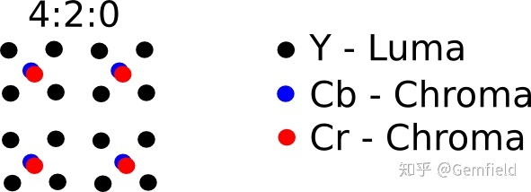
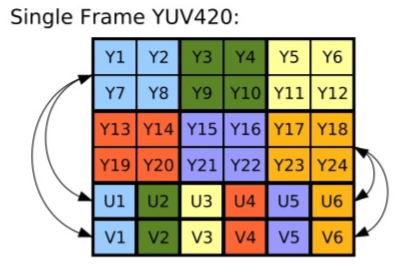
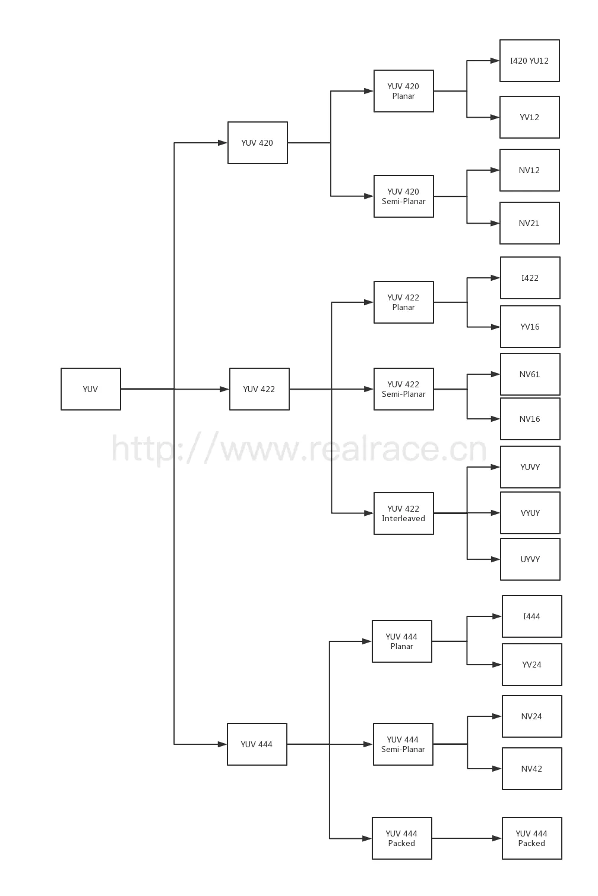

##### 背景
&emsp;&emsp;从视觉信息的来源方面来看：
1. Android和iOS项目中，从摄像头来的数据都是YUV格式的；
2. 解码一个视频时，每一帧中buffer里的data也都是YUV格式的（当你播放一个h264编码的MP4文件时，通过播放器的相关属性显示可以看到视频正以YUV420 planar被解码，什么意思？往后看！ ）。

&emsp;&emsp;从我们想要使用这些数据的角度来看：
1. UI界面显示画面需要使用RGB格式的data；
2. OpenCV等库需要RGB格式的输入；
3. 神经网络需要RGB这3个channel的输入；


##### YUV
[参考链接](https://blog.csdn.net/qq_39565868/article/details/114877172#:~:text=%E5%AE%83%E4%BB%AC%E7%9A%84%E6%95%B0%E6%8D%AE%E5%AD%98%E5%82%A8%E6%A0%BC%E5%BC%8F%E4%B8%BA%EF%BC%9A)  


###### 什么是 YUV 数据
&emsp;&emsp;YUV 模型根据一个亮度分量（Y）和两个色度分量（U（蓝色投影）和 V（红色投影））定义了色彩空间。先前的黑白系统仅使用亮度（Y）信息。颜色信息（U 和 V）是通过副载波单独添加的，因此黑白接收器仍然能够以接收器的本机黑白格式接收和显示彩色图片。

###### YUV 的存储格式
&emsp;&emsp;YUV 按照存储方法的不同，可以分为 packeted formats 和 planar formats。前者是 YUV 分量交叉排着，后者是 YUV 分量分成三个数组存放，不参和在一起。

###### YUV 的采样格式
&emsp;&emsp;YUV 根据采样率和采样方式的不同，又可以划分为各种格式。
&emsp;&emsp;YUV 相比 RGB 的优势是节省空间。因为 YUV 分量中，UV 分量对人眼来说不敏感，因此可以降低采样率，而对人的视觉又不构成什么影响。以下面的 YUV420 格式来说：  
  
&emsp;&emsp;可以看到 UV 分量只有 Y 分量的四分之一，这样每 4 个像素就是 6 个字节（而 RGB 是 12 个字节），相比 RGB 节省了一般空间。出了 YUV420 外，还有 YUV444（和 RGB 一样的空间大小）和 YUV422 等主流格式。


###### YUV 到 RGB 的转换
&emsp;&emsp;以 YUV420 到 RGB888 的转换为例介绍一下转化过程。
&emsp;&emsp;YUV420p 是平面格式，这意味着 Y，U 和 V 值组合在一起而不是散布在一起。这样做的原因是，通过将 U 和 V 值分组在一起，图像变得更加可压缩。当给定 YUV420p 格式的图像数组时，所有 Y 值首先出现，然后是所有 U 值，最后是所有 V 值。
  
&emsp;&emsp;转换示例代码：
```c
//Android sdk中的AV模块
uint8_t clamp(uint8_t v, uint8_t minValue, uint8_t maxValue) {
    CHECK(maxValue >= minValue);
    if (v < minValue) return minValue;
    else if (v > maxValue) return maxValue;
    else return v;
}
void YUVImage::yuv2rgb(uint8_t yValue, uint8_t uValue, uint8_t vValue,
        uint8_t *r, uint8_t *g, uint8_t *b) const {
    *r = yValue + (1.370705 * (vValue-128));
    *g = yValue - (0.698001 * (vValue-128)) - (0.337633 * (uValue-128));
    *b = yValue + (1.732446 * (uValue-128));
    *r = clamp(*r, 0, 255);
    *g = clamp(*g, 0, 255);
    *b = clamp(*b, 0, 255);
}
```

###### YUV 格式
&emsp;&emsp;YUV 格式总共有以下几种：  
  
&emsp;&emsp;YUV 格式按照数据大小分为三个格式：YUV420，YUV422，YUV444：  
* YUV 420，由 4 个 Y 分量共用一套 UV 分量，
* YUV 422，由 2 个 Y 分量共用一套 UV 分量，
* YUV 444，不共用，一个 Y 分量使用一套 UV 分量。

&emsp;&emsp;按照 YUV 的排列方式，再次将 YUV 分成三个大类，Planar，Semi-Planar 和 Packed：  
* Planar YUV 三个分量分开存放
* Semi-Planar Y 分量单独存放，UV 分量交错存放
* Packed YUV 三个分量全部交错存放

&emsp;&emsp;YUV 的各种格式就是上面的排列组合
1. I420（属于 YUV 420 Plannar）
I420 是 YUV 420 Planar 的一种，YUV 分量分别存放，先是 w * h 长度的 Y，后面跟 w * h * 0.25 长度的 U， 最后是 w * h * 0.25 长度的 V，总长度为 w * h * 1.5。
```shell
Y Y Y Y Y Y
Y Y Y Y Y Y
Y Y Y Y Y Y
Y Y Y Y Y Y
Y Y Y Y Y Y
Y Y Y Y Y Y
U U U
U U U
U U U
V V V
V V V
V V V
```
2. YV12（属于 YUV 420 Plannar）
YV12 是 YUV 420 Planar 的一种，YUV 分量分别存放，先是 w * h 长度的 Y，后面跟 w * h * 0.25 长度的 V， 最后是 w * h * 0.25 长度的 U，总长度为 w * h * 1.5。与 I420 不同的是，YV12 是先 V 后 U
```shell
Y Y Y Y Y Y
Y Y Y Y Y Y
Y Y Y Y Y Y
Y Y Y Y Y Y
Y Y Y Y Y Y
Y Y Y Y Y Y
V V V
V V V
V V V
U U U
U U U
U U U
```

3. NV12（属于 YUV 420 Semi-Planar）
NV12 是 YUV 420 Semi-Planar 的一种，Y 分量单独存放，UV 分量交错存放，UV 在排列的时候，从 U 开始。总长度为 w * h * 1.5。
```shell
Y Y Y Y Y Y
Y Y Y Y Y Y
Y Y Y Y Y Y
Y Y Y Y Y Y
Y Y Y Y Y Y
Y Y Y Y Y Y
U V U V U V
U V U V U V
U V U V U V
```

4. NV21（属于 YUV 420 Semi-Planar）
NV21 是 YUV 420 Semi-Planar 的一种，Y 分量单独存放，UV 分量交错存放，与 NV12 不同的是，UV 在排列的时候，从 V 开始。总长度为 w * h * 1.5。
```shell
Y Y Y Y Y Y
Y Y Y Y Y Y
Y Y Y Y Y Y
Y Y Y Y Y Y
Y Y Y Y Y Y
Y Y Y Y Y Y
V U V U V U
V U V U V U
V U V U V U
```

5. I422（属于 YUV 422 Plannar）
I422 是 YUV 422 Planar 的一种，YUV 分量分别存放，先是 w * h 长度的 Y，后面跟 w * h * 0.5 长度的 U， 最后是 w * h * 0.5 长度的 V，总长度为 w * h * 2。
```shell
Y Y Y Y Y Y
Y Y Y Y Y Y
Y Y Y Y Y Y
Y Y Y Y Y Y
Y Y Y Y Y Y
Y Y Y Y Y Y
U U U U U U
U U U U U U
U U U U U U
V V V V V V
V V V V V V
V V V V V V
```

6. YV16（属于 YUV 422 Plannar）
YV16 是 YUV 422 Planar 的一种，YUV 分量分别存放，先是 w * h 长度的 Y，后面跟 w * h * 0.5 长度的 V， 最后是 w * h * 0.5 长度的 U，总长度为 w * h * 2。与 I422 不同的是，YV16 是先 V 后 U
```shell
Y Y Y Y Y Y
Y Y Y Y Y Y
Y Y Y Y Y Y
Y Y Y Y Y Y
Y Y Y Y Y Y
Y Y Y Y Y Y
V V V V V V
V V V V V V
V V V V V V
U U U U U U
U U U U U U
U U U U U U
```

7. NV16（属于 YUV 422 Semi-Planar）
NV16 是 YUV 422 Semi-Planar 的一种，Y 分量单独存放，UV 分量交错存放，UV 在排列的时候，从 U 开始。总长度为 w * h * 2。
```shell
Y Y Y Y Y Y
Y Y Y Y Y Y
Y Y Y Y Y Y
Y Y Y Y Y Y
Y Y Y Y Y Y
Y Y Y Y Y Y
U V U V U V
U V U V U V
U V U V U V
U V U V U V
U V U V U V
U V U V U V
```

8. NV61（属于 YUV 422 Semi-Planar）
NV61 是 YUV 422 Semi-Planar 的一种，Y 分量单独存放，UV 分量交错存放，UV 在排列的时候，从 V 开始。总长度为 w * h * 2。
```shell
Y Y Y Y Y Y
Y Y Y Y Y Y
Y Y Y Y Y Y
Y Y Y Y Y Y
Y Y Y Y Y Y
Y Y Y Y Y Y
V U V U V U
V U V U V U
V U V U V U
V U V U V U
V U V U V U
V U V U V U
```

9. YUVY（属于 YUV 422 Interleaved）
YUVY 属于 YUV 422 Interleaved 的一种。事实上，Interleaved 是属于 Packed 的，但是在 422 中，用 Interleaved 更加形象一些。在 Packed 内部，YUV 的排列顺序是 Y U V Y，两个 Y 共用一组 UV。
```shell
Y U V Y   Y U V Y   Y U V Y
Y U V Y   Y U V Y   Y U V Y
Y U V Y   Y U V Y   Y U V Y
Y U V Y   Y U V Y   Y U V Y
Y U V Y   Y U V Y   Y U V Y
Y U V Y   Y U V Y   Y U V Y
```

10. VYUY（属于 YUV 422 Interleaved）
VYUY 属于 YUV 422 Interleaved 的一种。在 Packed 内部，YUV 的排列顺序是 VYUY，两个 Y 共用一组 UV。
```shell
V Y U Y   V Y U Y   V Y U Y
V Y U Y   V Y U Y   V Y U Y
V Y U Y   V Y U Y   V Y U Y
V Y U Y   V Y U Y   V Y U Y
V Y U Y   V Y U Y   V Y U Y
V Y U Y   V Y U Y   V Y U Y
```

11. UYVY（属于 YUV 422 Interleaved）
UYVY 属于 YUV 422 Interleaved 的一种。在 Packed 内部，YUV 的排列顺序是 UYVY，两个 Y 共用一组 UV。
```shell
U Y V Y   U Y V Y   U Y V Y
U Y V Y   U Y V Y   U Y V Y
U Y V Y   U Y V Y   U Y V Y
U Y V Y   U Y V Y   U Y V Y
U Y V Y   U Y V Y   U Y V Y
U Y V Y   U Y V Y   U Y V Y
```

12. I444（属于 YUV 444 Plannar）
I444 属于 YUV 444 Plannar 的一种。YUV 分量分别存放，先是 w * h 长度的 Y，后面跟 w * h 长度的 U， 最后是 w * h 长度的 V，总长度为 w * h * 3。
```shell
Y Y Y Y Y Y
Y Y Y Y Y Y
Y Y Y Y Y Y
Y Y Y Y Y Y
Y Y Y Y Y Y
Y Y Y Y Y Y
U U U U U U
U U U U U U
U U U U U U
U U U U U U
U U U U U U
U U U U U U
V V V V V V
V V V V V V
V V V V V V
V V V V V V
V V V V V V
V V V V V V
```

13. YV24（属于 YUV 444 Plannar）
YV24 属于 YUV 444 Plannar 的一种。YUV 分量分别存放，先是 w * h 长度的 Y，后面跟 w * h 长度的 V， 最后是 w * h 长度的 U，总长度为 w * h * 3。与 I444 不同的是，YV24 是先排列 V。
```shell
Y Y Y Y Y Y
Y Y Y Y Y Y
Y Y Y Y Y Y
Y Y Y Y Y Y
Y Y Y Y Y Y
Y Y Y Y Y Y
V V V V V V
V V V V V V
V V V V V V
V V V V V V
V V V V V V
V V V V V V
U U U U U U
U U U U U U
U U U U U U
U U U U U U
U U U U U U
U U U U U U
```

14. NV24（属于 YUV 444 Semi-Planar）
NV24 是 YUV 444 Semi-Planar 的一种，Y 分量单独存放，UV 分量交错存放，UV 在排列的时候，从 U 开始。总长度为 w * h * 3。
```shell
Y Y Y Y Y Y
Y Y Y Y Y Y
Y Y Y Y Y Y
Y Y Y Y Y Y
Y Y Y Y Y Y
Y Y Y Y Y Y
U V U V U V U V U V U V 
U V U V U V U V U V U V 
U V U V U V U V U V U V 
U V U V U V U V U V U V 
U V U V U V U V U V U V 
U V U V U V U V U V U V 
```

15. NV42（属于 YUV 444 Semi-Planar）
NV42 是 YUV 444 Semi-Planar 的一种，Y 分量单独存放，UV 分量交错存放，UV 在排列的时候，从 V 开始。总长度为 w * h * 3。
```shell
Y Y Y Y Y Y
Y Y Y Y Y Y
Y Y Y Y Y Y
Y Y Y Y Y Y
Y Y Y Y Y Y
Y Y Y Y Y Y
V U V U V U V U V U V U
V U V U V U V U V U V U
V U V U V U V U V U V U
V U V U V U V U V U V U
V U V U V U V U V U V U
V U V U V U V U V U V U
```

16. YUV 444 Packed
```shell
Y U V   Y U V   Y U V   Y U V   Y U V   Y U V
Y U V   Y U V   Y U V   Y U V   Y U V   Y U V
Y U V   Y U V   Y U V   Y U V   Y U V   Y U V
Y U V   Y U V   Y U V   Y U V   Y U V   Y U V
Y U V   Y U V   Y U V   Y U V   Y U V   Y U V
Y U V   Y U V   Y U V   Y U V   Y U V   Y U V
```


