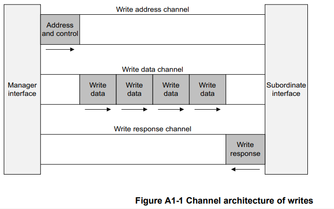
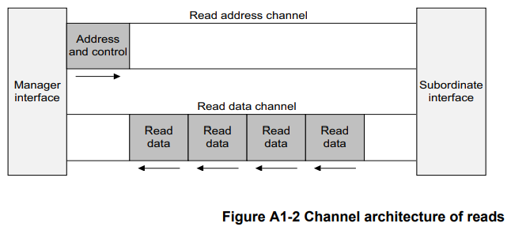
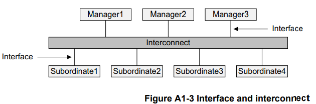
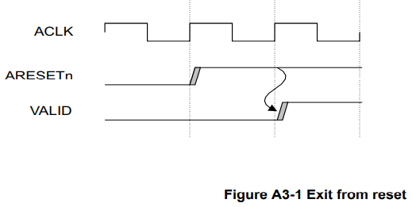
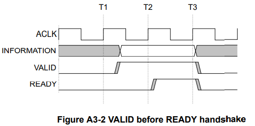
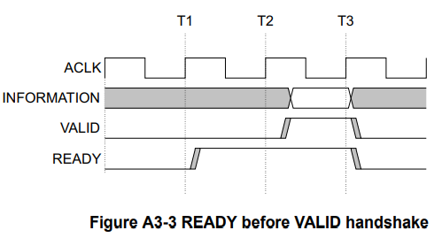
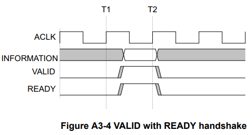

# AMBA AXI and ACE protocol specification
# Part A AMBA AXI Protocol Specification
## A1 章 介绍
&emsp;&emsp;本章介绍 AXI 协议的体系结构和本规范中使用的术语。
### A1.1 关于 AXI 协议
&emsp;&emsp;AMBA AXI 协议支持高性能、高频系统设计，用于管理器和从属组件之间的通信。 
&emsp;&emsp;AXI 协议特性包括： 
* 它适用于高带宽和低延迟的设计。 
* 提供高频操作，无需使用复杂的电桥。 
* 该协议满足各种组件的接口要求。 
* 它适用于具有高初始访问延迟的内存控制器。
* 提供了互连架构实施的灵活性。 
* 它向后兼容 AHB 和 APB 接口。 

&emsp;&emsp;AXI 协议的主要特点是： 
* 单独的地址/控制和数据层。 
* 使用 byte strobes 支持未对齐的数据传输。 
* 使用仅发出起始地址的基于突发的事务。 
* 独立的读写数据通道，可以提供低成本的直接内存访问（DMA）。 
* 支持发布多个未完成（outstanding）的地址。 
* 支持乱序（out-of-order）事务完成。
* 允许轻松添加寄存器级以提供时序收敛。 

&emsp;&emsp;AXI 协议包括：
* AXI4-Lite，AXI4 的子集，用于与组件内更简单的控制寄存器样式接口进行通信。 请参阅第 B1 章 AMBA AXI4-Lite。 
* AXI5-Lite，AXI5 的子集，用于使用 AXI5 功能以及组件内更简单的控制寄存器样式接口。 请参阅第 C2 章 AMBA AXI5-Lite。 

### A1.2 AXI 架构
&emsp;&emsp;AXI 协议是基于突发的，并定义了五个独立的事务通道： 
* 读取地址，其信号名称以 AR 开头。 
* 读取数据，其信号名称以 R 开头。
* 写地址，其信号名称以 AW 开头。
* 写数据，其信号名称以 W 开头。
* 写相应，其信号名称以 B 开头。

&emsp;&emsp;一个地址通道带着描述了要传输数据的性质的控制信息。 使用以下任一方式在控制器和从属之间传输数据： 
* 一个写数据通道，用于将数据从控制器传输到从属。 在写事务中，从属使用写响应通道向管理器发出传输完成的信号。 
* 一个读数据通道，用于将数据从从属传输到控制器。 

&emsp;&emsp;AXI 协议：
* 允许在实际数据传输之前发布地址信息。
* 支持多个未完成（outstanding）的交易。 
* 支持乱序（out-of-order）事务完成。

&emsp;&emsp;图 A1-1 显示了写事务如何使用写地址、写数据和写响应通道。 
  
&emsp;&emsp;图 A1-2 显示了读取事务如何使用读取地址和读取数据通道。 
  

#### A1.2.1 通道定义
&emsp;&emsp;五个独立通道中的每一个都包含一组信息信号以及提供双向握手机制的 VALID 和 READY 信号。 请参阅第 A3-41 页的基本读写事务。
&emsp;&emsp;信息源使用 VALID 信号来显示有效地址、数据或控制信息何时在通道上可用。 目的地使用 READY 信号来显示它何时可以接受信息。 读数据通道和写数据通道还包括一个 LAST 信号，用于指示事务中最终数据项的传输。 
##### 读写地址通道
&emsp;&emsp;每个读写事务都有自己的地址通道。 适当的地址通道携带交易所需的所有地址和控制信息。 
##### 读数据通道
&emsp;&emsp;读数据通道携带了从从属到控制器的读回的数据和读响应信息，包括：
* 数据总线，可以是 8、16、32、64、128、256、512 或 1024 位宽。 
* 指示读事务完成状态的读响应信号。 
##### 写数据通道
&emsp;&emsp;写数据通道将要写的数据从控制器传送到从属，包括： 
* 数据总线，可以是 8、16、32、64、128、256、512 或 1024 位宽。 
* 每八个数据位的字节通道选通信号（A byte lane strobe signal for every eight data bits），指示有效数据的字节。 

&emsp;&emsp;写入数据通道信息始终被视为缓冲，因此控制器可以执行写入事务，而无需从属确认先前的写入事务。 
##### 写响应通道
&emsp;&emsp;从属使用写响应通道来响应写事务。 所有写事务都需要在写响应通道上发出完成信号。
&emsp;&emsp;如图 A1-1 所示，仅针对完成的事务发出完成信号，而不是针对事务中的每个数据传输。 

#### A1.2.2 接口和互连
&emsp;&emsp;一个典型的系统由几个管理器和从属设备组成，它们通过某种形式的互连连接在一起，如图 A1-3 所示。 
  
&emsp;&emsp;AXI 协议为以下之间的接口提供了单一接口定义： 
* 管理器和互连 
* 从属设备和互连
* 控制器和从属设备

&emsp;&emsp;此接口定义支持许多不同的互连实现。 
&emsp;&emsp;注意：设备之间的互连相当于另一个设备具有对称的控制器和从属端口，此控制器和从属端口可以连接真正的控制器和从属设备。 

##### 典型的设备拓扑
&emsp;&emsp;大多数系统使用三种互连拓扑之一：
* 共享地址和数据总线
* 共享地址总线和多条数据总线
* 多层，具有多个地址和数据总线 

&emsp;&emsp;在大多数系统中，地址通道带宽要求明显低于数据通道带宽要求。 这样的系统可以通过使用具有多个数据总线的共享地址总线来实现并行数据传输，从而在系统性能和互连复杂性之间实现良好的平衡。 

#### A1.2.3 Register slices
&emsp;&emsp;每个 AXI 通道仅在一个方向传输信息，该架构不需要通道之间有任何固定关系。 这些特性意味着可以在任何通道中的几乎任何点插入寄存器片，但代价是额外的延迟周期。 
&emsp;&emsp;注意：这些性质使以下成为可能： 
* 在延迟周期和最大操作频率之间进行权衡。
* 处理器和高性能内存之间的直接、快速的连接，但使用简单的寄存器片将较长的路径隔离到性能要求较低的外围设备。

## A2 章 信号描述
&emsp;&emsp;本章介绍 AXI 接口信号。 大多数信号是协议的 AXI3 和 AXI4 实现所必需的，表格汇总了例外的信号的定义。 
&emsp;&emsp;后面的章节定义了信号参数和用法。 

## A3 章 单接口要求 
&emsp;&emsp;本章描述了单个管理器和从属之间的基本 AXI 协议事务的要求。 
### A3.1 时钟和复位
&emsp;&emsp;本节介绍实现 AXI 全局时钟和复位信号 ACLK 和 ARESETn 的要求。 
#### A3.1.1 时钟
&emsp;&emsp;每个 AXI 接口都有一个时钟信号 ACLK。 所有输入信号都在 ACLK 的上升沿采样。 所有输出信号的变化只能在 ACLK 的上升沿之后发生。
&emsp;&emsp;在控制器和从属接口上，输入和输出信号之间不得有组合路径。 
#### A3.1.2 复位
&emsp;&emsp;AXI 协议使用单个低电平有效复位信号 ARESETn。 复位信号可以异步置位，但解除置位只能与 ACLK 的上升沿同步。
&emsp;&emsp;在复位期间，以下接口要求适用： 
* 控制接口必须驱动 ARVALID、AWVALID 和 WVALID 为低。
* 从属接口必须将RVALID 和BVALID 驱动为低。
* 其他所有信号都可以驱动为任意值。

&emsp;&emsp;复位后允许管理器开始驱动 ARVALID、AWVALID 或 WVALID 为高电平的最早点是在 ARESETn 为高电平之后的 ACLK 上升沿。 图 A3-1 显示了复位后 ARVALID、AWVALID 或 WVALID 可以被驱动为高电平的最早点。 
  

### A3.2 基本读写事务 
&emsp;&emsp;本节定义了 AXI 协议事务的基本机制。 基本机制是： 
* 握手过程
* 第 A3 的信道信号要求 

#### A3.2.1 握手过程 
&emsp;&emsp;所有五个事务通道都使用相同的 VALID/READY 握手过程来传输地址、数据和控制信息。 这种双向流控机制意味着控制器和从属都可以控制信息在控制器和从属之间移动的速率。 源生成 VALID 信号以指示地址、数据或控制信息何时可用。 目的地生成 READY 信号以表明它可以接受信息。 仅当 VALID 和 READY 信号都为高电平时才会发生传输。 
&emsp;&emsp;在控制器和从属接口上，输入和输出信号之间不得有组合路径。
&emsp;&emsp;图 A3-2 至图 A3-4 显示了握手过程的示例。
&emsp;&emsp;源在 T1 之后显示信息并断言 VALID 信号，如图 A3-2 所示。 目标在 T2 之后断言 READY 信号。 源必须保持其信息稳定直到在 T3 发生传输，此时此断言被识别。 
  
&emsp;&emsp;在断言 VALID 之前，不允许源等到 READY 被断言。
&emsp;&emsp;当 VALID 被断言时，它必须保持断言直到握手发生，在时钟上升沿同时 VALID 和 READY 都被断言。
&emsp;&emsp;在图 A3-3 中，目的地在 T1 之后断言 READY，在地址、数据或控制信息有效之前。 该断言表明它可以接受该信息。 源在 T2 之后呈现信息并断言 VALID，然后在 T3 发生传输，当该断言被识别时。 在这种情况下，传输发生在一个周期内。 
  
&emsp;&emsp;在断言相应的 READY 之前，允许目的地等待 VALID 被断言。 如果 READY 被断言，则允许在 VALID 被断言之前取消断言 READY。 
&emsp;&emsp;在图 A3-4 中，源和目的都恰好表明它们可以在 T1 之后传输地址、数据或控制信息。 在这种情况下，传输发生在时钟的上升沿，此时可以识别出 VALID 和 READY 的断言。 这些断言意味着传输发生在 T2。 
  
&emsp;&emsp;各个 AXI 协议通道握手机制在 Channel signaling requirements 中进行了描述。 

