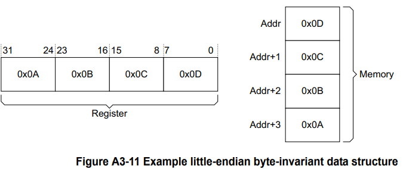

# AMBA AXI and ACE protocol specification
# Part A AMBA AXI Protocol Specification
## A1 章 介绍
&emsp;&emsp;本章介绍 AXI 协议的体系结构和本规范中使用的术语。
### A1.1 关于 AXI 协议
&emsp;&emsp;AMBA AXI 协议支持高性能、高频系统设计，用于管理器和从属组件之间的通信。 
&emsp;&emsp;AXI 协议特性包括： 
* 它适用于高带宽和低延迟的设计。 
* 提供高频操作，无需使用复杂的电桥。 
* 该协议满足各种组件的接口要求。 
* 它适用于具有高初始访问延迟的内存控制器。
* 提供了互连架构实施的灵活性。 
* 它向后兼容 AHB 和 APB 接口。 

&emsp;&emsp;AXI 协议的主要特点是： 
* 单独的地址/控制和数据层。 
* 使用 byte strobes 支持未对齐的数据传输。 
* 使用仅发出起始地址的基于突发的事务。 
* 独立的读写数据通道，可以提供低成本的直接内存访问（DMA）。 
* 支持发布多个未完成（outstanding）的地址。 
* 支持乱序（out-of-order）事务完成。
* 允许轻松添加寄存器级以提供时序收敛。 

&emsp;&emsp;AXI 协议包括：
* AXI4-Lite，AXI4 的子集，用于与组件内更简单的控制寄存器样式接口进行通信。 请参阅第 B1 章 AMBA AXI4-Lite。 
* AXI5-Lite，AXI5 的子集，用于使用 AXI5 功能以及组件内更简单的控制寄存器样式接口。 请参阅第 C2 章 AMBA AXI5-Lite。 

### A1.2 AXI 架构
&emsp;&emsp;AXI 协议是基于突发的，并定义了五个独立的事务通道： 
* 读取地址，其信号名称以 AR 开头。 
* 读取数据，其信号名称以 R 开头。
* 写地址，其信号名称以 AW 开头。
* 写数据，其信号名称以 W 开头。
* 写响应，其信号名称以 B 开头。

&emsp;&emsp;一个地址通道带着描述了要传输数据的性质的控制信息。 使用以下任一方式在控制器和从属之间传输数据： 
* 一个写数据通道，用于将数据从控制器传输到从属。 在写事务中，从属使用写响应通道向管理器发出传输完成的信号。 
* 一个读数据通道，用于将数据从从属传输到控制器。 

&emsp;&emsp;AXI 协议：
* 允许在实际数据传输之前发布地址信息。
* 支持多个未完成（outstanding）的传输。 
* 支持乱序（out-of-order）事务完成。

&emsp;&emsp;图 A1-1 显示了写事务如何使用写地址、写数据和写响应通道。 
  
&emsp;&emsp;图 A1-2 显示了读取事务如何使用读取地址和读取数据通道。 
  

#### A1.2.1 通道定义
&emsp;&emsp;五个独立通道中的每一个都包含一组信息信号以及提供双向握手机制的 VALID 和 READY 信号。 请参阅第 A3 的基本读写事务。
&emsp;&emsp;信息源使用 VALID 信号来显示有效地址、数据或控制信息何时在通道上可用。 目的地使用 READY 信号来显示它何时可以接受信息。 读数据通道和写数据通道还包括一个 LAST 信号，用于指示事务中最终数据项的传输。 
##### 读写地址通道
&emsp;&emsp;每个读写事务都有自己的地址通道。 适当的地址通道携带传输所需的所有地址和控制信息。 
##### 读数据通道
&emsp;&emsp;读数据通道携带了从从属到控制器的读回的数据和读响应信息，包括：
* 数据总线，可以是 8、16、32、64、128、256、512 或 1024 位宽。 
* 指示读事务完成状态的读响应信号。 
##### 写数据通道
&emsp;&emsp;写数据通道将要写的数据从控制器传送到从属，包括： 
* 数据总线，可以是 8、16、32、64、128、256、512 或 1024 位宽。 
* 每八个数据位的字节通道选通信号（A byte lane strobe signal for every eight data bits），指示有效数据的字节。 

&emsp;&emsp;写入数据通道信息始终被视为缓冲，因此控制器可以执行写入事务，而无需从属确认先前的写入事务。 
##### 写响应通道
&emsp;&emsp;从属使用写响应通道来响应写事务。 所有写事务都需要在写响应通道上发出完成信号。
&emsp;&emsp;如图 A1-1 所示，**仅针对完成的事务发出完成信号，而不是针对事务中的每个数据传输**。 

#### A1.2.2 接口和互连
&emsp;&emsp;一个典型的系统由几个管理器和从属设备组成，它们通过某种形式的互连连接在一起，如图 A1-3 所示。 
  
&emsp;&emsp;AXI 协议为以下之间的接口提供了单一接口定义： 
* 管理器和互连 
* 从属设备和互连
* 控制器和从属设备

&emsp;&emsp;此接口定义支持许多不同的互连实现。 
&emsp;&emsp;注意：设备之间的互连相当于另一个设备具有对称的控制器和从属端口，此控制器和从属端口可以连接真正的控制器和从属设备。 

##### 典型的设备拓扑
&emsp;&emsp;大多数系统使用三种互连拓扑之一：
* 共享地址和数据总线
* 共享地址总线和多条数据总线
* 多层，具有多个地址和数据总线 

&emsp;&emsp;在大多数系统中，地址通道带宽要求明显低于数据通道带宽要求。 这样的系统可以通过使用具有多个数据总线的共享地址总线来实现并行数据传输，从而在系统性能和互连复杂性之间实现良好的平衡。 

#### A1.2.3 Register slices
&emsp;&emsp;每个 AXI 通道仅在一个方向传输信息，该架构不需要通道之间有任何固定关系。 这些特性意味着可以在任何通道中的几乎任何点插入寄存器片，但代价是额外的延迟周期。 
&emsp;&emsp;注意：这些性质使以下成为可能： 
* 在延迟周期和最大操作频率之间进行权衡。
* 处理器和高性能内存之间的直接、快速的连接，但使用简单的寄存器片将较长的路径隔离到性能要求较低的外围设备。

## A2 章 信号描述
&emsp;&emsp;本章介绍 AXI 接口信号。 大多数信号是协议 AXI3 和 AXI4 实现所必需的，表格汇总了例外的信号的定义。 
&emsp;&emsp;后面的章节定义了信号参数和用法。

### A2.1 全局信号
&emsp;&emsp;表 A2-1 显示了全局 AXI 信号。 这些信号由 AXI3 和 AXI4 协议使用。 

| Signal  | Source       | Description                                           |
| ------- | ------------ | ----------------------------------------------------- |
| ACLK    | Clock source | 全局时钟信号。 在全局时钟的上升沿对同步信号进行采样。 |
| ARESETn | Reset source | 全局复位信号。 该信号为低电平有效。                   |

&emsp;&emsp;所有信号都在全局时钟的上升沿采样。 

### A2.2 写地址通道信号
&emsp;&emsp;表 A2-2 显示了 AXI 写地址通道信号。 除非另有说明，否则 AXI3 和 AXI4 都使用这些信号。 

| Signal   | Source      | Description                                                  |
| -------- | ----------- | ------------------------------------------------------------ |
| AWID     | Manager     | 写事务的标识标签。                                           |
| AWADDR   | Manager     | 写事务中第一笔传输的地址。                                   |
| AWLEN    | Manager     | 长度，写事务中数据传输的确切数量。 此信息确定与地址关联的数据传输次数。 在 AXI3 和 AXI4有些区别。 |
| AWSIZE   | Manager     | size，写事务中每次数据传输的字节的个数。                     |
| AWBURST  | Manager     | 突发类型，指示写事务中每次传输之间的地址如何变化。           |
| AWLOCK   | Manager     | 提供有关写入事务的原子特征的信息。 在 AXI3 和 AXI4有些区别。 |
| AWCACHE  | Manager     | 指示写入事务如何通过系统进行。                               |
| AWPROT   | Manager     | 写事务的保护属性：权限、安全级别和访问类型。                 |
| AWQOS    | Manager     | Quality of Service identifier for a write transaction.  AXI3 中没有实现。 |
| AWREGION | Manager     | 写入事务的区域指示符。  AXI3 中没有实现。                 |
| AWUSER   | Manager     | 用户定义的写地址通道扩展。 AXI3 中没有实现。                 |
| AWVALID  | Manager     | 表明写地址通道信号是有效的。                                 |
| AWREADY  | Subordinate | 表示可以接受写地址通道上的传输。                             |

### A2.3 写数据通道信号
&emsp;&emsp;表 A2-3 显示了 AXI 写数据通道信号。 除非另有说明，否则 AXI3 和 AXI4 使用信号。

| Signal | Source      | Description                                     |
| ------ | ----------- | ----------------------------------------------- |
| WID    | Manager     | 写入数据传输的 ID 标签。 仅在 AXI3 中实现。     |
| WDATA  | Manager     | 写数据。                                        |
| WSTRB  | Manager     | 写选通，指示哪些字节通道是有效数据。            |
| WLAST  | Manager     | 指示这是否是写事务中的最后一次数据传输。        |
| WUSER  | Manager     | 写入数据通道的用户定义扩展。 未在 AXI3 中实现。 |
| WVALID | Manager     | 表示写数据通道信号有效。                        |
| WREADY | Subordinate | 表示可以接受写入数据通道上的传输。              |

### A2.4 写响应通道信号
&emsp;&emsp;表 A2-4 显示了 AXI 写响应通道信号。 除非另有说明，否则 AXI3 和 AXI4 使用信号。

| Signal | Source      | Description                                   |
| ------ | ----------- | --------------------------------------------- |
| BID    | Subordinate | 写响应标识标签                                |
| BRESP  | Subordinate | 写响应，表明写写事务的状态                    |
| BUSER  | Subordinate | 写响应通道的用户定义扩展。 未在 AXI3 中实现。 |
| BVALID | Subordinate | 表示写响应通道信号有效。                      |
| BREADY | Manager     | 表示可以接受写响应通道上的传输。              |

### A2.5 读地址通道信号
&emsp;&emsp;表 A2-5 显示了 AXI 读取地址通道信号。 除非另有说明，否则 AXI3 和 AXI4 使用信号。

| Signal   | Source      | Description                                                  |
| -------- | ----------- | ------------------------------------------------------------ |
| ARID     | Manager     | 读事务的标识标签                                             |
| ARADDR   | Manager     | 读事务第一笔传输的地址                                       |
| ARLEN    | Manager     | 长度，读取事务中数据传输的确切数量。 这会在 AXI3 和 AXI4 之间发生变化。 |
| ARSIZE   | Manager     | size，读事务中每次数据传输的字节数量。                       |
| ARBURST  | Manager     | 突发类型，指示读取事务中每次传输之间的地址如何变化。         |
| ARLOCK   | Manager     | 提供有关读取事务的原子特征的信息。 这会在 AXI3 和 AXI4 之间发生变化。 |
| ARCACHE  | Manager     | 指示如何要求读取事务通过系统进行。                           |
| ARPROT   | Manager     | 读事务的保护属性：权限、安全级别和访问类型。                 |
| ARQOS    | Manager     | 读取事务的服务质量标识符。 未在 AXI3 中实现。                |
| ARREGION | Manager     | 读取事务的区域指示符。 未在 AXI3 中实现。                    |
| ARUSER   | Manager     | 读取地址通道的用户定义扩展。 未在 AXI3 中实现。              |
| ARVALID  | Manager     | 表示读地址通道信号有效。                                     |
| ARREADY  | Subordinate | 表示可以接受读取地址通道上的传输。                           |

### A2.6 读数据通道信号
&emsp;&emsp;表 A2-6 显示了 AXI 读取数据通道信号。 除非另有说明，否则 AXI3 和 AXI4 使用信号。 

| Signal | Source      | Description                                     |
| ------ | ----------- | ----------------------------------------------- |
| RID    | Subordinate | 读取数据和响应的标识标签                        |
| RDATA  | Subordinate | 读取数据                                        |
| RRESP  | Subordinate | 读响应，表明读取传输的状态                      |
| RLAST  | Subordinate | 指示这是否是读取事务中的最后一次数据传输。      |
| RUSER  | Subordinate | 读取数据通道的用户定义扩展。 未在 AXI3 中实现。 |
| RVALID | Subordinate | 表示读取的数据通道信号有效。                    |
| RREADY | Manager     | 表示可以接受读取数据通道上的传输。              |

## A3 章 单接口要求 
&emsp;&emsp;本章描述了单个管理器和从属之间的基本 AXI 协议事务的要求。 
### A3.1 时钟和复位
&emsp;&emsp;本节介绍实现 AXI 全局时钟和复位信号 ACLK 和 ARESETn 的要求。 
#### A3.1.1 时钟
&emsp;&emsp;每个 AXI 接口都有一个时钟信号 ACLK。 所有输入信号都在 ACLK 的上升沿采样。 所有输出信号的变化只能在 ACLK 的上升沿之后发生。
&emsp;&emsp;在控制器和从属接口上，输入和输出信号之间不得有组合路径。 

#### A3.1.2 复位
&emsp;&emsp;AXI 协议使用单个低电平有效复位信号 ARESETn。 复位信号可以异步置位，但解除置位只能与 ACLK 的上升沿同步。
&emsp;&emsp;在复位期间，以下接口要求适用： 
* 控制接口必须驱动 ARVALID、AWVALID 和 WVALID 为低。
* 从属接口必须将RVALID 和BVALID 驱动为低。
* 其他所有信号都可以驱动为任意值。

&emsp;&emsp;复位后允许管理器开始驱动 ARVALID、AWVALID 或 WVALID 为高电平的最早点是在 ARESETn 为高电平之后的 ACLK 上升沿。 图 A3-1 显示了复位后 ARVALID、AWVALID 或 WVALID 可以被驱动为高电平的最早点。 
  

### A3.2 基本读写事务 
&emsp;&emsp;本节定义了 AXI 协议事务的基本机制。 基本机制是： 
* 握手过程
* 通道信号请求 

#### A3.2.1 握手过程 
&emsp;&emsp;所有五个事务通道都使用相同的 VALID/READY 握手过程来传输地址、数据和控制信息。 这种双向流控机制意味着控制器和从属都可以控制信息在控制器和从属之间移动的速率。 源生成 VALID 信号以指示地址、数据或控制信息何时可用。 目的地生成 READY 信号以表明它可以接受信息。 仅当 VALID 和 READY 信号都为高电平时才会发生传输。 
&emsp;&emsp;在控制器和从属接口上，输入和输出信号之间不得有组合路径。
&emsp;&emsp;图 A3-2 至图 A3-4 显示了握手过程的示例。
&emsp;&emsp;源在 T1 之后显示信息并断言 VALID 信号，如图 A3-2 所示。 目标在 T2 之后断言 READY 信号。 源必须保持其信息稳定直到在 T3 发生传输，此时此断言被识别。 
  
&emsp;&emsp;在断言 VALID 之前，不允许源等到 READY 被断言。*（即，不要让源的 valid 信号依赖于目的地的 ready）*
&emsp;&emsp;当 VALID 被断言时，它必须保持断言直到握手发生，在时钟上升沿同时 VALID 和 READY 都被断言。
&emsp;&emsp;在图 A3-3 中，目的地在 T1 之后断言 READY，在地址、数据或控制信息有效之前。 该断言表明它可以接受该信息。 源在 T2 之后呈现信息并断言 VALID，然后在 T3 发生传输，当该断言被识别时。 在这种情况下，传输发生在一个周期内。 
  
&emsp;&emsp;在断言相应的 READY 之前，允许目的地等待 VALID 被断言。 如果 READY 被断言，则允许在 VALID 被断言之前取消断言 READY。 
&emsp;&emsp;在图 A3-4 中，源和目的都恰好表明它们可以在 T1 之后传输地址、数据或控制信息。 在这种情况下，传输发生在时钟的上升沿，此时可以识别出 VALID 和 READY 的断言。 这些断言意味着传输发生在 T2。 
  
&emsp;&emsp;各个 AXI 协议通道握手机制在 Channel signaling requirements 中进行了描述。 

#### A3.2.2 Channel signaling requirements
&emsp;&emsp;以下部分定义了每个通道的握手信号和握手规则：
* 信道握手信号
* 写地址通道
* 写数据通道
* 写响应通道
* 读地址通道
* 读数据通道 
##### 通道握手信号
&emsp;&emsp;每个通道都有自己的 VALID/READY 握手信号对。 表 A3-1 显示了每个通道的信号。 

| transaction channel | handshake pair   |
| ------------------- | ---------------- |
| 写地址通道          | AWVALID, AWREADY |
| 写数据通道          | WVALID, WREADY   |
| 写响应通道          | BVALID, BREADY   |
| 读地址通道          | ARVALID, ARREADY |
| 读数据通道          | RVALID, RREADY   |

##### 写地址通道
&emsp;&emsp;控制器只有在驱动了有效的地址和控制信息时才能断言 AWVALID 信号。 断言时，AWVALID 必须保持断言，一直保持到从属设备断言 AWREADY 之后的时钟上升沿。
&emsp;&emsp;AWREADY 的默认状态可以是 HIGH 或 LOW。 本规范推荐默认状态为 HIGH。 当 AWREADY 为高时，从属必须能够接受提供给它的任何有效地址。 

##### 写数据通道
&emsp;&emsp;在写入突发期间，控制器只有在驱动有效的写入数据时才能断言 WVALID 信号。 断言时，WVALID 必须保持置位，直到从属置位 WREADY 后的时钟上升沿。
&emsp;&emsp;WREADY 的默认状态可以是 HIGH，但前提是从属设备始终可以在单个周期内接受写入数据。
&emsp;&emsp;控制器在驱动突发中的最后一笔写传输时必须断言 WLAST 信号。
&emsp;&emsp;该规范建议将 WDATA 驱动为零以用于非活动字节通道。 

##### 写响应通道
&emsp;&emsp;只有当它驱动一个有效的写响应时，从属才能断言 BVALID 信号。 断言时，BVALID 必须保持置位，直到控制器置位 BREADY 后的时钟上升沿。
&emsp;&emsp;BREADY 的默认状态可以是 HIGH，但前提是控制器始终可以在单个周期内接受写入响应。 

##### 读地址通道
&emsp;&emsp;控制器只有在驱动有效地址和控制信息时才能断言 ARVALID 信号。 置位时，ARVALID 必须保持置位，直到从属置位 ARREADY 信号后的时钟上升沿。
&emsp;&emsp;ARREADY 的默认状态可以是 HIGH 或 LOW。 本规范推荐默认状态为 HIGH。 如果 ARREADY 为 HIGH，则从属必须能够接受提供给它的任何有效地址。 

##### 读数据通道
&emsp;&emsp;只有在驱动有效的读取数据时，从属设备才能断言 RVALID 信号。 置位后，RVALID 必须保持置位，直到控制器置位 RREADY 后的时钟上升沿。 即使从属只有一个读取数据源，它也必须仅在响应数据请求时断言 RVALID 信号。
&emsp;&emsp;控制器 接口使用 RREADY 信号来指示它接受数据。 RREADY 的默认状态可以是 HIGH，但前提是 控制器 在启动读取事务时能够立即接受读取数据。
&emsp;&emsp;在驱动突发中的最终读取传输时，从属必须断言 RLAST 信号。
&emsp;&emsp;该规范建议将 RDATA 驱动为零以用于非活动字节通道。 

### A3.3 通道间的关系
&emsp;&emsp;AXI 协议要求维护以下关系： 
* 写响应必须始终跟在写事务中的最后一次写传输之后。 
* 读取数据必须始终跟在数据的读取地址之后。 
* 通道握手必须符合通道握手信号之间的依赖关系中定义的依赖关系。 

&emsp;&emsp;该协议没有定义通道之间的任何其他关系。 
&emsp;&emsp;缺少关系意味着，例如，写入数据可以出现在事务的写入地址之前的接口处。 如果写地址通道包含的寄存器级多于写数据通道，则会发生这种情况。 类似地，写入数据可能与地址出现在同一周期中。 
&emsp;&emsp;当控制器发出写入请求时，它必须能够为该事务提供所有写入数据，而不依赖于来自该控制器的其他事务。
&emsp;&emsp;当控制器发出读取请求时，它必须能够接受该事务的所有读取数据，而不依赖于来自该控制器的其他事务。
&emsp;&emsp;请注意，控制器可以依赖从使用相同 ID 的事务中按顺序返回的读取数据，因此控制器只需要足够的存储空间来从具有不同 ID 的事务中读取数据。 

#### A3.3.1 通道握手信号之间的依赖关系 
&emsp;&emsp;为了防止出现死锁情况，必须遵守握手信号之间存在的依赖规则。 正如 A3-42 页上的通道信令要求中总结的那样，在任何事务中： 
* AXI 接口发送信息的 VALID 信号不能依赖于接收该信息的 AXI 接口的 READY 信号。 
* 正在接收信息的 AXI 接口可以等待，直到它检测到一个 VALID 信号，然后才断言其相应的 READY 信号。 

&emsp;&emsp;注意：在断言 READY 之前等待断言 VALID 是可以接受的。 在检测到相应的 VALID 之前断言 READY 也是可以接受的。 这可以产生更有效的设计。 
&emsp;&emsp;此外，不同通道上的握手信号之间存在依赖关系，AXI4 定义了额外的写响应依赖关系。 以下小节定义了这些依赖项： 
* Read transaction dependencies on page A3-45
* AXI3 write transaction dependencies on page A3-45
* AXI4 and AXI5 write transaction dependencies on page A3-46

&emsp;&emsp;在依赖关系图中： 
* 单箭头指向可以在箭头开始处的信号之前或之后断言的信号。
* 双箭头指向的信号必须在箭头开始处的信号断言之后才被断言。 

##### 读事务依赖关系
&emsp;&emsp;图 A3-5 显示了读取事务握手信号的依赖关系，并表明，在读取事务中： 
* 控制器在断言 ARVALID 之前不得等待从属断言 ARREADY。
* 在断言ARREADY 之前，从属可以等待ARVALID 被断言。
* 从属可以在ARVALID 被断言之前断言ARREADY。
* 从属必须等待 ARVALID 和 ARREADY 都被断言，然后才断言 RVALID 以指示有效数据可用。
* 在断言RVALID 之前，从属不得等待控制器断言RREADY。
* 控制器可以在断言RREADY 之前等待RVALID 被断言。
* 控制器可以在RVALID 被断言之前断言RREADY。 

  

##### AXI3写事务依赖关系
&emsp;&emsp;图 A3-6 显示了写事务握手信号的依赖关系，并显示了在写事务中： 
* 控制器在断言 AWVALID 或 WVALID 之前不得等待从属断言 AWREADY 或 WREADY。
* 在断言 AWREADY 之前，从属可以等待 AWVALID 或 WVALID，或两者。
* 从属可以在断言 AWVALID 或 WVALID 或两者之前断言 AWREADY。
* 在断言 WREADY 之前，从属可以等待 AWVALID 或 WVALID，或两者兼而有之。
* 从属可以在断言 AWVALID 或 WVALID 或两者之前断言 WREADY。
* 在断言 BVALID 之前，从属必须等待 WVALID 和 WREADY 都被断言。 在断言 BVALID 之前，从属也必须等待 WLAST 被断言。 需要等待是因为写响应 BRESP 必须在写事务的最后一次数据传输之后才发出信号。
* 在断言 BVALID 之前，从属不得等待控制器断言 BREADY。
* 控制器可以在断言 BREADY 之前等待 BVALID。
* 控制器可以在断言 BVALID 之前断言 BREADY。 

  

警告：必须遵守相关性规则以防止出现死锁情况。 例如，控制器 在驱动 WVALID 之前不得等待 AWREADY 被断言。 如果从属在断言 AWREADY 之前等待 WVALID，则可能发生死锁情况。 

##### AXI4 和 AXI5 写事务依赖关系
&emsp;&emsp;AXI4 和 AXI5 定义了一个附加的从属写响应相关性。 在断言 BVALID 之前，从属必须等待断言 AWVALID、AWREADY、WVALID 和 WREADY。 通过发出写响应，从属负责针对所有后续事务检查写事务的危险性。 
&emsp;&emsp;注意：这种额外的依赖关系反映了 AXI3 中的预期用途，因为预计任何组件在地址被接受之前都不会接受写入数据并提供写入响应。 
&emsp;&emsp;图 A3-7 显示了所有 AXI4 和 AXI5 所需的从属写响应握手依赖关系。 单箭头指向可以在前一个信号被断言之前或之后被断言的信号。 双箭头指向必须在前一个信号断言之后才断言的信号。
&emsp;&emsp;这些依赖项是： 
* 控制器在断言AWVALID 或WVALID 之前不得等待从属断言AWREADY 或WREADY。
* 在断言AWREADY 之前，从属可以等待AWVALID 或WVALID，或两者。
* 从属可以在断言AWVALID 或WVALID 或两者之前断言AWREADY。
* 在断言WREADY 之前，从属可以等待AWVALID 或WVALID，或两者兼而有之。
* 从属可以在断言AWVALID 或WVALID 或两者之前断言WREADY。
* 在断言BVALID 之前，从属必须等待AWVALID、AWREADY、WVALID 和WREADY 被断言。 在断言 BVALID 之前，从属也必须等待 WLAST 被断言。 这种等待是因为写响应 BRESP 必须在写事务的最后一次数据传输之后才发出信号。
* 在断言BVALID 之前，从属不得等待控制器断言BREADY。
* 控制器 可以在断言 BREADY 之前等待 BVALID。
* 控制器 可以在断言 BVALID 之前断言 BREADY 

  

#### A3.3.2 遗留问题 
&emsp;&emsp;第 A3-46 页上的 AXI4 和 AXI5 写入事务依赖项中描述的附加依赖项意味着接受所有写入数据并在接受地址之前提供写入响应的 AXI3 从属不符合 AXI4 或 AXI5。 将 AXI3 传统从属转换为 AXI4 或 AXI5 需要添加包装器。 该包装器确保在从属接受适当的地址之前不提供返回的写响应。 
&emsp;&emsp;注意：本规范强烈建议任何新的 AXI3 从属实现都包含此附加依赖项。 
&emsp;&emsp;任何 AXI3 管理器都符合 AXI4 和 AXI5 写响应要求。 

### A3.4 Transaction structure
&emsp;&emsp;本节介绍事务的结构。 以下部分定义了地址、数据和响应结构：
&emsp;&emsp;有关本节中使用的术语的定义，请参阅第 Glossary-493 页的词汇表。 

#### A3.4.1 Address 结构
&emsp;&emsp;AXI 协议是基于突发的。 控制器通过将控制信息和事务中第一个字节的地址发送给从属来开始每个突发。 随着突发的进行，从属必须计算突发中后续传输的地址。
&emsp;&emsp;突发不得跨越 4KB 地址边界。 
&emsp;&emsp;注意：此禁令防止爆发跨越两个从属之间的边界。 它还限制了从属必须支持的地址增量的数量。 

##### Burst length
&emsp;&emsp;突发长度由下式指定： 
* ARLEN[7:0]，用于读取传输 
* AWLEN[7:0]，用于写传输 

&emsp;&emsp;在本规范中，AxLEN 表示 ARLEN 或 AWLEN。 
&emsp;&emsp;对于所有突发类型，AXI3 支持 1-16 突发长度的传输。 
&emsp;&emsp;AXI4 将对 INCR 突发类型的突发长度支持扩展到 1-256 次传输。 AXI4 中对所有其他突发类型的支持仍为 1-16 次传输。
&emsp;&emsp;AXI3 的突发长度定义为： 
$ Burst_Length = AxLEN[3:0] + 1 $
&emsp;&emsp;为了适应 AXI4 中 INCR 突发类型的扩展突发长度，AXI4 的突发长度定义为： 
$ Burst_Length = AxLEN[7:0] + 1 $ 
&emsp;&emsp;AXI 具有以下管理突发使用的规则： 
* 对于环绕突发，突发长度必须为 2、4、8 或 16。
* 突发不得跨越 4KB 地址边界。
* 不支持提前终止突发。 

&emsp;&emsp;没有组件可以提前终止突发。 然而，为了减少写入突发中的数据传输次数，控制器可以通过取消所有写入选通来禁用进一步的写入。 在这种情况下，控制器必须完成突发中的剩余传输。 在读突发中，控制器可以丢弃读数据，但它必须完成突发中的所有传输。 
&emsp;&emsp;注意：在访问 FIFO 等读敏感设备时，丢弃不需要的读取数据可能会导致数据丢失。 访问此类设备时，管理器必须使用与所需数据传输大小完全匹配的突发长度 
&emsp;&emsp;在 AXI4 中，INCR 突发类型和长度大于 16 的事务可以转换为多个更小的突发，即使事务属性指示事务是不可修改的。 请参阅第 A4-64 页上的 AXI4 对内存属性信号的更改。 在这种情况下，生成的突发必须保留与原始传输相同的传输特征，唯一的例外是：
* 突发长度减少。
* 生成的突发的地址被适当地调整。 

&emsp;&emsp;注意：AXI3 兼容性需要将较长的突发分成多个较短的突发的能力。 可能还需要这种能力来减少较长的突发对 QoS 保证的影响。 

##### Burst size
&emsp;&emsp;在突发中，每次数据传输或节拍中传输的最大字节数由以下公式指定： 
* ARSIZE[2:0]，用于读传输
* AWSIZE[2:0]，用于写传输 

&emsp;&emsp;在本规范中，AxSIZE 表示 ARSIZE 或 AWSIZE。 
&emsp;&emsp;表 A3-2 显示了 AxSIZE 编码。 

| AxSIZE[2:0] | Bytes in transfer |
| ----------- | ----------------- |
| 0b000       | 1                 |
| 0b001       | 2                 |
| 0b010       | 4                 |
| 0b011       | 8                 |
| 0b100       | 16                |
| 0b101       | 32                |
| 0b110       | 64                |
| 0b111       | 128               |

&emsp;&emsp;如果 AXI 总线比突发大小更宽，AXI 接口必须根据传输地址确定数据总线的哪些字节通道用于每次传输。 请参阅第 A3-54 页的数据读取和写入结构。
&emsp;&emsp;任何传输的大小不得超过事务中任一代理的数据总线宽度。 

##### Burst type
&emsp;&emsp;AXI 协议定义了三种突发类型： 
###### FIXED
&emsp;&emsp;在固定突发中： 
* 对于突发中的每次传输，地址都是相同的。
* 对于突发中的所有节拍，有效的字节通道都是恒定的。 但是，在这些字节通道内，已断言 WSTRB 的实际字节对于突发中的每个节拍可能不同。 

&emsp;&emsp;这种突发类型用于对同一位置的重复访问，例如在加载或清空 FIFO 时。 

###### INCR
&emsp;&emsp;递增。 在递增突发中，突发中每个传输的地址是前一次传输地址的增量。 增量值取决于传输的大小。 例如，对于对齐的起始地址，大小为 4 字节的突发中每次传输的地址是前一个地址加 4。
&emsp;&emsp;这种突发类型用于访问正常的顺序存储器。 
###### WRAP
&emsp;&emsp;回绕突发类似于递增突发，不同之处在于，如果达到地址上限，则地址回绕到较低地址。
&emsp;&emsp;以下限制适用于回绕突发： 
* 起始地址必须与每次传输的大小对齐。
* 突发的长度必须是 2、4、8 或 16 次传输。 

&emsp;&emsp;环绕突发的行为是：
* 突发使用的最低地址与要传输的数据的总大小对齐，即（（突发中每次传输的大小）×（突发中的传输数））。 该地址被定义为回绕边界。
* 每次传输后，地址以与INCR 突发相同的方式递增。 然而，如果这个增加的地址是（（回绕边界）+（要传输的数据的总大小）），则地址回绕到回绕边界。
* 突发中的第一次传输可以使用高于回绕边界的地址，但受制于回绕突发的限制。 当第一个地址高于回绕边界时，任何 WRAP 突发的地址都会回绕。 

&emsp;&emsp;这种突发类型用于高速缓存行访问。 

&emsp;&emsp;突发类型由以下内容指定： 
* ARBURST[1:0]，用于读传输
* AWBURST[1:0]，用于写传输 

&emsp;&emsp;在本规范中，AxBURST 表示 ARBURST 或 AWBURST。
&emsp;&emsp;表 A3-3 显示了 AxBURST 信号编码。 

| AxBurst[1:0] | Burst type |
| ------------ | ---------- |
| 0b00         | FIXED      |
| 0b01         | INCR       |
| 0b10         | WRAP       |
| 0b11         | Reserved   |

##### Burst address
&emsp;&emsp;本节提供了确定突发内传输的地址和字节通道的方法。 方程使用以下变量： 
* Start_Address：Manager 下发的起始地址。 
* Number_Bytes：每次数据传输的最大字节数。 
* Data_Bus_Bytes：数据总线中的字节通道数。 
* Aligned_Address：起始地址的对齐版本。 
* Burst_Length：突发内的数据传输总数。 
* Address_N：突发传输 N 的地址。 对于突发中的第一次传输，N 为 1。 
* Wrap_Boundary：环绕突发中的最低地址。 
* Lower_Byte_Lane：传输的最低寻址字节的字节通道。 
* Upper_Byte_Lane：传输的最高寻址字节的字节通道。
* INT(x)：x 的向下舍入整数值。 

&emsp;&emsp;这些等式确定突发内的传输地址： 
$ Start\_Address = AxADDR $ 
$ Number\_Bytes = 2^{AxSIZE} $ 
$ Burst\_Length = AxLEN + 1 $ 
$ Aligned\_Address = (INT(Start\_Address / Number\_Bytes)) × Number\_Bytes $

#### A3.4.2 传输的伪代码描述 

#### A3.4.3 Regular transactions
&emsp;&emsp;事务有许多突发、大小和长度选项。 但是，某些接口和事务类型可能只使用这些选项的一个子集。 如果从属组件附加到仅使用事务选项子集的管理器，则可以使用简化的解码逻辑进行设计。
&emsp;&emsp;定义了常规属性，以识别满足以下条件的事务： 
* AxLEN 为 1、2、4、8 或 16。
* 如果 AxLEN 大于 1，则 AxSIZE 与数据总线宽度相同。
* AxBURST 是INCR 或 WRAP，而不是 FIXED。
* AxADDR 与 INCR 事务的事务容器对齐。
* AxADDR 与 WRAP 事务的 AxSIZE 对齐。 

##### Regular transactions property
&emsp;&emsp;Regular_Transactions_Only 属性用于定义 Manager 是否仅发出 Regular 类型的事务以及 Subordinate 是否仅支持 Regular 事务：
* TRUE：仅支持常规事务。
* FALSE：支持 AxBURST、AxSIZE 和 AxLEN 的所有合法组合。 

&emsp;&emsp;如果没有声明 Regular_Transactions_Only，则认为它是 False。
&emsp;&emsp;对于以下接口，Regular_Transactions_Only 属性可以为 True： 
* AXI5
* ACE5
* ACE5-Lite
* ACE5-LiteDVM

##### Interoperability
&emsp;&emsp;表 A3-4 给出了连接具有不同属性值的控制器和从属组件的指南： 

|                 | Subordinate: False | Subordinate: True                                            |
| --------------- | ------------------ | ------------------------------------------------------------ |
| Manager:  False | Compatible.        | 不兼容。 如果 Manager 发出非常规事务，则可能会发生数据损坏或死锁。 |
| Manager:  True  | Compatible.        | Compatible.                                                  |

#### A3.4.4 数据读写结构
&emsp;&emsp;本节介绍 AXI 读写数据总线上不同大小的传输，以及接口如何执行混合端和非对齐传输。 它包含以下部分： 
##### Write strobes
&emsp;&emsp;WSTRB[n:0] 信号为高电平时，指定包含有效信息的数据总线的字节通道。 写数据总线的每 8 位有一个写选通，因此 WSTRB[n] 对应于 WDATA[(8n)+7: (8n)]。
&emsp;&emsp;管理器必须确保写入选通仅对于包含有效数据的字节通道为高电平。
&emsp;&emsp;当 WVALID 为低电平时，写入选通脉冲可以采用任何值，尽管本规范建议将它们驱动为低电平或保持在其先前的值。 

##### Narrow transfers
&emsp;&emsp;当管理器生成比其数据总线更窄的传输时，地址和控制信息确定传输使用的字节通道：
* 在递增或环绕突发中，突发的每个节拍都使用不同的字节通道。
* 在固定突发中，每个节拍使用相同的字节通道。 

&emsp;&emsp;第 A3-55 页的图 A3-8 和图 A3-9 给出了字节通道使用的两个示例。 阴影单元表示未传输的字节。 
&emsp;&emsp;在图 A3-8 中： 
* 突发有五次传输。
* 起始地址为 0。
* 每次传输为 8 位。
* 传输在 32 位总线上。
* 突发类型为INCR。 

  

在图 A3-9 中：
* 突发具有三个传输。
* 起始地址为 4。
* 每次传输为 32 位。
* 传输在 64 位总线上。 

  

##### 字节不变性 
&emsp;&emsp;为了访问单个内存空间中的混合字节序数据结构，AXI 协议使用字节不变字节序方案。
&emsp;&emsp;字节不变字节序意味着，对于数据结构中的任何多字节元素：
* 元素使用相同的连续字节内存，而不管数据的字节顺序。
* 字节序决定了这些字节在内存中的顺序，这意味着它决定了内存中的第一个字节是元素的最高有效字节(MSB) 还是最低有效字节(LSB)。
* 到地址的任何字节传输都将同一数据总线上的 8 位数据传递到同一地址位置，而不管它所构成的任何较大数据元素的字节序。 

&emsp;&emsp;只有一种传输宽度的组件的字节通道必须连接到数据总线的相应字节通道。 支持多种传输宽度的组件可能需要更复杂的接口来转换不是自然字节不变的接口。
&emsp;&emsp;大多数 little-endian 组件可以直接连接到字节不变接口。 仅支持大端传输的组件需要字节不变操作的转换函数。
&emsp;&emsp;图 A3-10 和 A3-56 页中的示例显示了一个 32 位数字 0x0A0B0C0D，存储在寄存器和存储器中。 

图 A3-10 显示了一个大端、字节不变的数据结构示例。 在这个结构中：
* 数据的最高有效字节(MSB) 0x0A 存储在寄存器的 MSB 位置。
* 数据的 MSB 存储在地址最低的内存位置。
* 其他数据字节按重要性降序排列。 

  

图 A3-11 显示了 little-endian、字节不变的数据结构的示例。 在这个结构中：
* 数据的最低有效字节(LSB)，即0x0D，存储在寄存器的LSB 位置。
* 数据的LSB 存储在地址最低的内存位置。
* 其他数据字节按重要性递增的顺序排列。 
  
&emsp;&emsp;第 A3-55 页的图 A3-10 和图 A3-11 中的示例表明字节不变性确保大端和小端结构可以在单个内存空间中共存而不会损坏。 图 A3-12 显示了需要字节不变访问的数据结构示例。 在此示例中，标头字段使用 little-endian 排序，而有效负载使用 big-endian 排序。 
  
&emsp;&emsp;例如，在这个结构中，Data items 是一个两字节的 little-endian 元素，这意味着它的最低地址是它的 LSB。 字节不变性的使用确保了对有效负载的大端访问不会破坏小端元素。 

##### 未对齐的传输 
&emsp;&emsp;AXI 支持非对齐传输。 对于由宽于 1 个字节的数据传输组成的任何突发，访问的第一个字节可能与自然地址边界不对齐。 例如，从 0x1002 字节地址开始的 32 位数据包与自然 32 位地址边界不对齐。 
&emsp;&emsp;控制器可以：
* 使用低位地址线表示未对齐的起始地址。
* 提供对齐的地址并使用字节通道选通信号来指示未对齐的起始地址。 

&emsp;&emsp;注意：低位地址线的信息必须与字节通道选通的信息一致。从属无需根据控制器提供的任何对齐信息采取特殊行动。 
&emsp;&emsp;图 A3-13 显示了在 32 位总线上使用对齐和未对齐的 32 位传输的递增突发示例。 图中的每一行代表一次传输，阴影单元表示未传输的字节。 
  
&emsp;&emsp;图 A3-14 显示了在 64 位总线上具有对齐和未对齐的 32 位传输的递增突发示例。 图中的每一行代表一次传输，阴影单元表示未传输的字节。 
  
&emsp;&emsp;图 A3-15 显示了在 64 位总线上具有对齐的 32 位传输的包装突发示例。 图中的每一行代表一次传输，阴影单元表示未传输的字节。  
  

#### A3.4.5 读写响应结构 
&emsp;&emsp;AXI 协议为读取和写入事务提供响应信号：
* 对于读取事务，来自从属的响应信息在读取数据通道上发出信号。
* 对于写事务，响应信息在写响应通道上发出信号。

&emsp;&emsp;响应通过以下方式发出信号：
* RRESP[1:0]，用于读传输。
* BRESP[1:0]，用于写传输。 

&emsp;&emsp;响应是：
* OKAY：正常访问成功。 表示正常访问已成功。 还可以指示独占访问失败。 See OKAY, normal access success。
* EXOKAY：独家访问没问题。 表示独占访问的读取或写入部分已成功。 See EXOKAY, exclusive access success on page A3-60。
* SLVERR：从属错误。 当访问成功到达从属时使用，但从属希望将错误条件返回给原始经理。 See SLVERR, 
Subordinate error on page A3-60。
* DECERR：解码错误。 通常由互连组件生成，以指示在事务地址处没有从属。 See DECERR, decode error on page A3-60。 

&emsp;&emsp;表 A3-5 显示了 RRESP 和 BRESP 信号的编码。 

| RRESP[1:0] | Response |
| ---------- | -------- |
| 0b00       | OKAY     |
| 0b01       | EXOKAY   |
| 0b10       | EXOKAY   |
| 0b11       | DECERR   |

&emsp;&emsp;对于写事务，单个响应是针对整个突发发出的，而不是针对突发内的每个数据传输。
&emsp;&emsp;在读取事务中，从属节点可以针对突发中的不同传输发出不同的响应。 例如，在 16 次读取传输的突发中，从属可能会为 15 次传输返回 OKAY 响应，并为其中一次传输返回 SLVERR 响应。
&emsp;&emsp;该协议指定即使报告了错误，也必须执行所需数量的数据传输。 例如，如果从从属请求八次读取传输，但从属有错误条件，即使如此从属也必须执行八次数据传输，每一次都有错误响应。 如果下级给出一个错误响应，不会取消其余的突发。

##### OKAY，正常访问成功 
&emsp;&emsp;OKAY 响应表示以下任何一项：
* 正常访问的成功。
* 独占访问失败。
* 对不支持独占访问的从属的独占访问。
OKAY 是大多数事务的响应。 

##### EXOKAY，独家访问成功 
&emsp;&emsp;EXOKAY 响应表示独占访问成功。 此响应只能作为对独占读取或写入的响应给出。 请参阅第 A7-96 页的独占访问。 

##### SLVERR，从属错误 
&emsp;&emsp;SLVERR 响应指示事务不成功。
&emsp;&emsp;为了简化系统监控和调试，本规范建议错误响应仅用于错误条件，而不用于发出正常的预期事件。 从属错误条件的示例是：
* FIFO 或缓冲区溢出或欠载情况
* 尝试了不支持的传输大小。
* 尝试对只读位置进行写访问
* 从属的超时条件
* 试图访问已禁用或断电的功能 

##### DECERR，解码错误 
&emsp;&emsp;DECERR 响应指示互连无法成功解码从属访问。
&emsp;&emsp;如果互连无法成功解码从属访问，它必须返回 DECERR 响应。 本规范建议互连路由访问到默认从属，默认从属返回 DECERR 响应。
&emsp;&emsp;AXI 协议要求完成一个事务的所有数据传输，即使发生错误情况也是如此。 任何给出 DECERR 响应的组件都必须满足此要求。 

## A4章 传输属性 
&emsp;&emsp;本章描述了确定系统组件（如缓存、缓冲区和内存控制器）应如何处理事务的属性。 它包含以下部分： 
### A4.1 传输类型和属性 
&emsp;&emsp;从属分类为： 
* 内存从属：需要一个内存从属来正确处理所有事务类型。 
* 外设从属：外围从属具有 IMPLEMENTATION DEFINED 的访问方法。 通常，访问方法在组件数据表中定义，该数据表描述了从属正确处理的事务类型。  
  任何不属于实施定义的访问方法的外围从属访问必须按照协议完成。 然而，当进行了这样的访问时，不要求外围从属继续正确操作。 只需要以符合协议的方式继续完成进一步的传输。 
  注意：
  * 为了防止系统死锁，需要所有事务类型的合规完成，但是，不需要外围从属设备的持续正确操作。
  * 因为外围从属只需要为定义的访问方法正确工作，它可以有一组减少的接口信号。 

&emsp;&emsp;AXI 协议定义了一组支持内存和外围从属的事务属性。 ARCACHE 和 AWCACHE 信号指定事务属性。 他们控制： 
* 传输如何通过系统进行。 
* 任何系统级缓存如何处理事务。 

&emsp;&emsp;在本规范中，术语 AxCACHE 统指 ARCACHE 和 AWCACHE 信号。 以下部分描述了事务属性：
* AXI3 memory attribute signaling on page A4-63
* AXI4 changes to memory attribute signaling on page A4-64

### A4.2 AXI3 内存属性信令 
&emsp;&emsp;在 AXI3 中，AxCACHE[3:0] 信号指定事务的 Bufferable、Cacheable 和 Allocate 属性。 表 A4-1 显示了 AxCACHE 编码。 

| AxCACHE | Value | Transaction attribute |
| ------- | ----- | --------------------- |
| [0]     | 0     | Non-bufferable        |
|         | 1     | Bufferable            |
| [1]     | 0     | Non-cacheable         |
|         | 1     | Cacheable             |
| [2]     | 0     | No Read-Allocate      |
|         | 1     | Read-Allocate         |
| [3]     | 0     | Read-Allocate         |
|         | 1     | Write-Allocate        |

##### AxCACHE[0], Bufferable (B) bit 
&emsp;&emsp;当该位被置位时，互连或任何组件可以延迟事务到达其最终目的地任意数量的周期。 
&emsp;&emsp;注意：通常，Bufferable 属性只与写入相关。 

##### AxCACHE[1], Cacheable (C) bit 
&emsp;&emsp;当该位被置低时，事务的分配被禁止。
&emsp;&emsp;当该位被置位时：
* 允许分配传输。 RA 和 WA 提供额外的提示信息。
* 最终目的地的传输特征不必与原始传输的特征相匹配。
对于写入，这意味着可以将几个不同的写入合并在一起。
对于读取，这意味着可以预取某个位置的内容，或者可以将来自单个读取的值用于多个读取事务。 
##### AxCACHE[2], Read-Allocate (RA) bit
&emsp;&emsp;当该位被置位时，建议对事务进行读取分配，但不是强制性的。 如果取消断言 C 位，则不得断言 RA 位。 
##### AxCACHE[3], Write-Allocate (WA) bit
&emsp;&emsp;当该位被置位时，建议对事务进行写分配，但不是强制性的。 如果取消断言 C 位，则不得断言 WA 位。 

### A4.3 AXI4 对内存属性信号的更改 
AXI4 对 AXI3 内存属性信号进行了以下更改：
* AxCACHE[1] 位重命名为Modifiable 位。
* 为不可修改的传输定义了订购要求。
* 更新了Read-Allocate 和Write-Allocate 的含义。

#### A4.3.1 AxCACHE[1], Modifiable
&emsp;&emsp;在 AXI4 中，AxCACHE[1] 位是可修改位。 当 HIGH 时，Modifiable 表示可以修改事务的特征。 当 Modifiable 为 LOW 时，事务是不可修改的。 
&emsp;&emsp;注意：AxCACHE[1] 位从 Cacheable 位重命名为 Modifiable 位，以更好地描述所需的功能。 实际功能不变。 
&emsp;&emsp;以下部分描述了不可修改和可修改事务的属性。 
##### Non-modifiable transactions
&emsp;&emsp;通过将 AxCACHE[1] 设置为低电平来指示不可修改的事务。
&emsp;&emsp;不可修改的事务不得拆分为多个事务或与其他事务合并。
&emsp;&emsp;在不可修改事务中，不得更改表 A4-2 中显示的参数。 

| Parameter        | Signals                        |
| ---------------- | ------------------------------ |
| Transfer address | AxADDR, and therefore AxREGION |
| Burst size       | AxSIZE                         |
| Burst length     | AxLEN                          |
| Burst type       | AxBURST                        |
| Lock type        | Lock type                      |
| Protection type  | AxPROT                         |

&emsp;&emsp;只能修改 AxCACHE 属性以将事务从可缓冲转换为不可缓冲。 不允许对 AxCACHE 进行其他更改。
&emsp;&emsp;可以修改事务 ID 和 QoS 值。
&emsp;&emsp;突发长度大于 16 的不可修改事务可以拆分为多个事务。 每个产生的传输必须满足本小节中给出的要求，但以下情况除外：
* 突发长度减少。
* 生成的突发的地址被适当地调整。 

&emsp;&emsp;如果访问的总字节数保持不变，则允许修改事务大小 AxSIZE 和事务长度 AxLEN 的独占访问的不可修改事务。 

&emsp;&emsp;注意：在某些情况下，无法满足不可修改传输的要求。 例如，当缩小到比事务大小 AxSIZE 所需的总线宽度更窄的总线宽度时，必须修改事务。
执行此类操作的组件可以可选地包括实现定义的机制以指示已发生修改。 这种机制可以帮助进行软件调试。 

##### Modifiable transactions
可修改事务通过断言 AxCACHE[1] 来指示。
可以通过以下方式修改可修改事务：
* 一个事务可以分解为多个事务。
* 多个事务可以合并为一个事务。
* 读取事务可以获取比所需更多的数据。
* 写事务可以访问比要求更大的地址范围，使用 WSTRB 信号确保只更新适当的位置。
* 在每个生成的传输中，可以修改以下信号：
  * 传输地址，AxADDR
  * 突发大小，AxSIZE
  * 突发长度，AxLEN
  * 突发类型，AxBURST 

&emsp;&emsp;以下内容不得更改：
* 锁类型，AxLOCK
* 保护类型，AxPROT 

&emsp;&emsp;可以修改内存属性 AxCACHE，但任何修改都必须确保不降低其他组件对事务的可见性，方法是阻止事务传播到所需的点，或者更改在一个缓存中查找事务的需要。对于同一地址范围的所有事务，对内存属性的任何修改都必须是一致的。
&emsp;&emsp;可以修改事务 ID 和 QoS 值。
&emsp;&emsp;不允许进行以下传输修改： 
* 导致访问与原始事务不同的 4KByte 地址空间。
* 导致对单副本原子性大小区域的单次访问作为多次访问执行。 看 Single-copy atomicity size on page A7-94.

#### A4.3.2 更新了 Read-Allocate 和 Write-Allocate 的含义 
&emsp;&emsp;在 AXI4 中，Read-Allocate 和 Write-Allocate 位的含义被更新，因此一个位指示为事务发生的分配，另一个位指示可能由于另一个事务而进行了分配。
&emsp;&emsp;对于读取事务，写入分配位被重新定义以指示： 
* 由于写入事务（如AXI3 定义），该位置可能先前已在缓存中分配。
* 由于另一个管理器的操作（附加AXI4 定义），该位置可能先前已在缓存中分配。 

&emsp;&emsp;对于写事务，Read-Allocate 位被重新定义以表明： 
* 由于读取事务（如AXI3 定义），该位置可能先前已在缓存中分配。
* 由于另一个管理器的操作（附加AXI4 定义），该位置可能先前已在缓存中分配。 

这些变化意味着：
* 如果AxCACHE[3:2] 的值不是0b00，则必须在缓存中查找事务。
* 如果AxCACHE[3:2] 的值为0b00，则不需要在缓存中查找事务。 

&emsp;&emsp;注意：对 AxCACHE 定义的更改意味着对于同一位置的读取和写入事务，这些信号可能不同。 

&emsp;&emsp;表 A4-3 显示了 AWCACHE 信号的 AXI4 位分配。

| Signal     | AXI4 definition | AXI4 definition                                              |
| ---------- | --------------- | ------------------------------------------------------------ |
| AWCACHE[3] | Allocate        | 断言时，事务必须在缓存中查找，因为它可能先前已被分配。 如果 AWCACHE[2] 被断言，事务也必须在缓存中查找。 解除断言时，如果 AWCACHE[2] 也被解除断言，则不需要在缓存中查找事务，并且事务必须传播到最终目的地。 断言时，出于性能原因，本规范建议将此事务分配在缓存中。 |
| AWCACHE[2] | Other Allocate  | 断言时，必须在缓存中查找事务，因为它可能先前已由另一个在缓存中分配 事务，读取事务或来自另一个 Manager 的事务。 如果满足以下条件，还必须在缓存中查找事务 AWCACHE[3] 被断言。 解除断言时，如果 AWCACHE[3] 也被解除断言，则不需要在缓存中查找事务，并且事务必须传播到最终目的地。 |
| AWCACHE[1] | Modifiable      | 断言后，可以修改事务的特征并且可以合并写入。 置低时，不得修改事务的特征。 |
| AWCACHE[0] | Bufferable      | 置低时，如果两个 AWCACHE[3:2] 都置低，则必须从最终目的地给出写响应。 置位时，如果两个 AWCACHE[3:2] 都置低，则可以从中间点给出写响应，但需要及时使写事务在最终目的地可见。 置低时，如果 AWCACHE[3:2] 中的任何一个被置位，则可以从中间点给出写响应，但需要及时使写事务在最终目的地可见。 置位时，如果 AWCACHE[3:2] 中的任何一个置位，则可以从中间点给出写响应。 写事务不需要在最终目的地可见。 |

&emsp;&emsp;表 A4-4 显示了 ARCACHE 信号的 AXI4 位分配。  

| Signal     | AXI4 definition | Description                                                  |
| ---------- | --------------- | ------------------------------------------------------------ |
| ARCACHE[3] | Other Allocate  | 断言时，事务必须在缓存中查找，因为它可能已由另一个事务在缓存中分配，无论是写入事务还是来自另一个管理器的事务。 如果 ARCACHE[2] 被断言，事务也必须在缓存中查找。 置低时，如果 ARCACHE[2] 也置低，则不需要在缓存中查找事务。 |
| ARCACHE[2] | Allocate        | 断言时，事务必须在缓存中查找，因为它可能已被分配。 如果 ARCACHE[3] 被断言，事务也必须在缓存中查找。 置低时，如果 ARCACHE[3] 也置低，则无需在缓存中查找事务。 断言时，出于性能原因，此规范建议将此事务分配在缓存中。 |
| ARCACHE[1] | Modifiable      | 置位后，可以修改事务的特征，并且可以获取比所需数量更大的读取数据。 置低时，不得修改事务的特征。 |
| ARCACHE[0] | Bufferable      | 当 ARCACHE[3:1] 无效时，该位无效。 当 ARCACHE[3:2] 被置低且 ARCACHE[1] 被置位时：  • 如果该位被置低，则必须从最终目的地获取读取数据。  • 如果该位被置位，则可以从最终目的地或从正在进行到最终目的地的写入中获得读取数据。 当 ARCACHE[3] 置位或 ARCACHE[2] 置位时，该位可用于区分直写和回写存储器类型。 |

### A4.4 内存类型
&emsp;&emsp;AXI4 协议为由 AxCACHE 编码标识的内存类型引入了新名称。 表 A4-5 显示了 AXI4 AxCACHE 编码和相关的内存类型。 某些内存类型在 AXI3 中具有不同的编码，这些编码显示在括号中。   
&emsp;&emsp;注意：相同的内存类型在读通道和写通道上可以有不同的编码。 这些编码提供与 AXI3 AxCACHE 定义的向后兼容性。  
&emsp;&emsp;在 AXI4 中，对特定内存类型使用多个 AxCACHE 值是合法的。 表 A4-5 显示了首选 AXI4 值，括号中为合法 AXI3 值。   

| ARCACHE[3:0]    | AWCACHE[3:0]    | Memory type                               |
| --------------- | --------------- | ----------------------------------------- |
| 0b0000          | 0b0000          | Device Non-bufferable                     |
| 0b0001          | 0b0001          | Device Bufferable                         |
| 0b0010          | 0b0010          | Normal Non-cacheable Non-bufferable       |
| 0b0011          | 0b0011          | Normal Non-cacheable Bufferable           |
| 0b1010          | 0b0110          | Write-Through No-Allocate                 |
| 0b1110 (0b0110) | 0b0110          | Write-Through Read-Allocate               |
| 0b1010          | 0b1110 (0b1010) | Write-Through Write-Allocate              |
| 0b1110          | 0b1110          | Write-Through Read and Write-Allocate |
| 0b1011          | 0b0111          | Write-Back No-Allocate                    |
| 0b1111 (0b0111) | 0b0111          | Write-Back Read-Allocate                  |
| 0b1011          | 0b1111 (0b1011) | Write-Back Write-Allocate                 |
| 0b1111          | 0b1111          | Write-Back Read and Write-Allocate        |

&emsp;&emsp;表 A4-5 中未显示的所有值均保留。 

#### A4.4.1 内存类型要求 
&emsp;&emsp;本节指定每种内存类型所需的行为。 

##### Device Non-bufferable
&emsp;&emsp;设备非缓冲内存所需的行为是：
* 必须从最终目的地获得写响应。
* 必须从最终目的地获取读取数据。
* 交易不可修改，请参阅 Non-modifiable transactions 。
* 不得预取读取。 不得合并写入。

##### Device Bufferable
&emsp;&emsp;设备可缓冲内存类型所需的行为是：
* 可以从中间点获得写响应。
* 写入事务必须及时在最终目的地可见，如第 A4-74 页的事务缓冲中所定义。
* 必须从最终目的地获取读取数据。
* 交易不可修改，请参阅第 A4-64 页的不可修改交易。
* 不得预取读取。 不得合并写入。 

&emsp;&emsp;注意：两种设备内存类型都是不可修改的。 在本协议规范中，术语设备内存和不可修改内存是可以互换的。 
&emsp;&emsp;对于读取事务，Device Non-bufferable 和 Device Bufferable 内存类型所需的行为没有区别。 
##### Normal Non-cacheable Non-bufferable
&emsp;&emsp;Normal Non-cacheable Non-bufferable 内存类型所需的行为是：
* 必须从最终目的地获得写响应。
* 必须从最终目的地获取读取数据。
* 事务是可修改的，请参阅第 A4-65 页的可修改事务
* 可以合并写入。 

##### Normal Non-cacheable Bufferable
&emsp;&emsp;Normal Non-cacheable Bufferable 内存类型所需的行为是： 
* 可以从中间点获得写响应。
* 写入事务必须及时在最终目的地可见，如第 A4-74 页的事务缓冲中所定义。 没有确定写入事务何时在其最终目的地可见的机制。
* 必须从以下任一渠道获取读取数据： 
  * 最终的目的地
  * 正在向最终目的地进行的写入事务
  如果读取数据是从写入事务中获取的：
  * 它必须从最新版本的写入中获得。
  * 不得缓存数据以服务于以后的读取。 
* 事务是可修改的，请参阅第 A4-65 页的可修改事务。
* 可以合并写入。 

&emsp;&emsp;注意：对于普通的不可缓存可缓冲读取，可以从仍在进行到其最终目的地的写入事务中获取数据。 该数据与同时传播到最终目的地的读取和写入事务无法区分。 以这种方式返回的读取数据并不表示写入事务在最终目的地可见。

##### Write-Through No-Allocate
&emsp;&emsp;Write-Through No-Allocate 内存类型所需的行为是： 
* 可以从中间点获得写响应。
* 写入事务必须及时在最终目的地可见，如第 A4-74 页的事务缓冲中所定义。 有机制可以确定写入事务何时在最终目的地可见。
* 可以从中间缓存副本中获取读取数据。
* 事务是可修改的，请参阅第 A4-65 页的可修改事务。
* 可以预取读取。
* 可以合并写入。
* 读取和写入事务需要缓存查找。
* No-Allocate 属性是一个分配提示，即建议内存系统出于性能原因不分配这些事务。 但是，不禁止分配读写事务。 

##### Write-Through Read-Allocate
&emsp;&emsp;Write-Through Read-Allocate 内存类型所需的行为与 Write-Through No-Allocate 内存相同。 但在这种情况下，分配提示是，出于性能原因：
* 建议分配读取事务。
* 不建议分配写事务。 

##### Write-Through Write-Allocate
&emsp;&emsp;Write-Through Write-Allocate 内存类型所需的行为与 Write-Through No-Allocate 内存相同。 但在这种情况下，分配提示是，出于性能原因：
* 不建议分配读取事务。
* 建议分配写事务。 

##### Write-Through Read and Write-Allocate
&emsp;&emsp;Write-Through Read 和 Write-Allocate 内存类型所需的行为与 Write-Through No-Allocate 内存类型相同。 但在这种情况下，分配提示是，出于性能原因：
* 建议分配读取事务。
* 建议分配写事务。 

##### Write-Back No-Allocate
&emsp;&emsp;Write-Back No-Allocate 内存类型所需的行为是：
* 可以从中间点获得写响应。
* 写事务不需要在最终目的地可见。
* 可以从中间缓存副本中获取读取数据。
* 事务是可修改的，请参阅第 A4-65 页的可修改事务。
* 可以预取读取。
* 可以合并写入。
* 读取和写入事务需要缓存查找。
* No-Allocate 属性是一个分配提示，即建议内存系统出于性能原因不分配这些事务。 但是，不禁止分配读写事务。 

##### Write-Back Read-Allocate
&emsp;&emsp;Write-Back Read-Allocate 内存类型所需的行为与 Write-Back No-Allocate 内存相同。 但在这种情况下，分配提示是，出于性能原因：
• 建议分配读取事务。
• 不建议分配写事务。 

##### Write-Back Write-Allocate
&emsp;&emsp;回写式写入分配内存类型所需的行为与回写式不分配内存相同。 但在这种情况下，分配提示是，出于性能原因：
• 不建议分配读取事务。
• 建议分配写事务。 

##### Write-Back Read and Write-Allocate
&emsp;&emsp;Write-Back Read 和 Write-Allocate 内存类型所需的行为与 Write-Back No-Allocate 内存相同。 但在这种情况下，分配提示是，出于性能原因：
* 建议分配读取事务。
* 建议分配写事务。 

### A4.5 不匹配的内存属性 
访问同一内存区域的多个代理可以使用不匹配的内存属性。 但是，为了功能正确性，必须遵守以下规则：
* 访问同一内存区域的所有管理器必须对该内存区域在任何层次结构级别的可缓存性有一致的看法。 要应用的规则是： 
  * Address region not Cacheable
    所有管理器都必须在 AxCACHE[3:2] 都被置低的情况下使用事务。
  * Address region Cacheable
    所有管理器都必须使用断言 AxCACHE[3:2] 的事务。 
* 不同的管理器可以使用不同的分配提示。
* 如果寻址区域是正常不可缓存的，则任何管理器都可以使用设备内存事务访问它。
* 如果寻址区域具有可缓冲属性，则任何管理器都可以使用不允许可缓冲行为的事务来访问它。 

&emsp;&emsp;注意：例如，需要来自最终目的地的响应的事务不允许缓冲行为。 

#### A4.5.1 Changing memory attributes
&emsp;&emsp;特定内存区域的属性可以从一种类型更改为另一种不兼容的类型。 例如，可以将属性从 Write-Through Cacheable 更改为 Normal Non-cacheable。 此更改需要适当的过程来执行更改。 通常，执行以下过程：
* 所有Manager停止访问该区域。
* 单个管理器执行任何所需的缓存维护操作。
* 所有 Manager 使用新属性重新开始访问内存区域。 

### A4.6 Transaction buffering
&emsp;&emsp;对以下内存类型的写访问不需要来自最终目的地的事务响应，但确实需要及时使写事务在最终目的地可见：
* 设备可缓冲
* 普通不可缓存可缓冲
* 直写 

&emsp;&emsp;对于写事务，所有三种内存类型都需要相同的行为。 对于读取事务，所需的行为如下：
* 对于设备缓冲存储器，必须从最终目的地获取读取数据。
* 对于普通非高速缓存可缓冲存储器，必须从最终目的地或从正在进行到其最终目的地的写事务中获取读取数据。
* 对于直写内存，可以从中间缓存副本中获取读取数据。 

&emsp;&emsp;除了确保写入事务及时向最终目的地前进之外，中间缓冲区还必须表现如下： 
* 可以响应事务的中间缓冲区必须确保随着时间的推移，任何对普通不可缓存缓冲区的读取事务都会传播到其目的地。 这种传播意味着，在转发读取事务时，尝试的转发不得无限期地继续，并且用于转发的任何数据都不得无限期地保留。 该协议没有定义任何机制来确定用于转发读取事务的数据可以保留多长时间。 但是，在这样的机制中，读取数据的行为一定不能重置数据超时时间。 
注意：如果没有这个要求，对同一位置的持续轮询可以防止保存在缓冲区中的读取超时，从而阻止读取向其目的地前进。 
* 可以保存和合并写入事务的中间缓冲区必须确保事务不会无限期地保留在其缓冲区中。 例如，合并写入事务不得重置确定写入何时流向其最终目的地的机制。 
注意：如果没有这个要求，对同一位置的持续写入可以防止缓冲区中的写入超时，从而阻止写入向其目的地前进。 

&emsp;&emsp;有关对这些内存类型进行读取访问所需行为的信息，请参阅： 
* Device Bufferable on page A4-70
* Normal Non-cacheable Bufferable on page A4-70
* Write-Through No-Allocate on page A4-71

### A4.7 Access permissions
&emsp;&emsp;AXI 提供可用于防止非法事务的访问权限信号：
* ARPROT[2:0] 定义读取访问的访问权限。
* AWPROT[2:0] 定义写访问的访问权限。

&emsp;&emsp;术语 AxPROT 统指 ARPROT 和 AWPROT 信号。
&emsp;&emsp;表 A4-6 显示了 AxPROT[2:0] 编码。

| AxPROT | Value | Function            |
| ------ | ----- | ------------------- |
| 0      | 0     | Unprivileged access |
|        | 1     | Privileged access   |
| 1      | 0     | Secure access       |
|        | 1     | Non-secure access   |
| 2      | 0     | Data access         |
|        | 1     | Instruction access  |

保护属性为：
* 非特权或特权：AXI 管理器可能支持多个级别的操作权限，并将此权限概念扩展到内存访问。 AxPROT[0] 将访问标识为非特权或特权。 
注意：某些处理器支持多个权限级别，请参阅所选处理器的文档以确定到 AXI 权限级别的映射。 AXI 可以提供的唯一区别是特权访问和非特权访问。 
* 安全或非安全：AXI 管理器可能支持安全和非安全操作状态，并将这种安全概念扩展到内存访问。 AxPROT[1] 将访问标识为安全或非安全。 AxPROT[1] 可以被认为定义了两个地址空间，一个安全地址空间和一个非安全地址空间。 该信号可被视为附加地址位。 必须正确处理安全地址空间和非安全地址空间之间的任何别名。 
注意：该位被定义为当它被断言时，交易被识别为非安全的。 此定义与 Arm 安全扩展实现中的其他信令一致。 
* 指令或数据：该位指示事务是指令访问还是数据访问。
AXI 协议将此指示定义为提示。 它并非在所有情况下都是准确的，例如，交易包含指令和数据项的混合。 本规范建议管理器将 AxPROT[2] 设置为低电平，以指示数据访问，除非该访问已知为指令访问。 

### A4.8 遗留问题 
&emsp;&emsp;AXI4 为处理某些 AxCACHE 内存属性引入了额外的要求。
&emsp;&emsp;在 AXI4 中，所有使用相同 ID 到相同从属的设备事务必须相对于彼此进行排序。 
&emsp;&emsp;注意：
* 此排序不是 AXI3 的明确要求。 任何依赖此行为的 AXI4 组件都无法连接到不表现此行为的 AXI3 互连。
* Arm 认为，大多数实施的 AXI3 互连都支持所需的 AXI4 行为。 

&emsp;&emsp;本规范强烈建议任何新的 AXI3 设计都实现 AXI4 要求。
&emsp;&emsp;对于 AxCACHE 位名称和内存类型名称，要求 AXI4 使用新术语。 AXI3 组件可以使用 AXI3 或 AXI4 名称。 

### A4.9 使用示例 
&emsp;&emsp;本节给出了内存类型使用的示例。 
#### A4.9.1 设备内存类型的使用 
&emsp;&emsp;该规范支持结合使用 Device Non-bufferable 和 Device Bufferable 内存类型来强制写入事务到达其最终目的地，并确保发出的 Manager 知道该事务何时对所有其他 Manager 可见。
&emsp;&emsp;标记为 Device Bufferable 的写入事务需要及时到达其最终目的地。但是，事务的写响应可以由中间缓冲区发出信号。因此，发布 Manager 无法知道写入何时对所有其他 Manager 可见。
&emsp;&emsp;如果管理器发出设备可缓冲写入事务或写入事务流，然后是设备不可缓冲写入事务，并且所有事务使用相同的 AXI ID，AXI 排序要求会强制所有设备可缓冲写入事务达到在对设备不可缓冲事务做出响应之前的最终目的地。因此，对 Device Non-bufferable transaction 的响应表明所有的事务对所有 Manager 都是可见的。 
&emsp;&emsp;注意：一个Device Non-bufferable事务只能保证以相同ID发出的Device Bufferable事务的完成，并且是针对同一个从属设备。 

## A5 事务标识符（Transaction Identifiers） 
&emsp;&emsp;本章描述了实现<u>乱序事务完成</u>和<u>发行多个未完成地址</u>的机制。 它包含以下部分： 
* AXI transaction identifiers
* ID signals

### A5.1 AXI 事务标识符
&emsp;&emsp;AXI 协议包括 AXI ID 事务标识符。 控制器可以使用这些来识别必须按顺序返回的分离的事务。
&emsp;&emsp;具有指定 AXI ID 值的所有事务必须保持有序，但对具有不同 ID 值的事务的排序没有限制。 单个物理端口可以通过充当多个逻辑端口来支持乱序事务，每个逻辑端口按顺序处理其事务。
&emsp;&emsp;通过使用 AXI ID，管理器可以发出事务，而无需等待较早的事务完成。 这可以提高系统性能，因为它可以并行处理事务。 
&emsp;&emsp;注意：从属或控制器无需使用 AXI 事务 ID。 控制器和从属一次只能处理一项交易。 交易按照发出的顺序进行处理。
&emsp;&emsp;要求从属反映从控制器收到的 AXI ID 的相应 BID 或 RID 响应。 

### A5.2 ID 信号
&emsp;&emsp;每个事务通道都有自己的事务 ID。 表 A5-1 显示了这些指定信号。 

| 事务通道            | 事务 ID |
| ------------------- | ------- |
| 写地址通道          | AWID    |
| 写数据通道，仅 AXI3 | WID     |
| 写响应通道          | BID     |
| 读地址通道          | ARID    |
| 读数据通道          | RID     |

&emsp;&emsp;注意：AXI4 协议支持基于使用 AXI ID 事务标识符的扩展排序模型。 请参阅 Chapter A6 AXI Ordering Model.。 

#### A5.2.1 读数据顺序
&emsp;&emsp;从属必须确保任何返回数据的 RID 值与其响应的地址的 ARID 值匹配。
&emsp;&emsp;互连必须确保管理器按照其发布地址的顺序接收来自具有相同 ARID 值且针对不同从属的一系列事务的读取数据。
&emsp;&emsp;读取数据重新排序深度是可以重新排序的从属中未决地址的数量。 按顺序处理所有事务的从属节点的读取数据重新排序深度为 1。 读取数据重新排序深度是一个静态值，必须由从属的设计者指定。
&emsp;&emsp;管理器无法使用任何机制来确定从属的读取数据重新排序深度。 

#### A5.2.2 写数据顺序
&emsp;&emsp;管理器必须按照它发出事务地址的顺序发出写入数据。
&emsp;&emsp;结合来自不同管理器的写事务的互连必须确保它按地址顺序转发写数据。
&emsp;&emsp;在 AXI3 中允许交叉写入具有不同 ID 的写入数据，但在 AXI4 及更高版本中已弃用。 有关写入数据交错的更多详细信息，请参阅 AMBA AXI 和 ACE 协议规范问题 F 规范。 

#### A5.2.3 交易标识符的互连使用 
&emsp;&emsp;当管理器连接到互连时，互连将附加位附加到该管理器端口唯一的 ARID、AWID 和 WID 标识符。 这有两个效果： 
* 管理器不必知道其他管理器使用什么ID 值，因为互连通过将管理器编号附加到原始标识符来使每个管理器使用的ID 值唯一。
* 从属接口的 ID 标识符比 Manager 接口的 ID 标识符宽。 

&emsp;&emsp;对于读取数据，互连使用 RID 标识符的附加位来确定读取数据的目的地是哪个管理器端口。 在将 RID 值传递给正确的管理器端口之前，互连会删除 RID 标识符的这些位。 
&emsp;&emsp;对于写响应，互连使用 BID 标识符的附加位来确定写响应的目的地是哪个管理器端口。 在将 BID 值传递到正确的管理器端口之前，互连会删除 BID 标识符的这些位。 

## A6 AXI 排序模型
### A6.1 AXI 排序模型概述 
&emsp;&emsp;AXI 排序模型基于事务标识符的使用，该标识符在 ARID 或 AWID 上发出信号。
&emsp;&emsp;<u>同一通道、具有相同 ID 和目的地的事务请求</u>保证是有序的。
&emsp;&emsp;具有相同 ID 的事务响应以与发出请求相同的顺序返回。
&emsp;&emsp;排序模型不提供以下事务之间的任何排序保证： 
* 来自不同控制器的事务
* 读写事务
* 不同 ID 的事务
* 到不同外围区域的事务
* 不同内存位置的事务 

&emsp;&emsp;如果 Manager 需要在没有排序保证的事务之间排序，则 Manager 必须等待收到对第一个事务的响应，然后才能发出第二个事务。 

### A6.2 内存位置和外围区域 
&emsp;&emsp;AMBA 中的地址映射由内存位置和外围区域组成。
&emsp;&emsp;内存位置具有以下所有属性： 
* 从内存位置读取一个字节会返回写入最后写入该字节位置的值。
* 写入内存位置的字节会将该位置的值更新，随后读取该位置获得此新值。
* 读取或写入内存位置对任何其他内存位置没有副作用。
* 为每个位置提供内存观察保证。
* 内存位置的大小等于该组件的单拷贝原子性大小。 

&emsp;&emsp;外设区域具有以下所有属性： 
* 从外围区域中的地址读取，不一定会返回最后写入该地址的值。
* A write to a byte address in a Peripheral region does not necessarily update the value at that address to a new value that is obtained by subsequent reads.
* 访问外围区域内的地址可能对该区域内的其他地址产生副作用。
* 每个区域都提供外围设备的观察保证。
* 外围区域的大小是实现定义的，但它必须包含在单个从属组件中。 

### A6.3 事务和排序 
&emsp;&emsp;事务是对一个或多个地址位置的读取或写入。 这些位置由 AxADDR 和任何相关限定符（例如 AxPROT 中的非安全位）确定。
* 仅在访问同一内存位置或外设区域之间提供排序保证。
* 到外围区域的事务必须完全包含在该区域内。
* 跨越多个内存位置的事务具有多个排序保证。
  
&emsp;&emsp;事务可以是 Device 或 Normal 类型： 
* Device：A read or write where the request has AxCACHE[1] deasserted.
  设备事务可用于访问外围区域或内存位置。
* Normal：A read or write where the request has AxCACHE[1] asserted.
普通事务用于访问内存位置，预计不会用于访问外围区域。
对外围区域的正常访问必须以符合协议的方式完成，但结果是实现定义的。

&emsp;&emsp;写事务可以是不可缓冲的或可缓冲的。 可以向可缓冲写入发送早期响应。 
* 非缓冲写入已取消断言AWCACHE[0]。
* 可缓冲写入已断言AWCACHE[0]。 

### A6.4 观察和完成定义 

## An 实例（非协议内容）
&emsp;&emsp;以下波形来自 dma 的仿真波形，有些信号没有拉到波形框中进行观察。该段信号的内容是，从内存读取数据，然后将数据传输到外设的 fifo 中。
### An.1 读地址和读数据通道（从内存读）
&emsp;&emsp;波形如下：  
  
  
&emsp;&emsp;首先看读地址通道，arvalid 和 arready 有效以后，araddr 的值是 1000_4000，表明将要从此地址读取数据；arid 表明 id 号是 1；arburst 是 1，表明地址自增模式（和我们从内存读数据，地址是不断增加的是对应的）；arlen 是 3，表明会发起 4 笔传输；arsize 是 3，表明每次传输 2^3=8 个字节的数据。
&emsp;&emsp;再看读数据通道，在 rvalid 和 rready 有效以后，开始读取数据，在 rlast 有效之后，表明此时是最后一笔传输，rid 表明通道号是 1，和 arid 对应起来了。rdata 线上工作 4 笔传输，与 arlen 对应。
&emsp;&emsp;第二章截图，是第一笔第二笔数据放大以后的波形，可以看到确实是每笔 8 个字节。

