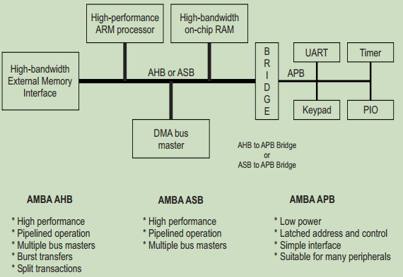
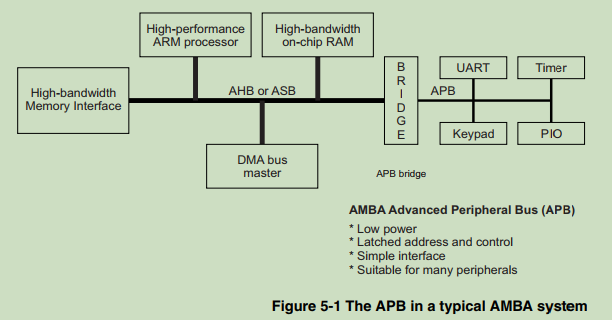
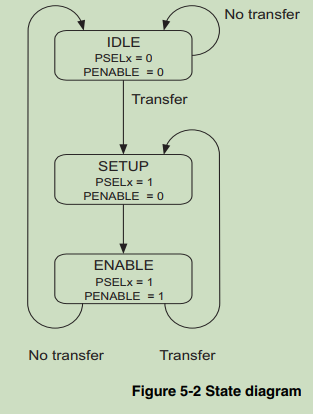
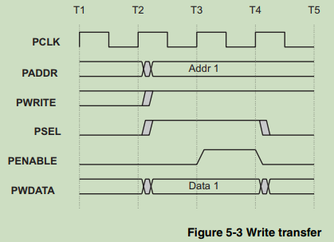
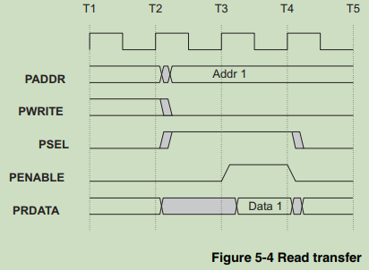

## 第一章 AMBA 总线介绍
### 1.1 AMBA 规范概述
&emsp;&emsp;高级微控制器总线架构（ Advanced Microcontroller Bus Architecture） (AMBA) 规范定义了用于设计高性能嵌入式微控制器的片上通信标准。 
&emsp;&emsp;AMBA 规范中定义了三种不同的总线： 
* the Advanced High-performance Bus (AHB)
* the Advanced System Bus (ASB)
* the Advanced Peripheral Bus (APB).

&emsp;&emsp;AMBA 规范中包含了一种测试方法，它为模块化宏单元测试和诊断访问提供了基础设施。 

#### 1.1.1 AHB
&emsp;&emsp;AMBA AHB 适用于高性能、高时钟频率的系统模块。
&emsp;&emsp;AHB 充当高性能系统主干总线。 AHB 支持处理器、片上存储器和片外外部存储器接口与低功耗外围宏单元功能的高效连接。 AHB 还被指定为使用综合和自动化测试技术确保在高效设计流程中的易用性。 

#### 1.1.2 ASB
&emsp;&emsp;AMBA ASB 用于高性能系统模块。
&emsp;&emsp;AMBA ASB 是一种替代系统总线，适用于不需要 AHB 的高性能特性的地方。 ASB 还支持处理器、片上存储器和片外外部存储器接口与低功耗外围宏单元功能的高效连接。 

#### 1.1.3 APB
&emsp;&emsp;AMBA APB 用于低功耗外设。
&emsp;&emsp;AMBA APB 针对最低功耗和降低接口复杂性进行了优化，以支持外围功能。 APB 可以与任一版本的系统总线结合使用。 

### 1.2 AMBA 规范的目标 
AMBA 规范是为了满足四个关键要求而制定的：
* 促进具有一个或多个 CPU 或信号处理器的嵌入式微控制器产品的首次开发成功
* 独立于技术，确保高度可重复使用的外围设备和系统宏单元可以跨各种 IC 工艺迁移，并适用于全定制、标准单元和门阵列技术
* 鼓励模块化系统设计以提高处理器的独立性，为高级缓存 CPU 内核和外围库的开发提供开发路线图
* 最大限度地减少支持操作和制造测试的有效片上和片外通信所需的硅基础设施。 

### 1.3 典型的基于 AMBA 的微控制器 
&emsp;&emsp;基于 AMBA 的微控制器通常由高性能系统主干总线（AMBA AHB 或 AMBA ASB）组成，能够维持 CPU、片上存储器和其他直接存储器访问 (DMA) 设备所在的外部存储器带宽 . 该总线在大多数传输中涉及的元素之间提供了一个高带宽接口。 位于高性能总线上的还有一个连接到较低带宽 APB 的桥，系统中的大多数外围设备都位于此处（见图 1-1）。 
  
&emsp;&emsp;AMBA APB 提供基本的外围宏单元通信基础设施，作为更高带宽流水线主系统总线的辅助总线。 此类外围设备通常：
* 具有内存映射寄存器的接口
* 没有高带宽接口
* 在程序控制下访问。 

&emsp;&emsp;外部存储器接口是特定于应用程序的，可能只有一个狭窄的数据路径，但也可能支持一种测试访问模式，该模式允许内部 AMBA AHB、ASB 和 APB 模块与系统无关的测试集进行隔离测试。 

### 1.4 术语 

### 1.5 介绍 AMBA AHB 
&emsp;&emsp;AHB 是新一代的 AMBA 总线，旨在满足高性能可综合设计的要求。 它是一种高性能系统总线，支持多个总线主控并提供高带宽操作。
&emsp;&emsp;AMBA AHB 实现了高性能、高时钟频率系统所需的功能，包括：
• 突发传输
• 拆分交易
• 单周期总线主控切换
• 单时钟边沿操作
• 非三态实现
• 更广泛的数据总线配置（64/128 位）。 

&emsp;&emsp;这种更高级别的总线与当前 ASB/APB 之间的桥接可以有效地完成，以确保任何现有设计都可以轻松集成。
&emsp;&emsp;AMBA AHB 设计可能包含一个或多个总线主控器，通常系统将至少包含处理器和测试接口。 然而，直接存储器访问 (DMA) 或数字信号处理器 (DSP) 作为总线主控器也很常见。
&emsp;&emsp;外部存储器接口、APB 桥和任何内部存储器是最常见的 AHB 从机。 系统中的任何其他外设也可以作为 AHB 从设备。 然而，低带宽外设通常驻留在 APB 上。
&emsp;&emsp;典型的 AMBA AHB 系统设计包含以下组件： 
* AHB 主机：总线主机能够通过提供地址和控制信息来启动读写操作。 任何时候都只允许一个总线主机主动使用总线。
* AHB 从机：总线从机响应给定地址空间范围内的读取或写入操作。 总线从机向活动主机发回数据传输成功、失败或等待的信号。
* AHB arbiter：总线仲裁器确保一次只允许一个总线主控器发起数据传输。 即使仲裁协议是固定的，任何仲裁算法，例如最高优先级或公平访问，都可以根据应用需求来实现。
AHB 将只包括一个仲裁器，尽管这在单总线主控系统中是不重要的。 
* AHB 解码器：AHB 解码器用于对每次传输的地址进行解码，并为传输中涉及的从机提供选择信号。
在所有 AHB 实现中都需要一个集中式解码器。 

### 1.6 介绍 AMBA ASB 

### 1.7 介绍 AMBA APB 
&emsp;&emsp;APB 是 AMBA 总线层次结构的一部分，并针对最低功耗和降低接口复杂性进行了优化。
&emsp;&emsp;AMBA APB 显示为本地辅助总线，封装为单个 AHB 或 ASB 从设备。 APB 为直接建立在 AHB 或 ASB 信号上的系统总线提供低功耗扩展。
&emsp;&emsp;APB 桥作为从模块出现，代表本地外围总线处理总线握手和控制信号重定时。通过从系统总线的起点定义 APB 接口，可以利用系统诊断和测试方法的优势。
&emsp;&emsp;AMBA APB 应该用于连接任何低带宽且不需要流水线总线接口的高性能的外设。
&emsp;&emsp;指定了 APB 的最新版本，以便所有信号转换仅与时钟的上升沿有关。这一改进确保 APB 外设可以轻松集成到任何设计流程中，具有以下优势：
* 高频操作更容易实现
* 性能与时钟的标记空间比无关
* 通过使用单个时钟沿简化静态时序分析
* 自动测试插入不需要特殊考虑
* 许多专用集成电路 (ASIC) 库具有更好的上升沿寄存器选择
* 与基于周期的模拟器轻松集成。

&emsp;&emsp;对 APB 的这些更改还使其与新 AHB 的接口变得更简单。
&emsp;&emsp;AMBA APB 实现通常包含一个 APB 桥，需要将 AHB 或 ASB 传输转换为适用于 APB 上从设备的格式。 该桥提供所有地址、数据和控制信号的锁存，以及提供第二级解码以生成用于 APB 外设的从设备选择信号。
&emsp;&emsp;APB 上的所有其他模块都是 APB 从机。 APB 从机具有以下接口规范： 
* 地址和控制在整个访问过程中有效（非流水线） 
* 非外围总线活动期间的零功耗接口（外围总线在不使用时是静态的）
* 定时可以通过解码与选通定时（非时钟接口）提供
* 写入对整个访问有效的数据（允许无故障透明锁存器实现）。 

## 第二章 AMBA Signals
&emsp;&emsp;本章介绍 AMBA 信号。 它包含以下部分：
* AMBA 信号名称（第 2-2 页）
* AMBA AHB 信号列表（第 2-3 页）
* AMBA ASB 信号列表（第 2-6 页）
* AMBA APB 信号列表（第 2-8 页）。 

### 2.1 AMBA 信号名称 
&emsp;&emsp;所有 AMBA 信号的命名方式使得名称的第一个字母表示该信号与哪个总线相关联。 信号名称中的小写 n 表示信号为低电平有效，否则信号名称始终为大写。
&emsp;&emsp;无论总线类型如何，测试信号都有前缀 T。 有关测试信号的更多信息，请参见第 6 章 AMBA 测试方法。 

#### 2.1.1 AHB 信号前缀 
&emsp;&emsp;H：表示AHB信号。
&emsp;&emsp;例如，HREADY 是用于指示 AHB 传输的数据部分可以完成的信号。 它处于高电平有效状态。 

#### 2.1.2 ASB 信号前缀 
&emsp;&emsp;&emspA 是 ASB 总线主机和仲裁器之间的单向信号
&emsp;&emsp;&emspB 是 ASB 信号
&emsp;&emsp;&emspD 是单向 ASB 解码器信号。
&emsp;&emsp;&emsp例如，BnRES 是 ASB 复位信号。 低电平有效。 

#### 2.1.3 APB 信号前缀 
&emsp;&emsp;P 表示APB信号。
&emsp;&emsp;例如，PCLK 是 APB 使用的主时钟。 

### 2.4 AMBA APB 信号列表
&emsp;&emsp;所有 AMBA APB 信号都使用单字母 P 前缀。 某些 APB 信号，例如时钟，可以直接连接到系统总线等效信号。
&emsp;&emsp;表 2-4 显示了 AMBA APB 信号名称列表，以及如何使用每个信号的说明。 

| Name                         | Description                                                  |
| ---------------------------- | ------------------------------------------------------------ |
| PCLK 总线时钟            | PCLK 的上升沿用于对 APB 上的所有传输进行计时。               |
| PRESETn APB 复位         | APB 总线复位信号为低电平有效，该信号通常直接连接到系统总线复位信号。 |
| PADDR[31:0] APB 地址总线 | 这是 APB 地址总线，最高可达 32 位宽，由外围总线桥单元驱动。  |
| PSELx APB select         | 从外围总线桥单元内的次级解码器到每个外围总线从设备x的信号。 该信号表示选择了从设备并且需要进行数据传输。 每个总线从机都有一个 PSELx 信号。 |
| PENABLE APB strobe       | 该选通信号用于对外围总线上的所有访问进行计时。 使能信号用于指示 APB 传输的第二个周期。 PENABLE 的上升沿发生在 APB 传输的中间。 |
| PWRITE APB 传输方向      | 该信号为高电平时表示 APB 写访问，低电平时表示读访问。        |
| PRDATA APB 读数据总线    | 在读取周期（当 PWRITE 为低电平时），读取数据总线由选定的从机来驱动。 读取数据总线最高可达 32 位宽。 |
| PWDATA APB 写数据总线    | 写数据总线在写周期（当 PWRITE 为高电平时）由外围总线桥单元来驱动。 写数据总线最高可达 32 位宽。 |

## 第五章 AMBA APB
&emsp;&emsp;本章在以下章节中介绍了高级微控制器总线架构 (AMBA) 高级外设总线 (APB) 规范：
* 关于 AMBA APB 第 5-2 页
* APB 规范（第 5-4 页）
* 关于 APB AMBA 组件（第 5-7 页）
* APB 桥（第 5-8 页）
* APB 从站（第 5-11 页）
* 将 APB 连接到 AHB（第 5-14 页）
* 将 APB 连接到 ASB（第 5-20 页）
* 将rev D APB 外围设备连接到rev 2.0 APB（第5-22 页）。 

&emsp;&emsp;高级外设总线 (APB) 是高级微控制器总线架构 (AMBA) 总线层次结构的一部分，并针对最低功耗和降低接口复杂性进行了优化。
&emsp;&emsp;AMBA APB 应该用于连接任何低带宽且不需要流水线总线接口的高性能的外设。
&emsp;&emsp;APB 的最新版本确保所有信号转换仅与时钟的上升沿有关。 这一改进意味着 APB 外设可以轻松集成到任何设计流程中，具有以下优势： 
* 提高高频操作时的性能
* 性能与时钟的标记空间比无关
* 通过使用单个时钟沿简化静态时序分析
* 自动测试插入不需要特殊考虑
* 许多专用集成电路 (ASIC) 库具有更好的上升沿寄存器选择
* 与基于周期的模拟器轻松集成。 

&emsp;&emsp;对 APB 的这些更改还使其与新的高级高性能总线 (AHB) 的接口变得更加简单。 

#### 5.1.1 典型的基于 AMBA 的微控制器 
&emsp;&emsp;基于 AMBA 的微控制器通常包含一个高性能系统主干总线，能够维持 CPU 和其他直接内存访问 (DMA) 设备所在的外部内存带宽，以及一个连接到更窄的 APB 总线的桥， 较低带宽的外围设备位于此 APB 总线桥。 图 5-1 显示了典型 AMBA 系统中的 APB。 
  
&emsp;&emsp;包含测试接口控制器 (TIC) 的系统总线允许对系统总线和 APB 模块进行模块化测试。 

### 5.2 APB 规范 
APB 规范在以下标题下进行了描述：
* 状态图
* 写传输
* 读传输

#### 5.2.1 状态图
&emsp;&emsp;状态图，如图 5-2 所示，可用于表示外围总线的活动。 
  
&emsp;&emsp;状态机的操作是通过下面描述的三个状态：
* IDLE：外设总线的默认状态。
* SETUP：当需要传输时，总线进入 SETUP 状态，此时相应的选择信号 PSELx 被置位。 总线仅在一个时钟周期内保持在 SETUP 状态，并且总是在时钟的下一个上升沿移动到 ENABLE 状态。 
* ENABLE：在 ENABLE 状态下，启用信号 PENABLE 被断言。 在从 SETUP 到 ENABLE 状态的转换期间，地址、写入和选择信号都保持稳定。
ENABLE 状态也只持续一个时钟周期，在此状态之后，如果不需要进一步传输，总线将返回 IDLE 状态。 或者，如果要进行另一次传输，则总线将直接进入 SETUP 状态。
在从 ENABLE 状态到 SETUP 状态的转换期间，地址、写入和选择信号出现毛刺是可以接受的。

#### 5.2.2 写传输
&emsp;&emsp;基本的写传输如图 5-3 所示。 
  
&emsp;&emsp;写传输，在时钟上升沿之后，地址、写数据、写信号和选择信号都开始传输。 传输的第一个时钟周期称为 SETUP 周期。 在下一个时钟沿之后，使能信号 PENABLE 被断言，这表明 ENABLE 周期正在发生。 **地址、数据和控制信号在整个使能周期都保持有效**。 传输在此周期结束时完成。
&emsp;&emsp;使能信号 PENABLE 将在传输结束时置低。 选择信号也将变为低电平，除非在传输之后立即向同一外设进行另一次传输。
&emsp;&emsp;为了降低功耗，地址信号和写信号在传输后不会改变，直到下一次访问发生。 
&emsp;&emsp;该协议只需要使能信号上的干净转换。 在背靠背传输的情况下，选择信号和写入信号可能会出现故障。 

#### 5.2.3 读传输
&emsp;&emsp;图 5-4 显示了一个读传输。 
  
&emsp;&emsp;地址、写、选择和选通信号的时序都与写传输相同。 在读取的情况下，从机必须在 ENABLE 周期内提供数据。 数据在 ENABLE 周期结束时的时钟上升沿采样。 

