# 一 软件安装
## 1.1 Typora
###### 下载太慢
镜像：[typora国内镜像地址](https://gitee.com/typora-mirror/Typora-Mirror/releases)


# 二 软件使用
## 2.1 markdown
###### 首行缩进
```shell
半方大的空白&ensp;或&#8194;
全方大的空白&emsp;或&#8195;
不断行的空白格&nbsp;或&#160;
```
注意：不要漏掉分号

###### 添加目录
1、[toc]
2、在vscode中安装插件`Markdown All in One`，安装后点开md文件，然后快捷键`CTRL+SHIFT+P`，输入`Markdown All in One: Create Table of Contents`，回车即可。

###### 生成侧边目录
1、安装nodejs
[nodejs下载地址](https://nodejs.org/en/)
2、测试是否安装成功
在cmd下输入npm -v查看版本号
3、安装插件
```shell
npm install -g i5ting_toc
```
4、在笔记.md文件下执行
```shell
i5ting_toc -f demo.md -o
```

###### markdonw中输入公式
[参考链接](https://www.jianshu.com/p/25f0139637b7)

###### 下划线
\<u> 文字\</u>
<u> 文字</u>

###### 表格内换行
\<br>

###### markdown preview enhanced
&emsp;&emsp;预览的背景色是黑色的，安装此插件，在预览界面右击，选择`preview theme`，如下图所示，选择所需背景色即可。
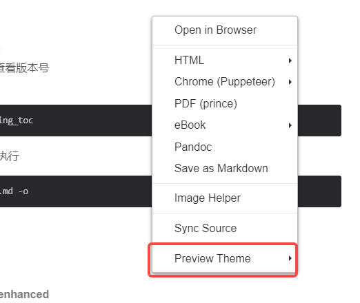

###### 插入指定大小的图片
<div align=center>

</div>

## 2.2 Git
###### git命令中文显示乱码
使用git add添加要提交的文件的时候，如果文件名是中文，会显示形如`\344\270\264\346\227\266\347\254\224\350\256\260/\344\270\264\346\227\266\347\254\224\350\256\260.md`的乱码，
解决方案：在bash提示符下输入`git config --global core.quotepath false`
core.quotepath设为false的话，就不会对0x80以上的字符进行quote。中文显示正常。

## 2.3 github
###### github访问速度慢
修改hosts文件。
* 修改hosts文件原理  
&emsp;&emsp;hosts文件是一个用于储存计算机网络中各节点信息的计算机文件。这个文件负责将主机名映射到相应的IP地址。hosts文件通常用于补充或取代网络中DNS的功能。和DNS不同的是，计算机的用户可以直接对hosts文件进行控制。  
&emsp;&emsp;为了方便用户记忆，我们将IP地址映射的域名来输入到浏览器进行访问。而这使得访问网站时要先将其域名解析成IP。DNS (Domain Name Server) 的作用就是进行 IP解析，把域名对应到IP。  
&emsp;&emsp;Hosts文件本来是用来提高解析效率。在进行DNS请求以前，系统会先检查自己的Hosts文件中是否有这个地址映射关系，如果有则调用这个IP地址映射，如果没有再向已知的DNS服务器提出域名解析。也就是说Hosts的请求级别比DNS高。当你的Hosts文件里面有对应的IP时，它就会直接访问那个IP，而不用通过DNS。  
* 修改本地hosts文件
windows系统的hosts文件的位置如下：`C:\Windows\System32\drivers\etc`
* 增加`http://github.global.ssl.fastly.net`和`https://github.com/`的映射
获取github相关网站的ip
访问`https://www.ipaddress.com`，在下图所示位置分别输入`github.com`和`github.global.ssl.fastly.net`，如图所示：  
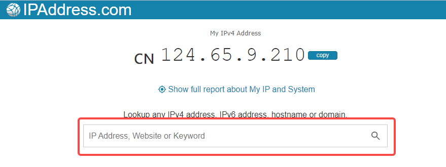  
然后得到对应的ip地址，如图所示：  
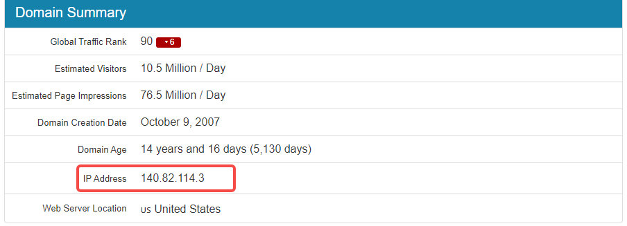  
* 修改hosts文件，如下图所示：  
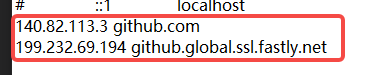  
此时可以快速访问github了。

## 2.4 Vmware
###### 未能启动虚拟机
&emsp;&emsp;出现如下所示信息：  
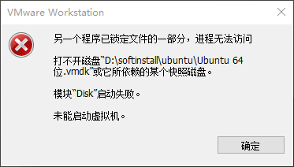  
&emsp;&emsp;原因：这是一种虚拟机的保护机制。虚拟机在运行时，为防止数据被篡改，会将所运行的文件保护起来。当虚拟机突然崩溃或者强制结束导致异常退出，会导致虚拟机来不及解锁保护文件这样在下一次运行时就会出现报错问题。  
&emsp;&emsp;进入虚拟机安装目录，删除.lck为后缀的文件，如下所示：  
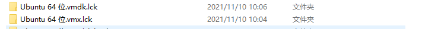

#### vmware网络配置
##### 1 NAT 模式和桥接模式的区别
&emsp;&emsp;如图所示：  
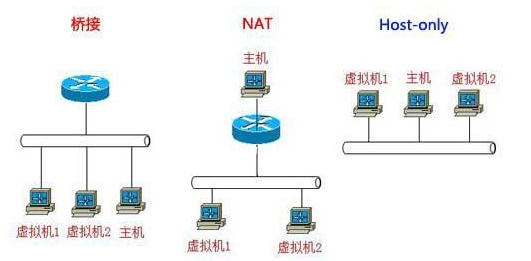  
* NAT模式：把物理机作为路由器进行上网，只要PC能上网，虚拟机内的系统也能上网。由于经过了PC的路由器角色转换，虚拟机内的系统已经是PC的一个子网设备，它可以与PC及PC层的其它机器通信，但是PC层的其它机器却无法跟虚拟机内的系统通信。如果将开发板接入路由器，则开发板不能与虚拟机ping通，所以在开发的时候，最好采用桥接模式去联网！
* 桥接需要得有个路由器，PC机使用有线或者无线连接到能上网的路由器上，将虚拟机内的系统模拟成一台局域网内单独的主机，虚拟机内的系统可以跟整个局域网内的所有设备进行双向通信，如果再将你的开发板接入路由器，那么三者互ping没有任何问题。因此在进行开发的时候，推荐使用桥接联网方式！可以想象虚拟机和host机处于对等地位，在网络关系上是平等的。

##### 2 配置为桥接模式的方法
###### 2.1 配置vmware为桥接模式
&emsp;&emsp;如下图所示：
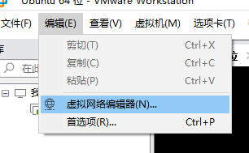 
###### 2.2 选择网卡 
&emsp;&emsp;选择桥接模式（有可能需要点击`更改设置`才会出现），选择物理机对应的网卡（可以通过下图所示路径在物理机上查看），如下图所示：  
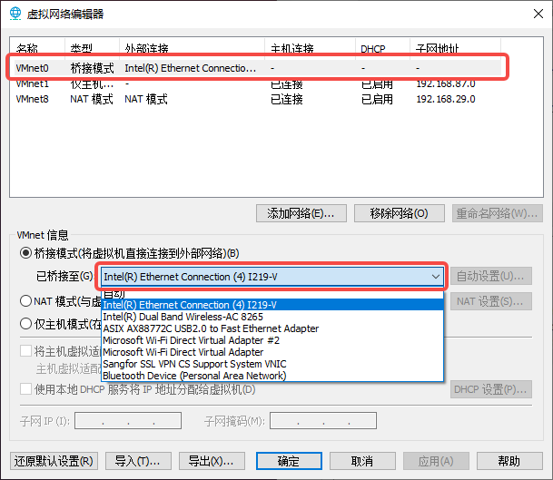  
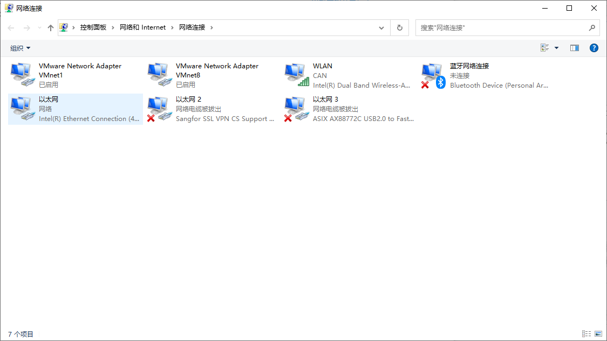  
###### 2.3 将对应虚拟机配置为桥接模式
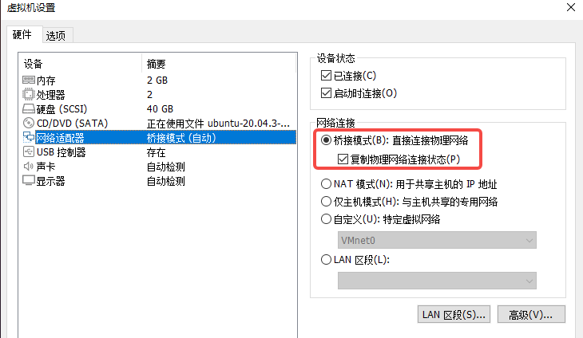
###### 2.4 在虚拟机中配置静态IP
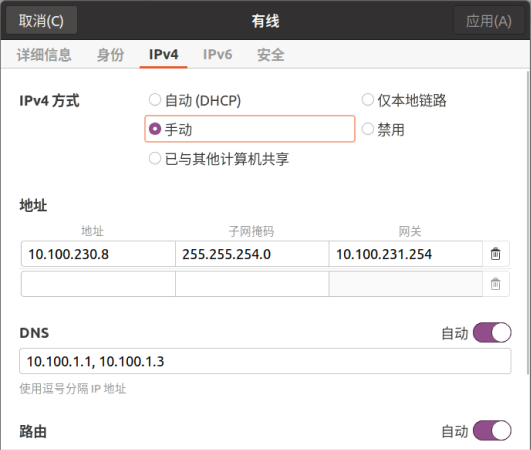
&emsp;&emsp;要保持虚拟机和主机在同一个网络段，使用同一个网关。此时就完成了配置，可以检测是否能够ping通物理机，如果不能，可以尝试关闭防火墙等设置。


#### samba 配置及使用
[参考连接](https://www.cnblogs.com/gzdaijie/p/5194033.html)
##### 1 安装方法
###### 1.1 安装samba
```shell
sudo apt-get install samba
```
###### 1.2 创建共享目录
```shell
// 创建的目录即之后能够在Windows主机上直接访问的目录。
mkdir /home/mara
// 由于Windows下的文件夹需可读可写可执行，需更改权限为777
sudo chmod 777 /home/mara
// 如果使用已存在的目录，只需更改相应目录的权限即可。
```
###### 1.3 修改samba配置文件
```shell
// 修改 /etc/samba/smb.conf
sudo vim /etc/samba/smb.conf
// 在smb.conf文件最后加上以下内容
[share]
path = /home/mara
public = yes
writable = yes
valid users = mara
create mask = 0644
force create mode = 0644
directory mask = 0755
force directory mode = 0755
available = yes
```
&emsp;&emsp;关于smb.conf的几点解释：
* [share]表示共享文件夹的别名，之后将直接使用这个别名
* `force create mode` 与 `force directory mode`的设置是因为Windows下与Linux下文件和文件夹的默认权限不同造成的，Windows下新建的文件是可执行的，必须强制设定其文件权限。
* valid users 设置为你当前的Linux用户名。
###### 1.4 设置登录密码
```shell
// 新建/etc/samba/smbpasswd文件
sudo touch /etc/samba/smbpasswd
// 根据1.3设置的valid users，设置用户密码
// mara 替换为你在1.3中设置的用户名
sudo smbpasswd -a mara
// 输入两次密码后，会提示 Added user mara. 表示设置成功
// 若用户名非当前登录系统的用户名，可能会提示Failed
```
###### 1.5 启动samba服务器
```shell
sudo /etc/init.d/samba restart
```
###### 1.6 测试是否共享成功
```shell
sudo apt-get install smbclient 
smbclient -L //localhost/share
//share为1.3中设置的共享文件夹的别名
//如果共享成功，将要求输入之前设置的密码
```
##### 2 在windows上进行连接
###### 方法一
&emsp;&emsp;打开windows文件管理器，输入`\\服务器ip地址`或`主机名\share`，linux服务器地址可以通过ifconfig命令查看。
###### 方法二
&emsp;&emsp;方法一可以在`此电脑->网络`中看到Linux服务器的文件，但是用vscode或者source insight中打开文件夹时无法打开。可以通过下面的方法来进行操作：
```shell
net use  z: \\192.168.31.118\share  /user:mara  /persistent:yes
```
&emsp;&emsp;其中share是上面配置的别名，也可以使用设置的完整路径，user是Linux服务器的用户名。可以查一下`net use`命令的用法。

## 2.5 source insight
###### Add All 和 Add Tree的区别
&emsp;&emsp;选中一个文件夹，add按钮，此文件夹会展开，只是用来添加.c、.h等单个文件的。
&emsp;&emsp;点击Add All会出现一个选项界面，有两个选项`include top level sub-directories`和`recursively add lower sub-directories`，第一个表示不仅添加选中文件夹下的文件，还会添加子文件夹中的文件；第二个表示，不仅添加选中文件夹及其子文件夹中的文件，还会添加子文件夹的子文件夹中的文件，即递归添加目录中所有子目录的所有文件。
&emsp;&emsp;Add Tree：可以递归的添加所选中目录中所有子目录下的所有文件。 与Add All中`Recursively add lower sub-directories`选项不同的是：Add All选中了File Name中的所有文件和目录，而Add Tree是想对File Name中的哪个目录进行递归添加文件就对哪个目录中的文件进行递归添加。

###### 添加新的文件类型
&emsp;&emsp;后缀是`.dts``.dtsi`这样后缀的文件，source insight 默认是不识别的，因此需要手动添加。
&emsp;&emsp;`option->file type option`，选中`C/C++ source File`，在`File filter`中添加`;.dts`即可。

## 2.6 Visio
###### 只导出有流程图的部分
&emsp;&emsp;设计-->大小-->适应绘图
###### 导出矢量图片
&emsp;&emsp;文件-->另存为-->选择位置-->保存类型-->可缩放的向量图形.svg

## 2.7 vscode
### 2.7.1 vscode 在 windows 下编译 c 程序
#### 2.7.1.1 安装 vscode

#### 2.7.1.2 安装 mingw64
&emsp;&emsp;安装 Mingw64，[官方网站](https://www.mingw-w64.org/)  
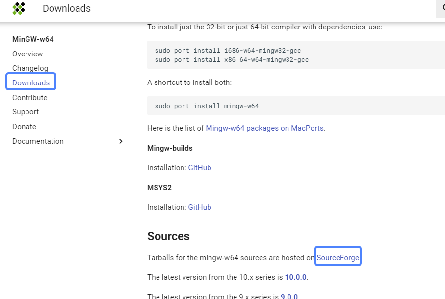 


###### tab 设置为 4 个空格
1. 在设置中找到`Editor:Tab Size`，设置成 4.
2. 找到`Editor:Detect Indentation`，去掉此选项，否则可能会根据文件内容自动推测空格数。如下图所示：
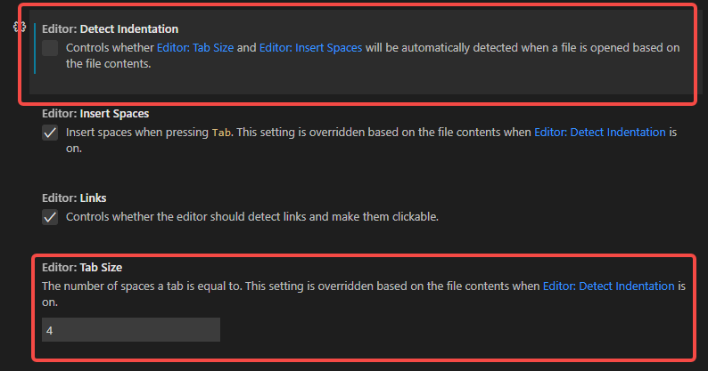


## 2.8 drawio
###### 连接线任意位置连接
&emsp;&emsp;按住 alt，同时移动起始点或者终点。

###### 容器颜色填充
&emsp;&emsp;泳道颜色即是容器的填充颜色。

## 2.9 windows 常用操作
###### 窗口跑到屏幕之外的操作
1. `alt + tab`切换你打开的内容为当前窗口；
2. 使用`alt + 空格键`激活菜单；
3. 再按`M`（移动）；
4. 最后通过`上下左右`方向键移窗口至可视范围，回车即可。