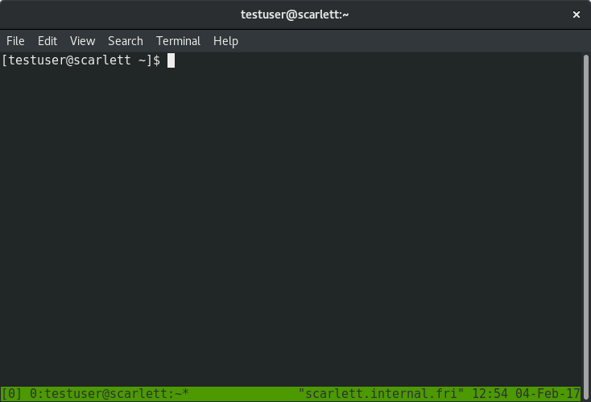

[toc]

# 一 软件安装
## 1.1 Typora
###### 下载太慢
镜像：[typora国内镜像地址](https://gitee.com/typora-mirror/Typora-Mirror/releases)


# 二 软件使用
## 2.1 markdown
###### 首行缩进
```shell
半方大的空白&ensp;或&#8194;
全方大的空白&emsp;或&#8195;
不断行的空白格&nbsp;或&#160;
```
注意：不要漏掉分号

###### 添加目录
1、[toc]
2、在vscode中安装插件`Markdown All in One`，安装后点开md文件，然后快捷键`CTRL+SHIFT+P`，输入`Markdown All in One: Create Table of Contents`，回车即可。

###### 生成侧边目录
1、安装nodejs
[nodejs下载地址](https://nodejs.org/en/)
2、测试是否安装成功
在cmd下输入npm -v查看版本号
3、安装插件
```shell
npm install -g i5ting_toc
```
4、在笔记.md文件下执行
```shell
i5ting_toc -f demo.md -o
```

###### markdonw中输入公式
[参考链接](https://www.jianshu.com/p/25f0139637b7)

###### 下划线
\<u> 文字\</u>
<u> 文字</u>

###### 表格内换行
\<br>

###### markdown preview enhanced
&emsp;&emsp;预览的背景色是黑色的，安装此插件，在预览界面右击，选择`preview theme`，如下图所示，选择所需背景色即可。


###### 插入指定大小的图片
<div align=center>

</div>

## 2.2 Git
###### git命令中文显示乱码
使用git add添加要提交的文件的时候，如果文件名是中文，会显示形如`\344\270\264\346\227\266\347\254\224\350\256\260/\344\270\264\346\227\266\347\254\224\350\256\260.md`的乱码，
解决方案：在bash提示符下输入`git config --global core.quotepath false`
core.quotepath设为false的话，就不会对0x80以上的字符进行quote。中文显示正常。

## 2.3 github
###### github访问速度慢
修改hosts文件。
* 修改hosts文件原理  
&emsp;&emsp;hosts文件是一个用于储存计算机网络中各节点信息的计算机文件。这个文件负责将主机名映射到相应的IP地址。hosts文件通常用于补充或取代网络中DNS的功能。和DNS不同的是，计算机的用户可以直接对hosts文件进行控制。  
&emsp;&emsp;为了方便用户记忆，我们将IP地址映射的域名来输入到浏览器进行访问。而这使得访问网站时要先将其域名解析成IP。DNS (Domain Name Server) 的作用就是进行 IP解析，把域名对应到IP。  
&emsp;&emsp;Hosts文件本来是用来提高解析效率。在进行DNS请求以前，系统会先检查自己的Hosts文件中是否有这个地址映射关系，如果有则调用这个IP地址映射，如果没有再向已知的DNS服务器提出域名解析。也就是说Hosts的请求级别比DNS高。当你的Hosts文件里面有对应的IP时，它就会直接访问那个IP，而不用通过DNS。  
* 修改本地hosts文件
windows系统的hosts文件的位置如下：`C:\Windows\System32\drivers\etc`
* 增加`http://github.global.ssl.fastly.net`和`https://github.com/`的映射
获取github相关网站的ip
访问`https://www.ipaddress.com`，在下图所示位置分别输入`github.com`和`github.global.ssl.fastly.net`，如图所示：  
  
然后得到对应的ip地址，如图所示：  
  
* 修改hosts文件，如下图所示：  
  
此时可以快速访问github了。

## 2.4 Vmware
###### 未能启动虚拟机
&emsp;&emsp;出现如下所示信息：  
  
&emsp;&emsp;原因：这是一种虚拟机的保护机制。虚拟机在运行时，为防止数据被篡改，会将所运行的文件保护起来。当虚拟机突然崩溃或者强制结束导致异常退出，会导致虚拟机来不及解锁保护文件这样在下一次运行时就会出现报错问题。  
&emsp;&emsp;进入虚拟机安装目录，删除.lck为后缀的文件，如下所示：  


#### vmware网络配置
##### 1 NAT 模式和桥接模式的区别
&emsp;&emsp;如图所示：  
  
* NAT模式：把物理机作为路由器进行上网，只要PC能上网，虚拟机内的系统也能上网。由于经过了PC的路由器角色转换，虚拟机内的系统已经是PC的一个子网设备，它可以与PC及PC层的其它机器通信，但是PC层的其它机器却无法跟虚拟机内的系统通信。如果将开发板接入路由器，则开发板不能与虚拟机ping通，所以在开发的时候，最好采用桥接模式去联网！
* 桥接需要得有个路由器，PC机使用有线或者无线连接到能上网的路由器上，将虚拟机内的系统模拟成一台局域网内单独的主机，虚拟机内的系统可以跟整个局域网内的所有设备进行双向通信，如果再将你的开发板接入路由器，那么三者互ping没有任何问题。因此在进行开发的时候，推荐使用桥接联网方式！可以想象虚拟机和host机处于对等地位，在网络关系上是平等的。

##### 2 配置为桥接模式的方法
###### 2.1 配置vmware为桥接模式
&emsp;&emsp;如下图所示：
 
###### 2.2 选择网卡 
&emsp;&emsp;选择桥接模式（有可能需要点击`更改设置`才会出现），选择物理机对应的网卡（可以通过下图所示路径在物理机上查看），如下图所示：  
  
  
###### 2.3 将对应虚拟机配置为桥接模式

###### 2.4 在虚拟机中配置静态IP

&emsp;&emsp;要保持虚拟机和主机在同一个网络段，使用同一个网关。此时就完成了配置，可以检测是否能够ping通物理机，如果不能，可以尝试关闭防火墙等设置。


#### samba 配置及使用
[参考连接](https://www.cnblogs.com/gzdaijie/p/5194033.html)
##### 1 安装方法
###### 1.1 安装samba
```shell
sudo apt-get install samba
```
###### 1.2 创建共享目录
```shell
// 创建的目录即之后能够在Windows主机上直接访问的目录。
mkdir /home/mara
// 由于Windows下的文件夹需可读可写可执行，需更改权限为777
sudo chmod 777 /home/mara
// 如果使用已存在的目录，只需更改相应目录的权限即可。
```
###### 1.3 修改samba配置文件
```shell
// 修改 /etc/samba/smb.conf
sudo vim /etc/samba/smb.conf
// 在smb.conf文件最后加上以下内容
[share]
path = /home/mara
public = yes
writable = yes
valid users = mara
create mask = 0644
force create mode = 0644
directory mask = 0755
force directory mode = 0755
available = yes
```
&emsp;&emsp;关于smb.conf的几点解释：
* [share]表示共享文件夹的别名，之后将直接使用这个别名
* `force create mode` 与 `force directory mode`的设置是因为Windows下与Linux下文件和文件夹的默认权限不同造成的，Windows下新建的文件是可执行的，必须强制设定其文件权限。
* valid users 设置为你当前的Linux用户名。
###### 1.4 设置登录密码
```shell
// 新建/etc/samba/smbpasswd文件
sudo touch /etc/samba/smbpasswd
// 根据1.3设置的valid users，设置用户密码
// mara 替换为你在1.3中设置的用户名
sudo smbpasswd -a mara
// 输入两次密码后，会提示 Added user mara. 表示设置成功
// 若用户名非当前登录系统的用户名，可能会提示Failed
```
###### 1.5 启动samba服务器
```shell
sudo /etc/init.d/samba restart
```
###### 1.6 测试是否共享成功
```shell
sudo apt-get install smbclient 
smbclient -L //localhost/share
//share为1.3中设置的共享文件夹的别名
//如果共享成功，将要求输入之前设置的密码
```
##### 2 在windows上进行连接
###### 方法一
&emsp;&emsp;打开windows文件管理器，输入`\\服务器ip地址`或`主机名\share`，linux服务器地址可以通过ifconfig命令查看。
###### 方法二
&emsp;&emsp;方法一可以在`此电脑->网络`中看到Linux服务器的文件，但是用vscode或者source insight中打开文件夹时无法打开。可以通过下面的方法来进行操作：
```shell
net use  z: \\192.168.31.118\share  /user:mara  /persistent:yes
```
&emsp;&emsp;其中share是上面配置的别名，也可以使用设置的完整路径，user是Linux服务器的用户名。可以查一下`net use`命令的用法。

## 2.5 source insight
###### Add All 和 Add Tree的区别
&emsp;&emsp;选中一个文件夹，add按钮，此文件夹会展开，只是用来添加.c、.h等单个文件的。
&emsp;&emsp;点击Add All会出现一个选项界面，有两个选项`include top level sub-directories`和`recursively add lower sub-directories`，第一个表示不仅添加选中文件夹下的文件，还会添加子文件夹中的文件；第二个表示，不仅添加选中文件夹及其子文件夹中的文件，还会添加子文件夹的子文件夹中的文件，即递归添加目录中所有子目录的所有文件。
&emsp;&emsp;Add Tree：可以递归的添加所选中目录中所有子目录下的所有文件。 与Add All中`Recursively add lower sub-directories`选项不同的是：Add All选中了File Name中的所有文件和目录，而Add Tree是想对File Name中的哪个目录进行递归添加文件就对哪个目录中的文件进行递归添加。

###### 添加新的文件类型
&emsp;&emsp;后缀是`.dts``.dtsi`这样后缀的文件，source insight 默认是不识别的，因此需要手动添加。
&emsp;&emsp;`option->file type option`，选中`C/C++ source File`，在`File filter`中添加`;.dts`即可。

## 2.6 Visio
###### 只导出有流程图的部分
&emsp;&emsp;设计-->大小-->适应绘图
###### 导出矢量图片
&emsp;&emsp;文件-->另存为-->选择位置-->保存类型-->可缩放的向量图形.svg

## 2.7 vscode
### 2.7.1 vscode 在 windows 下编译 c 程序
#### 2.7.1.1 安装 vscode

#### 2.7.1.2 安装 mingw64
&emsp;&emsp;安装 Mingw64，[官方网站](https://www.mingw-w64.org/)  
 


###### tab 设置为 4 个空格
1. 在设置中找到`Editor:Tab Size`，设置成 4.
2. 找到`Editor:Detect Indentation`，去掉此选项，否则可能会根据文件内容自动推测空格数。如下图所示：


## 2.8 drawio
###### 连接线任意位置连接
&emsp;&emsp;按住 alt，同时移动起始点或者终点。

###### 容器颜色填充
&emsp;&emsp;泳道颜色即是容器的填充颜色。

###### 文本框中添加换行符
&emsp;&emsp;shift + enter

## 2.9 windows 常用操作
###### 窗口跑到屏幕之外的操作
1. `alt + tab`切换你打开的内容为当前窗口；
2. 使用`alt + 空格键`激活菜单；
3. 再按`M`（移动）；
4. 最后通过`上下左右`方向键移窗口至可视范围，回车即可。


## 2.9 tmux
#### 2.9.1 安装 tmux（无 root 权限）
&emsp;&emsp;无 root 权限安装 tmux 方法如下，[原文链接](https://blog.csdn.net/banfushen007/article/details/109983826)
&emsp;&emsp;为什么没有 root，就无法使用 apt-get，因为 apt-get 是会去写一些文件到 root 用户才有权限的文件夹（例如/user）或者修改系统环境变量的。而普通用户是没有权限，所以没法使用。  
&emsp;&emsp;要解决这个问题，最主要的方法就是，修改安装的目录，添加自己用户下指定目录为环境变量。下面是安装 tmux 的方法：
##### 2.9.1.1 下载 tmux 及其依赖软件
```shell
wget -c https://github.com/tmux/tmux/releases/download/3.0a/tmux-3.0a.tar.gz 
 
wget -c https://github.com/libevent/libevent/releases/download/release-2.1.11-stable/libevent-2.1.11-stable.tar.gz 
 
wget -c https://ftp.gnu.org/gnu/ncurses/ncurses-6.2.tar.gz
```

##### 2.9.1.2 解压
```shell
tar -zxvf xxx
```

##### 2.9.1.3 先安装依赖，再安装 tmux
```shell
# libevent
./configure --prefix=$HOME/.local --disable-shared
make && make install
 
# ncurses
./configure --prefix=$HOME/.local
make && make install
 
# tmux
./configure CFLAGS="-I$HOME/.local/include -I$HOME/.local/include/ncurses" LDFLAGS="-L$HOME/.local/lib -L$HOME/.local/include/ncurses -L$HOME/.local/include" --prefix=$HOME/.local/bin
make && make install
 
cp tmux $HOME/.local/bin
```

#### 2.9.2 安装 tmux（root 权限）
```shell
# Ubuntu 或 Debian
$ sudo apt-get install tmux

# CentOS 或 Fedora
$ sudo yum install tmux

# Mac
$ brew install tmux
```


#### 2.9.3 tmux 是什么
##### 2.9.3.1 会话与进程
&emsp;&emsp;命令行的典型使用方式是，打开一个终端窗口（terminal window），在里面输入命令。用户与计算机的这种临时的交互，称为一次“会话”（session）。
&emsp;&emsp;会话的一个重要特点是，窗口与其中启动的进程是连在一起的。打开窗口，会话开始；关闭窗口，会话结束，会话内部的进程也会随之终止，不管有没有运行完。
&emsp;&emsp;一个典型的例子就是，SSH 登录远程计算机，打开一个远程窗口执行命令。这是，网络突然断线，再次登录的时候，是找不回上一次执行的命令的。因为上一次 SSH 会话已经终止了，里面的进程也随之消失了。
&emsp;&emsp;为了解决这个问题，会话与窗口可以“解绑”：窗口关闭时，会话并不终止，而是继续执行，等到以后需要的时候，再让会话“绑定”其他窗口。

##### 2.9.3.2 Tmux 的作用
&emsp;&emsp;Tmux 就是会话与窗口的“解绑”工具，将它们彻底分离。
```shell
1. 它允许在单个窗口中，同时访问多个会话。这对于同时运行多个命令行程序很有用。
2. 它可以让新窗口“接入”已经存在的会话。
2. 它允许每个会话有多个连接窗口，因此可以多人实时共享会话。
3. 它还支持窗口任意的垂直和水平拆分。
```
&emsp;&emsp;类似的终端复用器还有 GNU Screen。Tmux 与它功能相似，但是更易用，也更强大。

#### 2.9.4 基本用法
##### 2.9.4.1 启动与退出
&emsp;&emsp;安装完成后，键入`tmux`命令，就进入了 Tmux 窗口。
```shell
tmux
```
&emsp;&emsp;上面命令会启动 Tmux 窗口，底部有一个状态栏。状态栏的左侧是窗口信息（编号和名称），右侧是系统信息。
  
&emsp;&emsp;按下`Ctrl+d`或者显式输入`exit`命令，就可以退出 Tmux 窗口。
```shell
exit
```

##### 2.9.4.2 前缀键
&emsp;&emsp;Tmux 窗口有大量的快捷键。所有快捷键都要通过前缀键唤起。默认的前缀键是`Ctrl+b`，即先按下`Ctrl+b`，快捷键才会生效。
&emsp;&emsp;举例来说，帮助命令的快捷键是`Ctrl+b ?`。它的用法是，在 Tmux 窗口中，先按下`Ctrl+b`，再按下`?`，就会显示帮助信息。
&emsp;&emsp;然后，按下`ESC`键或`q`键，就可以退出帮助。

#### 2.9.5 会话管理
##### 2.9.5.1 新建会话
&emsp;&emsp;第一个启动的 Tmux 窗口，编号是0，第二个窗口的编号是1，以此类推。这些窗口对应的会话，就是 0 号会话、1 号会话。
&emsp;&emsp;使用编号区分会话，不太直观，更好的方法是为会话起名。
```shell
tmux new -s <session-name>
```
&emsp;&emsp;上面命令新建一个指定名称的会话。
##### 2.9.5.2 分离会话
&emsp;&emsp;在 Tmux 窗口中，按下Ctrl+b d或者输入tmux detach命令，就会将当前会话与窗口分离。
```shell
tmux detach
```
&emsp;&emsp;上面命令执行后，就会退出当前 Tmux 窗口，但是会话和里面的进程仍然在后台运行。
&emsp;&emsp;`tmux ls`命令可以查看当前所有的 Tmux 会话。
```shell
tmux ls
or
tmux list-session
```
##### 2.9.5.3 接入会话
&emsp;&emsp;`tmux attach`命令用于重新接入某个已存在的会话。
```shell
# 使用会话编号
tmux attach -t 0

# 使用会话名称
tmux attach -t <session-name>
```

##### 2.9.5.4 杀死会话
&emsp;&emsp;tmux kill-session命令用于杀死某个会话。
```shell
# 使用会话编号
tmux kill-session -t 0

# 使用会话名称
tmux kill-session -t <session-name>
```

##### 2.9.5.5 切换会话
&emsp;&emsp;tmux switch命令用于切换会话。
```shell
# 使用会话编号
tmux switch -t 0

# 使用会话名称
tmux switch -t <session-name>
```

##### 2.9.5.6 重命名会话
&emsp;&emsp;tmux rename-session命令用于重命名会话。
```shell
$ tmux rename-session -t 0 <new-name>
```

##### 2.9.5.7 会话快捷键
&emsp;&emsp;下面是一些会话相关的快捷键。
```shell
Ctrl+b d：分离当前会话。
Ctrl+b s：列出所有会话。
Ctrl+b $：重命名当前会话。
```

#### 2.9.6 最简单操作流程
&emsp;&emsp;综上所述，以下是 Tmux 的最简操作流程。
```shell
1. 新建会话tmux new -s my_session。
2. 在 Tmux 窗口运行所需的程序。
3. 按下快捷键Ctrl+b d(tmux detach)将会话分离。
4. 下次使用时，重新连接到会话tmux attach-session -t my_session。
```

#### 2.9.7 窗格操作
&emsp;&emsp;Tmux 可以将窗口分成多个窗格（pane），每个窗格运行不同的命令。以下命令都是在 Tmux 窗口中执行。
##### 2.9.7.1 划分窗格
&emsp;&emsp;`tmux split-window`命令用来划分窗格。
```shell
# 划分上下两个窗格
tmux split-window

# 划分左右两个窗格
tmux split-window -h
```

##### 2.9.7.2 移动光标
&emsp;&emsp;`tmux select-pane`命令用来移动光标位置。
```shell
# 光标切换到上方窗格
tmux select-pane -U

# 光标切换到下方窗格
tmux select-pane -D

# 光标切换到左边窗格
tmux select-pane -L

# 光标切换到右边窗格
tmux select-pane -R
```
##### 2.9.7.3 交换窗格位置
&emsp;&emsp;`tmux swap-pane`命令用来交换窗格位置。
```shell
# 当前窗格上移
tmux swap-pane -U

# 当前窗格下移
tmux swap-pane -D
```

##### 2.9.7.4 窗格快捷键
&emsp;&emsp;下面是一些窗格操作的快捷键。
```shell
1. Ctrl+b %：划分左右两个窗格。
2. Ctrl+b "：划分上下两个窗格。
3. Ctrl+b <arrow key>：光标切换到其他窗格。<arrow key>是指向要切换到的窗格的方向键，比如切换到下方窗格，就按方向键↓。
4. Ctrl+b ;：光标切换到上一个窗格。
5. Ctrl+b o：光标切换到下一个窗格。
6. Ctrl+b {：当前窗格与上一个窗格交换位置。
7. Ctrl+b }：当前窗格与下一个窗格交换位置。
8. Ctrl+b Ctrl+o：所有窗格向前移动一个位置，第一个窗格变成最后一个窗格。
9. Ctrl+b Alt+o：所有窗格向后移动一个位置，最后一个窗格变成第一个窗格。
10. Ctrl+b x：关闭当前窗格。
11. Ctrl+b !：将当前窗格拆分为一个独立窗口。
12. Ctrl+b z：当前窗格全屏显示，再使用一次会变回原来大小。
13. Ctrl+b Ctrl+<arrow key>：按箭头方向调整窗格大小。
14. Ctrl+b q：显示窗格编号。
15. Ctrl+b [ page_up/page_down：翻页。q 退出
16. Ctrl+b c：新增 bash
17. Ctrl+b 0：切换到 bash 0
```

#### 2.9.8 其他命令
&emsp;&emsp;下面是一些其他命令。
```shell
# 列出所有快捷键，及其对应的 Tmux 命令
tmux list-keys

# 列出所有 Tmux 命令及其参数
tmux list-commands

# 列出当前所有 Tmux 会话的信息
tmux info

# 重新加载当前的 Tmux 配置
tmux source-file ~/.tmux.conf
```


