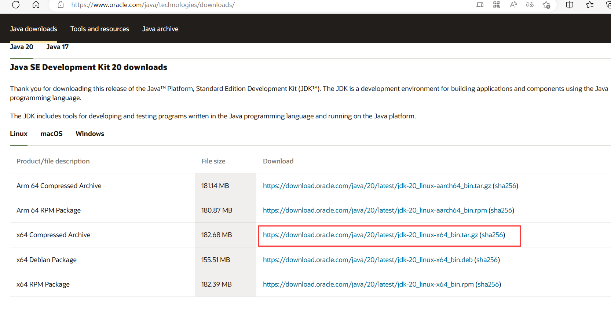
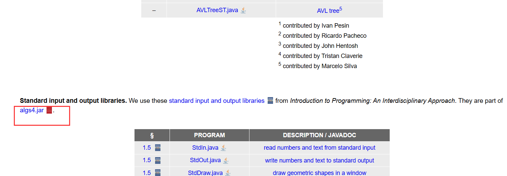

# 算法
## JAVA 安装
[链接](https://zhuanlan.zhihu.com/p/25551032)  
&emsp;&emsp;链接里的是 windows 上的安装以及运行方法，下面是 linux 的安装及运行方法。因为我试了一下，在 windows powershell 编译程序的时候会有一个问题：`“<”运算符是为将来使用而保留的。`，这个应该是 powershell 的问题，换成 windows 的 cmd 就没事了，但是 windows 的 cmd 各种命令用不习惯，所以试了一下 linux 的，运行成功了。

### 1. 安装 java
[java下载链接](https://www.oracle.com/java/technologies/downloads/)  
&emsp;&emsp;下载对应版本的 java se，如下图所示：  
  
&emsp;&emsp;下载完以后放到 linux 路径下面，例如`/home/lst/softinstall/java`，然后解压文件，如下所示：  
```shell
tar -zxvf /home/lst/softinstall/java/jdk-20_linux-x64_bin.tar.gz
```
&emsp;&emsp;解压完以后的文件名为`jdk-20`。  
&emsp;&emsp;修改配置文件，配置环境变量，在命令行输入：  
```shell
sudo vim /etc/profile
```
&emsp;&emsp;在最后一行输入：  
```shell
export PATH=$PATH:/usr/local/arm/gcc-linaro-4.9.4-2017.01-x86_64_arm-linux-gnueabihf/bin
export JAVA_HOME=/home/lst/softinstall/java/jdk-20
export PATH=$PATH:$JAVA_HOME/bin
export CLASSPATH=.:$JAVA_HOME/lib/dt.jar:$JAVA_HOME/lib/tools.jar
export JRE_HOME=$JAVA_HOME/jre
```
&emsp;&emsp;添加完成之后退出并保存，然后更新环境变量，`source /etc/profile`。安装成功以后可以通过以下命令来查看版本：  
```shell
java -version
```
&emsp;&emsp;会出现如下打印信息：
```shell
java version "20" 2023-03-21
Java(TM) SE Runtime Environment (build 20+36-2344)
Java HotSpot(TM) 64-Bit Server VM (build 20+36-2344, mixed mode, sharing)
```
&emsp;&emsp;至此，java 的安装就成功了。

### 2. 下载算法一书中的源码
&emsp;&emsp;点击进入[Java Algorithms and Clients](https://algs4.cs.princeton.edu/code/)，点击下图中的 algs4.jar 进行下载，[下载链接](https://link.zhihu.com/?target=http%3A//algs4.cs.princeton.edu/code/algs4.jar)。  
  
&emsp;&emsp;将`algs4.jar`放到刚刚安装 java 的路径的 lib 目录下面，例如我的`/home/lst/softinstall/java/jdk-20/lib/algs4.jar`。
&emsp;&emsp;将 algs4.jar 添加到环境变量中，有两种方法（我只试了第一种）：
#### 2.1 algs4.jar
&emsp;&emsp;在原来的 classpath 之后加入相应的 jar 包位置，例如，`vim etc/profile`，在原来的 CLASSPATH 后面加入`:$JAVA_HOME/lib/algs4.jar`，现在 profile 文件的内容如下所示：  
```shell
export PATH=$PATH:/usr/local/arm/gcc-linaro-4.9.4-2017.01-x86_64_arm-linux-gnueabihf/bin
export JAVA_HOME=/home/lst/softinstall/java/jdk-20
export PATH=$PATH:$JAVA_HOME/bin
export CLASSPATH=.:$JAVA_HOME/lib/dt.jar:$JAVA_HOME/lib/tools.jar:$JAVA_HOME/lib/algs4.jar
export JRE_HOME=$JAVA_HOME/jre
```
&emsp;&emsp;保存之后，`source /etc/profile`就可以了。
#### 2.1 algs4.jar
&emsp;&emsp;打开～/.profile 文件，在文件最后加入`export CLASSPATH="$PATH:XXXX.jar"`
&emsp;&emsp;如`export CLASSPATH="$PATH:/home/username/tomcat/lib/servlet-api.jar"`可以同时加入几个 jar 包，使用:（冒号）隔开。
&emsp;&emsp;然后`source .profile`可以不用重启
