# 深入理解计算机系统
## 第一章 计算机系统漫游
### 1.2 程序被以他程序翻译成不同的格式
&emsp;&emsp;从源文件到目标文件的转化是由编译器驱动程序完成的。
```shell
linux> gcc -o hello hello.c
```
&emsp;&emsp;编译过程分为四个阶段：
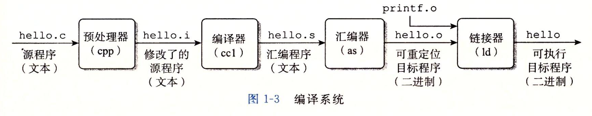  
* **预处理阶段**。预处理器根据以字符 # 开头的命令，修改原始的 C 程序。比如`#include <stdio.h>`命令告诉预处理器读取系统头文件 stdio.h 的内容，并把它直接插入程序文本中。结果就得到了另一个 C 程序，通常是以 .i 作为文件扩展名。
* **编译阶段**。编译器将文本文件 hello.i 翻译成文本文件 hello.s，它包含一个汇编语言程序。将高级语言翻译成汇编语言。
* **汇编阶段**。汇编器将 hello.s 翻译成机器语言指令，把这些指令打包成一种叫做`可重定位目标程序`的格式，并将结果保存在目标文件 hello.o 中。hello.o 文件是一个二进制文件。
* **链接阶段**。hello 程序调用了 printf 函数，它是每个 c 编译器都提供的标准 C 库中的一个函数。printf 函数存在于一个名为 printf.o 的单独的预编译好了的目标文件中，而这个文件必须以某种方式合并到我们的 hello.o 程序中。链接器就负责处理这种合并。结果就得到了 hello 文件，它是一个可执行目标文件，可以被加载到内存中，由系统执行。

### 1.7 操作系统管理硬件
#### 1.7.3 虚拟内存
&emsp;&emsp;`虚拟内存`是一个抽象概念，它为每个进程提供了一个假象，即每个进程都在独占地使用主存。每个进程看到的内存都是一致的，称为`虚拟地址空间`。下图所示的是 Linux 进程的虚拟地址空间。请注意，途中的地址是从下往上增大的。
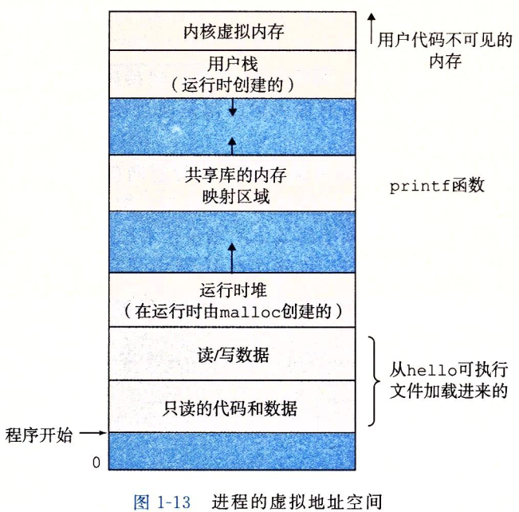  
&emsp;&emsp;我们从最低的地址开始，逐步向上介绍。
* **程序代码和数据**。对所有的进程来说，代码是从同一固定地址开始，紧接着的是和 C 全局变量相对应的数据位置。代码和数据区是直接按照可执行目标文件的内容初始化的。
* **堆**。代码和数据区后紧随着的是运行时`堆`。代码和数据区在进程一开始就被指定了大小，与此不同，当调用像 malloc 和 free 这样的 C 标准库函数时，堆可以在运行时动态地扩展和收缩。
* **共享库**。大约在地址空间的中间部分是一块用来存放像 C 标准库和数学库这样的共享库的代码和数据的区域。
* **栈**。位于用户虚拟地址空间顶部的是用户栈，编译器用它来实现函数调用。和堆一样，用户栈在程序执行期间可以动态地扩展和收缩。特别地，每次我们调用一个函数时，栈就会增长；从一个函数返回时，栈就会收缩。
* **内核虚拟内存**。地址空间顶部的区域是为内核保留的。不允许应用程序读写这个区域的内容或者直接调用内核代码定义的函数。它们必须调用内核来执行这些操作。

## 第二章 信息的表示和处理
#### 2.1.4 表示字符串
&emsp;&emsp;C 语言中字符串被编码为一个以 null（其值为 0）字符结尾的字符数组。


#### 2.2.3 补码编码
&emsp;&emsp;最常见的有符号数的计算机表示方式就是补码。在这个定义中，将字的最高有效位解释为负权。
&emsp;&emsp;原理：补码编码的定义：
$$
B2T_w(x) = -x_{w-1}2^{w-1} + \sum_{i=0}^{w-2}x_i2^i
$$
&emsp;&emsp;最高有效位 $x_{w-1}$ 也成为符号位，他的权重是 $-2^{w-1}$，是无符号表示中权重的负数。入下图所示：
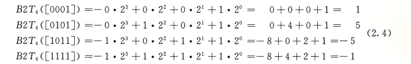  
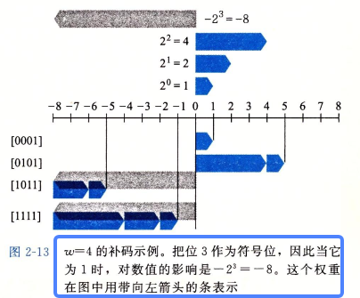  
&emsp;&emsp;在这个图中，我们用向左指的条表示符号位具有负权重。于是，与一个位向量相关联的数值是由可能的向左指的条和向右指的条加起来决定的。
###### 原码补码反码
* 原码：用第一位表示符号位，其余位表示数值。
* 反码：正数的反码是其原码本身，负数的反码是在其原码的基础上，符号位不变，其余各位取反。
* 补码：整数的补码是其原码本身。负数的补码是在其源码的基础上，符号位不变，其余各位取反后加 1.

&emsp;&emsp;如果使用原码，那 1 +(-1) = -2，如果使用反码， 0 这个数值会有两种表示形式。


## 第三章 程序的机器级表示
### 3.2 程序编码
&emsp;&emsp;源码转换成可执行代码的过程。
1. `C 预处理器`扩展源代码，插入所有用 #include 命令指定的文件，并扩展所有用 #define 生命指定的宏。
2. `编译器`产生两个源文件的汇编代码。
3. `汇编器`会将汇编代码转换成二进制目标代码文件。目标代码是机器代码的一种形式，它包含所有指令的二进制表示，但是还没有填入全局值的地址。
4. `链接器`将两个目标代码文件与实现库函数（例如 printf）合并，并产生最终的可执行代码文件。可执行代码是我们要考虑的机器代码的第二种形式，也就是处理器执行的代码格式。

#### 3.2.1 机器级代码
&emsp;&emsp;x86-64 的机器代码。
* 程序计数器（通常称为 PC）：给出将要执行的下一条指令在内存中的地址。
* 整数寄存器文件：包含16个命名的位置，分别存储 64 位的值。这些寄存器可以存储地址或整数数据。有的寄存器被用来记录某些重要的程序状态，而其他的寄存器用来保存临时数据，例如过程的参数和局部变量，以及函数的返回值。
* 条件码寄存器：保存着最近执行的算术或逻辑指令的状态信息。它们用来实现控制或数据流中的条件变化，比如说用来实现 if 或 while 语句。
* 向量寄存器：可以存放一个或多个整数或浮点数值。

#### 3.2.2 代码示例
&emsp;&emsp;在命令行使用`-S`选项，就能看到 C 语言编译器产生的汇编代码：
```shell
linux>gcc -Og -S mstore.c
```
&emsp;&emsp;这会使 GCC 运行编译器，产生一个汇编文件 mstore.s，但是不做其他进一步的工作。（通常情况下，它还会继续调用汇编器产生目标代码文件）。
&emsp;&emsp;如果我们使用`-c`命令行选项，GCC 会编译并汇编该代码：
```shell
linux>gcc -Og -c mstore.c
```
&emsp;&emsp;这就会产生目标代码文件 mstore.o，它是二进制格式的，所以无法直接查看。
&emsp;&emsp;要查看机器代码文件的内容，有一类称为反汇编器（disassembler）的程序非常有用。这些程序根据机器代码产生一种类似汇编代码的格式。在 Linux 系统中，带`-d`命令行标志的程序 OBJDUMP 可以充当这个角色：
```shell
linux>objdump -d mstore.o
```
&emsp;&emsp;生成实际可执行的代码需要对一组目标代码文件运行链接器，而这一组目标代码文件中必须含有一个 main 函数。我们可以使用如下方法生成可执行文件 prog：
```shell
linux>gcc -Og -o prog main.c mstore.c
```
&emsp;&emsp;也可以使用反汇编器抽取出各种代码序列，包括下面这段：
```shell
000000000040061b <multstore>:
  40061b:	53                   	push   %rbx
  40061c:	48 89 d3             	mov    %rdx,%rbx
  40061f:	e8 ef ff ff ff       	callq  400613 <mult2>
  400624:	48 89 03             	mov    %rax,(%rbx)
  400627:	5b                   	pop    %rbx
  400628:	c3                   	retq   
  400629:	0f 1f 80 00 00 00 00 	nopl   0x0(%rax)
```
&emsp;&emsp;有一个不同之处在于链接器填上了 callq 指令调用函数 mult2 需要使用的地址，链接器的任务之一就是为函数调用找到匹配的函数的可执行代码的位置。单独的 mstore.c 反汇编产生的指令如下：
```shell
0000000000000000 <multstore>:
   0:	53                   	push   %rbx
   1:	48 89 d3             	mov    %rdx,%rbx
   4:	e8 00 00 00 00       	callq  9 <multstore+0x9>
   9:	48 89 03             	mov    %rax,(%rbx)
   c:	5b                   	pop    %rbx
   d:	c3                   	retq   
```
&emsp;&emsp;还有一个区别是多了两行代码，这条指令对程序没有影响，因为它们出现在返回指令后面。插入这些行是为了使函数代码变为 16 字节，使得就存储系统性能而言，能更好地放置下一个代码块。


#### 3.2.3 关于格式的注解
&emsp;&emsp;mstore.s 文件完整内容如下：
```shell
	.file	"mstore.c"
	.text
	.globl	multstore
	.type	multstore, @function
multstore:
.LFB0:
	.cfi_startproc
	pushq	%rbx
	.cfi_def_cfa_offset 16
	.cfi_offset 3, -16
	movq	%rdx, %rbx
	call	mult2
	movq	%rax, (%rbx)
	popq	%rbx
	.cfi_def_cfa_offset 8
	ret
	.cfi_endproc
.LFE0:
	.size	multstore, .-multstore
	.ident	"GCC: (Ubuntu 5.4.0-6ubuntu1~16.04.12) 5.4.0 20160609"
	.section	.note.GNU-stack,"",@progbits
```
&emsp;&emsp;所有以`.`开头的行都是指导汇编器和链接器工作的伪指令。我们通常可以忽略这些行。

### 3.3 数据格式
&emsp;&emsp;字（word）：16 bit；
&emsp;&emsp;双字（double words）：32 bit；
&emsp;&emsp;四字（quad words）：64 bit。
&emsp;&emsp;大多数 GCC 生成的汇编代码指令都有一个字符的后缀，表明操作数的大小。例如，数据传送指令有四个变种：movb（传送字节）、movw（传送字）、movl（传送双字）和 movq（传送四字）。后缀‘l’用来表示双字，因为 32 位数被看成是“长字（long word）”。注意，汇编代码也使用后缀‘l’来表示 4 字节整数和 8 字节双精度浮点数。这不会产生歧义，因为浮点数使用的是一组完全不同的指令和寄存器。


### 3.4 访问信息
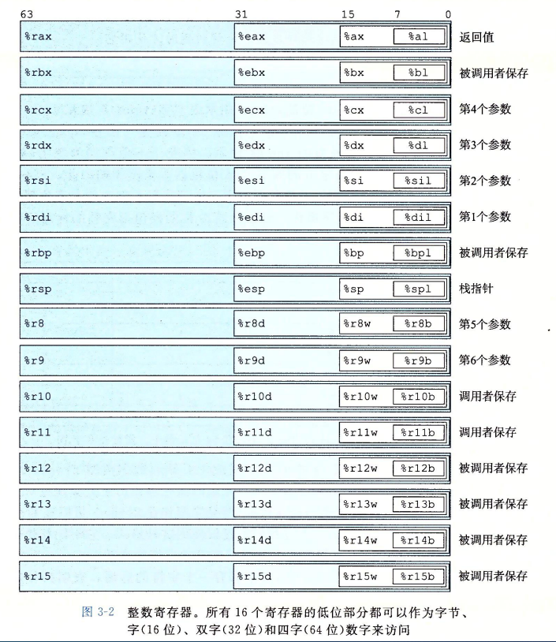  


#### 3.4.3 数据传送示例
&emsp;&emsp;这一节没认真看。

#### 3.4.4 压入和弹出栈数据
&emsp;&emsp;栈在处理过程调用中起到至关重要的作用。栈是一种数据结构，可以添加或删除值，不过要遵循“后进先出”的原则。通过 push 操作把数据压入栈中，通过 pop 操作删除数据；它具有一个属性：弹出的值永远是最近被压入而且仍然在栈中的值。
&emsp;&emsp;栈可以实现为一个数组，总是从数组的一端插入和删除元素。这一端被称为`栈顶`，栈顶元素的地址是所有栈中元素地址最低的。
&emsp;&emsp;push 和 pop 指令都只有一个操作数——压入的数据源和弹出的数据目的。
&emsp;&emsp;**将一个四字值压入栈中，首先要将栈指针减 8，然后将值写到新的栈顶地址。**

### 3.5 算数和逻辑操作
#### 3.5.3 移位操作
&emsp;&emsp;左移指令算术移位和逻辑移位是一样的，都是将右边填上 0。右移指令不同，SAR 执行算术移位（填上符号位），而 SHR 执行逻辑移位（填上 0）。

#### 3.5.5 特殊的算术操作
&emsp;&emsp;这一节不想看了

### 3.6 控制
#### 3.6.1 条件码
#### 3.6.2 访问条件码
&emsp;&emsp;这两节大概看了一下，知道什么意思，涉及反码补码的位置没有细看。

#### 3.6.3 跳转指令
&emsp;&emsp;正常执行的情况下，指令按照它们出现的顺序一条一条地执行。`跳转`（jump）指令会导致执行切换到程序中一个全新的位置。在汇编代码中，这些跳转的目的地通常用一个`标号`（label）指明。在产生目标代码文件时，汇编器会确定所有带标号指令的地址，并将`跳转目标`（目的指令的地址）编码为跳转指令的一部分。
&emsp;&emsp;跳转指令有无条件跳转和有条件跳转。
&emsp;&emsp;无条件跳转可以分为直接跳转和间接跳转，`直接跳转`是给出一个标号作为跳转目标，`间接跳转`的跳转目标是从寄存器或内存位置中读出的。
&emsp;&emsp;有条件跳转根据条件码的某种组合，或者跳转，或者继续执行代码序列中下一条指令。这些指令的名字和跳转条件与 SET 指令的名字和设置条件是相匹配的。**条件跳转只能是直接跳转。**

### 3.7 过程
&emsp;&emsp;过程是软件中一种很重要的抽象。不同编程语言中，过程的形式多样：函数、方法、子例程、处理函数等等。
&emsp;&emsp;要提供对过程的机器级支持，必须要处理许多不同的属性。为了讨论方便，假设过程 P 调用过程 Q，Q 执行后返回到 P。这些动作包括下面一个或多个机制：
* **传递控制**。在进入过程 Q 的时候，程序计数器必须被设置为 Q 的代码的起始地址，然后在返回时，要把程序计数器设置为 P 张调用 Q 后面那条指令的地址。
* **传递数据**。P 必须能够向 Q 提供一个或多个参数，Q 必须能够向 P 返回一个值。
* **分配和释放内存**。在开始时，Q 可能需要为局部变量分配空间，而在返回前，又必须释放这些存储空间。

#### 3.7.1 运行时栈
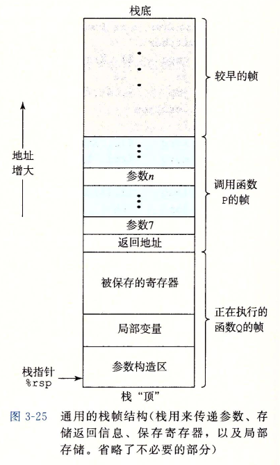  
&emsp;&emsp;C 语言过程调用机制的一个关键特性（大多数其他语言也是如此）在于使用了栈数据结构提供的后进先出的内存管理原则。在过程 P 调用过程 Q 的例子中，可以看到当 Q 在执行时，P 以及所有再向上追溯到 P 的调用链中的过程，都是暂时被挂起的。当 Q 运行时，它只需要为局部变量分配新的存储空间，或者设置到另一个过程的调用。另一方面，当 Q 返回时，任何它所分配的局部存储空间都可以被释放。
&emsp;&emsp;当 x86-64 过程需要的存储空间超过寄存器能够存放的大小时，就会在栈上分配空间。这个部分称为过程的**栈帧**。大多数过程的栈帧都是定长的，在过程的开始就分配好了。但是有些过程需要边长的帧，这个问题会在 3.10.5 中讨论。通过寄存器，过程 P 可以传递最多 6 个整数值（也就是整数和指针），但是如果 Q 需要更多的参数，<u>P 可以在调用 Q 之前在**自己（P）的栈帧**里存储好这些参数</u>。
&emsp;&emsp;为了提高空间和时间效率，x86-64 过程只分配自己所需要的栈帧部分。例如，许多过程有 6 个或者更少的参数，那么所有的参数都可以通过寄存器传递。因此上图中的某些栈帧部分可以省略。实际上，许多函数甚至根本不需要栈帧。**当所有局部变量都可以保存在寄存器中，而且该函数不会调用任何其他函数时，就可以这样处理**。

#### 3.7.3 数据传送
&emsp;&emsp;当调用一个过程时，除了要把控制传递给它并在过程返回时再传递回来之外，过程调用还可能包括把数据作为参数传递，而从过程返回还有可能包括一个返回一个值。
&emsp;&emsp;x86-64 中，可以通过寄存器最多传递 6 个整形参数。如果一个函数有大于 6 个整型参数，超出 6 个的部分就要通过栈来传递。
&emsp;&emsp;假设过程 P 调用过程 Q，有 n 个整型参数，且 n > 6。那么 P （P 分配它调用的子函数的参数空间）的代码分配的栈帧必须要能容纳 7 到 n 号参数的存储空间，如果 3-25 所示。


#### 3.7.4 栈上的局部存储
&emsp;&emsp;目前看到的大多数过程示例都不需要超出寄存器大小的本地存储区域。不过有些时候，局部数据必须存放在内存中，常见的情况包括：
* 寄存器不足够存放所有的本地数据。
* 对一个局部变量使用地址运算符`&`，因此必须能够为它产生一个地址。
* 某些局部变量是数组或结构，因此必须能够通过数组或结构引用被访问到。

#### 3.7.5 寄存器中的局部存储空间
&emsp;&emsp;这一节讲的内容和示例代码我没对应上


### 3.9 异质的数据结构

#### 3.9.3 数据对齐
&emsp;&emsp;许多计算机系统对基本数据类型的合法地址做出了一些限制，要求某种类型对象的地址必须是某个值 K（通常是 2、4 或 8）的倍数。例如，假设一个处理器总是从内存中取 8 个字节，则地址必须为 8 的倍数。如果能保证所有的 double 类型数据的地址对齐成 8 的倍数，那么就可以用一个内存操作来读或者写值了。否则可能需要执行两次内存访问，因为对象可能被分放在两个 8 字节内存块中。无论数据是否对齐，x86-64 硬件都能正确工作。
&emsp;&emsp;结构体对齐。编译器在结构体的末尾可能需要一些填充，这样结构数组中的每个元素都会满足它的对齐要求。

### 3.10 在机器级程序中将控制与数据结合起来
#### 3.10.3 内存越界引用和缓冲区溢出
&emsp;&emsp;C 对于数组引用不进行任何边界检查，而且局部变量和状态信息（例如保存的寄存器值和返回地址）都存放在栈中。这两种情况结合到一起就能导致严重的程序错误，对越界的数组元素的写操作会破坏存储在栈中的状态信息。当程序使用这个被破坏的状态，试图重新加载寄存器或执行 ret 指令时，就会出现很严重的错误。


### 3.11 浮点代码
&emsp;&emsp;不想看这一段了。

## 第四章 处理器体系结构
### 4.1.3 指令编码
&emsp;&emsp;指令集的一个重要性质就是字节编码必须有唯一的解释。任意一个字节序列要么是一个唯一的指令序列的编码，要么就不是一个合法的字节序列。
&emsp;&emsp;因为每条指令的第一个字节有唯一的代码和功能组合，给定这个字节，我们就可以决定所有其他附加字节的长度和含义。这个性质保证了处理器可以无二义性地执行目标代码程序。即使代码嵌入在程序的其他字节中，只要从序列的第一个字节开始处理，我们仍然可以很容易地确定指令序列。反过来说，如果不知道一段代码序列的起始位置，我们就不能准确地确定怎样将序列划分为单独的指令。对于试图直接从目标代码字节序列中抽取出机器级程序的反汇编程序和其他一些工具来说，这就带来了问题。


## 第六章 存储器层次结构
### 6.1 存储技术
#### 6.1.1 随机访问存储器
&emsp;&emsp;`随机访问存储器`（Random-Access Memory, RAM）分为两类：静态的和动态的。静态 RAM（SRAM）比动态 RAM（DRAM）更快，但也贵得多。
1. 静态 RAM
SRAM 将每个位存储在一个双稳态的存储器单元里。每个单元是用一个六晶体管电路来实现地，这个电路可以无限期地保持在两个不同地电压配置或状态之一。其他任何状态都是不稳定的。由于 SRAM 存储器单元的双稳态特性，只要有电，它就会永远地保持它的值。即使有干扰来扰乱电压，当干扰消除时，电路就会恢复到稳定值。
2. 动态 RAM
DRAM 将每个位存储为对一个电容的充电。与 SRAM 不同，DRAM 存储器单元对干扰非常敏感。当电容的电压被扰乱之后，它就永远不会恢复了。很多原因会导致漏电，使得 DRAM 单元在 10~100 毫秒时间内会是去电荷。内存系统必须周期性地通过读出，然后重写来刷新内存的每一位。
4. 内存模块
图 6-5 展示了一个内存模块的基本思想。示例模块用 8 个 64Mbit 的 DRAM 芯片（即 8MB*8），总共存储 64MB，这 8 个芯片编号位 0~7。**每个超单元存储主存的一个字节**，而用相应超单元地址为（i, j）的 8 个超单元来表示主存中字节地址 A 处的 64 位字。在图 6-5 示例中，DRAM0 存储第一个（低位）字节，DRAM1 存储下一个字节，依此类推。  
要取出内存地址 A 处的一个字，内存控制器将 A 转换成一个超单元地址（i, j），并将它发送到内存模块，然后内存模块再将 i 和 j 广播到每个 DRAM。作为相应，每个 DRAM 输出它的（i, j）超单元的 8 位内容。模块中的电路收集这些输出，并把它们合并成一个 64 位字，再返回给内存控制器。
通过将多个内存模块连接到内存控制器，能够聚合成主存。在这种情况中，当控制器收到一个地址 A 时，控制器选择包含 A 的模块 k，将 A 转换成它的（i, j）的形式，并将（i, j）发送到模块 k。
6. 非易失性存储器
如果断电，DRAM 和 SRAM 会丢失它们的信息，从这个意义上说，它们是`易失`的。另一方面，`非易失性存储器`即使在关电后，仍然保存着它们的信息。由于历史原因，虽然 ROM 中有的类型既可以读也可以写，但是它们整体上都被称为`只读存储器`（Read-Only Memory）。
存储在 ROM 设备中的程序通常被称为`固件`（firmware）。当一个计算机系统通电以后，它会运行存储在 ROM 中的固件。

#### 6.1.2 磁盘存储

### 6.2 局部性
&emsp;&emsp;一个编写良好的计算机程序常常具有良好的局部性。也就是，它们倾向于引用临近于其他最近引用过的数据项的数据项，或者最近引用过的数据项本身。这种倾向性，被称为局部性原理。

### 6.3 存储器层次结构
#### 6.3.1 存储器层次结构中的缓存
1. 缓存命中
当程序需要第 k + 1 层的某个数据对象 d 时，它首先在当前存储在第 k 层的一个块中查找 d。如果 d 刚好缓存在第 k 层中，那么就是我们所说的`缓存命中`（cache hit）。
2. 缓存不命中
另一方面，如果第 k 层中没有缓存数据对象 d，那么就是我们所说的`缓存不命中`（cache miss）。  
当发生缓存不命中时，第 k 层的缓存从第 k + 1 层缓存中取出包含 d 的那个块，如果第 k 层的缓存已经满了，可能就会覆盖现存的一个块。覆盖一个现存的块的过程称为`替换`（replacing）或`驱逐`（evicting）这个块。被驱逐的这个块有时也称为`牺牲块`（victim block）。决定该替换哪个块是由缓存的`替换策略`来控制的。
3. 缓存不命中的种类
区分不同种类的缓存不命中有时候是很有帮助的。如果第 k 层的缓存是空的，那么对任何数据对象的访问都不会命中。一个空的缓存有时被称为`冷缓存`（cold cache），此类不命中称为`强制不命中`或`冷不命中`。冷不命中很重要，因为它们通常是短暂的事件，不会在反复访问存储器是的缓存`暖身`（warmed up）之后的稳定状态中出现。  
只要发生了不命中，第 k 层的缓存就必须执行某个放置策略，确定把它从第 k + 1 层中取出的块放在哪里。最灵活的替换策略是允许来自第 k + 1 层的任何块放在第 k 层的任何块中。这个策略实现起来通常很昂贵，因为随机地放置块，定位起来代价很高。  
因此，硬件缓存通常使用的是更严格的放置策略，这个策略将第 k + 1 层的某个块限制放置在第 k 曾块的一个小的子集中（有时只是一个块）。例如（i mod 4）。这种限制性的放置策略会引起一种不命中，称为`冲突不命中`（conflict miss），在这种情况中，缓存足够大，能够保存被引用的数据对象，但是因为这些对象会映射到同一个缓存块，缓存会一直不命中。例如，在图 6-22 中，如果程序请求块 0，然后块 8，然后块 0，然后块 8，依此类推，在第 k 层的缓存中，对这两个块的每次引用都会不命中，即使这个缓存总共可以容纳 4 个块。  
程序通常是按照一系列阶段（如循环）来运行的，每个阶段访问缓存块的某个相对稳定不变的集合。例如，一个嵌套的循环可能会反复地访问同一个数据地元素。这个块地集合称为这个阶段的`工作集`。当工作集的大小超过缓存的大小时，缓存会经历`容量不命中`。换句话说就是，缓存太小了，不能处理这个工作集。

### 6.4 高速缓存存储器
#### 6.4.1 通用的高速缓存存储器组织结构
&emsp;&emsp;考虑一个计算机系统，其中每个存储器地址有 m 位，形成 $M = 2^m$ 个不同的地址。如图 6-25a 所示，这样一个机器的高速缓存被组织成一个有 $S = 2^s$ 个高速缓存组的数组。每个组包含 E 个`高速缓存行`（cache line）。每个行是由一个 $B = 2^b$ 字节的数据块组成的，一个`有效位`（valid bit）指明这个行是否包含有意义的信息，还有 $t = m - (b + s)$ 个`标记位`（tag bit）（是当前块的内存地址的位的一个子集），它们唯一地标识存储在这个高速缓存行中的块。  
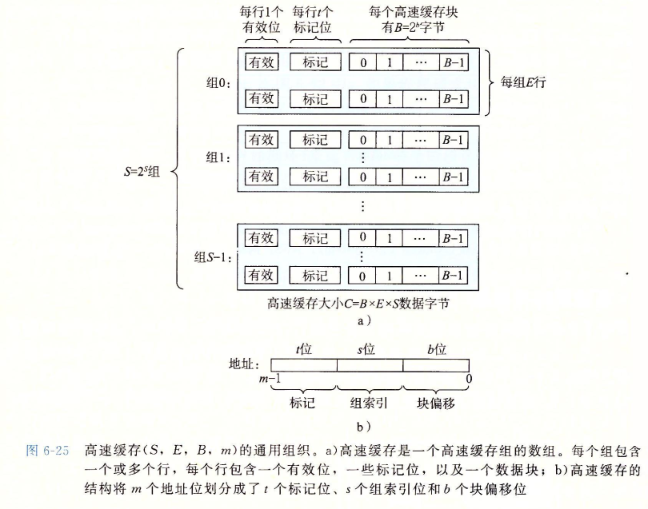   

&emsp;&emsp;为什么用中间的位来做索引。如果高位用作索引，那么一些连续的内存块就会映射到相同的高速缓存块。例如，在图中，头四个块映射到第一个高速缓存组，第二个第四个块映射到第二个组，依此类推。如果一个程序有良好的空间局部性，顺序扫描一个数组的元素，那么在任何时刻，高速缓存都只保存着一个块大小的数组内容。这样对高速缓存的使用效率很低。相比较而言，以中间位作为索引，相邻的块总是映射到不同的告诉缓存行。
  

#### 6.4.5 有关写的问题
&emsp;&emsp;假设我们要写一个已经缓存了的字 w（写命中，write hit）。在高速缓存更新了它的 w 副本之后，怎么更新 w 在层次结构中紧接着第一层中的副本呢？
&emsp;&emsp;最简单的方法，称为`直写`（write-through），就是立即将 w 的高速缓存块写回到紧接着的第一层中。虽然简单，但是直写的缺点是每次写都会引起总线流量。
&emsp;&emsp;另一种方法，称为`写回`（write-back），尽可能地推迟更新，只有当替换算法要驱逐这个更新过地块时，才把它写到紧接着的第一层中。由于局部性，写回能显著地减少总线流量，但是它的缺点是增加了复杂性。高速缓存必须为每个高速缓存行维护一个额外的修改位（dirty bit），表明这个告诉缓存块是否被修改过。
&emsp;&emsp;另一个问题是如何处理不命中。一种方法，称为`写分配`（write-allocate），加载相应的低一层中的块到高速缓存中，然后更新这个告诉缓存块。写分配试图利用写的空间局部性，但是缺点是每次不命中都会导致一个块从低一层传送到高速缓存。另一种方法，称为`非写分配`（not-write-allocate），避开告诉缓存行，直接把这个字写到低一层中。直写高速缓存通常是非写分配的。写高速缓存通常是写分配的。

#### 6.4.6 一个真实的高速缓存层次结构的解剖
&emsp;&emsp;高速缓存既保存数据，也保存指令。只保存指令的高速缓存称为 i-cache。只保存程序的高速缓存称为 d-cache。既保存指令又保存数据的高速缓存称为统一的`高速缓存`（unified cache）。


# 第二部分 在系统上运行程序
## 第七章 链接
&emsp;&emsp;`链接`（linking）是将各种代码和数据片段收集并组合成为一个单一文件的过程。链接可以执行于`编译`时，也就是在源代码被翻译成机器代码时；也可以执行于`加载`时，也就是程序被加载器加载到内存并执行时；甚至执行于`运行`时，也就是由应用程序来执行。在现代系统中，链接是由叫做链接器的程序自动执行的。  
&emsp;&emsp;链接器在软件开发中扮演着一个关键的角色，因为它们使得分离编译成为可能。我们不用将一个大型的应用程序组织为一个巨大的源文件，而是可以把它分解为更小、更好管理的模块，可以独立地修改和编译这些模块。当我们改变这些模块中的一个时，只需简单地重新编译它，并重新链接应用，而不必重新编译其他文件。


### 7.2 静态链接
&emsp;&emsp;像 Linux LD 程序这样地静态链接器以一组可重定位目标文件和命令行参数作为输入，生成一个完全链接的、可以加载和运行的可执行目标文件为输出。输入的可重定位目标文件由各种不同的代码和数据节（section）组成，每一节都是一个连续的字节序列。指令在一节中，初始化了的全局变量在另一节中，而未初始化的变量又在另外一节中。
&emsp;&emsp;为了构造可执行文件，链接器必须完成两个主要任务：
* 符号解析。目标文件定义和引用符号，每个符号对应于一个函数、一个全局变量或一个静态变量（即 C 语言中任何以 static 属性声明的变量）。**符号解析的目的是将每个符号引用正好和一个符号定义关联起来**。
* 重定位。编译器和汇编器生成从地址 0 开始的代码和数据节。链接器通过把每个符号定义与一个内存位置关联起来，从而重定位这些节，然后修改所有对这些符号的引用，使得它们指向这个内存位置。链接器使用汇编器产生的重定位条目的详细指令，不加甄别地执行这样的重定位。

### 7.3 目标文件
&emsp;&emsp;目标文件有三种形式：
* 可重定位目标文件。包含二进制代码和数据，其形式可以在编译时与其他可重定位目标文件合并起来，创建一个可执行目标文件。
* 可执行目标文件。包含二进制代码和数据，其形式可以直接被复制到内存并执行。
* 共享目标文件。一种特殊类型的可重定位目标文件，可以在加载或者运行时被动态地加载进内存并链接。

&emsp;&emsp;编译器和汇编器生成可重定位目标文件（包括共享目标文件）。链接器生成可执行目标文件。

### 7.4 可重定位目标文件
&emsp;&emsp;图 7-3 展示了一个典型的 ELF 可重定位目标文件的格式。ELF 头以一个 16 字节的序列开始，这个序列描述了生成该文件的系统的字的大小和字节顺序。ELF 头剩下的部分包含帮助链接器语法分析和解释目标文件的信息。其中包括 ELF 头的大小、目标文件的类型（如可重定位、可执行或者共享的）、机器类型（如 x86-64）、节头部表的文件偏移，以及节头部表中条目的大小和数量。不同节的位置和大小是由节头部表描述的，其中目标文件中每个节都有一个固定大小的条目（entry）。
&emsp;&emsp;夹在 ELF 头和节头部表之间的都是节。一个典型的 ELF 可重定位目标文件包含下面几个节：
* .text：已编译程序的机器代码
* .rodata：只读数据，比如 printf 语句中的格式串
* .data：已初始化的全局和静态 C 变量。局部 C 变量在运行时被保存在栈中，既不出现在 .data 节中，也不出现在 .bss 节中。
* .bss：未初始化的全局和静态 C 变量，以及所有被初始化为 0 的全部或静态变量。在目标文件中这个节不占据实际的空间，它仅仅是一个占位符。目标文件格式区分已初始化和未初始化变量是为了空间效率：在目标文件中，未初始化变量不需要占据任何实际的磁盘空间。运行时，在内存中分配这些变量，初始值为 0。
* .symtab：一个符号表，它存放在程序中定义和引用的函数和全局变量的信息。一些程序员错误地认为必须通过 -g 选项来编译一个程序，才能得到符号表信息。实际上，每个可重定位目标文件在 .symtab 中都有一张符号表（除非程序员特意用 STRIP 命令去掉它）。然而，和编译器中的符号表不同，.symtab 符号表不包含局部变量的条目。
* .rel.text：一个 .text 节中位置的列表，当链接器把这个目标文件和其他文件组合时，需要修改这些位置。一般而言，任何调用外部函数或者引用全局变量的指令都需要修改。另一方面，调用本地函数的指令则不需要修改。注意，可执行目标文件中并不需要重定位信息，因此通常省略，除非用户显示地指示链接器包含这些信息。
* .rel.data：被模块引用或定义的所有全局变量的重定位信息。一般而言，任何已初始化的全局变量，如果它的初始值是一个全局变量地址或者外部定义函数的地址，都需要被修改。
* .debug：一个调试符号表，其条目是程序中定义的局部变量和类型定义，程序中定义和引用的全局变量，以及原始的 C 源文件。只有以 -g 选项调用编译器驱动程序时，才会得到这张表。
* .line：原始 C 程序中的行号和 .text 节中机器指令之间的映射。只有以 -g 选项调用编译器驱动程序时，才会得到这张表。
* .strtab：一个字符串表，其内容包括 .symtab 和 .debug 节中的符号表，以及节头部中的节名字。字符串表就是以 null 结尾的字符串的序列。
  


### 7.5 符号和符号表
&emsp;&emsp;每个可重定位目标模块 m 都有一个符号表，它包含 m 定义和引用的符号的信息。在链接器的上下文中，有三种不同的符号：
* 由模块 m 定义并能被其他模块引用的`全局符号`。全局链接器符号对应于非静态的 C 函数和全局变量。
* 由其他模块定义并被模块 m 引用的`全局符号`。这些符号称为`外部符号`，对应于在其他模块中定义的非静态 C 函数和全局变量。
* 只被模块 m 定义和引用的局部符号。它们对应于带 static 属性的 C 函数和全局变量。这些符号在模块 m 中的任何位置都可见，但是不能被其他模块引用。

&emsp;&emsp;认识到本地链接器符号和本地程序变量不同是很重要的。.symtab 中的符号表不包含对应于`本地非静态程序变量`的任何符号。这些符号在运行时在栈中被管理，链接器对此类符号不感兴趣。


&emsp;&emsp;剩下的内容没有特别看懂

### 7.6 符号解析
&emsp;&emsp;链接器解析符号引用的方法是将每个引用与它输入的可重定位目标文件的符号表中的一个确定的符号定义关联起来。
&emsp;&emsp;对那些和引用定义在相同模块中的局部符号的引用，符号解析是非常简单明了的。编译器只允许每个模块中每个局部符号有一个定义。静态局部变量也会有本地链接器符号，编译器还要确保它们用户有唯一的名字。
&emsp;&emsp;对全局符号的引用解析就棘手得多。当编译器遇到一个不是在当前模块中定义的符号（变量或函数名）时，会假设该符号是在其他某个模块中定义的，生成一个链接器符号表条目，并把它交给链接器处理。如果链接器在它的任何输入模块中都找不到这个引用符号的定义，就输出一条错误信息并终止。如果多个目标文件定义了相同名字的全局符号，在这种情况中，链接器必须要么标志一个错误，要么以某种方法选出一个定义并抛弃其他定义。

#### 7.6.1 链接器如何解析多重定义的全局符号
&emsp;&emsp;链接器的输入是一组可重定位目标模块。每个模块定义一组符号，有些是全局的（对其它模块可见）。如果多个模块定义同名的全局符号，会发生什么呢？下面是 Linux 编译系统采用的方法。
&emsp;&emsp;在编译时，编译器向汇编器输出每个全局符号，或者是`强（strong）`或者是`弱（weak）`，而汇编器把这个信息隐含地编码在可重定位目标文件的符号表里。**函数和已初始化的全局变量是强符号，未初始化的全局变量是弱符号**。
&emsp;&emsp;根据强弱符号的定义，Linux 链接器使用下面的规则来处理多重定义的符号名：
* 规则 1：不允许有多个同名的强符号。
* 规则 2：如果有一个强符号和多个弱符号同名，那么选择强符号。
* 规则 3：如果有多个弱符号同名，那么从这些弱符号中任意选择一个。

&emsp;&emsp;在 7.5 节中，我们看到编译器如何按照一个看似绝对的规则来把符号分配为 COMMON 和 .bss。实际上，采用这个惯例是由于在某些情况中链接器允许多个模块定义同名的全局符号。当编译器在翻译某个模块时遇到一个弱全局符号，比如说 x，它并不知道其他模块是否也定义了 x，如果是，它无法预测链接器该使用 x 的多重定义中的哪一个。所以编译器把 x 分配成了 COMMON，把决定权留个链接器。另一方面，如果 x 初始化为 0，那么它是一个强符号，所以编译器可以很自信地将它分配成 .bss。类似地，静态符号地构造就必须是唯一地，所以编译器可以自信地把它们分配成 .data 或 .bss。

#### 7.6.2 与静态库链接
&emsp;&emsp;迄今为止，我们都是假设链接器读取一组可重定位目标文件，并把它们链接起来，形成一个输出地可执行文件。实际上，所有的编译系统都提供一种机制，将所有相关的目标模块打包成为一个单独的文件，称为`静态库`（static library），它可以用作链接器的输入。当链接器构造一个输出的可执行文件时，它只复制静态库里被应用程序引用的目标模块。
&emsp;&emsp;静态库的概念。相关的**函数**可以被编译为**独立的目标模块**，然后**封装**成一个**单独的静态库文件**。然后，应用程序可以通过在命令行上指定单独的文件名字来使用这些在库中定义的函数。比如，使用 C 标准库和数学库中函数的程序可以用形式如下的命令行来编译和链接：
```shell
linux> gcc main.c /usr/lib/libm.a /usr/lib/libc.a
```
&emsp;&emsp;在链接时，**链接器将只复制被程序引用的目标模块**，这就减少了可执行文件在磁盘和内存中的大小。另一方面，应用程序员只需要包含较少的库文件的名字（实际上，C 编译器驱动程序总是传送 libc.a 给链接器，所以前面提到的对 libc.a 的引用是不必要的）。
&emsp;&emsp;在 Linux 系统中，静态库以一种称为`存档`（archive）的特殊文件格式存放在磁盘中。存档文件是一组连接起来的可重定位目标文件的集合，有一个头部文件来描述每个成员目标文件的大小和位置。


##### 示例
addvec.c
```c
int addcnt = 0;

void addvec(int *x, int *y,
            int *z, int n)
{
    int i;

    addcnt++;

    for (i = 0; i < n; i++)
        z[i] = x[i] + y[i];
}           
```
multvec.c
```c
int multcnt = 0;

void multvec(int *x, int *y,
             int *z, int n)
{
    int i;

    multcnt++;

    for (i = 0; i < n; i++)
        z[i] = x[i] * y[i];
}
```
&emsp;&emsp;要创建这些函数的一个静态库，我们将使用 AR 工具，如下：
```shell
linux> gcc -c addvec.c multvec.c
linux> ar rcs libvector.a addvec.o multvec.o
```
&emsp;&emsp;为了使用这个库，我们可以编写一个应用，它调用 addvec 库历程。头文件 vector.h 定义了 libvector.a 中例程的函数原型。
main.c
```c
#include <stdio.h>
#include "vector.h"

int x[2] = {1, 2};
int y[2] = {3, 4};
int z[2];

int main()
{
    addvec(x, y, z, 2);
    printf("z = [%d %d]\n", z[0], z[1]);

    return 0;
}
```
vector.h
```c
void addvec(int *x, int *y, int *z, int n);
void multvec(int *x, int *y, int *z, int n);
```
&emsp;&emsp;为了创建这个可执行文件，我们要编译和链接输入文件 main.o 和 libvector.a：
```shell
linux> gcc -c main.c
linux> gcc -static -o prog2c main.o ./libvector.a
```
&emsp;&emsp;或者等价地使用：
```shell
linux> gcc -c main.c
linux> gcc -static -o prog2c main.o -L. -lvector
```
&emsp;&emsp;图 7-8 概括了链接器的行为。-static 参数告诉编译器驱动程序，链接器应该构建一个完全链接额可执行目标文件，它可以加载到内存并运行，在加载时无须更进一步的链接。-lvector 参数是 libvector.a 的缩写，-L. 参数告诉链接器在当前目录下查找 libvector.a。
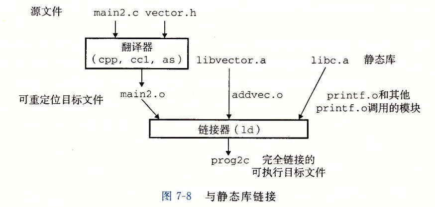  
&emsp;&emsp;当链接器运行时，它判定 main.o 引用了 addvec.o 定义的 addvec 符号，所以复制 addvec.o 到可执行文件。因为程序不引用任何由 multvec.o 定义的符号，所以链接器就不会复制这个模块到可执行文件。

#### 7.6.3 链接器如何使用静态库来解析引用
&emsp;&emsp;虽然静态库很有用，但是它们同时也是一个程序员迷惑的源头，原因在于 Linux 链接器使用它们解析外部引用的方式。
&emsp;&emsp;在符号解析阶段，链接器从左到右按照它们在编译器驱动程序命令行上出现的顺序来扫描可重定位目标文件和存档文件（在 Linux 系统中，静态库以一种称为`存档`的特殊文件格式存放在磁盘中）。（驱动程序自动将命令行中所有的 .c 文件翻译为 .o 文件。）
&emsp;&emsp;在这次扫描中，链接器维护一个可重定位目标文件的集合 E（这个集合中的文件会被合并起来形成可执行文件），一个未解析的符号（即引用了但是尚未定义的符号）集合 U，以及一个在前面输入文件中已定义的符号集合 D。初始时，E、U 和 D 均为空。
* 对于命令行上的每个输入文件 f，链接器会判断 f 是一个目标文件还是一个存档文件。如果 f 是一个目标文件，那么链接器把 f 添加到 E，修改 U 和 D 来反映 f 中的符号定义和引用，并继续下一个输入文件。
* 如果 f 是一个存档文件，那么链接器就尝试匹配 U 中未解析的符号和由存档文件成员定义的符号。如果某个存档文件成员 m，定义了一个符号来解析 U 中的一个引用，那么就将 m 加到 E 中，并且链接器修改 U 和 D 来反映 m 中的符号定义和引用。对<u>存档文件中所有的成员目标文件</u>都依次进行这个过程，直到 U 和 D 都不再发生变化。此时，任何不包含在 E 中的成员目标文件（存档文件中的成员目标文件）都简单地被丢弃，而链接器将继续处理下一个输入文件。
* 如果当链接器完成对命令行上输入文件的扫描后，U 是非空的，那么链接器就会输出一个错误并终止。否则，它会合并和重定位 E 中的目标文件，构建输出的可执行文件。

&emsp;&emsp;不幸的是，这种算法会导致一些令人困扰的链接时错误，因为命令行上的库和目标文件的顺序非常重要。在命令行中，如果定义一个符号的库出现在引用这个符号的目标文件之前，那么引用就不能被解析，链接会失败。
&emsp;&emsp;关于库的一般准则是将它们放在命令行的结尾。如果各个库的成员是相互独立的（也就是说没有成员引用另一个成员定义的符号），那么这些库就可以以任何顺序放置在命令行的结尾处。另一方面，如果库不是相互独立的，那么必须对它们排序，使得对于每个被存档文件的成员外部引用的符号 s，在命令行中至少有一个 s 的定义是在对 s 的引用之后的。比如，假设 foo.c 调用 libx.a 和 libz.a 中的函数，而这两个库又调用 liby.a 中的函数。那么，在命令行中 libx.a 和 libz.a 必须处在 liby.a 之前：
```shell
linux> gcc foo.c libx.a libz.a liby.a
```
&emsp;&emsp;如果需要满足依赖需求，可以在命令行上重复库。比如，假设 foo.c 调用 libx.a 中的函数，该库又调用 liby.a 中的函数，而 liby.a 又调用 libx.a 中的函数。那么 libx.a 必须在命令行上重复出现：
```shell
linux> gcc foo.c libx.a liby.a libx.a
```
&emsp;&emsp;另一种方法是，我们可以将 libx.a 和 liby.a 合并成一个单独的存档文件。

### 7.7 重定位
&emsp;&emsp;一旦链接器完成了符号解析这一步，就把代码中的每个符号引用和正好一个符号定义（即它的一个输入目标模块中的一个符号表条目）关联起来。此时，链接器就知道它的输入目标模块中的代码节和数据节的确切大小。现在就可以开始重定位步骤了，在这个步骤中，将合并输入模块，并为每个符号分配运行时地址。重定位由两步组成：
* **重定位节和符号定义**。在这一步中，链接器将所有相同类型的节合并为同一类型的新的聚合节。例如，来自所有输入模块的 .data 节被全部合并成一个节，这个节成为输出的可执行目标文件的 .data 节。然后，链接器将运行时内存地址赋给新的聚合节，赋给输入模块定义的每个节，以及赋给输入模块定义的每个符号。当这一步完成时，程序中的每条指令和全局变量都有唯一的运行时内存地址了。
* **重定位节中的符号引用**。在这一步中，链接器修改代码节和数据节中对每个符号的引用，使得它们指向正确的运行时地址。要执行这一步，链接器依赖于可重定位目标模块中成为`重定位条目`（relocation entry）的数据结构，我们接下来将会描述这种数据结构。

#### 7.7.1 重定位条目
&emsp;&emsp;当汇编器生成一个目标模块时，它并不知道数据和代码最终将放在内存中的什么位置。它也不知道这个模块引用的任何外部定义的函数或者全局变量的位置。所以，无论何时汇编器遇到对最终位置未知的目标引用，它就会生成一个`重定位条目`，告诉链接器在将目标文件合并成可执行文件时如何修改这个引用。代码的重定位条目放在 .rel.text 中。已初始化数据的重定位条目放在 .rel.data 中。
&emsp;&emsp;图 7-9 展示了 ELF 重定位条目的格式。offset 是需要被修改的引用的节偏移。symbol 标识被修改引用应该指向的符号。type 告知链接器如何修改新的引用。addend 是一个有符号常熟，一些类型的重定位要使用它对被修改引用的值做偏移调整。
```c
typedef struct {
    long offset;        /* Offset of the reference to relocate */
    long type : 32,     /* Relocation type */
         symbol : 32;   /* Symbol table index */
    long addend;        /* Constant part of relocation expression */
} Elf64_Rela;
```
&emsp;&emsp;ELF 定义了 32 种不同的重定位类型，有些相当隐秘。我们只关心其中两种最基本的重定位类型：
* **R_X86_64_PC32**。重定位一个使用 32 位 PC 相对地址的引用。一个 PC 相对地址就是距程序计数器（PC）的当前运行时值的偏移量。当 CPU 执行一条使用 PC 相对寻址的指令时，它就将在指令中编码的 32 位值加上 PC 的当前运行时值，得到`有效地址`（如 call 指令的目标），PC 值通常是下一条指令在内存中的地址。
* **R_X86_64_32**。重定位一个使用 32 位绝对地址的引用。通过绝对寻址，CPU 直接使用在指令中编码的 32 位值作为有效地址，不需要进一步修改。

&emsp;&emsp;这段示例大概看懂了，也没完全看懂。

### 7.8 可执行目标文件
&emsp;&emsp;图 7-13 概括了一个典型的 ELF 可执行文件中的各类信息。
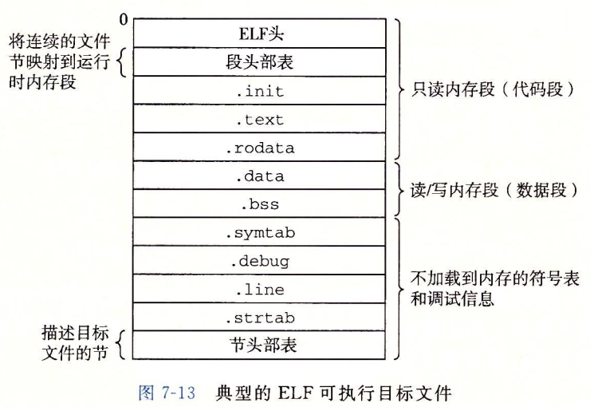  


### 7.10 动态链接共享库
&emsp;&emsp;静态库仍然有一些明显的缺点。如果想要使用一个库的最新版本，他们必须以某种方式了解到该库的更新情况，然后显示地将他们的程序与更新了的库重新链接。
&emsp;&emsp;另一个问题是几乎每个 C 程序都是用标准 I/O 函数。在运行时，这些函数的代码会被复制到每个运行进程的文本段中，这将是对稀缺的内存系统资源的极大浪费。
&emsp;&emsp;`共享库`是致力于解决静态库缺陷的一个现代创新产物。共享库是一个目标模块，在运行或加载时，可以加载到任意的内存地址，并和一个在内存中的程序链接起来。这个过程称为`动态链接`，是由一个叫做`动态链接器`的程序来执行的。共享库也称为`共享目标`，在 Linux 系统中通常用 .so 后缀来标识。微软的操作系统大量地使用了共享库，它们称为 DLL（动态链接库）。
&emsp;&emsp;共享库是以两种不同的方式来“共享”的。首先，在任何给定的文件系统中，对于一个库只有一个 .so 文件。所有引用该库的可执行目标文件共享这个 .so 文件中的代码和数据，而不是像静态库的内容那样被复制和嵌入到引用它们的可执行的文件中。其次，在内存中，一个共享库的 .text 节的一个副本可以被不同的正在运行的进程共享。
&emsp;&emsp;构造共享库示例，我们调用编译器驱动程序，给编译器和链接器如下特殊指令：
```shell
linux> gcc -shared -fpic -o libvector.so addvec.c multvec.c
```
&emsp;&emsp;-fpic 选项指示编译器生成与位置无关的代码。-shared 选项指示链接器创建一个共享的目标文件。一旦创建了这个库，可以将他连接到如图 7-7 的示例程序中：
```shell
linux> gcc -o prog21 main.c ../test/libvector.so
```
&emsp;&emsp;这样就创建了一个可执行目标文件 prog21，而此文件的形式使得它在运行时可以和 libvector.so 链接。基本的思路是当创建可执行文件时，静态执行一些链接，然后在程序加载时，动态完成链接过程。此时，没有任何 libvector.so 的代码和数据节真的被复制到可执行文件 prog21 中。反之，链接器复制了一些重定位和符号表信息，它们使得运行时可以解析对 libvector.so 中代码和数据的引用。
&emsp;&emsp;当加载器加载和运行可执行文件 prog21 时，加载部分链接的可执行文件 prog21。接着，它注意到 prog21 包含一个 .interp 节，这一节包含动态链接器的路径名，动态链接器本身就是一个共享目标。加载器不会像它通常所做地那样将控制传递给应用，而是加载和运行这个动态链接器。然后，动态链接器通过执行下面地重定位完成链接任务：
* 重定位 libc.so 的文本和数据到某个内存段。
* 重定位 libvector.so 的文本和数据到另一个内存段。
* 重定位 prog21 中所有对由 libc.so 和 libvector.so 定义的符号的引用。

&emsp;&emsp;最后，动态链接器将控制传递给应用程序。从这个时刻开始，共享库的位置就固定了，并且在程序执行的过程中都不会改变。

### 7.11 从应用程序中加载和链接共享库
&emsp;&emsp;到目前为止，我们已经讨论了应用程序被加载后执行前时，动态链接器和链接共享库的情景。然而，应用程序还可能在它运行时要求动态链接器加载和链接某个共享库，而无需在编译时将那些库链接到应用中。
&emsp;&emsp;Linux 系统为动态链接器提供了一个简单的接口，允许应用程序在运行时加载和链接共享库。
```c
#include <dlfcn.h>

/* 返回：若成功则为指向句柄的指针，若出错则为 NULL */
void *dlopen(const char *filename, int flag);
```
&emsp;&emsp;dlopen 函数加载和链接共享库 filename。用已用带 RTLD_GLOBAL 选项打开了的库解析 filename 中的外部符号。如果当前可执行文件是带 -rdynamic 选项编译的，那么对符号解析而言，它的全局符号也是可用的。flag 参数必须要么包括 RTLD_NOW，该标志告诉链接器立即解析对外部符号的引用，要么包括 RTLD_LAZY 标志，该标志指示链接器推迟符号解析直到执行来自库中的代码。这两个值中的任意一个都可以和 RTLD_GLOBAL 标志取或。
```c
#include <dlfcn.h>

void *dlsym(void *handle, char *symbol);
```
&emsp;&emsp;dlsym 函数的输入是一个指向前面已经打开了的共享库的句柄和一个 symbol 名字，如果该符号存在，就返回符号的地址，否则返回 NULL。
```c
#include <dlfcn.h>

/* 返回：若成功则为 0，若出错则为 -1 */
int dlclose(void *handle);
```
&emsp;&emsp;如果没有其他共享库还在使用这个共享库，dlclose 函数就卸载该共享库。
```c
#include <dlfcn.h>

/* 返回：如果前面对 dlopen、dlsym 或 dlclose 的调用失败，
   则为错误消息，如果前面的调试成功，则为 NULL */
const char *dlerror(void);
```
&emsp;&emsp;dlerror 函数返回一个字符串，它描述的是调用 dlopen、dlsym 或者 dlclose 函数时发生的最近的错误，如果没有错误发生，则返回 NULL。
```c
#include <stdio.h>
#include <stdlib.h>
#include <dlfcn.h>

int x[2] = {1, 2};
int y[2] = {3, 4};
int z[2];

int main()
{
    void *handle;
    void (*addvec)(int *, int *, int *, int);
    char *error;

    /* Dynamically load the shared library containing addvec() */
    handle = dlopen("./libvector.so", RTLD_LAZY);
    if (!handle) {
        fprintf(stderr, "%s\n", dlerror());
        exit(1);
    }

    /* Get a pointer to the addvec() function we just loaded */
    addvec = dlsym(handle, "addvec");
    if ((error = dlerror()) != NULL) {
        fprintf(stderr, "%s\n", error);
        exit(1);
    }

    /* Now we can call addvec() just like any other function */
    addvec(x, y, z, 2);
    printf("z = [%d %d]\n", z[0], z[1]);

    /* Unload the shared library */
    if (dlclose(handle) < 0) {
        fprintf(stderr, "%s\n", dlerror());
        exit(1);
    }

    return 0;
}
```

### 7.12 位置无关代码
这一节和后面两节先不想看了

## 第 8 章 异常控制流
### 8.1 异常
&emsp;&emsp;异常是异常控制流的一种形式，它一部分由硬件实现，一部分由操作系统实现。
&emsp;&emsp;在任何情况下，当处理器检测到有事件发生时，它就会通过一张叫做异常表的跳转表，进行一个间接过程调用，到一个专门设计用来处理这类事件的操作系统子程序（异常处理程序（exception handler））。当异常处理程序完成处理后，根据引起异常的事件的类型，会发生以下 3 中情况中的一种：
1. 处理程序将控制返回给当前指令 I_curr，即当事件发生时正在执行的指令。
2. 处理程序将控制返回给 I_next，如果没有发生异常将会执行的下一条指令。
3. 处理程序终止被中断的程序。

#### 8.1.1 异常处理
#### 8.1.2 异常的类别
1. 中断
中断是异步发生的，是来自处理器外部的 I/O 设备的信号的结果。硬件中断不是由任何一条专门的指令造成的，从这个意义上来说它是异步的。在当前指令完成执行之后，处理器注意到中断引脚的电压变高了，就从系统总线读取异常号，然后调用适当的中断处理程序。  
剩下的异常类型（陷阱、故障和终止）是同步发生的，是执行当前指令的结果。我们把这类指令叫做`故障指令`。
2. 陷阱和系统调用
陷阱是有意的异常，是执行一条指令的结果。就像中断处理程序一样，陷阱处理程序将控制返回到下一条指令。陷阱最重要的用途是在用户程序和内核之间提供一个像过程一样的接口，叫做`系统调用`。  
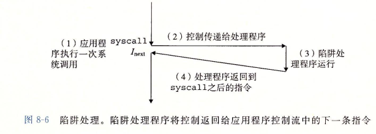  
&emsp;&emsp;从程序员的角度来看，系统调用和普通的函数调用是一样的。然而，它们的实现非常不同。普通的函数运行在用户模式中，用户模式限制了函数可以执行的指令的类型，而且它们只能访问与调用函数相同的栈。系统调用运行在内核模式中，内核模式允许系统调用执行特权指令，并访问定义在内核中的栈。
3. 故障
4. 终止

#### 8.2.3 私有地址空间
&emsp;&emsp;进程也为每个程序提供一种假象，好像它独占地使用系统地址空间。尽管和每个私有地址空间相关联的内存的内容一般是不同的，但是每个这样的空间都有相同的通用结构。地址空间底部是保留给用户程序的，包括通常的代码、数据、堆和栈段。代码段总是从地址 0x400000 开始。地址空间顶部保留给内核（操作系统常驻内存的部分）。地址空间的这个部分包含内核在代表进程执行指令时（比如当应用程序执行系统调用时）使用的代码、数据和栈。  
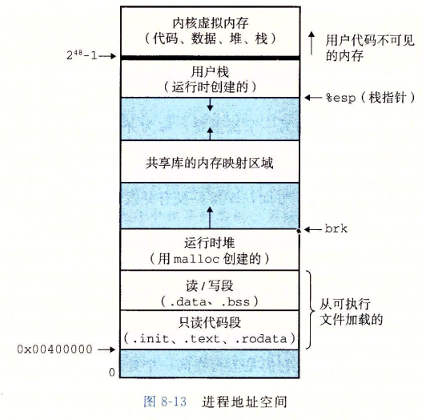  

### 8.4 进程控制
&emsp;&emsp;Unix 提供了大量从 C 程序中操作进程的系统调用。这一节将描述这些重要的函数，并举例说明如何使用它们。
#### 8.4.1 获取进程 ID
&emsp;&emsp;每个进程都有一个唯一的整数（非零）进程 ID（PID）。getpid 函数返回调用进程的 PID。getppid 函数返回它的父进程的 PID（创建调用进程的进程）。
```c
#include <sys/types.h>
#include <unistd.h>

pid_t getpid(void);
pid_t getppid(void);
```
&emsp;&emsp;getpid 和 getppid 函数返回一个类型为 pid_t 的整数值，在 Linux 系统上它在 types.h 中被定义为 int。

#### 8.4.2 创建和终止进程
&emsp;&emsp;从程序员角度，我们可以认为进程总是处于下面三种状态之一：
* 运行。进程要么在 CPU 上执行，要么在等待被执行且最终会被内核调度。
* 停止。进程的执行被挂起，且不会被调度。当收到 SIGSTOP、SIGTSTP、SIGTTIN 或者 SIGTTOU 信号时，进程就停止，并且保持停止直到它收到一个 SIGCONT 信号，在这个时刻，进程再次开始运行。（信号是一种软件中断的形式）。
* 终止。进程永远地停止了。进程会因为三种原因终止：1) 收到一个信号，该信号的默认行为是终止进程，2) 从主程序返回，3) 调用 exit 函数。
```c
#include <stdlib.h>

void exit(int status);
```
&emsp;&emsp;exit 函数以 status 退出状态来终止进程（另一种设置退出状态的方法是从主程序中返回一个整数值）。
&emsp;&emsp;父进程通过调用 fork 函数创建一个新的运行的子进程。
```c
#include <sys/types.h>
#include <unistd.h>

pid_t fork(void);
```
&emsp;&emsp;新创建的子进程几乎与父进程相同，但不完全相同。子进程得到与父进程用户级虚拟地址空间相同的（但是独立的）一份副本，包括代码和数据段、堆、共享库以及用户栈。子进程还获得与父进程任何打开文件描述符相同的副本，这就意味着当父进程调用 fork 时，子进程可以读父进程中任何打开的任何文件。父进程和新创建的子进程之间最大的区别在于它们有不同的 PID。
&emsp;&emsp;fork 函数只被调用一次，却会返回两次：一次是在调用进程（父进程）中，一次是在新创建的子进程中。在父进程中，fork 返回子进程的 PID。在子进程中，fork 返回 0.因为子进程的 PID 总是为非零，返回值就提供一个明确的方法来分辨程序是在父进程还是在子进程中执行。
&emsp;&emsp;下图展示了一个使用 fork 创建子进程的父进程的示例。当 fork 调用在第 6 行返回时，在父进程和子进程中 x 的值都为 1.子进程在第 8 行加一并输出它的 x 的副本。相似地，父进程在第 13 行减一并输出它的 x 的副本。
```c
#include <stdio.h>
#include <stdlib.h>
#include <sys/types.h>
#include <unistd.h>

int main()
{
    pid_t pid;
    int x = 1;

    pid = fork();
    if (pid == 0) {
        printf("child : x = %d\n", ++x);
        exit(0);
    }

    printf("parent: x = %d\n", --x);
    exit(0);
}
```
&emsp;&emsp;相同但是独立的地址空间。如果能够在 fork 函数在父进程和子进程中返回后立即暂停这两个进程，我们会看到两个进程的地址空间都是相同的。每个进程有相同的用户栈、相同的本地变量值、相同的堆、相同的全局变量值，以及相同的代码。然而，因为父进程和子进程是独立的进程，它们都有自己的私有地址空间。后面，父进程和子进程对 x 所做的任何改变都是独立的，不会反映在另一个进程的内存中。
&emsp;&emsp;从网上找的解释：fork（）会产生一个和父进程完全相同的子进程，出于效率考虑，linux 中引入了写时复制技术，也就是只有进程空间的各段的内容要发生变化时，才会将父进程的内容复制一份给子进程。在 fork 之后 exec 之前两个进程用的是相同的物理空间（内存区），子进程的代码段、数据段、堆栈都是指向父进程的物理空间，也就是说，两者的虚拟空间不同，但其对应的物理空间是同一个。当父子进程中有更改相应段的行为发生时，再为子进程相应的段分配物理空间，如果不调用 exec，内核会给子进程的数据段、堆栈段分配相应的物理空间（至此两者有各自的进程空间，互不影响），而代码段继续共享父进程的物理空间（两者的代码完全相同）。而如果调用了 exec，由于父子进程所执行的代码不同，子进程的代码段也会分配单独的物理空间。

#### 8.4.3 回收子进程
&emsp;&emsp;当一个进程由于某种原因终止时，内核并不是立即把它从系统中清除。相反，进程被保持在一种已终止的状态中，直到被它的父进程回收。当父进程回收已终止的子进程时，内核将子进程的退出状态传递给父进程，然后抛弃已终止的进程，从此时开始，该进程就不存在了。一个终止了但还未被回收的进程称为僵死进程。
&emsp;&emsp;如果一个父进程终止了，内核会安排 init 进程成为它的孤儿进程的养父。init 进程 PID 为 1，是在系统启动时由内核创建的，它不会终止，是所有进程的祖先。如果父进程没有回收它的僵死子进程就终止了，那么内核会安排 init 进程去回收它们。不过，长时间运行的程序，比如 shell 或者服务器，总是应该回收它们的僵死子进程。即使僵死子进程没有运行，它们仍然消耗系统的内存资源。
&emsp;&emsp;一个进程可以通过调用 waitpid 函数来等待它的子进程终止或者停止。
```c
#include <sys/types.h>
#include <sys/wait.h>

/* 返回：如果成功，则为子进程的 PID，如果 WNOHANG，则为 0，如果其他错误，则为 -1 */
pid_t waitpid(pid_t pid, int *statusp, int options);
```
&emsp;&emsp;waitpid 函数有点复杂。默认情况下（当 options = 0 时），waitpid 挂起调用进程的执行，直到它的等待集合中的一个子进程终止。如果等待集合中的一个进程刚调用的时刻就已经终止了，那么 waitpid 就立即返回。在这两种情况中，waitpid 返回会导致 waitpid 返回的已终止子进程的 PID。此时，已终止的子进程已经被回收，内核会从系统中删除掉它的所有痕迹。
1. 判定等待集合的成员
等待集合的成员是由参数 pid 来确定的：
* 如果 pid > 0，那么等待集合就是一个单独的子进程，它的进程 ID 等于 pid。
* 如果 pid = -1，那么等待集合就是由父进程所有的子进程组成的。

&emsp;&emsp;waitpid 函数还支持其他类型的等待集合，包括 Unix 进程组。

2. 修改默认行为
可以通过将 options 设置为常量 WNOHANG、WUNTRACED 和 WCONTINUED 的各种组合来修改默认行为：
* WNOHANG：如果等待集合中的任何子进程都还没有终止，那么就立即返回（返回值为 0）。默认的行为是挂起调用进程，直到有子进程终止。在等待子进程终止的同时，如果还想做些有用的工作，这个选项会有用。
* WUNTRACED：挂起调用进程的执行，直到等待集合中的一个进程编程已终止或者被停止。返回的 PID 为导致返回的已终止和被停止子进程的 PID。默认的行为是只返回已终止的子进程。当你想要检查已终止和被停止的子进程时，这个选项会游泳。
* WCONTINUED：挂起调用进程的执行，直到等待集合中一个正在运行的进程终止或等待集合中一个被停止的进程收到 SIGCONT 信号重新开始执行。

3. 检查已回收子进程的退出状态
&emsp;&emsp;如果 statusp 参数是非空的，那么 waitpid 就会在 status 中放上关于导致返回的子进程的状态信息，status 是 statusp 指向的值。

这一章后面的都没看


## 第九章 虚拟内存


