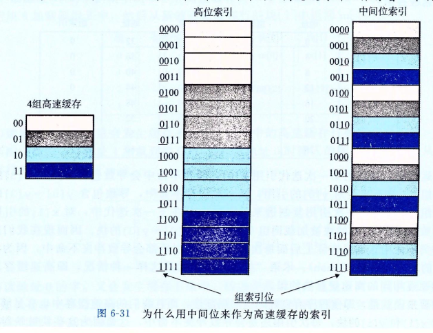

# 深入理解计算机系统
## 第一章 计算机系统漫游
### 1.2 程序被以他程序翻译成不同的格式
&emsp;&emsp;从源文件到目标文件的转化是由编译器驱动程序完成的。
```shell
linux> gcc -o hello hello.c
```
&emsp;&emsp;编译过程分为四个阶段：
  
* **预处理阶段**。预处理器根据以字符 # 开头的命令，修改原始的 C 程序。比如`#include <stdio.h>`命令告诉预处理器读取系统头文件 stdio.h 的内容，并把它直接插入程序文本中。结果就得到了另一个 C 程序，通常是以 .i 作为文件扩展名。
* **编译阶段**。编译器将文本文件 hello.i 翻译成文本文件 hello.s，它包含一个汇编语言程序。将高级语言翻译成汇编语言。
* **汇编阶段**。汇编器将 hello.s 翻译成机器语言指令，把这些指令打包成一种叫做`可重定位目标程序`的格式，并将结果保存在目标文件 hello.o 中。hello.o 文件是一个二进制文件。
* **链接阶段**。hello 程序调用了 printf 函数，它是每个 c 编译器都提供的标准 C 库中的一个函数。printf 函数存在于一个名为 printf.o 的单独的预编译好了的目标文件中，而这个文件必须以某种方式合并到我们的 hello.o 程序中。链接器就负责处理这种合并。结果就得到了 hello 文件，它是一个可执行目标文件，可以被加载到内存中，由系统执行。

### 1.7 操作系统管理硬件
#### 1.7.3 虚拟内存
&emsp;&emsp;`虚拟内存`是一个抽象概念，它为每个进程提供了一个假象，即每个进程都在独占地使用主存。每个进程看到的内存都是一致的，称为`虚拟地址空间`。下图所示的是 Linux 进程的虚拟地址空间。请注意，途中的地址是从下往上增大的。
  
&emsp;&emsp;我们从最低的地址开始，逐步向上介绍。
* **程序代码和数据**。对所有的进程来说，代码是从同一固定地址开始，紧接着的是和 C 全局变量相对应的数据位置。代码和数据区是直接按照可执行目标文件的内容初始化的。
* **堆**。代码和数据区后紧随着的是运行时`堆`。代码和数据区在进程一开始就被指定了大小，与此不同，当调用像 malloc 和 free 这样的 C 标准库函数时，堆可以在运行时动态地扩展和收缩。
* **共享库**。大约在地址空间的中间部分是一块用来存放像 C 标准库和数学库这样的共享库的代码和数据的区域。
* **栈**。位于用户虚拟地址空间顶部的是用户栈，编译器用它来实现函数调用。和堆一样，用户栈在程序执行期间可以动态地扩展和收缩。特别地，每次我们调用一个函数时，栈就会增长；从一个函数返回时，栈就会收缩。
* **内核虚拟内存**。地址空间顶部的区域是为内核保留的。不允许应用程序读写这个区域的内容或者直接调用内核代码定义的函数。它们必须调用内核来执行这些操作。

## 第二章 信息的表示和处理
#### 2.1.4 表示字符串
&emsp;&emsp;C 语言中字符串被编码为一个以 null（其值为 0）字符结尾的字符数组。


#### 2.2.3 补码编码
&emsp;&emsp;最常见的有符号数的计算机表示方式就是补码。在这个定义中，将字的最高有效位解释为负权。
&emsp;&emsp;原理：补码编码的定义：
$$
B2T_w(x) = -x_{w-1}2^{w-1} + \sum_{i=0}^{w-2}x_i2^i
$$
&emsp;&emsp;最高有效位 $x_{w-1}$ 也成为符号位，他的权重是 $-2^{w-1}$，是无符号表示中权重的负数。入下图所示：
  
  
&emsp;&emsp;在这个图中，我们用向左指的条表示符号位具有负权重。于是，与一个位向量相关联的数值是由可能的向左指的条和向右指的条加起来决定的。
###### 原码补码反码
* 原码：用第一位表示符号位，其余位表示数值。
* 反码：正数的反码是其原码本身，负数的反码是在其原码的基础上，符号位不变，其余各位取反。
* 补码：整数的补码是其原码本身。负数的补码是在其源码的基础上，符号位不变，其余各位取反后加 1.

&emsp;&emsp;如果使用原码，那 1 +(-1) = -2，如果使用反码， 0 这个数值会有两种表示形式。


## 第三章 程序的机器级表示
### 3.2 程序编码
&emsp;&emsp;源码转换成可执行代码的过程。
1. `C 预处理器`扩展源代码，插入所有用 #include 命令指定的文件，并扩展所有用 #define 生命指定的宏。
2. `编译器`产生两个源文件的汇编代码。
3. `汇编器`会将汇编代码转换成二进制目标代码文件。目标代码是机器代码的一种形式，它包含所有指令的二进制表示，但是还没有填入全局值的地址。
4. `链接器`将两个目标代码文件与实现库函数（例如 printf）合并，并产生最终的可执行代码文件。可执行代码是我们要考虑的机器代码的第二种形式，也就是处理器执行的代码格式。

#### 3.2.1 机器级代码
&emsp;&emsp;x86-64 的机器代码。
* 程序计数器（通常称为 PC）：给出将要执行的下一条指令在内存中的地址。
* 整数寄存器文件：包含16个命名的位置，分别存储 64 位的值。这些寄存器可以存储地址或整数数据。有的寄存器被用来记录某些重要的程序状态，而其他的寄存器用来保存临时数据，例如过程的参数和局部变量，以及函数的返回值。
* 条件码寄存器：保存着最近执行的算术或逻辑指令的状态信息。它们用来实现控制或数据流中的条件变化，比如说用来实现 if 或 while 语句。
* 向量寄存器：可以存放一个或多个整数或浮点数值。

#### 3.2.2 代码示例
&emsp;&emsp;在命令行使用`-S`选项，就能看到 C 语言编译器产生的汇编代码：
```shell
linux>gcc -Og -S mstore.c
```
&emsp;&emsp;这会使 GCC 运行编译器，产生一个汇编文件 mstore.s，但是不做其他进一步的工作。（通常情况下，它还会继续调用汇编器产生目标代码文件）。
&emsp;&emsp;如果我们使用`-c`命令行选项，GCC 会编译并汇编该代码：
```shell
linux>gcc -Og -c mstore.c
```
&emsp;&emsp;这就会产生目标代码文件 mstore.o，它是二进制格式的，所以无法直接查看。
&emsp;&emsp;要查看机器代码文件的内容，有一类称为反汇编器（disassembler）的程序非常有用。这些程序根据机器代码产生一种类似汇编代码的格式。在 Linux 系统中，带`-d`命令行标志的程序 OBJDUMP 可以充当这个角色：
```shell
linux>objdump -d mstore.o
```
&emsp;&emsp;生成实际可执行的代码需要对一组目标代码文件运行链接器，而这一组目标代码文件中必须含有一个 main 函数。我们可以使用如下方法生成可执行文件 prog：
```shell
linux>gcc -Og -o prog main.c mstore.c
```
&emsp;&emsp;也可以使用反汇编器抽取出各种代码序列，包括下面这段：
```shell
000000000040061b <multstore>:
  40061b:	53                   	push   %rbx
  40061c:	48 89 d3             	mov    %rdx,%rbx
  40061f:	e8 ef ff ff ff       	callq  400613 <mult2>
  400624:	48 89 03             	mov    %rax,(%rbx)
  400627:	5b                   	pop    %rbx
  400628:	c3                   	retq   
  400629:	0f 1f 80 00 00 00 00 	nopl   0x0(%rax)
```
&emsp;&emsp;有一个不同之处在于链接器填上了 callq 指令调用函数 mult2 需要使用的地址，链接器的任务之一就是为函数调用找到匹配的函数的可执行代码的位置。单独的 mstore.c 反汇编产生的指令如下：
```shell
0000000000000000 <multstore>:
   0:	53                   	push   %rbx
   1:	48 89 d3             	mov    %rdx,%rbx
   4:	e8 00 00 00 00       	callq  9 <multstore+0x9>
   9:	48 89 03             	mov    %rax,(%rbx)
   c:	5b                   	pop    %rbx
   d:	c3                   	retq   
```
&emsp;&emsp;还有一个区别是多了两行代码，这条指令对程序没有影响，因为它们出现在返回指令后面。插入这些行是为了使函数代码变为 16 字节，使得就存储系统性能而言，能更好地放置下一个代码块。


#### 3.2.3 关于格式的注解
&emsp;&emsp;mstore.s 文件完整内容如下：
```shell
	.file	"mstore.c"
	.text
	.globl	multstore
	.type	multstore, @function
multstore:
.LFB0:
	.cfi_startproc
	pushq	%rbx
	.cfi_def_cfa_offset 16
	.cfi_offset 3, -16
	movq	%rdx, %rbx
	call	mult2
	movq	%rax, (%rbx)
	popq	%rbx
	.cfi_def_cfa_offset 8
	ret
	.cfi_endproc
.LFE0:
	.size	multstore, .-multstore
	.ident	"GCC: (Ubuntu 5.4.0-6ubuntu1~16.04.12) 5.4.0 20160609"
	.section	.note.GNU-stack,"",@progbits
```
&emsp;&emsp;所有以`.`开头的行都是指导汇编器和链接器工作的伪指令。我们通常可以忽略这些行。

### 3.3 数据格式
&emsp;&emsp;字（word）：16 bit；
&emsp;&emsp;双字（double words）：32 bit；
&emsp;&emsp;四字（quad words）：64 bit。
&emsp;&emsp;大多数 GCC 生成的汇编代码指令都有一个字符的后缀，表明操作数的大小。例如，数据传送指令有四个变种：movb（传送字节）、movw（传送字）、movl（传送双字）和 movq（传送四字）。后缀‘l’用来表示双字，因为 32 位数被看成是“长字（long word）”。注意，汇编代码也使用后缀‘l’来表示 4 字节整数和 8 字节双精度浮点数。这不会产生歧义，因为浮点数使用的是一组完全不同的指令和寄存器。


### 3.4 访问信息
  


#### 3.4.3 数据传送示例
&emsp;&emsp;这一节没认真看。

#### 3.4.4 压入和弹出栈数据
&emsp;&emsp;栈在处理过程调用中起到至关重要的作用。栈是一种数据结构，可以添加或删除值，不过要遵循“后进先出”的原则。通过 push 操作把数据压入栈中，通过 pop 操作删除数据；它具有一个属性：弹出的值永远是最近被压入而且仍然在栈中的值。
&emsp;&emsp;栈可以实现为一个数组，总是从数组的一端插入和删除元素。这一端被称为`栈顶`，栈顶元素的地址是所有栈中元素地址最低的。
&emsp;&emsp;push 和 pop 指令都只有一个操作数——压入的数据源和弹出的数据目的。
&emsp;&emsp;**将一个四字值压入栈中，首先要将栈指针减 8，然后将值写到新的栈顶地址。**

### 3.5 算数和逻辑操作
#### 3.5.3 移位操作
&emsp;&emsp;左移指令算术移位和逻辑移位是一样的，都是将右边填上 0。右移指令不同，SAR 执行算术移位（填上符号位），而 SHR 执行逻辑移位（填上 0）。

#### 3.5.5 特殊的算术操作
&emsp;&emsp;这一节不想看了

### 3.6 控制
#### 3.6.1 条件码
#### 3.6.2 访问条件码
&emsp;&emsp;这两节大概看了一下，知道什么意思，涉及反码补码的位置没有细看。

#### 3.6.3 跳转指令
&emsp;&emsp;正常执行的情况下，指令按照它们出现的顺序一条一条地执行。`跳转`（jump）指令会导致执行切换到程序中一个全新的位置。在汇编代码中，这些跳转的目的地通常用一个`标号`（label）指明。在产生目标代码文件时，汇编器会确定所有带标号指令的地址，并将`跳转目标`（目的指令的地址）编码为跳转指令的一部分。
&emsp;&emsp;跳转指令有无条件跳转和有条件跳转。
&emsp;&emsp;无条件跳转可以分为直接跳转和间接跳转，`直接跳转`是给出一个标号作为跳转目标，`间接跳转`的跳转目标是从寄存器或内存位置中读出的。
&emsp;&emsp;有条件跳转根据条件码的某种组合，或者跳转，或者继续执行代码序列中下一条指令。这些指令的名字和跳转条件与 SET 指令的名字和设置条件是相匹配的。**条件跳转只能是直接跳转。**

### 3.7 过程
&emsp;&emsp;过程是软件中一种很重要的抽象。不同编程语言中，过程的形式多样：函数、方法、子例程、处理函数等等。
&emsp;&emsp;要提供对过程的机器级支持，必须要处理许多不同的属性。为了讨论方便，假设过程 P 调用过程 Q，Q 执行后返回到 P。这些动作包括下面一个或多个机制：
* **传递控制**。在进入过程 Q 的时候，程序计数器必须被设置为 Q 的代码的起始地址，然后在返回时，要把程序计数器设置为 P 张调用 Q 后面那条指令的地址。
* **传递数据**。P 必须能够向 Q 提供一个或多个参数，Q 必须能够向 P 返回一个值。
* **分配和释放内存**。在开始时，Q 可能需要为局部变量分配空间，而在返回前，又必须释放这些存储空间。

#### 3.7.1 运行时栈
  
&emsp;&emsp;C 语言过程调用机制的一个关键特性（大多数其他语言也是如此）在于使用了栈数据结构提供的后进先出的内存管理原则。在过程 P 调用过程 Q 的例子中，可以看到当 Q 在执行时，P 以及所有再向上追溯到 P 的调用链中的过程，都是暂时被挂起的。当 Q 运行时，它只需要为局部变量分配新的存储空间，或者设置到另一个过程的调用。另一方面，当 Q 返回时，任何它所分配的局部存储空间都可以被释放。
&emsp;&emsp;当 x86-64 过程需要的存储空间超过寄存器能够存放的大小时，就会在栈上分配空间。这个部分称为过程的**栈帧**。大多数过程的栈帧都是定长的，在过程的开始就分配好了。但是有些过程需要边长的帧，这个问题会在 3.10.5 中讨论。通过寄存器，过程 P 可以传递最多 6 个整数值（也就是整数和指针），但是如果 Q 需要更多的参数，<u>P 可以在调用 Q 之前在**自己（P）的栈帧**里存储好这些参数</u>。
&emsp;&emsp;为了提高空间和时间效率，x86-64 过程只分配自己所需要的栈帧部分。例如，许多过程有 6 个或者更少的参数，那么所有的参数都可以通过寄存器传递。因此上图中的某些栈帧部分可以省略。实际上，许多函数甚至根本不需要栈帧。**当所有局部变量都可以保存在寄存器中，而且该函数不会调用任何其他函数时，就可以这样处理**。

#### 3.7.3 数据传送
&emsp;&emsp;当调用一个过程时，除了要把控制传递给它并在过程返回时再传递回来之外，过程调用还可能包括把数据作为参数传递，而从过程返回还有可能包括一个返回一个值。
&emsp;&emsp;x86-64 中，可以通过寄存器最多传递 6 个整形参数。如果一个函数有大于 6 个整型参数，超出 6 个的部分就要通过栈来传递。
&emsp;&emsp;假设过程 P 调用过程 Q，有 n 个整型参数，且 n > 6。那么 P （P 分配它调用的子函数的参数空间）的代码分配的栈帧必须要能容纳 7 到 n 号参数的存储空间，如果 3-25 所示。


#### 3.7.4 栈上的局部存储
&emsp;&emsp;目前看到的大多数过程示例都不需要超出寄存器大小的本地存储区域。不过有些时候，局部数据必须存放在内存中，常见的情况包括：
* 寄存器不足够存放所有的本地数据。
* 对一个局部变量使用地址运算符`&`，因此必须能够为它产生一个地址。
* 某些局部变量是数组或结构，因此必须能够通过数组或结构引用被访问到。

#### 3.7.5 寄存器中的局部存储空间
&emsp;&emsp;这一节讲的内容和示例代码我没对应上


### 3.9 异质的数据结构

#### 3.9.3 数据对齐
&emsp;&emsp;许多计算机系统对基本数据类型的合法地址做出了一些限制，要求某种类型对象的地址必须是某个值 K（通常是 2、4 或 8）的倍数。例如，假设一个处理器总是从内存中取 8 个字节，则地址必须为 8 的倍数。如果能保证所有的 double 类型数据的地址对齐成 8 的倍数，那么就可以用一个内存操作来读或者写值了。否则可能需要执行两次内存访问，因为对象可能被分放在两个 8 字节内存块中。无论数据是否对齐，x86-64 硬件都能正确工作。
&emsp;&emsp;结构体对齐。编译器在结构体的末尾可能需要一些填充，这样结构数组中的每个元素都会满足它的对齐要求。

### 3.10 在机器级程序中将控制与数据结合起来
#### 3.10.3 内存越界引用和缓冲区溢出
&emsp;&emsp;C 对于数组引用不进行任何边界检查，而且局部变量和状态信息（例如保存的寄存器值和返回地址）都存放在栈中。这两种情况结合到一起就能导致严重的程序错误，对越界的数组元素的写操作会破坏存储在栈中的状态信息。当程序使用这个被破坏的状态，试图重新加载寄存器或执行 ret 指令时，就会出现很严重的错误。


### 3.11 浮点代码
&emsp;&emsp;不想看这一段了。

## 第四章 处理器体系结构
### 4.1.3 指令编码
&emsp;&emsp;指令集的一个重要性质就是字节编码必须有唯一的解释。任意一个字节序列要么是一个唯一的指令序列的编码，要么就不是一个合法的字节序列。
&emsp;&emsp;因为每条指令的第一个字节有唯一的代码和功能组合，给定这个字节，我们就可以决定所有其他附加字节的长度和含义。这个性质保证了处理器可以无二义性地执行目标代码程序。即使代码嵌入在程序的其他字节中，只要从序列的第一个字节开始处理，我们仍然可以很容易地确定指令序列。反过来说，如果不知道一段代码序列的起始位置，我们就不能准确地确定怎样将序列划分为单独的指令。对于试图直接从目标代码字节序列中抽取出机器级程序的反汇编程序和其他一些工具来说，这就带来了问题。


## 第六章 存储器层次结构
### 6.1 存储技术
#### 6.1.1 随机访问存储器
&emsp;&emsp;`随机访问存储器`（Random-Access Memory, RAM）分为两类：静态的和动态的。静态 RAM（SRAM）比动态 RAM（DRAM）更快，但也贵得多。
1. 静态 RAM
SRAM 将每个位存储在一个双稳态的存储器单元里。每个单元是用一个六晶体管电路来实现地，这个电路可以无限期地保持在两个不同地电压配置或状态之一。其他任何状态都是不稳定的。由于 SRAM 存储器单元的双稳态特性，只要有电，它就会永远地保持它的值。即使有干扰来扰乱电压，当干扰消除时，电路就会恢复到稳定值。
2. 动态 RAM
DRAM 将每个位存储为对一个电容的充电。与 SRAM 不同，DRAM 存储器单元对干扰非常敏感。当电容的电压被扰乱之后，它就永远不会恢复了。很多原因会导致漏电，使得 DRAM 单元在 10~100 毫秒时间内会是去电荷。内存系统必须周期性地通过读出，然后重写来刷新内存的每一位。
4. 内存模块
图 6-5 展示了一个内存模块的基本思想。示例模块用 8 个 64Mbit 的 DRAM 芯片（即 8MB*8），总共存储 64MB，这 8 个芯片编号位 0~7。**每个超单元存储主存的一个字节**，而用相应超单元地址为（i, j）的 8 个超单元来表示主存中字节地址 A 处的 64 位字。在图 6-5 示例中，DRAM0 存储第一个（低位）字节，DRAM1 存储下一个字节，依此类推。  
要取出内存地址 A 处的一个字，内存控制器将 A 转换成一个超单元地址（i, j），并将它发送到内存模块，然后内存模块再将 i 和 j 广播到每个 DRAM。作为相应，每个 DRAM 输出它的（i, j）超单元的 8 位内容。模块中的电路收集这些输出，并把它们合并成一个 64 位字，再返回给内存控制器。
通过将多个内存模块连接到内存控制器，能够聚合成主存。在这种情况中，当控制器收到一个地址 A 时，控制器选择包含 A 的模块 k，将 A 转换成它的（i, j）的形式，并将（i, j）发送到模块 k。
6. 非易失性存储器
如果断电，DRAM 和 SRAM 会丢失它们的信息，从这个意义上说，它们是`易失`的。另一方面，`非易失性存储器`即使在关电后，仍然保存着它们的信息。由于历史原因，虽然 ROM 中有的类型既可以读也可以写，但是它们整体上都被称为`只读存储器`（Read-Only Memory）。
存储在 ROM 设备中的程序通常被称为`固件`（firmware）。当一个计算机系统通电以后，它会运行存储在 ROM 中的固件。

#### 6.1.2 磁盘存储

### 6.2 局部性
&emsp;&emsp;一个编写良好的计算机程序常常具有良好的局部性。也就是，它们倾向于引用临近于其他最近引用过的数据项的数据项，或者最近引用过的数据项本身。这种倾向性，被称为局部性原理。

### 6.3 存储器层次结构
#### 6.3.1 存储器层次结构中的缓存
1. 缓存命中
当程序需要第 k + 1 层的某个数据对象 d 时，它首先在当前存储在第 k 层的一个块中查找 d。如果 d 刚好缓存在第 k 层中，那么就是我们所说的`缓存命中`（cache hit）。
2. 缓存不命中
另一方面，如果第 k 层中没有缓存数据对象 d，那么就是我们所说的`缓存不命中`（cache miss）。  
当发生缓存不命中时，第 k 层的缓存从第 k + 1 层缓存中取出包含 d 的那个块，如果第 k 层的缓存已经满了，可能就会覆盖现存的一个块。覆盖一个现存的块的过程称为`替换`（replacing）或`驱逐`（evicting）这个块。被驱逐的这个块有时也称为`牺牲块`（victim block）。决定该替换哪个块是由缓存的`替换策略`来控制的。
3. 缓存不命中的种类
区分不同种类的缓存不命中有时候是很有帮助的。如果第 k 层的缓存是空的，那么对任何数据对象的访问都不会命中。一个空的缓存有时被称为`冷缓存`（cold cache），此类不命中称为`强制不命中`或`冷不命中`。冷不命中很重要，因为它们通常是短暂的事件，不会在反复访问存储器是的缓存`暖身`（warmed up）之后的稳定状态中出现。  
只要发生了不命中，第 k 层的缓存就必须执行某个放置策略，确定把它从第 k + 1 层中取出的块放在哪里。最灵活的替换策略是允许来自第 k + 1 层的任何块放在第 k 层的任何块中。这个策略实现起来通常很昂贵，因为随机地放置块，定位起来代价很高。  
因此，硬件缓存通常使用的是更严格的放置策略，这个策略将第 k + 1 层的某个块限制放置在第 k 曾块的一个小的子集中（有时只是一个块）。例如（i mod 4）。这种限制性的放置策略会引起一种不命中，称为`冲突不命中`（conflict miss），在这种情况中，缓存足够大，能够保存被引用的数据对象，但是因为这些对象会映射到同一个缓存块，缓存会一直不命中。例如，在图 6-22 中，如果程序请求块 0，然后块 8，然后块 0，然后块 8，依此类推，在第 k 层的缓存中，对这两个块的每次引用都会不命中，即使这个缓存总共可以容纳 4 个块。  
程序通常是按照一系列阶段（如循环）来运行的，每个阶段访问缓存块的某个相对稳定不变的集合。例如，一个嵌套的循环可能会反复地访问同一个数据地元素。这个块地集合称为这个阶段的`工作集`。当工作集的大小超过缓存的大小时，缓存会经历`容量不命中`。换句话说就是，缓存太小了，不能处理这个工作集。

### 6.4 高速缓存存储器
#### 6.4.1 通用的高速缓存存储器组织结构
&emsp;&emsp;考虑一个计算机系统，其中每个存储器地址有 m 位，形成 $M = 2^m$ 个不同的地址。如图 6-25a 所示，这样一个机器的高速缓存被组织成一个有 $S = 2^s$ 个高速缓存组的数组。每个组包含 E 个`高速缓存行`（cache line）。每个行是由一个 $B = 2^b$ 字节的数据块组成的，一个`有效位`（valid bit）指明这个行是否包含有意义的信息，还有 $t = m - (b + s)$ 个`标记位`（tag bit）（是当前块的内存地址的位的一个子集），它们唯一地标识存储在这个高速缓存行中的块。  
   

&emsp;&emsp;为什么用中间的位来做索引。如果高位用作索引，那么一些连续的内存块就会映射到相同的高速缓存块。例如，在图中，头四个块映射到第一个高速缓存组，第二个第四个块映射到第二个组，依此类推。如果一个程序有良好的空间局部性，顺序扫描一个数组的元素，那么在任何时刻，高速缓存都只保存着一个块大小的数组内容。这样对高速缓存的使用效率很低。相比较而言，以中间位作为索引，相邻的块总是映射到不同的告诉缓存行。
  

#### 6.4.5 有关写的问题
&emsp;&emsp;假设我们要写一个已经缓存了的字 w（写命中，write hit）。在高速缓存更新了它的 w 副本之后，怎么更新 w 在层次结构中紧接着第一层中的副本呢？
&emsp;&emsp;最简单的方法，称为`直写`（write-through），就是立即将 w 的高速缓存块写回到紧接着的第一层中。虽然简单，但是直写的缺点是每次写都会引起总线流量。
&emsp;&emsp;另一种方法，称为`写回`（write-back），尽可能地推迟更新，只有当替换算法要驱逐这个更新过地块时，才把它写到紧接着的第一层中。由于局部性，写回能显著地减少总线流量，但是它的缺点是增加了复杂性。高速缓存必须为每个高速缓存行维护一个额外的修改位（dirty bit），表明这个告诉缓存块是否被修改过。
&emsp;&emsp;另一个问题是如何处理不命中。一种方法，称为`写分配`（write-allocate），加载相应的低一层中的块到高速缓存中，然后更新这个告诉缓存块。写分配试图利用写的空间局部性，但是缺点是每次不命中都会导致一个块从低一层传送到高速缓存。另一种方法，称为`非写分配`（not-write-allocate），避开告诉缓存行，直接把这个字写到低一层中。直写高速缓存通常是非写分配的。写高速缓存通常是写分配的。

#### 6.4.6 一个真实的高速缓存层次结构的解剖
&emsp;&emsp;高速缓存既保存数据，也保存指令。只保存指令的高速缓存称为 i-cache。只保存程序的高速缓存称为 d-cache。既保存指令又保存数据的高速缓存称为统一的`高速缓存`（unified cache）。


# 第二部分 在系统上运行程序
## 第七章 链接